So you have a fresh feature ready to be shipped. What happens next? Do you upload files to a server manually? How do you manage the version of your product running in the wild? How do you make sure it works, and roll back to a safe version if it doesn’t?

Doing all the above manually is a pain and doesn’t scale well for a larger team. That’s why we have Continuous Integration / Continuous Delivery systems, in short CI/CD systems. In this part, you will gain an understanding of why you should use a CI/CD system, what can one do for you, and how to get started with GitHub Actions which is available to all GitHub users by default.

This module was crafted by the Engineering Team at Smartly.io. At Smartly.io, we automate every step of social advertising to unlock greater performance and creativity. We make every day of advertising easy, effective, and enjoyable for more than 650 brands worldwide, including eBay, Uber, and Zalando. We are one of the early adopters of GitHub Actions in wide-scale production use. Contributors: Anna Osipova, Anton Rautio, Mircea Halmagiu, Tomi Hiltunen.

# Table of Content


# Part 11

## Part 11a - Introduction to CI/CD

During this part, you will build a robust _deployment pipeline_ to a ready made [example project](https://github.com/fullstack-hy2020/full-stack-open-pokedex) starting in exercise 11.2. You will [fork](https://docs.github.com/en/free-pro-team@latest/github/getting-started-with-github/fork-a-repo) the example project and that will create you a personal copy of the repository. In the last two exercises, you will build another deployment pipeline for some of _your own_ previously created apps!

There are 21 exercises in this part, and you need to complete each exercise for completing the course. Exercises are submitted via [the submissions system](https://studies.cs.helsinki.fi/stats/courses/fs-cicd) just like in the previous parts, but unlike parts 0 to 7, the submission goes to a different "course instance".

This part will rely on many concepts covered in the previous parts of the course. It is recommended that you finish at least parts 0 to 5 before starting this part.

Unlike the other parts of this course, you do not write many lines of code in this part, it is much more about configuration. Debugging code might be hard but debugging configurations is way harder, so in this part, you need lots of patience and discipline!

### Getting software to production

Writing software is all well and good but nothing exists in a vacuum. Eventually, we'll need to deploy the software to production, i.e. give it to the real users. After that we need to maintain it, release new versions, and work with other people to expand that software.

We've already used GitHub to store our source code, but what happens when we work within a team with more developers?

Many problems may arise when several developers are involved. The software might work just fine on _my computer_, but maybe some of the other developers are using a different operating system or different library versions. It is not uncommon that a code works just fine in one developer's machine but another developer can not even get it started. This is often called the "works on my machine" problem.

There are also more involved problems. If two developers are both working on changes and they haven't decided on a way to deploy to production, whose changes get deployed? How would it be possible to prevent one developer's changes from overwriting another's?

In this part, we'll cover ways to work together and build and deploy software in a strictly defined way so that it's clear exactly what will happen under any given circumstance.

### Some useful terms

In this part we'll be using some terms you may not be familiar with or you may not have a good understanding of. We'll discuss some of these terms here. Even if you are familiar with the terms, give this section a read so when we use the terms in this part, we're on the same page.

#### Branches

Git allows multiple copies, streams, or versions of the code to co-exist without overwriting each other. When you first create a repository, you will be looking at the main branch (usually in Git, we call this _main_ or _master_, but that does vary in older projects). This is fine if there's only one developer for a project and that developer only works on one feature at a time.

Branches are useful when this environment becomes more complex. In this context, each developer can have one or more branches. Each branch is effectively a copy of the main branch with some changes that make it diverge from it. Once the feature or change in the branch is ready it can be _merged_ back into the main branch, effectively making that feature or change part of the main software. In this way, each developer can work on their own set of changes and not affect any other developer until the changes are ready.

But once one developer has merged their changes into the main branch, what happens to the other developers' branches? They are now diverging from an older copy of the main branch. How will the developer on the later branch know if their changes are compatible with the current state of the main branch? That is one of the fundamental questions we will be trying to answer in this part.

You can read more about branches e.g. from [here](https://www.atlassian.com/git/tutorials/using-branches).

#### Pull request

In GitHub merging a branch back to the main branch of software is quite often happening using a mechanism called [pull request](https://docs.github.com/en/free-pro-team@latest/github/collaborating-with-issues-and-pull-requests/about-pull-requests), where the developer who has done some changes is requesting the changes to be merged to the main branch. Once the pull request, or PR as it's often called, is made or _opened_, another developer checks that all is ok and _merges_ the PR.

If you have proposed changes to the material of this course, you have already made a pull request!

#### Build 

The term "build" has different meanings in different languages. In some interpreted languages such as Python or Ruby, there is actually no need for a build step at all.

In general when we talk about building we mean preparing software to run on the platform where it's intended to run. This might mean, for example, that if you've written your application in TypeScript, and you intend to run it on Node, then the build step might be transpiling the TypeScript into JavaScript.

This step is much more complicated (and required) in compiled languages such as C and Rust where the code needs to be compiled into an executable.

In [part 7](../part7/README.md#part-7d---webpack) we had a look at [Webpack](https://webpack.js.org/) that is the current de facto tool for building a production version of a React or any other frontend JavaScript or TypeScript codebase.

#### Deploy

Deployment refers to putting the software where it needs to be for the end-user to use it. In the case of libraries, this may simply mean pushing an npm package to a package archive (such as [npmjs.com](https://www.npmjs.com/)) where other users can find it and include it in their software.

Deploying a service (such as a web app) can vary in complexity. In [part 3](../part3/README.md#3b---deploying-app-to-internet) our deployment workflow involved running some scripts manually and pushing the repository code to [Fly.io](https://fly.io/) or [Render](https://render.com/) hosting service.

In this part, we'll develop a simple "deployment pipeline" that deploys each commit of your code automatically to Fly.io or Render _if_ the committed code does not break anything.

Deployments can be significantly more complex, especially if we add requirements such as "the software must be available at all times during the deployment" (zero downtime deployments) or if we have to take things like [database migrations](https://fullstackopen.com/en/part13/migrations_many_to_many_relationships#migrations) into account. We won't cover complex deployments like those in this part but it's important to know that they exist.

### What is CI?

The strict definition of CI (Continuous Integration) and the way the term is used in the industry may sometimes be different. One influential but quite early (written already in 2006) discussion of the topic is in [Martin Fowler's blog](https://www.martinfowler.com/articles/continuousIntegration.html).

Strictly speaking, CI refers to [merging developer changes to the main branch](https://www.atlassian.com/continuous-delivery/principles/continuous-integration-vs-delivery-vs-deployment) often, Wikipedia even helpfully suggests: "several times a day". This is usually true but when we refer to CI in industry, we're quite often talking about what happens after the actual merge happens.

We'd likely want to do some of these steps:

- Lint: to keep our code clean, maintainable, and merge compatible

- Build: put all of our code together into runnable software bundle

- Test: to ensure we don't break existing features

- Package: Put it all together in an easily movable batch

- Deploy: Make it available to the word

We'll discuss each of these steps (and when they're suitable) in more detail later. What is important to remember is that this process should be strictly defined.

Usually, strict definitions act as a constraint on creativity/development speed. This, however, should usually not be true for CI. This strictness should be set up in such a way as to allow for easier development and working together. Using a good CI system (such as GitHub Actions that we'll cover in this part) will allow us to do this all automagically.

### Packaging and Deployment as part of CI

It may be worthwhile to note that packaging and especially deployment are sometimes not considered to fall under the umbrella of CI. We'll add them in here because in the real world it makes sense to lump it all together. This is partly because they make sense in the context of the flow and pipeline (I want to get my code to users) and partially because these are in fact the most likely point of failure.

The packaging is often an area where issues crop up in CI as this isn't something that's usually tested locally. It makes sense to test the packaging of a project during the CI workflow even if we don't do anything with the resulting package. With some workflows, we may even be testing the already built packages. This assures us that we have tested the code in the same form as what will be deployed to production.

What about deployment then? We'll talk about consistency and repeatability at length in the coming sections but we'll mention here that we want a process that always looks the same, whether we're running tests on a development branch or the main branch. In fact, the process may _literally_ be the same with only a check at the end to determine if we are on the main branch and need to do a deployment. In this context, it makes sense to include deployment in the CI process since we'll be maintaining it at the same time we work on CI.

#### Is this CD thing related?

The terms _Continuous Delivery_ and _Continuous Deployment_ (both of which have the acronym CD) are often used when one talks about CI that also takes care of deployments. We won't bore you with the exact definition (you can use e.g. [Wikipedia](https://en.wikipedia.org/wiki/Continuous_delivery) or [another Martin Fowler blog post](https://martinfowler.com/bliki/ContinuousDelivery.html)) but in general, we refer to CD as the practice where the main branch is kept deployable at all times. In general, this is also frequently coupled with automated deployments triggered from merges into the main branch.

What about the murky area between CI and CD? If we, for example, have tests that must be run before any new code can be merged to the main branch, is this CI because we're making frequent merges to the main branch, or is it CD because we're making sure that the main branch is always deployable?

So, some concepts frequently cross the line between CI and CD and, as we discussed above, deployment sometimes makes sense to consider CD as part of CI. This is why you'll often see references to CI/CD to describe the entire process. We'll use the terms "CI" and "CI/CD" interchangeably in this part.

### Why is it important?

Above we talked about the "works on my machine" problem and the deployment of multiple changes, but what about other issues. What if Alice committed directly to the main branch? What if Bob used a branch but didn't bother to run tests before merging? What if Charlie tries to build the software for production but does so with the wrong parameters?

With the use of continuous integration and systematic ways of working, we can avoid these.

- We can disallow commits directly to the main brach

- We can have our CI process run on all Pull Requests (PRs) against the main branch and allow merges only when out desired conditions are met e.g. tests pass

- We can build our packages for production in the known environment of the CI system

There are other advantages to extending this setup:

- If we use CI/CD with deployment every time there is a merge to the main branch, then we know that it will always work in production

- If we only allow merges when the branch is up to date with the main branch, then we can be sure that different developers don't overwrite each other's changes

Note that in this part we are assuming that the main branch contains the code that is running in production. There are numerous different [workflows](https://www.atlassian.com/git/tutorials/comparing-workflows) one can use with Git, e.g. in some cases, it may be a _specific release branch_ that contains the code that is running in production.

### Important principles

It's important to remember that CI/CD is not the goal. The goal is better, faster software development with fewer preventable bugs and better team cooperation.

To that end, CI should always be configured to the task at hand and the project itself. The end goal should be kept in mind at all times. You can think of CI as the answer to these questions:

- How to make sure that tests run on all code that will be deployed?

- How to make sure that the main branch is deployable at all times?

- How to ensure that builds will be consistent and will always work on the platform it'd be deploying to?

- How to make sure that the changes don't overwrite each other?

- How to make deployments happen at the click of a button or automatically when one merges to the main branch?

There even exists scientific evidence on the numerous benefits the usage of CI/CD has. According to a large study reported in the book [Accelerate: The Science of Lean Software and DevOps: Building and Scaling High Performing Technology Organizations](https://itrevolution.com/product/accelerate/), the use of CI/CD correlate heavily with organizational success (e.g. improves profitability and product quality, increases market share, shortens the time to market). CI/CD even makes developers happier by reducing their burnout rate. The results summarized in the book are also reported in scientific articles such as [this](https://papers.ssrn.com/sol3/papers.cfm?abstract_id=2681909).

#### Documented behavior

There's an old joke that a bug is just an "undocumented feature". We'd like to avoid that. We'd like to avoid any situations where we don't know the exact outcome. For example, if we depend on a label on a PR to define whether something is a "major", "minor" or "patch" release (we'll cover the meanings of those terms later), then it's important that we know what happens if a developer forgets to put a label on their PR. What if they put a label on after the build/test process has started? What happens if the developer changes the label mid-way through, which one is the one that actually releases?

It's possible to cover all cases you can think of and still have gaps where the developer will do something "creative" that you didn't think of, so it's important to have the process fail safely in this case.

For example, if we have the case mentioned above where the label changes midway through the build. If we didn't think of this beforehand, it might be best to fail the build and alert the user if something we weren't expecting happened. The alternative, where we deploy the wrong type of version anyway, could result in bigger problems, so failing and notifying the developer is the safest way out of this situation.

#### Know the same thing happens every time

We might have the best tests imaginable for our software, tests that catch every possible issue. That's great, but they're useless if we don't run them on the code before it's deployed.

We need to guarantee that the tests will run and we need to be sure that they run against the code that will actually be deployed. For example, it's no use if the tests are _only_ run against Alice's branch if they would fail after merging to the main branch. We're deploying from the main branch so we need to make sure that the tests are run against a copy of the main branch with Alice's changes merged in.

This brings us to a critical concept. We need to make sure that the same thing happens every time. Or rather that the required tasks are all performed and in the right order.

#### Code always kept deployable

Having code that's always deployable makes life easier. This is especially true when the main branch contains the code running in the production environment. For example, if a bug is found and it needs to be fixed, you can pull a copy of the main branch (knowing it is the code running in production), fix the bug, and make a pull request back to the main branch. This is relatively straight forward.

If, on the other hand, the main branch and production are very different and the main branch is not deployable, then you would have to find out what code _is_ running in production, pull a copy of that, fix the bug, figure out a way to push it back, then work out how to deploy that specific commit. That's not great and would have to be a completely different workflow from a normal deployment.

#### Knowing wha code is deployed (sha sum/version)

It's often important to know what is actually running in production. Ideally, as we discussed above, we'd have the main branch running in production. This is not always possible. Sometimes we intend to have the main branch in production but a build fails, sometimes we batch together several changes and want to have them all deployed at once.

What we need in these cases (and is a good idea in general) is to know _exactly what code is running in production_. Sometimes this can be done with a version number, sometimes it's useful to have the commit SHA sum (uniquely identifying hash of that particular commit in git) attached to the code. We will discuss versioning further [a bit later in this part](https://fullstackopen.com/en/part11/keeping_green#versioning).

It is even more useful if we combine the version information with a history of all releases. If, for example, we found out that a particular commit has introduced a bug, we can find out exactly when that was released and how many users were affected. This is especially useful when that bug has written bad data to the database. We'd now be able to track where that bad data went based on the time.

### Types of CI setup

To meet some of the requirements listed above, we want to dedicate a separate server for running the tasks in continuous integration. Having a separate server for the purpose minimizes the risk that something else interferes with the CI/CD process and causes it to be unpredictable.

There are two options: host our own server or use a cloud service.

#### Jenkins (and other self-hosted setups)

Among the self-hosted options, [Jenkins](https://www.jenkins.io/) is the most popular. It's extremely flexible and there are plugins for almost anything (except that one thing you want to do). This is a great option for many applications, using a self-hosted setup means that the entire environment is under your control, the number of resources can be controlled, secrets (we'll elaborate a little more on security in later sections of this part) are never exposed to anyone else and you can do anything you want on the hardware.

Unfortunately, there is also a downside. Jenkins is quite complicated to set up. It's very flexible but that means that there's often quite a bit of boilerplate/template code involved to get builds working. With Jenkins specifically, it also means that CI/CD must be set up with Jenkins' own domain-specific language. There are also the risks of hardware failures which can be an issue if the setup sees heavy use.

With self-hosted options, the billing is usually based on the hardware. You pay for the server. What you do on the server doesn't change the billing.

#### GitHub Actions and other cloud-based solutions

In a cloud-hosted setup, the setup of the environment is not something you need to worry about. It's there, all you need to do is tell it what to do. Doing that usually involves putting a file in your repository and then telling the CI system to read the file (or to check your repository for that particular file).

The actual CI config for the cloud-based options is often a little simpler, at least if you stay within what is considered "normal" usage. If you want to do something a little bit more special, then cloud-based options may become more limited, or you may find it difficult to do that one specific task for which the cloud platform just isn't built for.

In this part, we'll look at a fairly normal use case. The more complicated setups might, for example, make use of specific hardware resources, e.g. a GPU.

Aside from the configuration issue mentioned above, there are often resource limitations on cloud-based platforms. In a self-hosted setup, if a build is slow, you can just get a bigger server and throw more resources at it. In cloud-based options, this may not be possible. For example, in [GitHub Actions](https://github.com/features/actions), the nodes your builds will run on have 2 vCPUs and 8GB of RAM.

Cloud-based options are also usually billed by build time which is something to consider. 

#### Why pick one over the other

In general, if you have a small to medium software project that doesn't have any special requirements (e.g. a need for a graphics card to run tests), a cloud-based solution is probably best. The configuration is simple and you don't need to go to the hassle or expense of setting up your own system. For smaller projects especially, this should be cheaper.

For larger projects where more resources are needed or in larger companies where there are multiple teams and projects to take advantage of it, a self-hosted CI setup is probably the way to go.

#### Why use GitHub Actions for this course

For this course, we'll use [GitHub Actions](https://github.com/features/actions). It is an obvious choice since we're using GitHub anyway. We can get a robust CI solution working immediately without any hassle of setting up a server or configuring a third-party cloud-based service.

Besides being easy to take into use, GitHub Actions is a good choice in other respects. It might be the best cloud-based solution at the moment. It has gained lots of popularity since its initial release in November 2019.

<hr style="border: 2px solid #9C7AA6">

### Exercise 11.1

Before getting our hands dirty with setting up the CI/CD pipeline let us reflect a bit on what we have read.

#### 11.1 Warming up

Think about a hypothetical situation where we have an application being worked on by a team of about 6 people. The application is in active development and will be released soon. 

Let us assume that the application is coded with some other language than JavaScript/TypeScript, e.g. in Python, Java, or Ruby. You can freely pick the language. This might even be a language you do not know much yourself.

Write a short text, say 200-300 words, where you answer or discuss some of the points below. You can check the length with https://wordcounter.net/. Save your answer to the file named exercise1.md in the root of the repository that you shall create in exercise 11.2.

The points to discuss:

- Some common steps in a CI setup include linting, testing, and building. What are the specific tools for taking care of these steps in the ecosystem of the language you picked? You can search for the answers by Google.

- What alternatives are there to set up the CI besides Jenkins and GitHub Actions? Again, you can ask Google!

- Would this setup be better in a self-hosted or a cloud-based environment? Why? What information would you need to make that decision?

<hr style="border: 2px solid #9C7AA6">

## Part 11b - Getting started with GitHub Actions

Before we start playing with GitHub Actions, let's have a look at what they are and how do they work.

GitHub Actions work on a basis of [workflows](https://docs.github.com/en/free-pro-team@latest/actions/learn-github-actions/introduction-to-github-actions#workflows). A workflow is a series of [jobs](https://docs.github.com/en/free-pro-team@latest/actions/learn-github-actions/introduction-to-github-actions#jobs) that are run when a certain triggering [event](https://docs.github.com/en/free-pro-team@latest/actions/learn-github-actions/introduction-to-github-actions#events) happens. The jobs that are run then themselves contain instructions for what GitHub Actions should do.

A typical execution of a workflow looks like this:

- Triggering event happens (for example, there is a push to the main branch).

- The workflow with that trigger is executed.

- Cleanup.

### Basic needs

In general, to have CI operate on a repository, we need a few things:

- A repository (obviously)

- Some definition of what the CI needs to do: This can be in the form of a specific file inside the repository or it can be defined in the CI system

- The CI needs to be aware that the repository (and the configuration file within it) exist

- The CI needs to be able to access the repository

- The CI needs permission to perform the actions it is supposed to be able to do: For example, if the CI needs to be able to deploy to a production environment, it needs _credentials_ for that environment. 

That's the traditional model at least, we'll see in a minute how GitHub Actions short-circuit some of these steps or rather make it such that you don't have to worry about them!

GitHub Actions have a great advantage over self-hosted solutions: the repository is hosted with the CI provider. In other words, GitHub provides both the repository and the CI platform. This means that if we've enabled actions for a repository, GitHub is already aware of the fact that we have workflows defined and what those definitions look like.

<hr style="border: 2px solid #9C7AA6">

### Exercise 11.2

In most exercises of this part, we are building a CI/CD pipeline for a small project found in [this example project repository](https://github.com/fullstack-hy2020/full-stack-open-pokedex).

#### 11.2 The example project

The first thing you'll want to do is to fork the example repository under your name. What it essentially does is it creates a copy of the repository under your GitHub user profile for your use.

To fork the repository, you can click on the Fork button in the top-right area of the repository view next to the Star button:

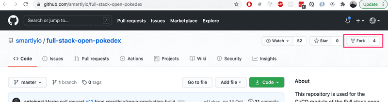

Once you've clicked on the Fork button, GitHub will start the creation of a new repository called `{github_username}/full-stack-open-pokedex`.

Once the process has been finished, you should be redirected to your brand-new repository:

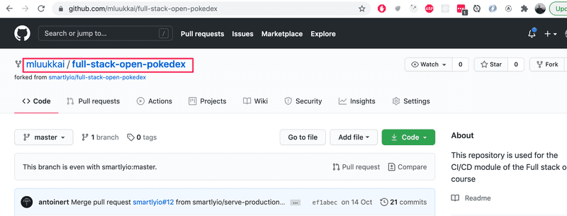

Clone the project now to your machine. As always, when starting with a new code, the most obvious place to look first is the file `package.json`

_NOTE since the project is already a bit old, you need Node 16 to work with it!_

Try now the following:

- install dependencies (by running `npm install`)

- start the code in development mode

- run tests

- lint the code

You might notice that the project contains some broken tests and linting errors. __Just leave them as they are for now__. We will get around those later in the exercises.

As you might remember from [part 3](../part3/README.md#frontend-product-build), the React code _should not_ be run in development mode once it is deployed in production. Try now the following

- create a production _build_ of the project

- run the production version locally

Also for these two tasks, there are ready-made npm scripts in the project!

Study the structure of the project for a while. As you notice both the frontend and the backend code are now [in the same repository](../part7/README.md#frontend-and-backend-in-the-same-repository). In earlier parts of the course we had a separate repository for both, but having those in the same repository makes things much simpler when setting up a CI environment.

In contrast to most projects in this course, the frontend code _does not use_ Vite but it has a relatively simple [Webpack](../part7/README.md#part-7d---webpack) configuration that takes care of creating the development environment and creating the production bundle.

<hr style="border: 2px solid #9C7AA6">

### Getting started with workflows

The core component of creating CI/CD pipelines with GitHub Actions is something called a [Workflow](https://docs.github.com/en/free-pro-team@latest/actions/learn-github-actions/introduction-to-github-actions#workflows). Workflows are process flows that you can set up in your repository to run automated tasks such as building, testing, linting, releasing, and deploying to name a few! The hierarchy of a workflow looks as follows:

Workflow:

- Job

    - Step

    - Step

- Job

    - Step

Each workflow must specify at least one [Job](https://docs.github.com/en/free-pro-team@latest/actions/learn-github-actions/introduction-to-github-actions#jobs), which contains a set of [Steps](https://docs.github.com/en/free-pro-team@latest/actions/learn-github-actions/introduction-to-github-actions#steps) to perform individual tasks. The jobs will be run in parallel and the steps in each job will be executed sequentially.

Steps can vary from running a custom command to using pre-defined actions, thus the name GitHub Actions. You can create [customized actions](https://docs.github.com/en/free-pro-team@latest/actions/creating-actions) or use any actions published by the community, which are plenty, but let's get back to that later!

For GitHub to recognize your workflows, they must be specified in `.github/workflows` folder in your repository. Each Workflow is its own separate file which needs to be configured using the `YAML` data-serialization language.

YAML is a recursive acronym for "YAML Ain't Markup Language". As the name might hint its goal is to be human-readable and it is commonly used for configuration files. You will notice below that it is indeed very easy to understand!

Notice that indentations are important in YAML. You can learn more about the syntax [here](https://docs.ansible.com/ansible/latest/reference_appendices/YAMLSyntax.html).

A basic workflow contains three elements in a YAML document. These three elements are:

- name: Yep, you guessed it, the name of the workflow

- (on) triggers: The events that trigger the workflow to be executed

- jobs: The separate jobs that the workflow will execute (a basic workflow might contain only one job).

A simple workflow definition looks like this:

```yml
name: Hello World!

on:
  push:
    branches:
      - main

jobs:
  hello_world_job:
    runs-on: ubuntu-latest
    steps:
      - name: Say hello
        run: |
          echo "Hello World!"
```

There is one job named *hello_world_job*, it will be run in a virtual environment with Ubuntu 20.04. The job has just one step named "Say hello", which will run the `echo "Hello World!"` command in the shell.

So you may ask, when does GitHub trigger a workflow to be started? There are plenty of [options](https://docs.github.com/en/free-pro-team@latest/actions/reference/events-that-trigger-workflows) to choose from, but generally speaking, you can configure a workflow to start once:

- An _event on GitHub_ occurs such as when someone pushes a commit to a repository or when an issue or pull request is created

- A _scheduled event_, that is specified using the [cron](https://en.wikipedia.org/wiki/Cron)-syntax, happens

- An _external event_ occurs, for example, a command is performed in an external application such as [Slack](https://slack.com/) or [Discord](https://discord.com/) messaging app

To learn more about which events can be used to trigger workflows, please refer to GitHub Action's [documentation](https://docs.github.com/en/free-pro-team@latest/actions/reference/events-that-trigger-workflows).

<hr style="border: 2px solid #9C7AA6">

### Exercises 11.3 - 11.4

To tie this all together, let us now get GitHub Actions up and running in the example project!

#### 11.3 Hello world!

Create a new Workflow that outputs "Hello World!" to the user. For the setup, you should create the directory `.github/workflows` and a file `hello.yml` to your repository.

To see what your GitHub Action workflow has done, you can navigate to the _Actions_ tab in GitHub where you should see the workflows in your repository and the steps they implement. The output of your Hello World workflow should look something like this with a properly configured workflow.

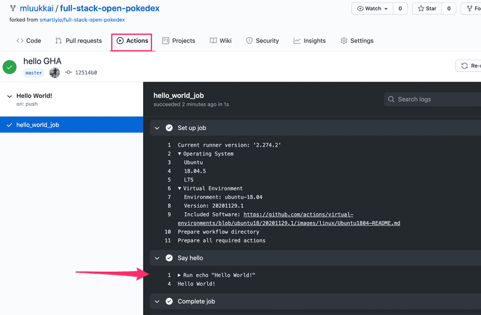

You should see the "Hello World!" message as an output. If that's the case then you have successfully gone through all the necessary steps. You have your first GitHub Actions workflow active!

Note that GitHub Actions also informs you on the exact environment (operating system, and its [setup](https://github.com/actions/virtual-environments/blob/ubuntu18/20201129.1/images/linux/Ubuntu1804-README.md)) where your workflow is run. This is important since if something surprising happens, it makes debugging so much easier if you can reproduce all the steps in your machine!

#### 11.4 Date and directory contents

Extend the workflow with steps that print the date and current directory content in the long format.

Both of these are easy steps, and just running commands [date](https://man7.org/linux/man-pages/man1/date.1.html) and [ls](https://man7.org/linux/man-pages/man1/ls.1.html) will do the trick.

Your workflow should now look like this

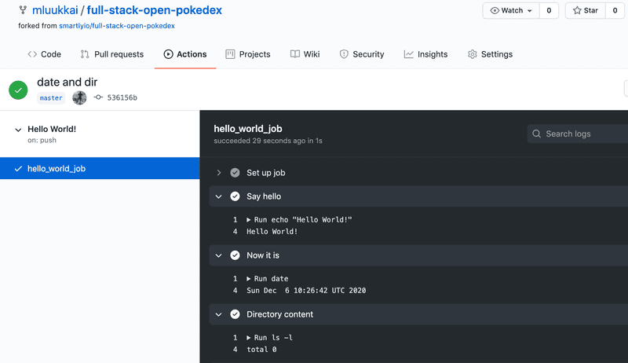

As the output of the command `ls -l` shows, by default, the virtual environment that runs our _workflow does not_ have any code!

<hr style="border: 2px solid #9C7AA6">

### Setting up lint, test and build steps

After completing the first exercises, you should have a simple but pretty useless workflow set up. Let's make our workflow do something useful.

Let's implement a GitHub Action that will lint the code. If the checks don't pass, GitHub Actions will show a red status.

At the start, the workflow that we will save to file `pipeline.yml` looks like this:

```yml
name: Deployment pipeline

on:
  push:
    branches:
      - main

jobs:
```

Before we can run a command to lint the code, we have to perform a couple of actions to set up the environment of the job.

#### Setting up the environment

Setting up the environment is an important task while configuring a pipeline. We're going to use an `ubuntu-latest` virtual environment because this is the version of Ubuntu we're going to be running in production.

It is important to replicate the same environment in CI as in production as closely as possible, to avoid situations where the same code works differently in CI and production, which would effectively defeat the purpose of using CI.

Next, we list the steps in the "build" job that the CI would need to perform. As we noticed in the last exercise, by default the virtual environment does not have any code in it, so we need to _checkout the code_ from the repository.

This is an easy step:

```yml
name: Deployment pipeline

on:
  push:
    branches:
      - main

jobs:

  simple_deployment_pipeline:
    runs-on: ubuntu-latest
    steps:
      - uses: actions/checkout@v4
```

The [uses](https://docs.github.com/en/free-pro-team@latest/actions/reference/workflow-syntax-for-github-actions#jobsjob_idstepsuses) keyword tells the workflow to run a specific _action_. An action is a reusable piece of code, like a function. Actions can be defined in your repository in a separate file or you can use the ones available in public repositories.

Here we're using a public action [actions/checkout](https://github.com/actions/checkout) and we specify a version (`@v4`) to avoid potential breaking changes if the action gets updated. The `checkout` action does what the name implies: it checkouts the project source code from Git.

>`actions/checkout@v4` is an __official GitHub Action__ that clones your repository’s code into the runner (the VM/container where your workflow runs).

Secondly, as the application is written in JavaScript, Node.js must be set up to be able to utilize the commands that are specified in `package.json`. To set up Node.js, [actions/setup-node](https://github.com/actions/setup-node) action can be used. Version `20` is selected because it is the version the application is using in the production environment.

```yml
# name and trigger not shown anymore...

jobs:
  simple_deployment_pipeline:
    runs-on: ubuntu-latest
    steps:
      - uses: actions/checkout@v4

      - uses: actions/setup-node@v4
        with:
          node-version: '20'
```

As we can see, the [with](https://docs.github.com/en/free-pro-team@latest/actions/reference/workflow-syntax-for-github-actions#jobsjob_idstepswith) keyword is used to give a "parameter" to the action. Here the parameter specifies the version of Node.js we want to use.

Lastly, the dependencies of the application must be installed. Just like on your own machine we execute `npm install`. The steps in the job should now look something like

```yml
jobs:
  simple_deployment_pipeline:
    runs-on: ubuntu-latest
    steps:
      - uses: actions/checkout@v4
      - uses: actions/setup-node@v4
        with:
          node-version: '20'

      - name: Install dependencies
        run: npm install
```

Now the environment should be completely ready for the job to run actual important tasks in!

#### Lint

After the environment has been set up we can run all the scripts from `package.json` like we would on our own machine. To lint the code all you have to do is add a step to run the `npm run eslint` command.

```yml
jobs:
  simple_deployment_pipeline:
    runs-on: ubuntu-latest
    steps:
      - uses: actions/checkout@v4
      - uses: actions/setup-node@v4
        with:
          node-version: '20'
      - name: Install dependencies 
        run: npm install  

      - name: Check style
        run: npm run eslint
```

Note that the `name` of a step is optional, if you define a step as follows

```yml
- run: npm run eslint
```

the command that is run is used as the default name.

<hr style="border: 2px solid #9C7AA6">

### Exercise 11.5 - 11.9

Implement or _copy-paste_ the "Lint" workflow and commit it to the repository. Use a new _yml_ file for this workflow, you may call it e.g. _pipeline.yml_.

Push your code and navigate to "Actions" tab and click on your newly created workflow on the left. You should see that the workflow run has failed:

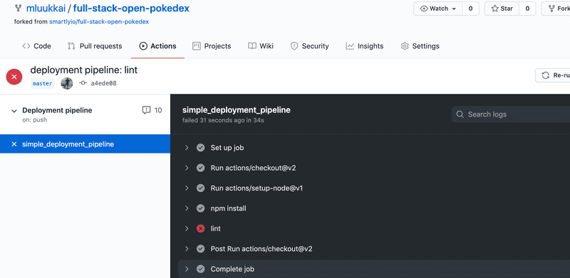

#### 11.6 Fix the code

There are some issues with the code that you will need to fix. Open up the workflow logs and investigate what is wrong.

A couple of hints. One of the errors is best to be fixed by specifying proper _env_ for linting, see [here](../part3/README.md#lint) how it can be done. One of the complaints concerning `console.log` statement could be taken care of by simply silencing the rule for that specific line. Ask google how to do it.

Make the necessary changes to the source code so that the lint workflow passes. Once you commit new code the workflow will run again and you will see updated output where all is green again:

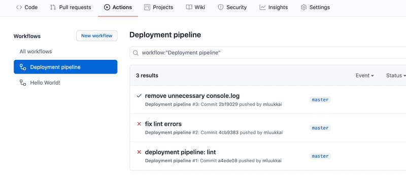

#### 11.7 Building and testing 

Let's expand on the previous workflow that currently does the linting of the code. Edit the workflow and similarly to the lint command add commands for build and test. After this step outcome should look like this

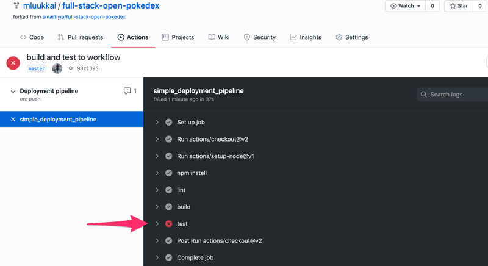

As you might have guessed, there are some problems in code...

#### 11.8 Back to green

Investigate which test fails and fix the issue in the code (do not change the tests).

Once you have fixed all the issues and the Pokedex is bug-free, the workflow run will succeed and show green!

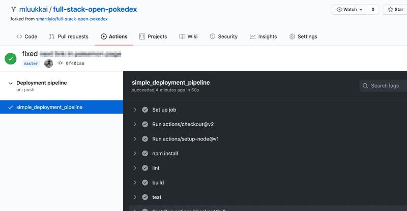

#### 11.9 Simple end-to-end tests

The current set of tests uses [Jest](https://jestjs.io/) to ensure that the React components work as intended. This is essentially the same thing that is done in the section [Testing React apps](../part5/README.md#part-5c---testing-react-apps) of part 5 with [Vitest](https://vitest.dev/).

Testing components in isolation is quite useful but that still does not ensure that the system as a whole works as we wish. To have more confidence about this, let us write a couple of really simple end-to-end tests similarly we did in section [part 5](../part5/README.md). You could use [Playwright](https://playwright.dev/) or [Cypress](https://www.cypress.io/) for the tests.

No matter which you choose, you should extend Jest-definition in package.json to prevent Jest from trying to run the e2e-tests. Assuming that directory `e2e-tests` is used for e2e-tests, the definition is:

```json
{
  // ...
  "jest": {
    "testEnvironment": "jsdom",

    "testPathIgnorePatterns": ["e2e-tests"]
  }
}
```

##### Playwright

Set Playwright up (you'll find [here](../part5/README.md#part-5d---end-to-end-testing-playwright) all the info you need) to your repository. Note that in contrast to part 5, you should now install Playwright to the same project with the rest of the code!

Use this test first:

```js
const { test, describe, expect, beforeEach } = require('@playwright/test')

describe('Pokedex', () => {
  test('front page can be opened', async ({ page }) => {
     await page.goto('')
    await expect(page.getByText('ivysaur')).toBeVisible()
    await expect(page.getByText('Pokémon and Pokémon character names are trademarks of Nintendo.')).toBeVisible()
  })
})
```

_Note_ is that although the page renders the Pokemon names with an initial capital letter, the names are actually written with lowercase letters in the source, so you should test for `ivysaur` instead of `Ivysaur`!

Define a npm script `test:e2e` for running the e2e tests from the command line.

Remember that the Playwright tests _assume that the application is up and running_ when you run the test! Instead of starting the app manually, you should now configure a _Playwright development server_ to start the app while tests are executed, see [here](https://playwright.dev/docs/next/api/class-testconfig#test-config-web-server) how that can be done.

Ensure that the test passes locally.

Once the end-to-end test works in your machine, include it in the GitHub Action workflow. That should be pretty easy by following [this](https://playwright.dev/docs/ci-intro#on-pushpull_request).

##### Cypress

Set Cypress up (you'll find [here](https://fullstackopen.com/en/part5/end_to_end_testing_cypress) all the info you need) and use this test first:

```js
describe('Pokedex', function() {
  it('front page can be opened', function() {
    cy.visit('http://localhost:5000')
    cy.contains('ivysaur')
    cy.contains('Pokémon and Pokémon character names are trademarks of Nintendo.')
  })
})
```

Define a npm script `test:e2e` for running the e2e tests from the command line.

_Note_ is that although the page renders the Pokemon names with an initial capital letter, the names are actually written with lowercase letters in the source, so you should test for `ivysaur` instead of `Ivysaur`!

Ensure that the test passes locally. Remember that the Cypress tests _assume that the application is up and running_ when you run the test! If you have forgotten the details, please see part 5 how to get up and running with Cypress.

Once the end-to-end test works in your machine, include it in the GitHub Action workflow. By far the easiest way to do that is to use the ready-made action [cypress-io/github-action](https://github.com/cypress-io/github-action). The step that suits us is the following:

```yml
- name: e2e tests
  uses: cypress-io/github-action@v5
  with:
    command: npm run test:e2e
    start: npm run start-prod
    wait-on: http://localhost:5000
```

Three options are used: [command](https://github.com/cypress-io/github-action#custom-test-command) specifies how to run Cypress tests, [start](https://github.com/cypress-io/github-action#start-server) gives npm script that starts the server, and [wait-on](https://github.com/cypress-io/github-action#wait-on) says that before the tests are run, the server should have started on url http://localhost:5000.

Note that you need to build the app in GitHub Actions before it can be started in production mode!

##### Once the pipeline works...

Once you are sure that the pipeline works, _write another test_ that ensures that one can navigate from the main page to the page of a particular Pokemon, e.g. _ivysaur_. The test does not need to be a complex one, just check that when you navigate to a link, the page has some proper content, such as the string _chlorophyll_ in the case of _ivysaur_.

Note the Pokemon abilities are written with lowercase letters in the source code (the capitalization is done in CSS), so _do not_ test for _Chlorophyll_ but rather _chlorophyll_.

The end result should be something like this

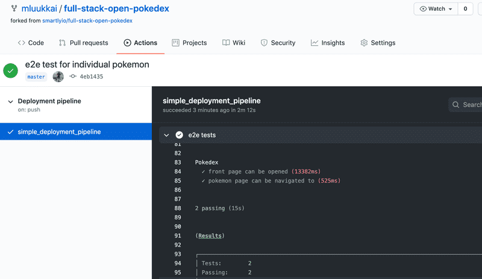

End-to-end tests are nice since they give us confidence that software works from the end user's perspective. The price we have to pay is the slower feedback time. Now executing the whole workflow takes quite much longer.

<hr style="border: 2px solid #9C7AA6">

## Part 11c - Deployment

Having written a nice application it's time to think about how we're going to deploy it to the use of real users.

In [part 3](../part3/README.md#3b---deploying-app-to-internet) of this course, we did this by simply running a single command from terminal to get the code up and running the servers of the cloud provider [Fly.io](https://fly.io/) or [Render](https://render.com/).

It is pretty simple to release software in Fly.io and Render at least compared to many other types of hosting setups but it still contains risks: nothing prevents us from accidentally releasing broken code to production.

Next, we're going to look at the principles of making a deployment safely and some of the principles of deploying software on both a small and large scale.

### Anything that can go wrong...

We'd like to define some rules about how our deployment process should work but before that, we have to look at some constraints of reality.

One phrasing of Murphy's Law holds that: "Anything that can go wrong will go wrong."

It's important to remember this when we plan out our deployment system. Some of the things we'll need to consider could include:

- What if my computer crashes or hangs during deployment?

- I'm connected to the server and deploying over the internet, what happens if my internet connection dies?

- What happens if any specific instruction in my deployment script/system fails?

- What happens if, for whatever reason, my software doesn't work as expected on the server I'm deploying to? Can I roll back to a previous version?

- What happens if a user does an HTTP request to our software just before we do deployment (we didn't have time to send a response to the user)?

These are just a small selection of what can go wrong during a deployment, or rather, things that we should plan for. Regardless of what happens, our deployment system should **never** leave our software in a broken state. We should also always know (or be easily able to find out) what state a deployment is in.

Another important rule to remember when it comes to deployments (and CI in general) is: "Silent failures are **very** bad!"

This doesn't mean that failures need to be shown to the users of the software, it means we need to be aware if anything goes wrong. If we are aware of a problem, we can fix it. If the deployment system doesn't give any errors but fails, we may end up in a state where we believe we have fixed a critical bug but the deployment failed, leaving the bug in our production environment and us unaware of the situation.

### What does a good deployment system do?

Defining definitive rules or requirements for a deployment system is difficult, let's try anyway:

- Our deployment system should be able to fail gracefully at any step of the deployment.

- Our deployment system should **never** leave our software in a broken state.

- Our deployment system should let us know when a failure has happened. It's more important to notify about failure than about success.

- Our deployment system should allow us to roll back to a previous deployment

  - Preferably this rollback should be easier to do and less prone to failure than a full deployment

  - Of course, the best option would be an automatic rollback in case of deployment failures

- Our deployment system should handle the situation where a user makes an HTTP request just before/during a deployment.

- Our deployment system should make sure that the software we are deploying meets the requirements we have set for this (e.g. don't deploy if tests haven't been run).

Let's define some things we **want** in this hypothetical deployment system too:

- We would like it to be fast

- We'd like to have no downtime during the deployment (this is a distinct from the requirement we have for handling user requests just before/during the deployment)

Next we will have two sets of exercises for automating the deployment with GitHub Actions, one for [Fly.io](https://fly.io/), another one for [Render](https://render.com/). The process of deployment is always specific to the particular cloud provider, so you can also do both the exercise sets if you want to see the differences on how these services work with respect to deployments.

### Has the app been deployed?

Since we are not making any real changes to the app, it might be a bit hard to see if the app deployment really works. Let us create a dummy endpoint in the app that makes it possible to do some code changes and to ensure that the deployed version has really changed:

```js
app.get('/version', (req, res) => {
  res.send('1') // change this string to ensure a new version deployed
})
```

<hr style="border: 2px solid #9C7AA6">

### Exercises 11.10 - 11.12 (Render)

If you rather want to use other hosting options, there is an alternative set of exercises for [Fly.io](https://fullstackopen.com/en/part11/deployment#exercises-11-10-11-12-fly-io).

#### 11.10 Deploying your application to Render

Set up your application in [Render](https://render.com/). The setup is now not quite as straightforward as in [part 3](../part3/README.md#application-to-the-internet). You have to carefully think about what should go to these settings:

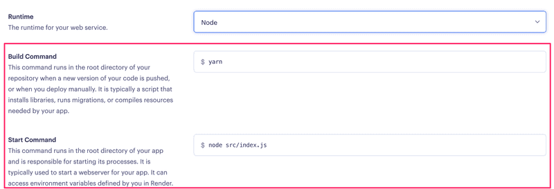

If you need to run several commands in the build or start command, you may use a simple shell script for that.

Create eg. a file *build_step.sh* with the following content:

```sh
#!/bin/bash

echo "Build script"

# add the commands here
```

Give it execution permissions (Google or see e.g. [this](https://www.guru99.com/file-permissions.html) to find out how) and ensure that you can run it from the command line:

```
$ ./build_step.sh
Build script
```

Other option is to use a [Pre deploy command](https://docs.render.com/deploys#deploy-steps), with that you may run one additional command before the deployment starts.

You also need to open the *Advanced settings* and turn the auto-deploy off since we want to control the deployment in the GitHub Actions:

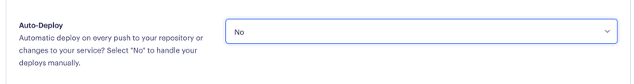

Ensure now that you get the app up and running. Use the *Manual deploy*.

Most likely things will fail at the start, so remember to keep the *Logs* open all the time.

#### 11.11 Automatic deployments

Next step is to automate the deployment. There are two options, a ready-made custom action or the use of the Render deploy hook.

**Deployment with custom action**

Go to GitHub Actions [marketplace](https://github.com/marketplace) and search for action for our purposes. You might search with *render deploy*. There are several actions to choose from. You can pick any. Quite often the best choice is the one with the most stars. It is also a good idea to look if the action is actively maintained (time of the last release) and does it have many open issues or pull requests.

**Warning**: for some reason, the most starred option [render-action](https://github.com/Bounceapp/render-action) was very unreliable when the part was updated (16th Jan 2024), so better avoid that. If you end up with too much problems, the deploy hook might be a better option!

Set up the action to your workflow and ensure that every commit that passes all the checks results in a new deployment. Note that you need Render API key and the app service id for the deployment. See [here](https://render.com/docs/api) how the API key is generated. You can get the service id from the URL of the Render dashboard of your app. The end of the URL (starting with `srv-`) is the id:

```
https://dashboard.render.com/web/srv-randomcharachtershere
```

**Deployment with deploy hook**

Alternative, and perhaps a more reliable option is to use [Render Deploy Hook](https://render.com/docs/deploy-hooks) which is a private URL to trigger the deployment. You can get it from you app settings:

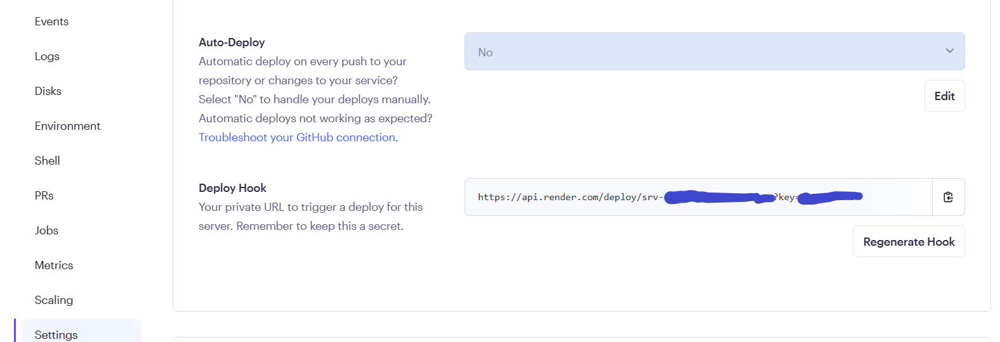

DON'T USE the plain URL in your pipeline. Instead create GitHub secrets for your key and service id:

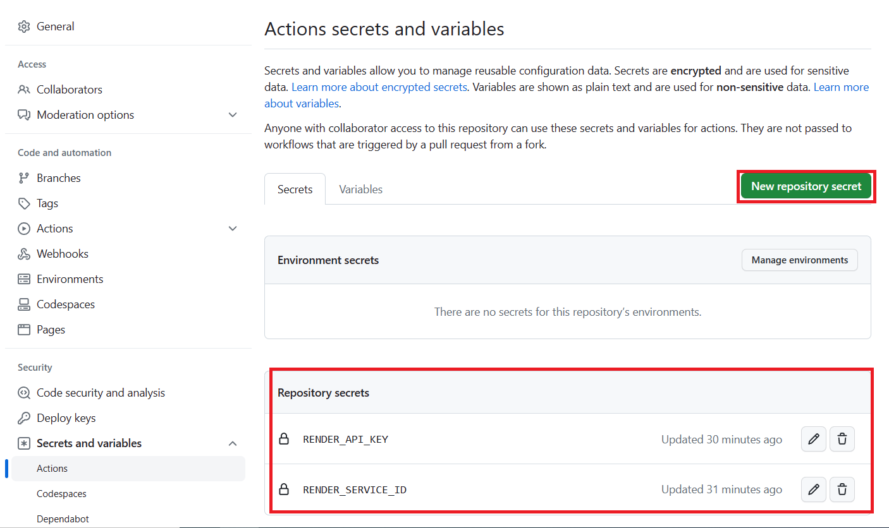

Then you can use them like this:

```yml
- name: Trigger deployment
  run: curl https://api.render.com/deploy/srv-${{ secrets.RENDER_SERVICE_ID }}?key=${{ secrets.RENDER_API_KEY }}
```

<hr style="border: 2px solid #9C7AA6">

## Part 11d - Keeping green

Your main branch of the code should always remain green. Being green means that all the steps of your build pipeline should complete successfully: the project should build successfully, tests should run without errors, and the linter shouldn't have anything to complain about, etc.

Why is this important? You will likely deploy your code to production specifically from your main branch. Any failures in the main branch would mean that new features cannot be deployed to production until the issue is sorted out. Sometimes you will discover a nasty bug in production that was not caught by the CI/CD pipeline. In these cases, you want to be able to roll the production environment back to a previous commit in a safe manner.

How do you keep your main branch green then? Avoid committing any changes directly to the main branch. Instead, commit your code on a branch based on the freshest possible version of the main branch. Once you think the branch is ready to be merged into the main you create a GitHub Pull Request (also referred to as PR).

### Working with Pull Requests

Pull requests are a core part of the collaboration process when working on any software project with at least two contributors. When making changes to a project you checkout a new branch locally, make and commit your changes, push the branch to the remote repository (in our case to GitHub) and create a pull request for someone to review your changes before those can be merged into the main branch.

There are several reasons why using pull requests and getting your code reviewed by at least one other person is always a good idea.

- Even a seasoned developer can often overlook some issues in their code: we all know of the tunnel vision effect.

- A reviewer can have a different perspective and offer a different point of view.

- After reading through your changes, at least one other developer will be familiar with the changes you've made.

- Using PRs allows you to automatically run all tasks in your CI pipeline before the code gets to the main branch. GitHub Actions provides a trigger for pull requests.

You can configure your GitHub repository in such a way that pull requests cannot be merged until they are approved.

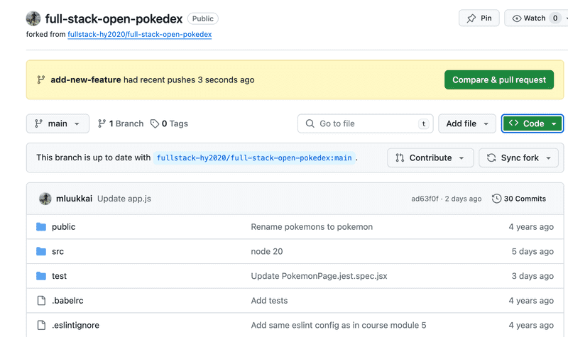

To open a new pull request, open your branch in GitHub and click on the green "Compare & pull request" button at the top. You will be presented with a form where you can fill in the pull request description.

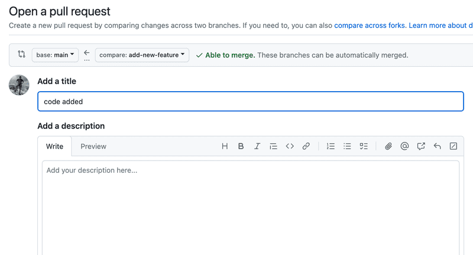

GitHub's pull request interface presents a description and the discussion interface. At the bottom, it displays all the CI checks (in our case each of our Github Actions) that are configured to run for each PR and the statuses of these checks. A green board is what you aim for! You can click on Details of each check to view details and run logs.

All the workflows we looked at so far were triggered by commits to the main branch. To make the workflow run for each pull request we would have to update the trigger part of the workflow. We use the "pull_request" trigger for branch "main" (our main branch) and limit the trigger to events "opened" and "synchronize". Basically, this means, that the workflow will run when a PR into the main branch is opened or updated.

So let us change events that [trigger](https://docs.github.com/en/free-pro-team@latest/actions/reference/events-that-trigger-workflows) of the workflow as follows:

```yml
on:
  push:
    branches:
      - main
  pull_request:
    branches: [main]
    types: [opened, synchronize]
```

We shall soon make it impossible to push the code directly to the main branch, but in the meantime, let us still run the workflow also for all the possible direct pushes to the main branch.

<hr style="border: 2px solid #9C7AA6">

### Exercises 11.13 - 11.14

Our workflow is doing a nice job of ensuring good code quality, but since it is run on commits to the main branch, it's catching the problems too late!

#### 11.13 Pull request

Update the trigger of the existing workflow as suggested above to run on new pull requests to your main branch.

Create a new branch, commit your changes, and open a pull request to your main branch.

If you have not worked with branches before, check [e.g. this tutorial](https://www.atlassian.com/git/tutorials/using-branches) to get started.

Note that when you open the pull request, make sure that you select here your *own* repository as the destination *base repository*. By default, the selection is the original repository by https://github.com/fullstack-hy2020 and you **do not want** to do that:

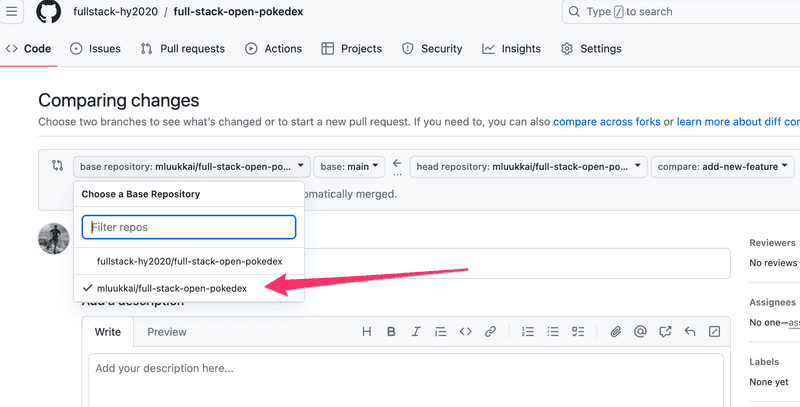

In the "Conversation" tab of the pull request you should see your latest commit(s) and the yellow status for checks in progress:

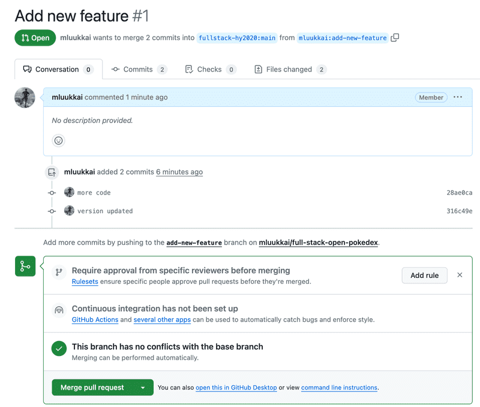

Once the checks have been run, the status should turn to green. Make sure all the checks pass. Do not merge your branch yet, there's still one more thing we need to improve on our pipeline.

#### 11.14 Run deployment step only for the main branch

All looks good, but there is actually a pretty serious problem with the current workflow. All the steps, including the deployment, are run also for pull requests. This is surely something we do not want!

Fortunately, there is an easy solution for the problem! We can add an [if](https://docs.github.com/en/actions/using-workflows/workflow-syntax-for-github-actions#jobsjob_idstepsif) condition to the deployment step, which ensures that the step is executed only when the code is being merged or pushed to the main branch.

The workflow [context](https://docs.github.com/en/free-pro-team@latest/actions/reference/context-and-expression-syntax-for-github-actions#contexts) gives various kinds of information about the code the workflow is run.

The relevant information is found in [GitHub context](https://docs.github.com/en/actions/learn-github-actions/contexts#github-context), the field *event_name* tells us what is the "name" of the event that triggered the workflow. When a pull request is merged, the name of the event is somehow paradoxically *push*, the same event that happens when pushing the code to the repository. Thus, we get the desired behavior by adding the following condition to the step that deploys the code:

```yml
if: ${{ github.event_name == 'push' }}
```

Push some more code to your branch, and ensure that the deployment step *is not executed* anymore. Then merge the branch to the main branch and make sure that the deployment happens.

<hr style="border: 2px solid #9C7AA6">

### Versioning 

The most important purpose of versioning is to uniquely identify the software we're running and the code associated with it.

The ordering of versions is also an important piece of information. For example, if the current release has broken critical functionality and we need to identify the *previous version* of the software so that we can roll back the release back to a stable state.

#### Semantic Versioning and Hash Versioning

How an application is versioned is sometimes called a versioning strategy. We'll look at and compare two such strategies.

The first one is [semantic versioning](https://semver.org/), where a version is in the form `{major}.{minor}.{patch}`. For example, if the version is `1.2.3`, it has `1` as the major version, `2` is the minor version, and `3` is the patch version.

In general, changes that fix the functionality without changing how the application works from the outside are `patch` changes, changes that make small changes to functionality (as viewed from the outside) are `minor` changes and changes that completely change the application (or major functionality changes) are `major` changes. The definitions of each of these terms can vary from project to project.

For example, npm-libraries are following the semantic versioning. At the time of writing this text (16th March 2023) the most recent version of React is [18.2.0](https://reactjs.org/versions/), so the major version is 18 and the minor version is 2.

*Hash versioning* (also sometimes known as SHA versioning) is quite different. The version "number" in hash versioning is a hash (that looks like a random string) derived from the contents of the repository and the changes introduced in the commit that created the version. In Git, this is already done for you as the commit hash that is unique for any change set.

Hash versioning is almost always used in conjunction with automation. It's a pain (and error-prone) to copy 32 character long version numbers around to make sure that everything is correctly deployed.

#### But what does the version point to?

Determining what code belongs to a given version is important and the way this is achieved is again quite different between semantic and hash versioning. In hash versioning (at least in Git) it's as simple as looking up the commit based on the hash. This will let us know exactly what code is deployed with a specific version.

It's a little more complicated when using semantic versioning and there are several ways to approach the problem. These boil down to three possible approaches: something in the code itself, something in the repo or repo metadata, something completely outside the repo.

While we won't cover the last option on the list (since that's a rabbit hole all on its own), it's worth mentioning that this can be as simple as a spreadsheet that lists the Semantic Version and the commit it points to.

For the two repository based approaches, the approach with something in the code usually boils down to a version number in a file and the repo/metadata approach usually relies on tags or (in the case of GitHub) releases. In the case of [tags](https://www.atlassian.com/git/tutorials/inspecting-a-repository/git-tag) or releases, this is relatively simple, the tag or release points to a commit, the code in that commit is the code in the release.

#### Versioning order

In semantic versioning, even if we have version bumps of different types (major, minor, or patch) it's still quite easy to put the releases in order: 1.3.7 comes before 2.0.0 which itself comes before 2.1.5 which comes before 2.2.0. A list of releases (conveniently provided by a package manager or GitHub) is still needed to know what the last version is but it's easier to look at that list and discuss it: It's easier to say "We need to roll back to 3.2.4" than to try communicate a hash in person.

That's not to say that hashes are inconvenient: if you know which commit caused the particular problem, it's easy enough to look back through a Git history and get the hash of the previous commit. But if you have two hashes, say `d052aa41edfb4a7671c974c5901f4abe1c2db071` and `12c6f6738a18154cb1cef7cf0607a681f72eaff3`, you really can not say which came earlier in history, you need something more, such as the Git log that reveals the ordering.

#### Comparing the Two

We've already touched on some of the advantages and disadvantages of the two versioning methods discussed above but it's perhaps useful to address where they'd each likely be used.

Semantic Versioning works well when deploying services where the version number could be of significance or might actually be looked at. As an example, think of the JavaScript libraries that you're using. If you're using version 3.4.6 of a particular library, and there's an update available to 3.4.8, if the library uses semantic versioning, you could (hopefully) safely assume that you're ok to upgrade without breaking anything. If the version jumps to 4.0.1 then maybe it's not such a safe upgrade.

Hash versioning is very useful where most commits are being built into artifacts (e.g. runnable binaries or Docker images) that are themselves uploaded or stored. As an example, if your testing requires building your package into an artifact, uploading it to a server, and running tests against it, it would be convenient to have hash versioning as it would prevent accidents.

As an example think that you're working on version 3.2.2 and you have a failing test, you fix the failure and push the commit but as you're working in your branch, you're not going to update the version number. Without hash versioning, the artifact name may not change. If there's an error in uploading the artifact, maybe the tests run again with the older artifact (since it's still there and has the same name) and you get the wrong test results. If the artifact is versioned with the hash, then the version number `must` change on every commit and this means that if the upload fails, there will be an error since the artifact you told the tests to run against does not exist.

Having an error happen when something goes wrong is almost always preferable to having a problem silently ignored in CI.

#### Best of Both Worlds

From the comparison above, it would seem that the semantic versioning makes sense for releasing software while hash-based versioning (or artifact naming) makes more sense during development. This doesn't necessarily cause a conflict.

Think of it this way: versioning boils down to a technique that points to a specific commit and says "We'll give this point a name, it's name will be 3.5.5". Nothing is preventing us from also referring to the same commit by its hash.

There is a catch. We discussed at the beginning of this part that we always have to know exactly what is happening with our code, for example, we need to be sure that we have tested the code we want to deploy. Having two parallel versioning (or naming) conventions can make this a little more difficult.

For example, when we have a project that uses hash-based artifact builds for testing, it's always possible to track the result of every build, lint, and test to a specific commit and developers know the state their code is in. This is all automated and transparent to the developers. They never need to be aware of the fact that the CI system is using the commit hash underneath to name build and test artifacts. When the developers merge their code to the main branch, again the CI takes over. This time, it will build and test all the code and give it a semantic version number all in one go. It attaches the version number to the relevant commit with a Git tag.

In the case above, the software we release is tested because the CI system makes sure that tests are run on the code it is about to tag. It would not be incorrect to say that the project uses semantic versioning and simply ignore that the CI system tests individual developer branches/PRs with a hash-based naming system. We do this because the version we care about (the one that is released) is given a semantic version.

<hr style="border: 2px solid #9C7AA6">

### Exercises 11.15 - 11.16

Let's extend our workflow so that it will automatically increase (bump) the version when a pull request is merged into the main branch and [tag](https://www.atlassian.com/git/tutorials/inspecting-a-repository/git-tag) the release with the version number. We will use an open source action developed by a third party: [anothrNick/github-tag-action](https://github.com/anothrNick/github-tag-action).

#### 11.15 Adding versioning

we will extend our workflow with one more step:

```yml
- name: Bump version and push tag
  uses: anothrNick/github-tag-action@1.64.0
  env:
    GITHUB_TOKEN: ${{ secrets.GITHUB_TOKEN }}
```

Note: you should use the most recent version of the action, see [here](https://github.com/anothrNick/github-tag-action) if a more recent version is available.

We're passing an environmental variable `secrets.GITHUB_TOKEN` to the action. As it is third party action, it needs the token for authentication in your repository. You can read more [here](https://docs.github.com/en/actions/configuring-and-managing-workflows/authenticating-with-the-github_token) about authentication in GitHub Actions.

You may end up having this error message

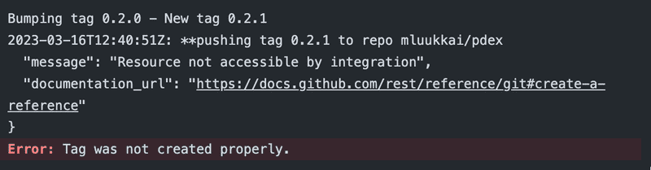

The most likely cause for this is that your token has no write access to your repo. Go to your repository settings, select actions/general, and ensure that your token has read and write permissions:

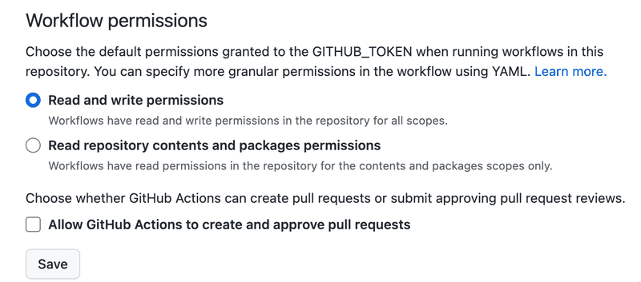

The [anothrNick/github-tag-action](https://github.com/anothrNick/github-tag-action) action accepts some environment variables that modify the way the action tags your releases. You can look at these in the [README](https://github.com/anothrNick/github-tag-action) and see what suits your needs.

As you can see from the documentation by default your releases will receive a `minor` bump, meaning that the middle number will be incremented.

Modify the configuration above so that each new version is by default a `patch` bump in the version number, so that by default, the last number is increased.

Remember that we want only to bump the version when the change happens to the main branch! So add a similar `if` condition to prevent version bumps on pull request as was done in [Exercise 11.14](#1114-run-deployment-step-only-for-the-main-branch) to prevent deployment on pull request related events.

Complete now the workflow. Do not just add it as another step, but configure it as a separate job that [depends](https://docs.github.com/en/actions/using-workflows/advanced-workflow-features#creating-dependent-jobs) on the job that takes care of linting, testing and deployment. So change your workflow definition as follows:

```yml
name: Deployment pipeline

on:
  push:
    branches:
      - main
  pull_request:
    branches: [main]
    types: [opened, synchronize]

jobs:
  simple_deployment_pipeline:
    runs-on: ubuntu-latest
    steps:
      // steps here
  tag_release:
    needs: [simple_deployment_pipeline]
    runs-on: ubuntu-latest
    steps:
      // steps here
```

As mentioned [earlier](#getting-started-with-workflows), jobs of a workflow are executed in parallel. However since we want the linting, testing and deployment to be done first, we set a dependency that the *tag_release* waits for since we do not want to tag the release unless it passes tests and is deployed.

If you're uncertain of the configuration, you can set `DRY_RUN` to `true`, which will make the action output the next version number without creating or tagging the release!

Once the workflow runs successfully, the repository mentions that there are some *tags*:

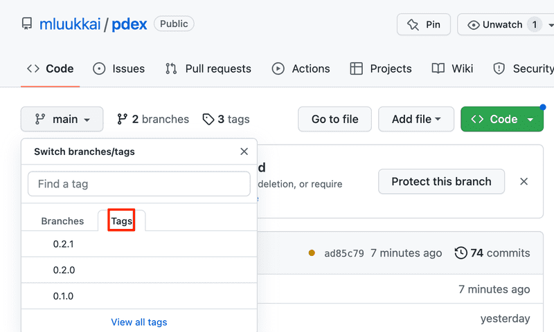

By clicking *view all tags*, you can see all the tags listed:

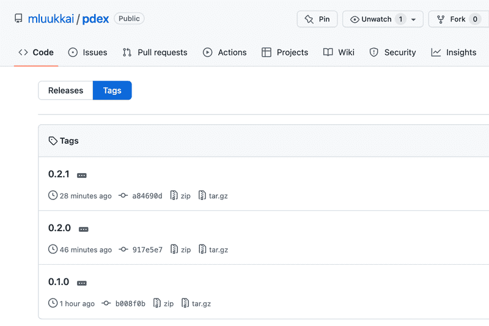

If needed, you can navigate to the view of a single tag that shows eg. what is the GitHub commit corresponding to the tag.

#### 11.16 Skipping a commit for tagging and deployment

In general, the more often you deploy the main branch to production, the better. However, there might sometimes be a valid reason to skip/prevent a particular commit or a merged pull request from being tagged and released to production.

Modify your setup so that if a commit message in a pull request contains `#skip`, the merge will not be deployed to production and it is not tagged with a version number.

**Hints**

The easiest way to implement this is to alter the [if](https://docs.github.com/en/free-pro-team@latest/actions/reference/workflow-syntax-for-github-actions#jobsjob_idstepsif) conditions of the relevant steps. Similarly to [exercise 11-14](#1114-run-deployment-step-only-for-the-main-branch) you can get the relevant information from the [GitHub context](https://docs.github.com/en/free-pro-team@latest/actions/reference/context-and-expression-syntax-for-github-actions#github-context) of the workflow.

You might take this as a starting point:

```yml
name: Testing stuff

on:
  push:
    branches:
      - main

jobs:
  a_test_job:
    runs-on: ubuntu-latest
    steps:
      - uses: actions/checkout@v4
      - name: github context
        env:
          GITHUB_CONTEXT: ${{ toJson(github) }}
        run: echo "$GITHUB_CONTEXT"
      - name: commits
        env:
          COMMITS: ${{ toJson(github.event.commits) }}
        run: echo "$COMMITS"
      - name: commit messages
        env:
          COMMIT_MESSAGES: ${{ toJson(github.event.commits.*.message) }}
        run: echo "$COMMIT_MESSAGES"
```

See what gets printed in the workflow log!

Note that you can access the commits and commit messages *only when pushing or merging to the main branch*, so for pull requests the `github.event.commits` is empty. It is anyway not needed, since we want to skip the step altogether for pull requests.

You most likely need functions [contains](https://docs.github.com/en/actions/learn-github-actions/expressions#contains) and [join](https://docs.github.com/en/actions/learn-github-actions/expressions#join) for your if condition.

Developing workflows is not easy, and quite often the only option is trial and error. It might actually be advisable to have a separate repository for getting the configuration right, and when it is done, to copy the right configurations to the actual repository.

It would also make sense to re-use longer conditions by moving them to commonly accessible variables and referring these variables on the step level:

```yml
name: some workflow name

env:
  # the below will be 'true'
  CONDITION: ${{ contains('kissa', 'ss') && contains('koira', 'ra') && contains('pretty long array of criteria to repeat in multiple places', 'crit') }}

jobs:
  job1:
    # rest of the job
    outputs:
      # here we produce a record of the outcome of a key step in the job.
      # the below will be 'true'
      job2_can_run: ${{ steps.final.outcome == 'success' }}
    steps:
      - if: ${{ env.CONDITION == 'true' }}
        run: echo 'this step is executed'

      - if: ${{ env.CONDITION == 'false' }}
        run: echo 'this step will not be executed'

      - if: ${{ env.CONDITION == 'true' }}
        # this is important, the id `final` is referenced in job1's `outputs`.
        id: final
        run: echo

  job2:
    needs:
      - job1
    # this job will be dependent on the above job1's final step, which in turn depends on the CONDITION defined at the beginning of the file.
    # note that the `env`-variable cannot be directly accessed on the job level, so we need to use something else,
    # such as the outputs from another job.
    if: ${{ needs.job1.outputs.job2_can_run == 'true' }}
    steps:
      # rest of the job
```

It would also be possible to install a tool such as [act](https://github.com/nektos/act) that makes it possible to run your workflows locally. Unless you end up using more involved use cases like creating your [own custom actions](https://docs.github.com/en/free-pro-team@latest/actions/creating-actions), going through the burden of setting up a tool such as act is most likely not worth the trouble.

<hr style="border: 2px solid #9C7AA6">

### A note about using third-party actions

When using a third-party action such that *github-tag-action* it might be a good idea to specify the used version with hash instead of using a version number. The reason for this is that the version number, that is implemented with a Git tag can in principle be *moved*. So today's version 1.61.0 might be a different code that is at next week the version 1.61.0!

However, the code in a commit with a particular hash does not change in any circumstances, so if we want to be 100% sure about the code we use, it is safest to use the hash.

Version [1.61.0](https://github.com/anothrNick/github-tag-action/releases/tag/1.61.0) of the action corresponds to a commit with hash `8c8163ef62cf9c4677c8e800f36270af27930f42`, so we might want to change our configuration as follows:

```yml
    - name: Bump version and push tag
      uses: anothrNick/github-tag-action@8c8163ef62cf9c4677c8e800f36270af27930f42
      env:
        GITHUB_TOKEN: ${{ secrets.GITHUB_TOKEN }}
```

When we use actions provided by GitHub we trust them not to mess with version tags and to thoroughly test their code.

In the case of third-party actions, the code might end up being buggy or even malicious. Even when the author of the open-source code does not have the intention of doing something bad, they might end up leaving their credentials on a post-it note in a cafe, and then who knows what might happen.

By pointing to the hash of a specific commit we can be sure that the code we use when running the workflow will not change because changing the underlying commit and its contents would also change the hash.

