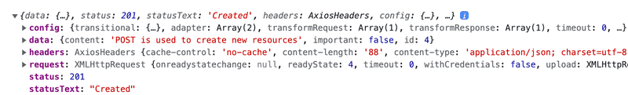
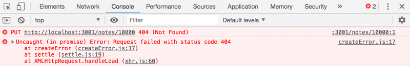
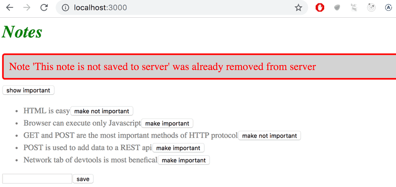
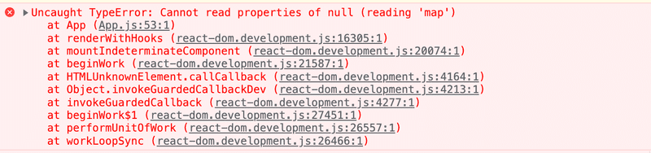
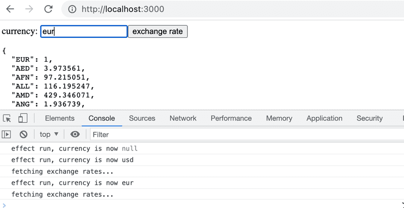

# Table of Contents

- [Part 2](#part-2)
  - [2c - Getting data from server](#2c---getting-data-from-server)
    - [The browser as a runtime environment](#the-browser-as-a-runtime-environment)
    - [npm](#npm)
    - [Axios and promises](#axios-and-promises)
    - [Effect-hooks](#effect-hooks)
    - [The development runtime environment](#the-development-runtime-environment)
  - [2d - Altering data in server](#2d---altering-data-in-server)
    - [REST](#rest)
    - [Sending Data to the Server](#sending-data-to-the-server)
    - [Changing the Importance of Notes](#changing-the-importance-of-notes)
    - [Extracting Communication with the Backend into a Separate Module](#extracting-communication-with-the-backend-into-a-separate-module)
    - [Cleaner Syntax for Defining Object Literals](#cleaner-syntax-for-defining-object-literals)
    - [Promise and Errors](#promise-and-errors)
    - [Full stack developer's oath](#full-stack-developers-oath)
  - [2e - Adding styles to React App](#2e---adding-styles-to-react-app)
    - [Improved error message](#improved-error-message)
    - [Inline style](#inline-styles)

# Part 2

## 2c - Getting data from server

For a while now we have only been working on "frontend", i.e. client-side (browser) functionality. We will begin working on "backend", i.e. server-side functionality in the third part of this course. Nonetheless, we will now take a step in that direction by familiarizing ourselves with how the code executing in the browser communicates with the backend.

Let's use a tool meant to be used during software development called JSON Server to act as our server.

Create a file named _db.json_:

```json
{
  "notes": [
    {
      "id": "1",
      "content": "HTML is easy",
      "important": true
    },
    {
      "id": "2",
      "content": "Browser can execute only JavaScript",
      "important": false
    },
    {
      "id": "3",
      "content": "GET and POST are the most important methods of HTTP protocol",
      "important": true
    }
  ]
}
```

You can start the JSON Server without a separate installation by running the following `npx` command in the root directory of the application:

```
npx json-server --port 3001 db.json
```

The JSON Server starts running on port 3000 by default, but we will now define an alternate port 3001. Let's navigate to the address http://localhost:3001/notes in the browser.

Going forward, the idea will be to save the notes to the server, which in this case means saving them to the json-server. The React code fetches the notes from the server and renders them to the screen. Whenever a new note is added to the application, the React code also sends it to the server to make the new note persist in "memory".

json-server stores all the data in the db.json file, which resides on the server. In the real world, data would be stored in some kind of database. However, json-server is a handy tool that enables the use of server-side functionality in the development phase without the need to program any of it.

We will get familiar with the principles of implementing server-side functionality in more detail in part 3 of this course.

### The browser as a runtime environment

Our first task is fetching the already existing notes to our React application from the address http://localhost:3001/notes.

In the part0 example project, we already learned a way to fetch data from a server using JavaScript. The code in the example was fetching the data using `XMLHttpRequest`, otherwise known as an HTTP request made using an XHR object. This is a technique introduced in 1999, which every browser has supported for a good while now.

The use of XHR is no longer recommended, and browsers already widely support the `fetch` method, which is based on so-called <u>promises</u>, instead of the event-driven model used by XHR.

As a reminder from part0 (which one should remember to not use without a pressing reason), data was fetched using XHR in the following way:

```js
const xhttp = new XMLHttpRequest();

xhttp.onreadystatechange = function () {
  if (this.readyState == 4 && this.status == 200) {
    const data = JSON.parse(this.responseText);
    // handle the response that is saved in variable data
  }
};

xhttp.open("GET", "/data.json", true);
xhttp.send();
```

Right at the beginning, we register an _event handler_ to the `xhttp` object representing the HTTP request, which will be called by the JavaScript runtime whenever the state of the `xhttp` object changes. If the change in state means that the response to the request has arrived, then the data is handled accordingly.

It is worth noting that the code in the event handler is defined before the request is sent to the server. Despite this, the code within the event handler will be executed at a later point in time. Therefore, the code does not execute synchronously "from top to bottom", but does so _asynchronously_. JavaScript calls the event handler that was registered for the request at some point.

JavaScript engines, or runtime environments follow the asynchronous model. In principle, this requires all IO operations (with some exceptions) to be executed as non-blocking. This means that code execution continues immediately after calling an IO function, without waiting for it to return.

When an asynchronous operation is completed, or, more specifically, at some point after its completion, the JavaScript engine calls the event handlers registered to the operation.

Currently, JavaScript engines are single-threaded, which means that they cannot execute code in parallel. As a result, it is a requirement in practice to use a non-blocking model for executing IO operations. Otherwise, the browser would "freeze" during, for instance, the fetching of data from a server.

Another consequence of this single-threaded nature of JavaScript engines is that if some code execution takes up a lot of time, the browser will get stuck for the duration of the execution. If we added the following code at the top of our application:

```js
setTimeout(() => {
  console.log("loop..");
  let i = 0;
  while (i < 50000000000) {
    i++;
  }
  console.log("end");
}, 5000);
```

everything would work normally for 5 seconds. However, when the function defined as the parameter for setTimeout is run, the browser will be stuck for the duration of the execution of the long loop. Even the browser tab cannot be closed during the execution of the loop, at least not in Chrome.

For the browser to remain responsive, i.e., to be able to continuously react to user operations with sufficient speed, the code logic needs to be such that no single computation can take too long.

In today's browsers, it is possible to run parallelized code with the help of so-called web workers. The event loop of an individual browser window is, however, still only handled by a single thread.

### npm

Let's get back to the topic of fetching data from the server.

We could use the previously mentioned promise-based function `fetch` to pull the data from the server. Fetch is a great tool. It is standardized and supported by all modern browsers.

That being said, we will be using the <u>axios</u> library instead for communication between the browser and server. It functions like fetch but is somewhat more pleasant to use. Another good reason to use axios is our getting familiar with adding external libraries, so-called _npm packages_, to React projects.

Nowadays, practically all JavaScript project are defined using the node package manager, aka <u>npm</u>. The projects created using Vite also follow the npm format. A clear indicator that a project uses npm is the _package.json_ file located at the root of the project.

We now want to use axios. Theoretically, we could define the library directly in the package.json file, but it is better to install it from the command line.

```bash
npm install axios
```

**NB `npm` -command should always be run in the project root directory**, which is where the _package.json_ file can be found.

In addition to adding axios to the dependencies, the npm install command also downloaded the library code. As with other dependencies, the code can be found in the node_modules directory located in the root. As one might have noticed, node_modules contains a fair amount of interesting stuff.

Let's make another addition. Install json-server as a development dependency (only used during development) by executing the command:

```bash
npm install json-server --save-dev
```

and making a small addition to the _scripts_ part of the _package.json_ file:

```json
{
  // ...
  "scripts": {
    "dev": "vite",
    "build": "vite build",
    "lint": "eslint .",
    "preview": "vite preview",
    "server": "json-server -p 3001 db.json"
  }
}
```

We can now conveniently, without parameter definitions, start the json-server from the project root directory with the command:

```
npm run server
```

**NB** The previously started json-server must be terminated before starting a new one; otherwise, there will be troubles.

We used the command `npm install` twice, but with slight differences:

```bash
npm install axios
npm install json-server --save-dev
```

There is a fine difference in the parameters. axios is installed as a runtime dependency of the application because the execution of the program requires the existence of the library. On the other hand, json-server was installed as a development dependency (--save-dev), since the program itself doesn't require it. It is used for assistance during software development. There will be more on different dependencies in the next part of the course.

### Axios and promises

Now we are ready to use Axios. Going forward, json-server is assumed to be running on port 3001.

The library can be brought into use the same way other libraries, i.e., by using an appropriate `import` statement.

Add the following in the _main.jsx_.

```js
import axios from "axios";

const promise = axios.get("http://localhost:3001/notes");
console.log(promise);
```

Axios' method `get` return a <u>promise</u>.

The documentation on Mozilla's site states the following about promises

> _A Promise is an object representing the eventual completion or failure of an asynchronous operation._

In other words, a promise is an object that represents an asynchronous operation. A promise can have three distinct states:

- The promise is _pending_. It means that the asynchronous operation corresponding to the promise has not yet finished and the final value is not available yet.
- The promise is _fulfilled_. It means that the operation has been completed and the final value is available, which generally is a successful operation.
- The promise is _rejected_. It means that an error prevent the final value from being determined, which generally represents a failed operation.

There are many details related to promises, but understanding these three states is sufficient for us for now. If you want, you can read more about promises in [Mozilla's documentation](https://developer.mozilla.org/en-US/docs/Web/JavaScript/Reference/Global_Objects/Promise).

If, and when, we want to access the result of the operation represented by the promise, we must register an event handler to the promise. This is achieved using the method `then`:

```js
const promise = axios.get("http://localhost:3001/notes");

promise.then((response) => {
  console.log(response);
});
```

The JavaScript runtime environment calls the callback function registered by the `then` method providing it with a `response` object as a parameter. The `response` object contains all the essential data related to the response of an HTTP GET request, which would include the returned _data_, _status code_ and _headers_.

Storing the promise object in a variable is generally unnecessary, and it's instead common to chan the `then` method call to the axios method call, so that it follows it directly.

```js
axios.get("http://localhost:3001/notes").then((response) => {
  const notes = response.data;
  console.log(notes);
});
```

The callback function now takes the data contained within the response, stores it in a variable, and prints the notes to the console.

A more readable way to format _chained_ method calls is to place each on its own line:

```js
axios.get("http://localhost:3001/notes").then((response) => {
  const notes = response.data;
  console.log(notes);
});
```

The data returned by the server is plain text, basically just one long string. The axios library is still able to parse the data into a JavaScript array, since the server has specified that the data format is _application/json;charset=utf-8_ using the _content-type_ header.

We can finally begin using the data fetched from the server.

Let's try and request the notes from our local server and render them, initially as the App component. Please note that this approach has many issues, as we're rendering the entire App component only when we successfully retrieve a response:

```js
import ReactDOM from "react-dom/client";
import axios from "axios";
import App from "./App";

axios.get("http://localhost:3001/notes").then((response) => {
  const notes = response.data;
  ReactDOM.createRoot(document.getElementById("root")).render(
    <App notes={notes} />
  );
});
```

This method could be acceptable in some circumstances, but it's somewhat problematic. Let's instead move the fetching of the data into the App component.

What's not immediately obvious, however, is where the command axios.get should be placed within the component.

### Effect-hooks

We have already used state hooks that were introduced along with React version 16.8.0, which provide state to React components defined as functions - the so-called _functional components_. Version 16.8.0 also introduces effect hooks as a new feature. As per the official docs:

> _Effects let a component connect to and synchronize with external system. This includes dealing with network, browser DOM, animations, widgets written using a different UI library, and other non-React code._

As such, effect hooks are precisely the right tool to use when fetching data from a server.

Let's remove the fetching of data from main.jsx. Since we're going to be retrieving the notes from the server, there is no longer a need to pass data as props to the App component. So main.jsx can be simplified to:

```js
import ReactDOM from "react-dom/client";
import App from "./App";

ReactDOM.createRoot(document.getElementById("root")).render(<App />);
```

The App component changes as follows:

```js
import { useState, useEffect } from "react";
import axios from "axios";
import Note from "./components/Note";

const App = () => {
  const [notes, setNotes] = useState([]);
  const [newNote, setNewNote] = useState("");
  const [showAll, setShowAll] = useState(true);

  useEffect(() => {
    console.log("effect");
    axios.get("http://localhost:3001/notes").then((response) => {
      console.log("promise fulfilled");
      setNotes(response.data);
    });
  }, []);
  console.log("render", notes.length, "notes");

  // ...
};
```

We have also added a few helpful prints, which clarify the progression of the execution.

This is printed to the console:

```
render 0 notes
effect
promise fulfilled
render 3 notes
```

First, the body of the function defining the component is executed and the component is rendered for the first time. At this point render 0 notes is printed, meaning data hasn't been fetched from the server yet.

The `useEffect` is executed immediately after rendering. The execution of the functinos results in _effect_ being printed to the console, and the command `axios.get` initiates the fetching of data from the server as well as registers the following function as an _event handler_ for the operation:

```js
(response) => {
  console.log("promise fulfilled");
  setNotes(response.data);
};
```

When data arrives from the server, the JavaScript runtime calls the function registered as the event handler, which prints _promise fulfilled_ to the console and stores the notes received from the server into the state using the function `setNotes(response.data)`.

As always, a call to a state-updating function triggers the re-rendering of the component. As a result, the _render 3 notes_ is printed to the console, and the notes fetched from the server are rendered to the screen.

Finally, let's take a look at the definition of the effect hook as a whole:

```js
useEffect(() => {
  console.log("effect");
  axios.get("http://localhost:3001/notes").then((response) => {
    console.log("promise fulfilled");
    setNotes(response.data);
  });
}, []);
```

Let's rewrite the code a bit differently.

```js
const hook = () => {
  console.log("effect");
  axios.get("http://localhost:3001/notes").then((response) => {
    console.log("promise fulfilled");
    setNotes(response.data);
  });
};

useEffect(hook, []);
```

Now we can see more clearly that the function useEffect takes two parameters. The first is a function, the effect itself. According to the documentation:

> _By default, effects run after every completed render, but you can choose to fire it only when certain values have changed._

So by default, the effect is _always_ run after the component has been rendered. In our case, however, we only want to execute the effect along with the first render.

The second parameter of `useEffect` is used to specify how often the effect is run. If the second parameter is an empty array `[]`, then the effect is only run along with the first render of the component.

There are many possible use cases for an effect hook other than fetching data from the server. However, this use is sufficient for us, for now.

Note that we could have also written the code for the effect function this way:

```js
useEffect(() => {
  console.log("effect");

  const eventHandler = (response) => {
    console.log("promise fulfilled");
    setNotes(response.data);
  };

  const promise = axios.get("http://localhost:3001/notes");
  promise.then(eventHandler);
}, []);
```

A reference to an event handler function is assigned to the variable `eventHandler`. The promise returned by the `get` method of Axios is stored in the variable `promise`. The registration of the callback happens by giving the `eventHandler` variable, referring to the event-handler function, as a parameter to the `then` method of the promise. It isn't usually necessary to assign functions and promises to variables, and a more compact way of representing things, as seen below, is sufficient.

We still have a problem with our application. When adding new notes, they are not stored on the server.

### The development runtime environment

The configuration for the whole application has steadily grown more complex. Let's review what happens and where. The following image describes the makeup of the application


The JavaScript code making up our React application is run in the browser. The browser gets the JavaScript from the _React dev server_, which is the application that runs after running the command `npm run dev`. The dev-server transforms the JavaScript into a format understood by the browser. Among other things, it stitches together JavaScript from different files into one file. We'll discuss the dev-server in more detail in part 7 of the course.

The React application running in the browser fetches the JSON formatted data from json-server running on port 3001 on the machine. The server we query the data from - _json-server_ - gets its data from the file _db.json_.

At this point in development, all the parts of the application happen to reside on the software developer's machine, otherwise known as localhost. The situation changes when the application is deployed to the internet. We will do this in part 3.

## 2d - Altering data in server

When creating notes in our application, we would naturally want to store them in some backend server. The <u>json-server</u> package claims to be a so-called REST or RESTful API in its documentation:

> _Get a full fake REST API with zero coding in less than 30 seconds (seriously)_

The json-server does not exactly match the description provided by the textbook definition of a REST API, but neither do most other APIs claiming to be RESTful.

We will take a closer look at REST in the next part of the course. But it's important to familiarize ourselves at this point with some of the conventions used by json-server and REST APIs in general. In particular, we will be taking a look at the conventional use of routes, aka URLs and HTTP request types, in REST.

### REST

In REST terminology, we refer to individual data objects, such as the notes in our application, as _resources_. Every resource has a unique address associated with it - its URL. According to a general convention used by json-server, we would be able to locate an individual note at the resource URL _notes/3_, where 3 is the id of the resource. The _notes_ URL, on the other hand, would point to a resource collection containing all the notes.

Resources are fetched from the server with `HTTP GET` requests. For instance, an HTTP GET request to the URL _notes/3_ will return the note that has the id number 3. An HTTP GET request to the _notes_ URL would return a list of all notes.

Creating a new resource for storing a note is done by making an `HTTP POST` request to the _notes_ URL according to the REST convention that the json-server adheres to. The data for the new note resource is sent in the _body_ of the request.

json-server requires all data to be sent in JSON format. What this means in practice is that the data must be a correctly formatted string and that the request must contain the Content-Type request header with the value _application/json_.

### Sending Data to the Server

Let's make the following changes to the event handler responsible for creating a new note:

```js
addNote = (event) => {
  event.preventDefault();
  const noteObject = {
    content: newNote,
    important: Math.random() < 0.5,
  };

  axios.post("http://localhost:3001/notes", noteObject).then((response) => {
    console.log(response);
  });
};
```

We create a new object for the note but omit the _id_ property since it's better to let the server generate ids for our resources.

The object is sent to the server using the axios `post` method. The registered event handler logs the response that is sent back from the server to the console.

When we try to create a new note, the following output pops up in the console:



The newly created note resource is stored in the value of the data property of the `response` object.

Quite often it is useful to inspect HTTP requests in the Network tab of Chrome developer tools. We can use the inspector to check that the headers sent in the POST request are what we expected them to be.

Since the data we sent in the POST request was a JavaScript object, axios automatically knew to set the appropriate _application/json_ value for the _Content-Type_ header.

The tab _payload_ can be used to check the request data.  
Also the tab _response_ is useful, it shows what was the data the server responded with:

The new note is not rendered to the screen yet. This is because we did not update the state of the App component when we created it. Let's fix this:

```js
addNote = (event) => {
  event.preventDefault();
  const noteObject = {
    content: newNote,
    important: Math.random() > 0.5,
  };

  axios.post("http://localhost:3001/notes", noteObject).then((response) => {
    setNotes(notes.concat(response.data));
    setNewNote("");
  });
};
```

The new note returned by the backend server is added to the list of notes in our application's state in the customary way of using the `setNotes` function and then resetting the note creation form. An important detail to remember is that the `concat` method does not change the component's original state, but instead creates a new copy of the list.

Once the data returned by the server starts to have an effect on the behavior of our web applications, we are immediately faced with a whole new set of challenges arising from, for instance, the asynchronicity of communication. This necessitates new debugging strategies, console logging and other means of debugging become increasingly more important. We must also develop a sufficient understanding of the principles of both the JavaScript runtime and React components. Guessing won't be enough.

It's beneficial to inspect the state of the backend server, e.g. through the browser:


This makes it possible to verify that all the data we intended to send was actually received by the server.

In the next part of the course, we will learn to implement our own logic in the backend. We will then take a closer look at tools like Postman that helps us to debug our server applications. However, inspecting the state of the json-server through the browser is sufficient for our current needs.

### Changing the Importance of Notes

Let's add a button to every note that can be used for toggling its importance.  
We make the following changes to the Note component:

```js
const Note = ({ note, toggleImportance }) => {
  const label = note.important ? "make not important" : "make important";

  return (
    <li>
      {note.content}
      <button onClick={toggleImportance}>{label}</button>
    </li>
  );
};
```

We add a button to the component and assign its event handler as the `toggleImportance` function passed in the component's props.  
The _App_ component defines an initial version of the `toggleImportanceOf` event handler function and passes it to every _Note_ component:

```js
const App = () => {
  const [notes, setNotes] = useState([]);
  const [newNote, setNewNote] = useState("");
  const [showAll, setShowAll] = useState(true);

  // ...

  const toggleImportanceOf = (id) => {
    console.log("importance of " + id + " needs to be toggled");
  };

  // ...

  return (
    <div>
      <h1>Notes</h1>
      <div>
        <button onClick={() => setShowAll(!showAll)}>
          show {showAll ? "important" : "all"}
        </button>
      </div>
      <ul>
        {notesToShow.map((note) => (
          <Note
            key={note.id}
            note={note}
            toggleImportance={() => toggleImportanceOf(note.id)}
          />
        ))}
      </ul>
      // ...
    </div>
  );
};
```

Notice how every note receives its own _unique_ event handler function since the _id_ of every note is unique.

Individual notes stored in the json-server backend can be modified in two different ways by making HTTP requests to the note's unique URL. We can either _replace_ the entire note with an `HTTP PUT` request or only change some of the note's properties with an `HTTP PATCH` request.  
The final form of the event handler function is the following:

```js
const toggleImportanceOf = (id) => {
  const url = `http://localhost:3001/notes/${id}`;
  const note = notes.find((n) => n.id === id);
  const changedNote = { ...note, important: !note.important };

  axios.put(url, changedNote).then((response) => {
    setNotes(notes.map((n) => (n.id === id ? response.data : n)));
  });
};
```

Almost every line of code in the function body contains important details. The first line defines the unique URL for each note resource based on its id.

The array find method is used to find the note we want to modify, and we then assign it to the `note` variable.

After this, we create a _new object_ that is an exact copy of the old note, apart from the important property that has the value flipped (from true to false or from false to true).

The code for creating the new object that uses the object spread syntax may seem a bit strange at first:

```js
const changedNote = { ...note, important: !note.important };
```

In practice, `{ ...note }` creates a new object with copies of all the properties from the `note` object. When we add properties inside the curly braces after the spread object, e.g. `{ ...note, important: true }`, then the value of the `important` property of the new object will be `true`. In our example, the `important` property gets the negation of its previous value in the original object.

There are a few things to point out. Why did we make a copy of the note object we wanted to modify when the following code also appears to work?

```js
const note = notes.find(n => n.id === id)
note.important = !note.important

axios.put(url, note).then(response => {
  // ...
```

This is not recommended because the variable `note` is a reference to an item in the `notes` array in the component's state, and as we recall we must <u>never mutate state directly</u> in React.

It's also worth noting that the new object `changedNote` is only a so-called <u>shallow copy</u>, meaning that the values of the new object are the same as the values of the old object. If the values of the old object were objects themselves, then the copied values in the new object would reference the same objects that were in the old object.

The new note is then sent with a PUT request to the backend where it will replace the old object.

The callback function sets the component's `notes` state to a new array that contains all the items from the previous `notes` array, except for the old note which is replaced by the updated version of it returned by the server:

```js
axios.put(url, changedNote).then((response) => {
  setNotes(notes.map((note) => (note.id === id ? response.data : note)));
});
```

This is accomplished with the `map` method:

```js
notes.map((note) => (note.id === id ? response.data : note));
```

The map method creates a new array by mapping every item from the old array into an item in the new array. In our example, the new array is created conditionally so that if `note.id === id` is true; the note object returned by the server is added to the array. If the condition is false, then we simply copy the item from the old array into the new array instead.

This `map` trick may seem a bit strange at first, but it's worth spending some time wrapping your head around it. We will be using this method many times through the course.

### Extracting Communication with the Backend into a Separate Module

The _App_ component has become somewhat bloated after adding the code for communicating with the backend server. In the spirit of the <u>single responsibility principle</u> we deem it wise to extract this communication into its own module.

Let's create a _src/services_ directory and add a file there called _notes.js_:

```js
import axios from "axios";
const baseUrl = "http://localhost:3001/notes";

const getAll = () => {
  return axios.get(baseUrl);
};

const create = (newObject) => {
  return axios.post(baseUrl, newObject);
};

const update = (id, newObject) => {
  return axios.put(`${baseUrl}/${id}`, newObject);
};

export default {
  getAll: getAll,
  create: create,
  update: update,
};
```

The module returns an object that has three functions (_getAll_, _create_ and _update_) as its properties that deal with notes.  
The functions directly return the promises returned by the axios methods.

The _App_ component uses `import` to get access to the module.

```js
import noteService from './services/notes'

const App = () => {
  \\...
}
```

The functions of the module can be used directly with the imported variable `noteService` as follows:

```js
const App = () => {
  // ...

  useEffect(() => {
    noteService.getAll().then((response) => {
      setNotes(response.data);
    });
  }, []);

  const toggleImportanceOf = (id) => {
    const note = notes.find((n) => n.id === id);
    const changedNote = { ...note, important: !note.important };

    noteService.update(id, changedNote).then((response) => {
      setNotes(notes.map((note) => (note.id === id ? response.data : note)));
    });
  };

  const addNote = (event) => {
    event.preventDefault();
    const noteObject = {
      content: newNote,
      important: Math.random() > 0.5,
    };

    noteService.create(noteObject).then((response) => {
      setNotes(notes.concat(response.data));
      setNewNote("");
    });
  };

  // ...
};

export default App;
```

We could take our implementation a step further. When the _App_ component uses the functions, it receives an object that contains the entire response for the HTTP request:

```js
noteService.getAll().then((response) => {
  setNotes(response.data);
});
```

The _App_ component only uses the _response.data_ property of the response object.

The module would be much nicer to use if, instead of the entire HTTP response, we would only get the response data. Using the module would then look like this:

```js
noteService.getAll().then((initialNotes) => {
  setNotes(response.data);
});
```

We can achieve this by changing the code in the modules as follows (the current code contains some copy-paste, but we will tolerate that for now).

```js
import axios from "axios";
const baseUrl = "http://localhost:3001/notes";

const getAll = () => {
  const request = axios.get(baseUrl);
  return request.then((response) => response.data);
};

const create = (newObject) => {
  const request = axios.post(baseUrl, newObject);
  return request.then((response) => response.data);
};

const update = (is, newObject) => {
  const request = axios.put(`${baseUrl}/${id}`, newObject);
  return request.then((response) => response.data);
};

export default {
  getAll: getAll,
  create: create,
  update: update,
};
```

We no longer return the promise returned by axios directly. Instead, we assign the promise to the `request` variable and call its `then` method.

```js
const getAll = () => {
  const request = axios.get(baseUrl);
  return request.then((response) => response.data);
};
```

The last row in our function is simply a more compact expression of the same code as shown below.

```js
const getAll = () => {
  const request = axios.get(baseUrl);

  return request.then((response) => {
    return response.data;
  });
};
```

The modified `getAll` function still returns a promise, as the `then` method of a promise also returns a promise.

After defining the parameter of the `then` method to directly return _response.data_, we have gotten the `getAll` function to work like we wanted it to. When the HTTP request is successful, the promise returns the data sent back in the response from the backend.

We have to update the _App_ component to work with the changes made to our module. We have to fix the callback functions given as parameters to the `noteService` object's methods so that they use the directly returned response data:

```js
const App = () => {
  // ...

  useEffect(() => {
    noteService
      .getAll()

      .then((initialNotes) => {
        setNotes(initialNotes);
      });
  }, []);

  const toggleImportanceOf = (id) => {
    const note = notes.find((n) => n.id === id);
    const changedNote = { ...note, important: !note.important };

    noteService
      .update(id, changedNote)

      .then((returnedNote) => {
        setNotes(notes.map((note) => (note.id === id ? returnedNote : note)));
      });
  };

  const addNote = (event) => {
    event.preventDefault();
    const noteObject = {
      content: newNote,
      important: Math.random() > 0.5,
    };

    noteService
      .create(noteObject)

      .then((returnedNote) => {
        setNotes(notes.concat(returnedNote));
        setNewNote("");
      });
  };

  // ...
};
```

This is all quite complicated and attempting to explain it may just make it harder to understand. The internet is full of material discussing the topic, such as [this](https://javascript.info/promise-chaining) one.

The "Async and performance" book from the [You do not know JS](https://github.com/getify/You-Dont-Know-JS/tree/1st-ed) book series [explains the topic](https://github.com/getify/You-Dont-Know-JS/blob/1st-ed/async%20%26%20performance/ch3.md) well, but the explanation is many pages long.

Promises are central to modern JavaScript development and it is highly recommended to invest a reasonable amount of time into understanding them.

### Cleaner Syntax for Defining Object Literals

The module defining note-related services currently exports an object with the properties _getAll_, _create_, and _update_ that are assigned to functions for handling notes.

The module definition was:

```js
import axios from "axios";
const baseUrl = "http://localhost:3001/notes";

const getAll = () => {
  const request = axios.get(baseUrl);
  return request.then((response) => response.data);
};

const create = (newObject) => {
  const request = axios.post(baseUrl, newObject);
  return request.then((response) => response.data);
};

const update = (id, newObject) => {
  const request = axios.put(`${baseUrl}/${id}`, newObject);
  return request.then((response) => response.data);
};

export default {
  getAll: getAll,
  create: create,
  update: update,
};
```

The module exports the following, rather peculiar looking, object:

```js
{
  getAll: getAll,
  create: create,
  update: update
}
```

The labels to the left of the colon in the object definition are the _keys_ of the object, whereas the ones to the right of it are _variables_ that are defined inside the module.

Since the names of the keys and the assigned variables are the same, we can write the object definition with a more compact syntax:

```js
{
  getAll, create, update;
}
```

As a result, the module definition gets simplified into the following form:

```js
import axios from "axios";
const baseUrl = "http://localhost:3001/notes";

const getAll = () => {
  const request = axios.get(baseUrl);
  return request.then((response) => response.data);
};

const create = (newObject) => {
  const request = axios.post(baseUrl, newObject);
  return request.then((response) => response.data);
};

const update = (id, newObject) => {
  const request = axios.put(`${baseUrl}/${id}`, newObject);
  return request.then((response) => response.data);
};

export default { getAll, create, update };
```

In defining the object using this shorter notation, we make use of a <u>new feature</u> that was introduced to JavaScript through ES6, enabling a slightly more compact way of defining objects using variables.

To demonstrate this feature, let's consider a situation where we have the following values assigned to variables:

```js
const name = "Leevi";
const age = 0;
```

In older versions of JavaScript we had to define an object like this:

```js
const person = {
  name: name,
  age: age,
};
```

However, since both the property fields and the variable names in the object are the same, it's enough to simply write the following in ES6 JavaScript:

```js
const person = { name, age };
```

The result is identical for both expressions. They both create an object with a _name_ property with the value _Leevi_ and an _age_ property with the value _0_.

### Promise and Errors

If our application allowed users to delete notes, we could end up in a situation where a user tries to change the importance of a note that has already been deleted from the system.

Let's simulate this situation by making the `getAll` function of the note service return a "hardcoded" note that does not actually exist on the backend server:

```js
const getAll = () => {
  const request = axios.get(baseUrl);
  const nonExisting = {
    id: 10000,
    content: "This note is not saved to server",
    important: true,
  };
  return request.then((response) => response.data.concat(nonExisting));
};
```

When we try to change the importance of the hardcoded note, we see the following error message in the console. The error says that the backend server responded to our HTTP PUT request with a status code 404 _not found_.



The application should be able to handle these types of error situations gracefully. Users won't be able to tell that an error has occurred unless they happen to have their console open. The only way the error can be seen in the application is that clicking the button does not affect the note's importance.

We had previously mentioned that a promise can be in one of three different states. When an HTTP request fails, the associated promise is _rejected_. Our current code does not handle this rejection in any way.

The rejection of a promise is handled by providing the `then` method with a second callback function, which is called in the situation where the promise is rejected.

The more common way of adding a handler for rejected promises is to use the `catch` method.

In practice, the error handler for rejected promises is defined like this:

```js
axios
  .get("http://example.com/probably_will_fail")
  .then((response) => {
    console.log("success!");
  })
  .catch((error) => {
    console.log("fail");
  });
```

If the request fails, the event handler registered with the `catch` method gets called.

The `catch` method is often utilized by placing it deeper within the promise chain.

When multiple `.then` methods are chained together, we are in fact creating a <u>promise chain</u>:

```js
axios
  .get("http://...")
  .then((response) => response.data)
  .then((data) => {
    // ...
  });
```

The `catch` method can be used to define a handler function at the end of a promise chain, which is called once any promise in the chain throws an error and the promise becomes _rejected_.

Let's take advantage of this feature. We will place our application's error handler in the App component:

```js
const toggleImportanceOf = (id) => {
  const note = notes.find((n) => n.id === id);
  const changedNote = { ...note, important: !note.important };

  noteService
    .update(id, changedNote)
    .then((returnedNote) => {
      setNotes(notes.map((note) => (note.id === id ? returnedNote : note)));
    })

    .catch((error) => {
      alert(`the note '${note.content}' was already deleted from server`);
      setNotes(notes.filter((n) => n.id !== id));
    });
};
```

The error message is displayed to the user with the trusty old <u>alert</u> dialog popup, and the deleted note gets filtered out from the state.

Removing an already deleted note from the application's state is done with the array <u>filter</u> method, which returns a new array comprising only the items from the list for which the function that was passed as a parameter returns true for:

```js
notes.filter((n) => n.id !== id);
```

It's probably not a good idea to use alert in more serious React applications. We will soon learn a more advanced way of displaying messages and notifications to users. There are situations, however, where a simple, battle-tested method like `alert` can function as a starting point. A more advanced method could always be added in later, given that there's time and energy for it.

### Full stack developer's oath

It is again time for the exercises. The complexity of our app is now increasing since besides just taking care of the React components in the frontend, we also have a backend that is persisting the application data.

To cope with the increasing complexity we should extend the web developer's oath to a _Full stack developer's oath_, which reminds us to make sure that the communication between frontend and backend happens as expected.

So here is the updated oath:

Full stack development is extremely hard, that is why I will use all the possible means to make it easier

- I will have my browser developer console open all the time
- I will use the network tab of the browser dev tools to ensure that frontend and backend are communicating as I expect
- I will constantly keep an eye on the state of the server to make sure that the data sent there by the frontend is saved there as I expect
- I will progress with small steps
- I will write lots of `console.log` statements to make sure I understand how the code behaves and to help pinpoint problems
- If my code does not work, I will not write more code. Instead, I start deleting the code until it works or just return to a state when everything was still working

## 2e - Adding styles to React App

The appearance of our current Notes application is quite modest. In exercise 0.2, the assignment was to go through [Mozilla's CSS](https://developer.mozilla.org/en-US/docs/Learn_web_development/Getting_started/Your_first_website/Styling_the_content) tutorial.

Let's take a look at how we can add styles to a React application. There are several different ways of doing this and we will take a look at the other methods later on. First, we will add CSS to our application the old-school way; in a single file without using a CSS preprocessor (although this is not entirely true as we will learn later on).

Let's add a new _index.css_ file under the src directory and then add it to the application by importing it in the _main.jsx_ file:

```js
import "./index.css";
```

Let's add the following CSS rule to the _index.css_ file:

```css
h1 {
  color: green;
}
```

CSS rules comprise of _selectors_ and _declarations_. The selector defines which elements the rule should be applied to. The selector above is _h1_, which will match all of the _h1_ header tags in our application.

The declaration sets the `color` property to the value green.

One CSS rule can contain an arbitrary number of properties. Let's modify the previous rule to make the text cursive, by defining the font style as italic:

```css
h1 {
  color: green;
  font-style: italic;
}
```

There are many ways of matching elements by using [different types of CSS selectors](https://developer.mozilla.org/en-US/docs/Web/CSS/CSS_selectors).

If we wanted to target, let's say, each one of the notes with our styles, we could use the selector _li_, as all of the notes are wrapped inside _li_ tags:

```js
const Note = ({ note, toggleImportance }) => {
  const label = note.important ? "make not important" : "make important";

  return (
    <li>
      {note.content}
      <button onClick={toggleImportance}>{label}</button>
    </li>
  );
};
```

Let's add the following rule to our style sheet (since my knowledge of elegant web design is close to zero, the styles don't make much sense):

```css
li {
  color: grey;
  padding-top: 3px;
  font-size: 15px;
}
```

Using element types for defining CSS rules is slightly problematic. If our application contained other _li_ tags, the same style rule would also be applied to them.

If we want to apply our style specifically to notes, then it is better to use class selectors.

In regular HTML, classes are defined as the value of the class attribute:

```js
<li class="note">some text...</li>
```

In React we have to use the `className` attribute instead of the class attribute. With this in mind, let's make the following changes to our Note component:

```js
const Note = ({ note, toggleImportance }) => {
  const label = note.important ? "make not important" : "make important";

  return (
    <li className="note">
      {note.content}
      <button onClick={toggleImportance}>{label}</button>
    </li>
  );
};
```

Class selectors are defined with the `.classname` syntax:

```css
.note {
  color: grey;
  padding-top: 5px;
  font-size: 15px;
}
```

If you now add other li elements to the application, they will not be affected by the style rule above.

### Improved error message

We previously implemented the error message that was displayed when the user tried to toggle the importance of a deleted note with the `alert` method. Let's implement the error message as its own React component.

The component is quite simple:

```js
const Notification = ({ message }) => {
  if (message === null) {
    return null;
  }

  return <div className="error">{message}</div>;
};
```

If the value of the `message` prop is `null`, then nothing is rendered to the screen, and in other cases, the message gets rendered inside of a div element.

Let's add a new piece of state called _errorMessage_ to the App component. Let's initialize it with some error message so that we can immediately test our component:

```js
const App = () => {
  const [notes, setNotes] = useState([]);
  const [newNote, setNewNote] = useState("");
  const [showAll, setShowAll] = useState(true);

  const [errorMessage, setErrorMessage] = useState("some error happened...");

  // ...

  return (
    <div>
      <h1>Notes</h1>
      <Notification message={errorMessage} />
      <div>
        <button onClick={() => setShowAll(!showAll)}>
          show {showAll ? "important" : "all"}
        </button>
      </div>
      // ...
    </div>
  );
};
```

Then let's add a style rule that suits an error message:

```css
.error {
  color: red;
  background: lightgrey;
  font-size: 20px;
  border-style: solid;
  border-radius: 5px;
  padding: 10px;
  margin-bottom: 10px;
}
```

Now we are ready to add the logic for displaying the error message. Let's change the `toggleImportanceOf` function in the following way:

```js
const toggleImportanceOf = (id) => {
  const note = notes.find((n) => n.id === id);
  const changedNote = { ...note, important: !note.important };

  noteService
    .update(id, changedNote)
    .then((returnedNote) => {
      setNotes(notes.map((note) => (note.id !== id ? note : returnedNote)));
    })
    .catch((error) => {
      setErrorMessage(`Note '${note.content}' was already removed from server`);
      setTimeout(() => {
        setErrorMessage(null);
      }, 5000);
      setNotes(notes.filter((n) => n.id !== id));
    });
};
```

When the error occurs we add a descriptive error message to the `errorMessage` state. At the same time, we start a timer, that will set the `errorMessage` state to `null` after five seconds.



### Inline styles

React also makes it possible to write styles directly in the code as so-called <u>inline styles</u>.

The idea behind defining inline styles is extremely simple. Any React component or element can be provided with a set of CSS properties as a JavaScript object through the style attribute.

CSS rules are defined slightly different in JavaScript than in normal CSS files. Let's say that we wanted to give some element the color green and italic font that's 16 pixels in size. In CSS, it would look like this:

```css
 {
  color: green;
  font-style: italic;
  font-size: 16px;
}
```

But as a React inline-style object it would look like this:

```js
{
  color: 'green',
  fontStyle: 'italic',
  fontSize: 16
}
```

Every CSS property is defined as a separate property of the JavaScript object. Numeric values for pixels can be simply defined as integers. On of the major differences compared to regular CSS, is that hyphenated (kebab case) CSS properties
are written in camelCase.

Next, we could add a "Bottom block" to our application by creating a _Footer_ component and defining the following inline styles for it:

```js
const Footer = () => {
  const footerStyle = {
    color: "green",
    fontStyle: "italic",
    fontSize: 16,
  };
  return (
    <div style={footerStyle}>
      <br />
      <em>
        Note app, Department of Computer Science, University of Helsinki 2025
      </em>
    </div>
  );
};

const App = () => {
  // ...

  return (
    <div>
      <h1>Notes</h1>
      <Notification message={errorMessage} />
      // ...
      <Footer />
    </div>
  );
};
```

Inline styles come with certain limitations. For instance, so-called pseudo-classes can't be used straightforwardly.

A CSS **pseudo-class** is a keyword added to a selector that lets you style a specific state of the selected element(s). For example, the pseudo-class :hover can be used to select a button when a user's pointer hovers over the button and this selected button can then be styled.

```css
/* Any button over which the user's pointer is hovering */
button:hover {
  color: blue;
}
```

Inline styles and some of the other ways of adding styles to React components go completely against the grain of old conventions. Traditionally, it has been considered best practice to entirely separate CSS from the content (HTML) and functionality (JavaScript). According to this older school of thought, the goal was to write CSS, HTML, and JavaScript into their separate files.

The philosophy of React is, in fact, the polar opposite of this. Since the separation of CSS, HTML, and JavaScript into separate files did not seem to scale well in larger applications, React bases the division of the application along the lines of its logical functional entities.

The structural units that make up the application's functional entities are React components. A React component defines the HTML for structuring the content, the JavaScript functions for determining functionality, and also the component's styling; all in one place. This is to create individual components that are as independent and reusable as possible.

We have done one thing in our app that is masking away a very typical source of error.

We set the state `notes` to have initial value of an empty array:

```js
const App = () => {
  const [notes, setNotes] = useState([]);

  // ...
};
```

This is a pretty natural initial value since the notes are a set, that is, there are many notes that the state will store.

If the state were only saving "one thing", a more appropriate initial value would be `null` denoting that there is _nothing_ in the state at the start. Let's see what happens if we use this initial value:

```js
const App = () => {
  const [notes, setNotes] = useState(null);

  // ...
};
```

The app breaks down:



The error message gives the reason and location for the error. The code that caused the problems is the following:

```js
// notesToShow gets the value of notes
const notesToShow = showAll ? notes : notes.filter((note) => note.important);

// ...

{
  notesToShow.map((note) => <Note key={note.id} note={note} />);
}
```

The error message is

```bash
Cannot read properties of null (reading 'map')
```

The variable `notesToShow` is first assigned the value of the state `notes` and then the code tries to call method `map` to a nonexisting object, that is, to `null`.

What is the reason for that?

The effect hook uses the function `setNotes` to set `notes` to have the `notes` that the backend is returning:

```js
useEffect(() => {
  noteService
    .getAll()
    .then((initialNotes) => {
    setNotes(initialNotes);
  });
}, []);
```

However the problem is that the effect is executed only *after the first render*. And because `notes` has the initial value of null:

```js
const App = () => {
  const [notes, setNotes] = useState(null)
  // ...
```

on the first render the following code gets executed:

```js
notesToShow = notes

// ...

notesToShow.map(note => ...)
```

and this blows up the app since we can not call method `map` of the value `null`.

When we set `notes` to be initially an empty array, there is no error since it is allowed to call `map` to an empty array.

So, the initialization of the state "masked" the problem that is caused by the fact that the data is not yet fetched from the backend.

Another way to circumvent the problem is to use *conditional rendering* and return null if the component state is not properly initialized:

```js
const App = () => {

  const [notes, setNotes] = useState(null)
  // ... 

  useEffect(() => {
    noteService
      .getAll()
      .then(initialNotes => {
        setNotes(initialNotes)
      })
  }, [])

  // do not render anything if notes is still null

  if (!notes) { 
    return null 
  }

  // ...
} 
```

So on the first render, nothing is rendered. When the notes arrive from the backend, the effect used function `setNotes` to set the value of the state `notes`. This causes the component to be rendered again, and at the second render, the notes get rendered to the screen.

The method based on conditional rendering is suitable in cases where it is impossible to define the state so that the initial rendering is possible.

The other thing that we still need to have a closer look at is the second parameter of the useEffect:

```js
useEffect(() => {
  noteService
    .getAll()
    .then(initialNotes => {
      setNotes(initialNotes)  
    })
}, [])
```

The second parameter of `useEffect` is used to specify how often the effect is run. The principle is that the effect is always executed after the first render of the component *and* when the value of the second parameter changes.

If the second parameter is an empty array `[]`, its content never changes and the effect is only run after the first render of the component. This is exactly what we want when we are initializing the app state from the server.

However, there are situations where we want to perform the effect at other times, e.g. when the state of the component changes in a particular way.

Consider the following simple application for querying currency exchange rates from the [Exchange rate API](https://www.exchangerate-api.com/):

```js
import { useState, useEffect } from 'react'
import axios from 'axios'

const App = () => {
  const [value, setValue] = useState('')
  const [rates, setRates] = useState({})
  const [currency, setCurrency] = useState(null)

  useEffect(() => {
    console.log('effect run, currency is now', currency)

    // skip if currency is not defined
    if (currency) {
      console.log('fetching exchange rates...')
      axios
        .get(`https://open.er-api.com/v6/latest/${currency}`)
        .then(response => {
          setRates(response.data.rates)
        })
    }
  }, [currency])

  const handleChange = (event) => {
    setValue(event.target.value)
  }

  const onSearch = (event) => {
    event.preventDefault()
    setCurrency(value)
  }

  return (
    <div>
      <form onSubmit={onSearch}>
        currency: <input value={value} onChange={handleChange} />
        <button type="submit">exchange rate</button>
      </form>
      <pre>
        {JSON.stringify(rates, null, 2)}
      </pre>
    </div>
  )
}

export default App
```

The user interface of the application has a form, in the input field of which the name of the desired currency is written. If the currency exists, the application renders the exchange rates of the currency to other currencies:



The application sets the name of the currency entered to the form to the state currency at the moment the button is pressed.

When the `currency` gets a new value, the application fetches its exchange rates from the API in the effect function:

```js
const App = () => {
  // ...
  const [currency, setCurrency] = useState(null)

  useEffect(() => {
    console.log('effect run, currency is now', currency)

    // skip if currency is not defined
    if (currency) {
      console.log('fetching exchange rates...')
      axios
        .get(`https://open.er-api.com/v6/latest/${currency}`)
        .then(response => {
          setRates(response.data.rates)
        })
    }

  }, [currency])
  // ...
}
```

The `useEffect` hook now has `[currency]` as the second parameter. The effect function is therefore executed after the first render, and *always* after the table as its second parameter `[currency]` changes. That is, when the state `currency` gets a new value, the content of the table changes and the effect function is executed.

It is natural to choose `null` as the initial value for the variable `currency`, because `currency` represents a single item. The initial value `null` indicates that there is nothing in the state yet, and it is also easy to check with a simple if statement whether a value has been assigned to the variable. The effect has the following condition

```js
if (currency) { 
  // exchange rates are fetched
}
```
which prevents requesting the exchange rates just after the first render when the variable `currency` still has the initial value, i.e. a `null` value.

So if the user writes e.g. *eur* in the search field, the application uses Axios to perform an HTTP GET request to the address https://open.er-api.com/v6/latest/eur and stores the response in the `rates` state.

When the user then enters another value in the search field, e.g. *usd*, the effect function is executed again and the exchange rates of the new currency are requested from the API.

The way presented here for making API requests might seem a bit awkward. This particular application could have been made completely without using the useEffect, by making the API requests directly in the form submit handler function:

```js
const onSearch = (event) => {
  event.preventDefault()
  axios
    .get(`https://open.er-api.com/v6/latest/${value}`)
    .then(response => {
      setRates(response.data.rates)
    })
}
```

However, there are situations where that technique would not work. For example, you *might* encounter one such a situation in the exercise 2.20 where the use of useEffect could provide a solution. Note that this depends quite much on the approach you selected, e.g. the model solution does not use this trick.

