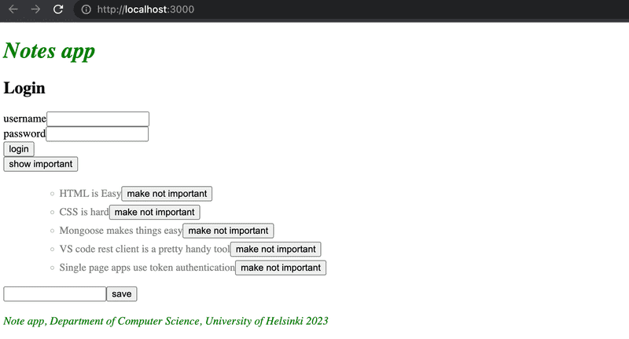

In this part we return to the frontend, first looking at different possibilities for testing the React code. We will also implement token based authentication which will enable users to log in to our application.

# Table of Contents

# Part 5

## Part 5a - Login in fronted

In the last two parts, we have mainly concentrated on the backend. The frontend that we developed in [part 2](../part2/) does not yet support the user management we implemented to the backend in part 4.

At the moment the frontend shows existing notes and lets users change the state of a note from important to not important and vice versa. New notes cannot be added anymore because of the changes made to the backend in part 4: the backend now expects that a token verifying a user's identity is sent with the new note.

We'll now implement a part of the required user management functionality in the frontend. Let's begin with the user login. Throughout this part, we will assume that new users will not be added from the frontend.

### Handling login

A login form has now been added to the top of the page:



The code of the App component now looks as follows:

```js
const App = () => {
  const [notes, setNotes] = useState([]) 
  const [newNote, setNewNote] = useState('')
  const [showAll, setShowAll] = useState(true)
  const [errorMessage, setErrorMessage] = useState(null)

  const [username, setUsername] = useState('') 
  const [password, setPassword] = useState('') 

  useEffect(() => {
    noteService
      .getAll().then(initialNotes => {
        setNotes(initialNotes)
      })
  }, [])

  // ...


  const handleLogin = (event) => {
    event.preventDefault()
    console.log('logging in with', username, password)
  }

  return (
    <div>
      <h1>Notes</h1>

      <Notification message={errorMessage} />


      <form onSubmit={handleLogin}>
        <div>
          username
            <input
            type="text"
            value={username}
            name="Username"
            onChange={({ target }) => setUsername(target.value)}
          />
        </div>
        <div>
          password
            <input
            type="password"
            value={password}
            name="Password"
            onChange={({ target }) => setPassword(target.value)}
          />
        </div>
        <button type="submit">login</button>
      </form>

      // ...
    </div>
  )
}

export default App
```

The current application code can be found on GitHub, in the branch [part5-1](https://github.com/fullstack-hy2020/part2-notes-frontend/tree/part5-1). If you clone the repo, don't forget to run `npm install` before attempting to run the frontend.

The frontend will not display any notes if it's not connected to the backend. You can start the backend with `npm run dev` in its folder from Part 4. This will run the backend on port 3001. While that is active, in a separate terminal window you can start the frontend with `npm run dev`, and now you can see the notes that are saved in your MongoDB database from Part 4.

Keep this in mind from now on.

