In this part we return to the frontend, first looking at different possibilities for testing the React code. We will also implement token based authentication which will enable users to log in to our application.

# Table of Contents
- [Part 5](#part-5)
  - [Part 5a - Login in fronted](#part-5a---login-in-fronted)
    - [Handling login](#handling-login)
    - [Creating new notes](#creating-new-notes)
    - [Saving the token to the browser's local storage](#saving-the-token-to-the-browsers-local-storage)
    - [Exercise 5.1-5.4](#exercise-51-54)
      - [5.1: Blog List Frontend, step 1](#51-blog-list-frontend-step-1)
      - [5.2: Blog List Frontend, step 2](#52-blog-list-frontend-step-2)
      - [5.3: Blog List Frontend, step 3](#53-blog-list-frontend-step-3)
      - [5.4: Blog List Frontend, step 4](#54-blog-list-frontend-step-4)
    - [A note on using local storage](#a-note-on-using-local-storage)
  - [Part 5b - props.children and proptypes](#part-5b---propschildren-and-proptypes)
    - [Displaying the login form only when appropriate](#displaying-the-login-form-only-when-appropriate)
    - [The component children, aka. props.children](#the-component-children-aka-propschildren)
    - [State of the forms](#state-of-the-forms)
    - [References to components with ref](#references-to-components-with-ref)
    - [One point about components](#one-point-about-components)
    - [The updated full stack developer's oath](#the-updated-full-stack-developers-oath)
    - [Exercises 5.5 - 5.11](#exercises-55---511)
      - [5.5: Blog List Frontend, step 5](#55-blog-list-frontend-step-5)
      - [5.6: Blog List Frontend, step 6](#56-blog-list-frontend-step-6)
      - [5.7: Blog List Frontend, step 7](#57-blog-list-frontend-step-7)
      - [5.8: Blog List Frontend, step 8](#58-blog-list-frontend-step-8)
      - [5.9: Blog List Frontend, step 9](#59-blog-list-frontend-step-9)
      - [5.10: Blog List Frontend, step 10](#510-blog-list-frontend-step-10)
      - [5.11: Blog List Frontend, step 11](#511-blog-list-frontend-step-11)
    - [PropTypes](#proptypes)
    - [ESlint](#eslint)
    - [Exercise 5.12](#exercise-512)
      - [5.12: Blog List Frontend, step 12](#512-blog-list-frontend-step-12)
  - [Part 5c - Testing React apps](#part-5c---testing-react-apps)
  - [Rendering the component for tests](#rendering-the-component-for-tests)
  - [Test file location](#test-file-location)
  - [Searching for a content in a component](#searching-for-a-content-in-a-component)
  - [Debugging tests](#debugging-tests)
  - [Clicking buttons in tests](#clicking-buttons-in-tests)
  - [Tests for the _Toggable_ component](#tests-for-the-togglable-component)
  - [Testing the forms](#testing-the-forms)
  - [About finding the elements](#about-finding-the-elements)
  - [Test coverage](#test-coverage)
  - [Exercise 5.13 - 5.16](#exercise-513---516)
    - [5.13: Blog List Tests, step 1](#513-blog-list-tests-step-1)
    - [5.14: Blog List Tests, step 2](#514-blog-list-tests-step-2)
    - [5.15: Blog List Tests, step 3](#515-blog-list-tests-step-3)
    - [5.16: Blog List Tests, step 4](#516-blog-list-tests-step-4)
  - [Frontend integration tests](#frontend-integration-tests)
  - [Snapshot testing](#snapshot-testing)

# Part 5

## Part 5a - Login in fronted

In the last two parts, we have mainly concentrated on the backend. The frontend that we developed in [part 2](../part2/) does not yet support the user management we implemented to the backend in part 4.

At the moment the frontend shows existing notes and lets users change the state of a note from important to not important and vice versa. New notes cannot be added anymore because of the changes made to the backend in part 4: the backend now expects that a token verifying a user's identity is sent with the new note.

We'll now implement a part of the required user management functionality in the frontend. Let's begin with the user login. Throughout this part, we will assume that new users will not be added from the frontend.

### Handling login

A login form has now been added to the top of the page:


The code of the App component now looks as follows:

```js
const App = () => {
  const [notes, setNotes] = useState([]) 
  const [newNote, setNewNote] = useState('')
  const [showAll, setShowAll] = useState(true)
  const [errorMessage, setErrorMessage] = useState(null)

  const [username, setUsername] = useState('') 
  const [password, setPassword] = useState('') 

  useEffect(() => {
    noteService
      .getAll().then(initialNotes => {
        setNotes(initialNotes)
      })
  }, [])

  // ...


  const handleLogin = (event) => {
    event.preventDefault()
    console.log('logging in with', username, password)
  }

  return (
    <div>
      <h1>Notes</h1>

      <Notification message={errorMessage} />


      <form onSubmit={handleLogin}>
        <div>
          username
            <input
            type="text"
            value={username}
            name="Username"
            onChange={({ target }) => setUsername(target.value)}
          />
        </div>
        <div>
          password
            <input
            type="password"
            value={password}
            name="Password"
            onChange={({ target }) => setPassword(target.value)}
          />
        </div>
        <button type="submit">login</button>
      </form>

      // ...
    </div>
  )
}

export default App
```

The current application code can be found on GitHub, in the branch [part5-1](https://github.com/fullstack-hy2020/part2-notes-frontend/tree/part5-1). If you clone the repo, don't forget to run `npm install` before attempting to run the frontend.

The frontend will not display any notes if it's not connected to the backend. You can start the backend with `npm run dev` in its folder from Part 4. This will run the backend on port 3001. While that is active, in a separate terminal window you can start the frontend with `npm run dev`, and now you can see the notes that are saved in your MongoDB database from Part 4.

Keep this in mind from now on.

The login form is handled the same way we handled forms in [part 2](../part2/README.md). The app state has fields for _username_ and _password_ to store the data from the form. The form fields have event handlers, which synchronize changes in the field to the state of the _App_ component. The event handlers are simple: An object is given to them as a parameter, and they destructure the field _target_ from the object and save its value to the state.

```js
({ target }) => setUsername(target.value)
```

The method `handleLogin`, which is responsible for handling the data in the form, is yet to be implemented.

Logging in is done by sending an HTTP POST request to the server address _api/login_. Let's separate the code responsible for this request into its own module, to file _services/login.js._

We'll use _async/await_ syntax instead of promises for the HTTP request:

```js
import axios from 'axios'
const baseUrl = '/api/login'

const login = async credentials => {
  const response = await axios.post(baseUrl, credentials)
  return response.data
}

export default { login }
```

The method for handling the login can be implemented as follows:

```js
import loginService from './services/login'

const App = () => {
  // ...
  const [username, setUsername] = useState('') 
  const [password, setPassword] = useState('') 
  const [user, setUser] = useState(null)

  const handleLogin = async (event) => {
    event.preventDefault()
    
    try {
      const user = await loginService.login({
        username, password,
      })
      setUser(user)
      setUsername('')
      setPassword('')
    } catch (exception) {
      setErrorMessage('Wrong credentials')
      setTimeout(() => {
        setErrorMessage(null)
      }, 5000)
    }
    
  // ...
}
```

If the login is successful, the form fields are emptied and the server response (including a _token_ and the user details) is saved to the _user_ field of the application's state.

If the login fails or running the function `loginService.login` results in an error, the user is notified.

The user is not notified about a successful login in any way. Let's modify the application to show the login form only _if the user is not logged-in_, so when `user === null`. The form for adding new notes is shown only _if the user is logged-in_, so when user contains the user's details.

Let's add two helper functions to the _App_ component for generating the forms:

```js
const App = () => {
  // ...

  const loginForm = () => (
    <form onSubmit={handleLogin}>
      <div>
        username
          <input
          type="text"
          value={username}
          name="Username"
          onChange={({ target }) => setUsername(target.value)}
        />
      </div>
      <div>
        password
          <input
          type="password"
          value={password}
          name="Password"
          onChange={({ target }) => setPassword(target.value)}
        />
      </div>
      <button type="submit">login</button>
    </form>      
  )

  const noteForm = () => (
    <form onSubmit={addNote}>
      <input
        value={newNote}
        onChange={handleNoteChange}
      />
      <button type="submit">save</button>
    </form>  
  )

  return (
    // ...
  )
}
```

and conditionally render them:

```js
const App = () => {
  // ...

  const loginForm = () => (
    // ...
  )

  const noteForm = () => (
    // ...
  )

  return (
    <div>
      <h1>Notes</h1>

      <Notification message={errorMessage} />

      {user === null && loginForm()}
      {user !== null && noteForm()}

      <div>
        <button onClick={() => setShowAll(!showAll)}>
          show {showAll ? 'important' : 'all'}
        </button>
      </div>
      <ul>
        {notesToShow.map((note, i) => 
          <Note
            key={i}
            note={note} 
            toggleImportance={() => toggleImportanceOf(note.id)}
          />
        )}
      </ul>

      <Footer />
    </div>
  )
}
```

A slightly odd looking, but commonly used [React trick](https://react.dev/learn/conditional-rendering#logical-and-operator-) is used to render the forms conditionally:

```js
{
  user === null && loginForm()
}
```

If the first statement evaluates to false or is [falsy](https://developer.mozilla.org/en-US/docs/Glossary/Falsy), the second statement (generating the form) is not executed at all.

We can make this even more straightforward by using the [conditional operator](https://developer.mozilla.org/en-US/docs/Web/JavaScript/Reference/Operators/Conditional_operator):

```js
return (
  <div>
    <h1>Notes</h1>

    <Notification message={errorMessage}/>

    {user === null ?
      loginForm() :
      noteForm()
    }

    <h2>Notes</h2>

    // ...

  </div>
)
```

If `user === null` is [truthy](https://developer.mozilla.org/en-US/docs/Glossary/Truthy), `loginForm()` is executed. If not, `noteForm()` is.

Let's do one more modification. If the user is logged in, their name is shown on the screen:

```js
return (
  <div>
    <h1>Notes</h1>

    <Notification message={errorMessage} />

    {user === null ?
      loginForm() :
      <div>
        <p>{user.name} logged-in</p>
        {noteForm()}
      </div>
    }

    <h2>Notes</h2>

    // ...

  </div>
)
```

The solution isn't perfect, but we'll leave it like this for now.

Our main component _App_ is at the moment way too large. The changes we did now are a clear sign that the forms should be refactored into their own components. However, we will leave that for an optional exercise.

The current application code can be found on [GitHub](https://github.com/fullstack-hy2020/part2-notes-frontend/tree/part5-2), in the branch _part5-2_.

### Creating new notes

The token returned with a successful login is saved to the application's state - the _user_'s field _token_:

```js
const handleLogin = async (event) => {
  event.preventDefault()
  try {
    const user = await loginService.login({
      username, password,
    })

    setUser(user)
    setUsername('')
    setPassword('')
  } catch (exception) {
    // ...
  }
}
```

Let's fix creating new notes so it works with the backend. This means adding the token of the logged-in user to the Authorization header of the HTTP request.

The _noteService_ module changes like so:

```js
import axios from 'axios'
const baseUrl = '/api/notes'

let token = null

const setToken = newToken => {
  token = `Bearer ${newToken}`
}

const getAll = () => {
  const request = axios.get(baseUrl)
  return request.then(response => response.data)
}

const create = async newObject => {
  const config = {
    headers: { Authorization: token },
  }

  const response = await axios.post(baseUrl, newObject, config)
  return response.data
}

const update = (id, newObject) => {
  const request = axios.put(`${ baseUrl }/${id}`, newObject)
  return request.then(response => response.data)
}

export default { getAll, create, update, setToken }
```

The noteService module contains a private variable called `token`. Its value can be changed with the `setToken` function, which is exported by the module. `create`, now with async/await syntax, sets the token to the _Authorization_ header. The header is given to axios as the third parameter of the _post_ method.

The event handler responsible for login must be changed to call the method `noteService.setToken(user.token)` with a successful login:

```js
const handleLogin = async (event) => {
  event.preventDefault()
  try {
    const user = await loginService.login({
      username, password,
    })

    noteService.setToken(user.token)
    setUser(user)
    setUsername('')
    setPassword('')
  } catch (exception) {
    // ...
  }
}
```

And now adding new notes works again!

### Saving the token to the browser's local storage

Our application has a small flaw: if the browser is refreshed (eg. pressing F5), the user's login information disappears.

This problem is easily solved by saving the login details to [local storage](https://developer.mozilla.org/en-US/docs/Web/API/Storage). Local Storage is a [key-value database](https://en.wikipedia.org/wiki/Key%E2%80%93value_database) in the browser.

It is very easy to use. A _value_ corresponding to a certain _key_ is saved to the database with the method [setItem](https://developer.mozilla.org/en-US/docs/Web/API/Storage/setItem). For example:

```js
window.localStorage.setItem('name', 'juha tauriainen')
```

saves the string given as the second parameter as the value of the key _name_.

The value of a key can be found with the method [getItem](https://developer.mozilla.org/en-US/docs/Web/API/Storage/getItem):

```js
window.localStorage.getItem('name')
```

while [removeItem](https://developer.mozilla.org/en-US/docs/Web/API/Storage/removeItem) removes a key.

Values in the local storage are persisted even when the page is _re-rendered_. The storage is [origin](https://developer.mozilla.org/en-US/docs/Glossary/Origin)-specific so each web application has its own storage.

Let's extend our application so that it saves the details of a logged-in user to the local storage.

Values saved to the storage are [DOMstrings](https://docs.w3cub.com/dom/domstring), so we cannot save a JavaScript object as it is. The object has to be parsed to JSON first, with the method `JSON.stringify`. Correspondingly, when a JSON object is read from the local storage, it has to be parsed back to JavaScript with `JSON.parse`.

Changes to the login method are as follows:

```js
  const handleLogin = async (event) => {
    event.preventDefault()
    try {
      const user = await loginService.login({
        username, password,
      })

      window.localStorage.setItem(
        'loggedNoteappUser', JSON.stringify(user)
      ) 
      noteService.setToken(user.token)
      setUser(user)
      setUsername('')
      setPassword('')
    } catch (exception) {
      // ...
    }
  }
```

The details of a logged-in user are now saved to the local storage, and they can be viewed on the console (by typing `window.localStorage` in it):

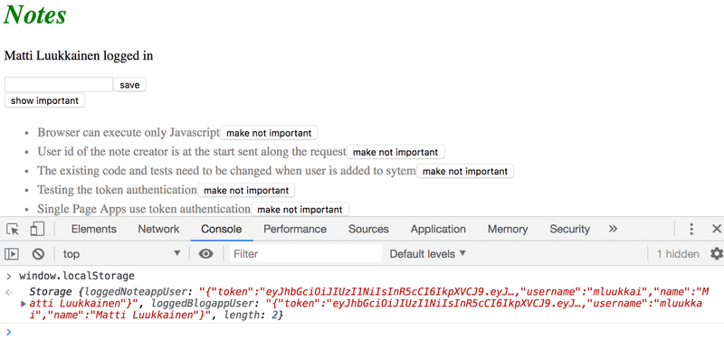

You can also inspect the local storage using the developer tools. On Chrome, go to the _Application_ tab and select _Local Storage_ (more details [here](https://developer.chrome.com/docs/devtools/storage/localstorage)). On Firefox go to the _Storage_ tab and select _Local Storage_ (details [here](https://firefox-source-docs.mozilla.org/devtools-user/storage_inspector/index.html)).

We still have to modify our application so that when we enter the page, the application checks if user details of a logged-in user can already be found on the local storage. If they are there, the details are saved to the state of the application and to _noteService_.

The right way to do this is with an [effect hook](https://react.dev/reference/react/useEffect): a mechanism we first encountered in part 2, and used to fetch notes from the server.

We can have multiple effect hooks, so let's create a second one to handle the first loading of the page:

```js
const App = () => {
  const [notes, setNotes] = useState([]) 
  const [newNote, setNewNote] = useState('')
  const [showAll, setShowAll] = useState(true)
  const [errorMessage, setErrorMessage] = useState(null)
  const [username, setUsername] = useState('') 
  const [password, setPassword] = useState('') 
  const [user, setUser] = useState(null) 

  useEffect(() => {
    noteService
      .getAll().then(initialNotes => {
        setNotes(initialNotes)
      })
  }, [])

  useEffect(() => {
    const loggedUserJSON = window.localStorage.getItem('loggedNoteappUser')
    if (loggedUserJSON) {
      const user = JSON.parse(loggedUserJSON)
      setUser(user)
      noteService.setToken(user.token)
    }
  }, [])

  // ...
}
```

The empty array as the parameter of the effect ensures that the effect is executed only when the component is rendered [for the first time](https://react.dev/reference/react/useEffect#parameters).

Now a user stays logged in to the application forever. We should probably add a _logout_ functionality, which removes the login details from the local storage. We will however leave it as an exercise.

It's possible to log out a user using the console, and that is enough for now. You can log out with the command:

```js
window.localStorage.removeItem('loggedNoteappUser')
```

or with the command which empties localstorage completely:

```js
window.localStorage.clear()
```

The current application code can be found on [GitHub](https://github.com/fullstack-hy2020/part2-notes-frontend/tree/part5-3), in the branch _part5-3_.

<hr style="border: 2px solid rgba(171, 40, 236, 0.81);">

### Exercise 5.1-5.4

We will now create a frontend for the blog list backend we created in the last part. You can use [this application](https://github.com/fullstack-hy2020/bloglist-frontend) from GitHub as the base of your solution. You need to connect your backend with a proxy as shown in [part 3](/part3/README.md#proxy).

It is enough to submit your finished solution. You can commit after each exercise, but that is not necessary.

The first few exercises revise everything we have learned about React so far. They can be challenging, especially if your backend is incomplete. It might be best to use the backend that we marked as the answer for part 4.

While doing the exercises, remember all of the debugging methods we have talked about, especially keeping an eye on the console.

__Warning__: If you notice you are mixing in the `async/await` and then commands, it's 99.9% certain you are doing something wrong. Use either or, never both.

#### 5.1: Blog List Frontend, step 1

Clone the application from [GitHub](https://github.com/fullstack-hy2020/bloglist-frontend) with the command:

```
git clone https://github.com/fullstack-hy2020/bloglist-frontend
```

_Remove the git configuration of the cloned application_

```
cd bloglist-frontend   // go to cloned repository
rm -rf .git
```

The application is started the usual way, but you have to install its dependencies first:

```
npm install
npm run dev
```

Implement login functionality to the frontend. The token returned with a successful login is saved to the application's state _user_.

If a user is not logged in, _only_ the login form is visible.

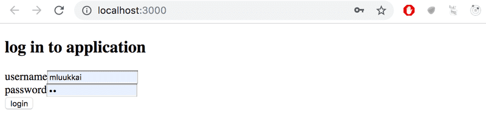

If the user is logged-in, the name of the user and a list of blogs is shown.

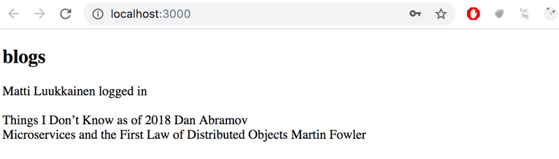

User details of the logged-in user do not have to be saved to the local storage yet.

__NB__ You can implement the conditional rendering of the login form like this for example:

```js
  if (user === null) {
    return (
      <div>
        <h2>Log in to application</h2>
        <form>
          //...
        </form>
      </div>
    )
  }

  return (
    <div>
      <h2>blogs</h2>
      {blogs.map(blog =>
        <Blog key={blog.id} blog={blog} />
      )}
    </div>
  )
}
```

#### Exercise 5.2: Blog List Frontend, step 2

Make the login 'permanent' by using the local storage. Also, implement a way to log out.

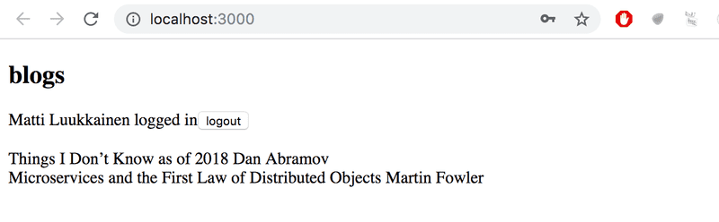

Ensure the browser does not remember the details of the user after logging out.

#### Exercise 5.3: Blog List Frontend, step 3

Expand your application to allow a logged-in user to add new blogs:

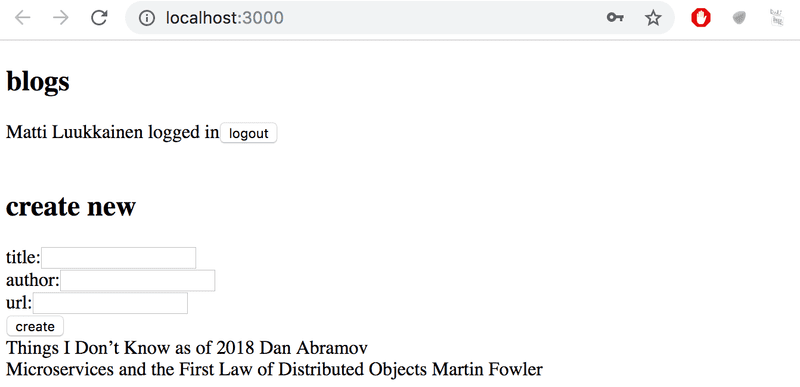

#### Exercise 5.4: Blog List Frontend, step 4

Implement notifications that inform the user about successful operations at the top of the page. For example, when a new blog is added, the following notification can be shown:

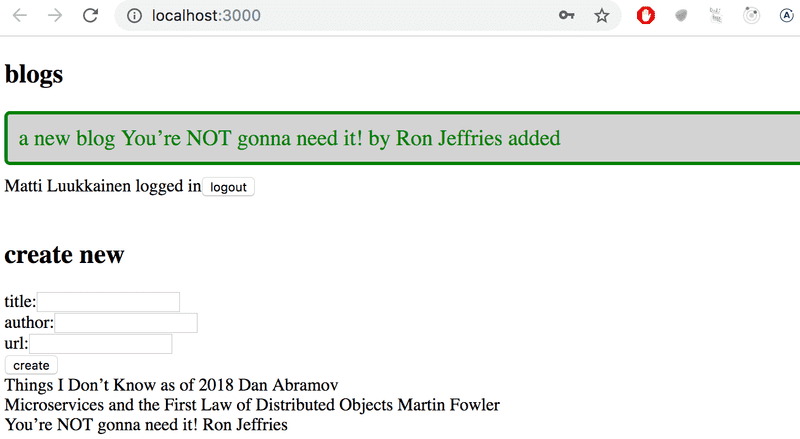

Failed login can shown the following notification:

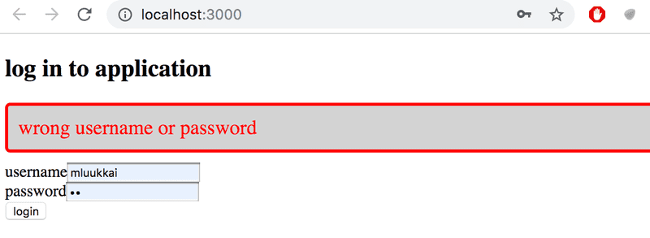

The notification must be visible for a few seconds. It is not compulsory to add colors. 

<hr style="border: 2px solid rgba(171, 40, 236, 0.81);">

### A note on using local storage 

At the [end](../part4/README.md#problems-of-token-based-authentication) of the last part, we mentioned that the challenge of token-based authentication is how to cope with the situation when the API access of the token holder to the API needs to be revoked.

There are two solutions to the problem. The first one is to limit the validity period of a token. This forces the user to re-login to the app once the token has expired. The other approach is to save the validity information of each token to the backend database. This solution is often called a _server-side_ session.

No matter how the validity of tokens is checked and ensured, saving a token in the local storage might contain a security risk if the application has a security vulnerability that allows [Cross Site Scripting (XSS)](https://owasp.org/www-community/attacks/xss/) attacks. An XSS attack is possible if the application would allow a user to inject arbitrary JavaScript code (e.g. using a form) that the app would then execute. When using React sensibly it should not be possible since [React sanitizes](https://legacy.reactjs.org/docs/introducing-jsx.html#jsx-prevents-injection-attacks) all text that it renders, meaning that it is not executing the rendered content as JavaScript.

If one wants to play safe, the best option is to not store a token in local storage. This might be an option in situations where leaking a token might have tragic consequences.

It has been suggested that the identity of a signed-in user should be saved as [httpOnly cookies](https://developer.mozilla.org/en-US/docs/Web/HTTP/Cookies#restrict_access_to_cookies), so that JavaScript code could not have any access to the token. The drawback of this solution is that it would make implementing SPA applications a bit more complex. One would need at least to implement a separate page for logging in.

However, it is good to notice that even the use of httpOnly cookies does not guarantee anything. It has even been suggested that httpOnly cookies are [not any safer than](https://academind.com/tutorials/localstorage-vs-cookies-xss/) the use of local storage.

So no matter the used solution the most important thing is to [minimize the risk](https://cheatsheetseries.owasp.org/cheatsheets/DOM_based_XSS_Prevention_Cheat_Sheet.html) of XSS attacks altogether.

## Part 5b - props.children and proptypes

### Displaying the login form only when appropriate

Let's modify the application so that the login form is not displayed by default:

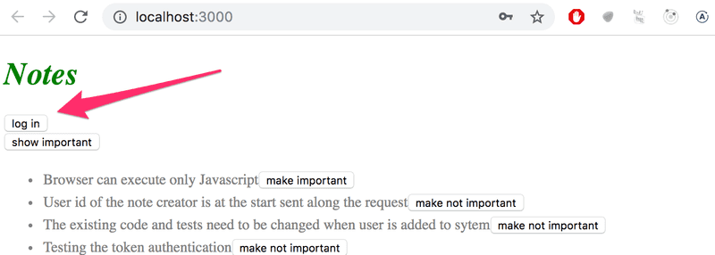

The login form appears when the user presses the _login_ button:

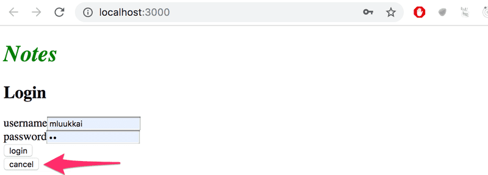

The user can close the login form by clicking the _cancel_ button.

Let's start by extracting the login form into its own component:

```js
const LoginForm = ({
   handleSubmit,
   handleUsernameChange,
   handlePasswordChange,
   username,
   password
  }) => {
  return (
    <div>
      <h2>Login</h2>

      <form onSubmit={handleSubmit}>
        <div>
          username
          <input
            value={username}
            onChange={handleUsernameChange}
          />
        </div>
        <div>
          password
          <input
            type="password"
            value={password}
            onChange={handlePasswordChange}
          />
        </div>
        <button type="submit">login</button>
      </form>
    </div>
  )
}

export default LoginForm
```

The state and all the functions related to it are defined outside of the component and are passed to the component as props.

Notice that the props are assigned to variables through _destructuring_, which means that instead of writing:

```js
const LoginForm = (props) => {
  return (
    <div>
      <h2>Login</h2>
      <form onSubmit={props.handleSubmit}>
        <div>
          username
          <input
            value={props.username}
            onChange={props.handleChange}
            name="username"
          />
        </div>
        // ...
        <button type="submit">login</button>
      </form>
    </div>
  )
}
```

where the properties of the `props` object are accessed through e.g. `props.handleSubmit`, the properties are assigned directly to their own variables.

One fast way of implementing the functionality is to change the `loginForm` function of the _App_ component like so:

```js
const App = () => {
  const [loginVisible, setLoginVisible] = useState(false)

  // ...

  const loginForm = () => {
    const hideWhenVisible = { display: loginVisible ? 'none' : '' }
    const showWhenVisible = { display: loginVisible ? '' : 'none' }

    return (
      <div>
        <div style={hideWhenVisible}>
          <button onClick={() => setLoginVisible(true)}>log in</button>
        </div>
        <div style={showWhenVisible}>
          <LoginForm
            username={username}
            password={password}
            handleUsernameChange={({ target }) => setUsername(target.value)}
            handlePasswordChange={({ target }) => setPassword(target.value)}
            handleSubmit={handleLogin}
          />
          <button onClick={() => setLoginVisible(false)}>cancel</button>
        </div>
      </div>
    )
  }

  // ...
}
```

The _App_ component state now contains the boolean _loginVisible_, which defines if the login form should be shown to the user or not.

The value of `loginVisible` is toggled with two buttons. Both buttons have their event handlers defined directly in the component:

```js
<button onClick={() => setLoginVisible(true)}>log in</button>

<button onClick={() => setLoginVisible(false)}>cancel</button>
```

The visibility of the component is defined by giving the component an [inline](../part2/README.md#inline-styles) style rule, where the value of the [display](https://developer.mozilla.org/en-US/docs/Web/CSS/display) property is _none_ if we do not want the component to be displayed:

```js
const hideWhenVisible = { display: loginVisible ? 'none' : '' }
const showWhenVisible = { display: loginVisible ? '' : 'none' }

<div style={hideWhenVisible}>
  // button
</div>

<div style={showWhenVisible}>
  // button
</div>
```

We are once again using the "question mark" ternary operator. If `loginVisible` is _true_, then the CSS rule of the component will be:

```js
display: 'none';
```

If `loginVisible` is _false_, then _display_ will not receive any value related to the visibility of the component.

### The component children, aka. props.children 

The code related to managing the visibility of the login form could be considered to be its own logical entity, and for this reason, it would be good to extract it from the _App_ component into a separate component.

Our goal is to implement a new _Togglable_ component that can be used in the following way:

```js
<Togglable buttonLabel='login'>
  <LoginForm
    username={username}
    password={password}
    handleUsernameChange={({ target }) => setUsername(target.value)}
    handlePasswordChange={({ target }) => setPassword(target.value)}
    handleSubmit={handleLogin}
  />
</Togglable>
```

The way that the component is used is slightly different from our previous components. The component has both opening and closing tags that surround a _LoginForm_ component. In React terminology _LoginForm_ is a child component of _Togglable_.

We can add any React elements we want between the opening and closing tags of _Togglable_, like this for example:

```js
<Togglable buttonLabel="reveal">
  <p>this line is at start hidden</p>
  <p>also this is hidden</p>
</Togglable>
```

The code for the _Togglable_ component is shown below:

```js
import { useState } from 'react'

const Togglable = (props) => {
  const [visible, setVisible] = useState(false)

  const hideWhenVisible = { display: visible ? 'none' : '' }
  const showWhenVisible = { display: visible ? '' : 'none' }

  const toggleVisibility = () => {
    setVisible(!visible)
  }

  return (
    <div>
      <div style={hideWhenVisible}>
        <button onClick={toggleVisibility}>{props.buttonLabel}</button>
      </div>
      <div style={showWhenVisible}>
        {props.children}
        <button onClick={toggleVisibility}>cancel</button>
      </div>
    </div>
  )
}

export default Togglable
```

The new and interesting part of the code is [props.children](https://react.dev/learn/passing-props-to-a-component#passing-jsx-as-children), which is used for referencing the child components of the component. The child components are the React elements that we define between the opening and closing tags of a component.

This time the children are rendered in the code that is used for rendering the component itself:

```js
<div style={showWhenVisible}>
  {props.children}
  <button onClick={toggleVisibility}>cancel</button>
</div>
```

Unlike the "normal" props we've seen before, _children_ is automatically added by React and always exists. If a component is defined with an automatically closing `/>` tag, like this:

```js
<Note
  key={note.id}
  note={note}
  toggleImportance={() => toggleImportanceOf(note.id)}
/>
```

Then _props.children_ is an empty array.

The _Togglable_ component is reusable and we can use it to add similar visibility toggling functionality to the form that is used for creating new notes.

Before we do that, let's extract the form for creating notes into a component:

```js
const NoteForm = ({ onSubmit, handleChange, value}) => {
  return (
    <div>
      <h2>Create a new note</h2>

      <form onSubmit={onSubmit}>
        <input
          value={value}
          onChange={handleChange}
        />
        <button type="submit">save</button>
      </form>
    </div>
  )
}
```

Next let's define the form component inside of a Togglable component:

```js
<Togglable buttonLabel="new note">
  <NoteForm
    onSubmit={addNote}
    value={newNote}
    handleChange={handleNoteChange}
  />
</Togglable>
```

You can find the code for our current application in its entirety in the _part5-4_ branch of [this GitHub repository](https://github.com/fullstack-hy2020/part2-notes-frontend/tree/part5-4).

### State of the forms

The state of the application currently is in the `App` component.

React documentation says the [following](https://react.dev/learn/sharing-state-between-components) about where to place the state:

_Sometimes, you want the state of two components to always change together. To do it, remove state from both of them, move it to their closest common parent, and then pass it down to them via props. This is known as lifting state up, and it’s one of the most common things you will do writing React code._

If we think about the state of the forms, so for example the contents of a new note before it has been created, the `App` component does not need it for anything. We could just as well move the state of the forms to the corresponding components.

The component for creating a new note changes like so:

```js
import { useState } from 'react'

const NoteForm = ({ createNote }) => {
  const [newNote, setNewNote] = useState('')

  const addNote = (event) => {
    event.preventDefault()
    createNote({
      content: newNote,
      important: true
    })

    setNewNote('')
  }

  return (
    <div>
      <h2>Create a new note</h2>

      <form onSubmit={addNote}>
        <input
          value={newNote}
          onChange={event => setNewNote(event.target.value)}
        />
        <button type="submit">save</button>
      </form>
    </div>
  )
}

export default NoteForm
```

__NOTE__ At the same time, we changed the behavior of the application so that new notes are important by default, i.e. the field _important_ gets the value _true_.

The _newNote_ state variable and the event handler responsible for changing it have been moved from the `App` component to the component responsible for the note form.

There is only one prop left, the `createNote` function, which the form calls when a new note is created.

The `App` component becomes simpler now that we have got rid of the _newNote_ state and its event handler. The `addNote` function for creating new notes receives a new note as a parameter, and the function is the only prop we send to the form:

```js
const App = () => {
  // ...

  const addNote = (noteObject) => {
    noteService
      .create(noteObject)
      .then(returnedNote => {
        setNotes(notes.concat(returnedNote))
      })
  }
  // ...
  const noteForm = () => (
    <Togglable buttonLabel='new note'>
      <NoteForm createNote={addNote} />
    </Togglable>
  )

  // ...
}
```

We could do the same for the log in form, but we'll leave that for an optional exercise.

The application code can be found on [GitHub](https://github.com/fullstack-hy2020/part2-notes-frontend/tree/part5-5), branch _part5-5_.

### References to components with ref

Our current implementation is quite good; it has one aspect that could be improved.

After a new note is created, it would make sense to hide the new note form. Currently, the form stays visible. There is a slight problem with hiding it, the visibility is controlled with the _visible_ state variable inside of the _Togglable_ component.

One solution to this would be to move control of the Togglable component's state outside the component. However, we won't do that now, because we want the component to be responsible for its own state. So we have to find another solution, and find a mechanism to change the state of the component externally.

There are several different ways to implement access to a component's functions from outside the component, but let's use the [ref](https://react.dev/learn/referencing-values-with-refs) mechanism of React, which offers a reference to the component.

Let's make the following changes to the _App_ component:

```js
import { useState, useEffect, useRef } from 'react'

const App = () => {
  // ...

  const noteFormRef = useRef()

  const noteForm = () => (

    <Togglable buttonLabel='new note' ref={noteFormRef}>
      <NoteForm createNote={addNote} />
    </Togglable>
  )

  // ...
}
```

The [useRef](https://react.dev/reference/react/useRef) hook is used to create a _noteFormRef_ reference, that is assigned to the _Togglable_ component containing the creation note form. The _noteFormRef_ variable acts as a reference to the component. This hook ensures the same reference (ref) that is kept throughout re-renders of the component.

We also make the following changes to the _Togglable_ component:

```js
import { useState, forwardRef, useImperativeHandle } from 'react'

const Togglable = forwardRef((props, refs) => {
  const [visible, setVisible] = useState(false)

  const hideWhenVisible = { display: visible ? 'none' : '' }
  const showWhenVisible = { display: visible ? '' : 'none' }

  const toggleVisibility = () => {
    setVisible(!visible)
  }

  useImperativeHandle(refs, () => {
    return {
      toggleVisibility
    }
  })

  return (
    <div>
      <div style={hideWhenVisible}>
        <button onClick={toggleVisibility}>{props.buttonLabel}</button>
      </div>
      <div style={showWhenVisible}>
        {props.children}
        <button onClick={toggleVisibility}>cancel</button>
      </div>
    </div>
  )
})

export default Togglable
```

The function that creates the component is wrapped inside of a [forwardRef](https://react.dev/reference/react/forwardRef) function call. This way the component can access the ref that is assigned to it.

The component uses the [useImperativeHandle](https://react.dev/reference/react/useImperativeHandle) hook to make its _toggleVisibility_ function available outside of the component.

We can now hide the form by calling _noteFormRef.current.toggleVisibility()_ after a new note has been created:

```js
const App = () => {
  // ...
  const addNote = (noteObject) => {
    noteFormRef.current.toggleVisibility()
    noteService
      .create(noteObject)
      .then(returnedNote => {     
        setNotes(notes.concat(returnedNote))
      })
  }
  // ...
}
```

To recap, the [useImperativeHandle](https://react.dev/reference/react/useImperativeHandle) function is a React hook, that is used for defining functions in a component, which can be invoked from outside of the component.

This trick works for changing the state of a component, but it looks a bit unpleasant. We could have accomplished the same functionality with slightly cleaner code using "old React" class-based components. We will take a look at these class components during part 7 of the course material. So far this is the only situation where using React hooks leads to code that is not cleaner than with class components.

There are also [other use cases](https://react.dev/learn/manipulating-the-dom-with-refs) for refs than accessing React components.

You can find the code for our current application in its entirety in the _part5-6_ branch of [this GitHub repository](https://github.com/fullstack-hy2020/part2-notes-frontend/tree/part5-6).

### One point about components

When we define a component in React:

```js
const Togglable = () => ...
  // ...
}
```

And use it like this:

```js
<div>
  <Togglable buttonLabel="1" ref={togglable1}>
    first
  </Togglable>

  <Togglable buttonLabel="2" ref={togglable2}>
    second
  </Togglable>

  <Togglable buttonLabel="3" ref={togglable3}>
    third
  </Togglable>
</div>
```

We create _three separate instances of the component_ that all have their separate state:

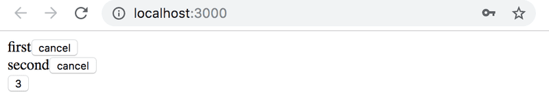

The _ref_ attribute is used for assigning a reference to each of the components in the variables _togglable1_, _togglable2_ and _togglable3_.

### The updated full stack developer's oath

The number of moving parts increases. At the same time, the likelihood of ending up in a situation where we are looking for a bug in the wrong place increases. So we need to be even more systematic.

So we should once more extend our oath:

Full stack development is _extremely hard_, that is why I will use all the possible means to make it easier

- I will have my browser developer console open all the time
- I will use the network tab of the browser dev tools to ensure that frontend and backend are communicating as I expect
- I will constantly keep an eye on the state of the server to make sure that the data sent there by the frontend is saved there as I expect
- I will keep an eye on the database: does the backend save data there in the right format
- I progress with small steps
- _when I suspect that there is a bug in the frontend, I'll make sure that the backend works as expected_
- _when I suspect that there is a bug in the backend, I'll make sure that the frontend works as expected_
- I will write lots of `console.log` statements to make sure I understand how the code and the tests behave and to help pinpoint problems
- If my code does not work, I will not write more code. Instead, I'll start deleting it until it works or will just return to a state where everything was still working
- If a test does not pass, I'll make sure that the tested functionality works properly in the application

<hr style="border: 2px solid rgba(171, 40, 236, 0.81);">

### Exercises 5.5 - 5.11

#### 5.5: Blog List Frontend, step 5

Change the form for creating blog posts so that it is only displayed when appropriate. Use functionality similar to what was shown [earlier in this part of the course material](#part-5b---propschildren-and-proptypes). If you wish to do so, you can use the _Toggable_ component defined in part 5.

By default the form is not visible

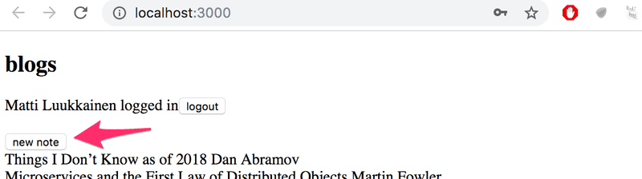

It expands when button create _new blog_ is clicked

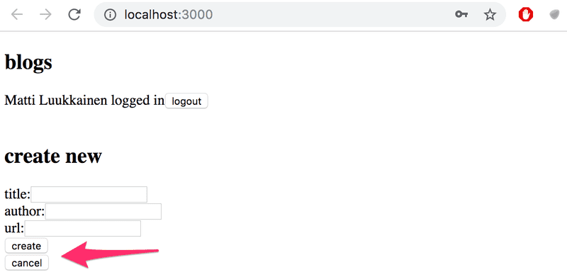

The form hides again after a new blog is created.

#### 5.6: Blog List Frontend, step 6

Separate the form for creating a new blog into its own component (if you have not already done so), and move all the states required for creating a new blog to this component. 

The component must work like the _NoteForm_ component from the [material](#state-of-the-forms) of this part.

#### 5.7: Blog List Frontend, step 7

Let's add a button to each blog, which controls whether all of the details about the blog are shown or not.

Full details of the blog open when the button is clicked.

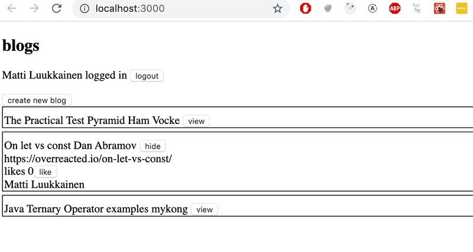

And the details are hidden when the button is clicked again.

At this point, the _like_ button does not need to do anything.

The application shown in the picture has a bit of additional CSS to improve its appearance.

It is easy to add styles to the application as shown in part 2 using [inline](../part2/README.md#inline-styles) styles:

```js
const Blog = ({ blog }) => {
  const blogStyle = {
    paddingTop: 10,
    paddingLeft: 2,
    border: 'solid',
    borderWidth: 1,
    marginBottom: 5
  }

  return (
    <div style={blogStyle}>
      <div>
        {blog.title} {blog.author}
      </div>
      // ...
  </div>
)}
```

__NB__: Even though the functionality implemented in this part is almost identical to the functionality provided by the _Togglable_ component, it can't be used directly to achieve the desired behavior. The easiest solution would be to add a state to the blog component that controls if the details are being displayed or not.

#### 5.8: Blog List Frontend, step 8

Implement the functionality for the like button. Likes are increased by making an HTTP `PUT` request to the unique address of the blog post in the backend.

Since the backend operation replaces the entire blog post, you will have to send all of its fields in the request body. If you wanted to add a like to the following blog post:

```js
{
  _id: "5a43fde2cbd20b12a2c34e91",
  user: {
    _id: "5a43e6b6c37f3d065eaaa581",
    username: "mluukkai",
    name: "Matti Luukkainen"
  },
  likes: 0,
  author: "Joel Spolsky",
  title: "The Joel Test: 12 Steps to Better Code",
  url: "https://www.joelonsoftware.com/2000/08/09/the-joel-test-12-steps-to-better-code/"
},
```

You would have to make an HTTP PUT request to the address _/api/blogs/5a43fde2cbd20b12a2c34e91_ with the following request data:

```js
{
  user: "5a43e6b6c37f3d065eaaa581",
  likes: 1,
  author: "Joel Spolsky",
  title: "The Joel Test: 12 Steps to Better Code",
  url: "https://www.joelonsoftware.com/2000/08/09/the-joel-test-12-steps-to-better-code/"
}
```

The backend has to be updated too to handle the user reference.

#### 5.9: Blog List Frontend, step 9

We notice that something is wrong. When a blog is liked in the app, the name of the user that added the blog is not shown in its details:

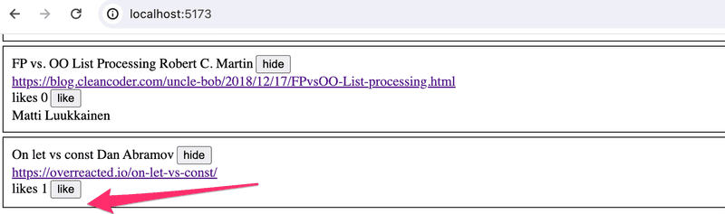

When the browser is reloaded, the information of the person is displayed. This is not acceptable, find out where the problem is and make the necessary correction.

Of course, it is possible that you have already done everything correctly and the problem does not occur in your code. In that case, you can move on.

#### 5.10: Blog List Frontend, step 10

Modify the application to sort the blog posts by the number of _likes_. The Sorting can be done with the array [sort](https://developer.mozilla.org/en-US/docs/Web/JavaScript/Reference/Global_Objects/Array/sort) method.

#### 5.11: Blog List Frontend, step 11

Add a new button for deleting blog posts. Also, implement the logic for deleting blog posts in the frontend.

Your application could look something like this:

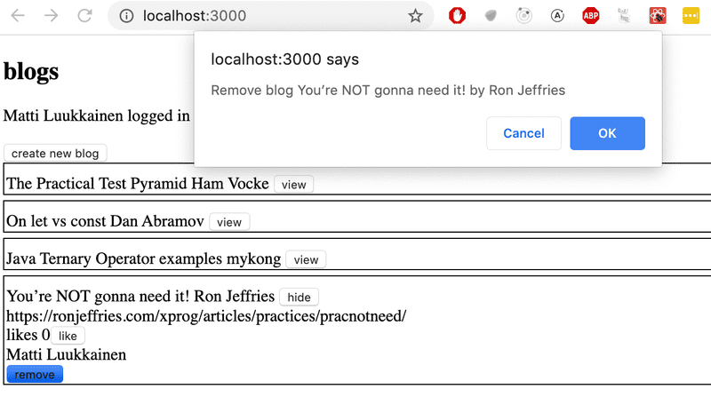

The confirmation dialog for deleting a blog post is easy to implement with the [window.confirm](https://developer.mozilla.org/en-US/docs/Web/API/Window/confirm) function.

Show the button for deleting a blog post only if the blog post was added by the user.

<hr style="border: 2px solid rgba(171, 40, 236, 0.81);">

### PropTypes

The _Togglable_ component assumes that it is given the text for the button via the _buttonLabel_ prop. If we forget to define it to the component:

```js
<Togglable> buttonLabel forgotten... </Togglable>
```

The application works, but the browser renders a button that has no label text.

We would like to enforce that when the _Togglable_ component is used, the button label text prop must be given a value.

The expected and required props of a component can be defined with the [prop-types](https://github.com/facebook/prop-types) package. Let's install the package:

```
npm install prop-types
```

We can define the _buttonLabel_ prop as a mandatory or _required_ string-type prop as shown below:

```js
import PropTypes from 'prop-types'

const Togglable = React.forwardRef((props, ref) => {
  // ..
})

Togglable.propTypes = {
  buttonLabel: PropTypes.string.isRequired
}
```

The console will display the following error message if the prop is left undefined:

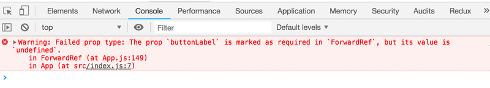

The application still works and nothing forces us to define props despite the PropTypes definitions. Mind you, it is extremely unprofessional to leave any red output in the browser console.

Let's also define PropTypes to the _LoginForm_ component:

```js
import PropTypes from 'prop-types'

const LoginForm = ({
   handleSubmit,
   handleUsernameChange,
   handlePasswordChange,
   username,
   password
  }) => {
    // ...
  }

LoginForm.propTypes = {
  handleSubmit: PropTypes.func.isRequired,
  handleUsernameChange: PropTypes.func.isRequired,
  handlePasswordChange: PropTypes.func.isRequired,
  username: PropTypes.string.isRequired,
  password: PropTypes.string.isRequired
}
```

If the type of a passed prop is wrong, e.g. if we try to define the _handleSubmit_ prop as a string, then this will result in the following warning:

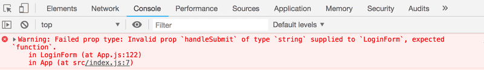

### ESlint

In part 3 we configured the [ESlint](/part3/README.md#lint) code style tool to the backend. Let's take ESlint to use in the frontend as well.

Vite has installed ESlint to the project by default, so all that's left for us to do is define our desired configuration in the _.eslintrc.cjs_ file.

Let's create a _.eslintrc.cjs_ file with the following contents:

```js
module.exports = {
  root: true,
  env: {
    browser: true,
    es2020: true,
  },
  extends: [
    'eslint:recommended',
    'plugin:react/recommended',
    'plugin:react/jsx-runtime',
    'plugin:react-hooks/recommended',
  ],
  ignorePatterns: ['dist', '.eslintrc.cjs'],
  parserOptions: { ecmaVersion: 'latest', sourceType: 'module' },
  settings: { react: { version: '18.2' } },
  plugins: ['react-refresh'],
  rules: {
    "indent": [
        "error",
        2  
    ],
    "linebreak-style": [
        "error",
        "unix"
    ],
    "quotes": [
        "error",
        "single"
    ],
    "semi": [
        "error",
        "never"
    ],
    "eqeqeq": "error",
    "no-trailing-spaces": "error",
    "object-curly-spacing": [
        "error", "always"
    ],
    "arrow-spacing": [
        "error", { "before": true, "after": true }
    ],
    "no-console": 0,
    "react/react-in-jsx-scope": "off",
    "react/prop-types": 0,
    "no-unused-vars": 0    
  },
}
```

NOTE: If you are using Visual Studio Code together with ESLint plugin, you might need to add a workspace setting for it to work. If you are seeing `Failed to load plugin react: Cannot find module 'eslint-plugin-react'` additional configuration is needed. Adding the line `"eslint.workingDirectories": [{ "mode": "auto" }]` to settings.json in the workspace seems to work. See [here](https://github.com/microsoft/vscode-eslint/issues/880#issuecomment-578052807) for more information.

Let's create [.eslintignore](https://eslint.org/docs/latest/use/configure/ignore#the-eslintignore-file) file with the following contents to the repository root

```
node_modules
dist
.eslintrc.cjs
vite.config.js
```

Now the directories `dist` and `node_modules` will be skipped when linting.

As usual, you can perform the linting either from the command line with the command

```
npm run lint
```

or using the editor's Eslint plugin.

Component `Togglable` causes a nasty-looking warning _Component definition is missing display name_:

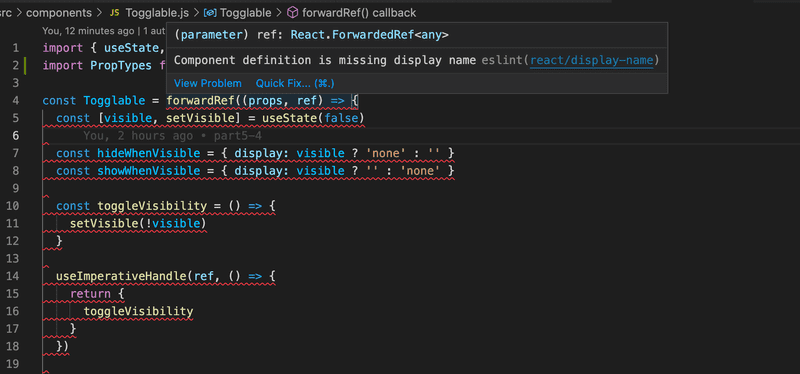

The react-devtools also reveals that the component does not have a name:

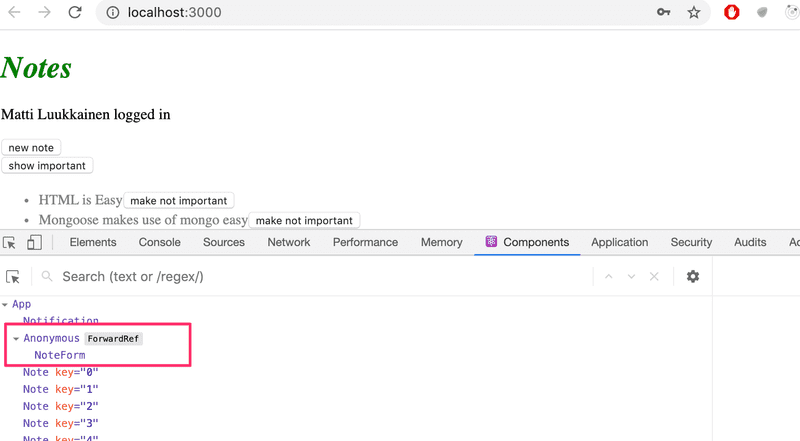

Fortunately, this is easy to fix

```js
import { useState, useImperativeHandle } from 'react'
import PropTypes from 'prop-types'

const Togglable = React.forwardRef((props, ref) => {
  // ...
})

Togglable.displayName = 'Togglable'

export default Togglable
```

You can find the code for our current application in its entirety in the _part5-7_ branch of [this GitHub repository](https://github.com/fullstack-hy2020/part2-notes-frontend/tree/part5-7).

<hr style="border: 2px solid rgba(171, 40, 236, 0.81);">

### Exercise 5.12

#### 5.12: Blog List Frontend, step 12

Define PropTypes for one of the components of your application, and add ESlint to the project. Define the configuration according to your liking. Fix all of the linter errors.

Vite has installed ESlint to the project by default, so all that's left for you to do is define your desired configuration in the _.eslintrc.cjs_ file.

<hr style="border: 2px solid rgba(171, 40, 236, 0.81);">

## Part 5c - Testing React apps

There are many different ways of testing React applications. Let's take a look at them next.

The course previously used the [Jest](http://jestjs.io/) library developed by Facebook to test React components. We are now using the new generation of testing tools from Vite developers called [Vitest](https://vitest.dev/). Apart from the configurations, the libraries provide the same programming interface, so there is virtually no difference in the test code.

Let's start by installing Vitest and the [jsdom](https://github.com/jsdom/jsdom) library simulating a web browser:

```
npm install --save-dev vitest jsdom
```

In addition to Vitest, we also need another testing library that will help us render components for testing purposes. The current best option for this is [react-testing-library](https://github.com/testing-library/react-testing-library) which has seen rapid growth in popularity in recent times. It is also worth extending the expressive power of the tests with the library [jest-dom](https://github.com/testing-library/jest-dom).

Let's install the libraries with the command:

```
npm install --save-dev @testing-library/react @testing-library/jest-dom
```

Before we can do the first test, we need some configurations.

We add a script to the package.json file to run the tests:

```js
{
  "scripts": {
    // ...
    "test": "vitest run"
  }
  // ...
}
```

Let's create a file `testSetup.js` in the project root with the following content

```js
import { afterEach } from 'vitest'
import { cleanup } from '@testing-library/react'
import '@testing-library/jest-dom/vitest'

afterEach(() => {
  cleanup()
})
```

Now, after each test, the function `cleanup` is executed to reset jsdom, which is simulating the browser.

Expand the `vite.config.js` file as follows

```js
export default defineConfig({
  // ...
  test: {
    environment: 'jsdom',
    globals: true,
    setupFiles: './testSetup.js', 
  }
})
```

With `globals: true`, there is no need to import keywords such as `describe`, `test` and `expect` into the tests.

Let's first write tests for the component that is responsible for rendering a note:

```js
const Note = ({ note, toggleImportance }) => {
  const label = note.important
    ? 'make not important'
    : 'make important'

  return (
    <li className='note'>
      {note.content}
      <button onClick={toggleImportance}>{label}</button>
    </li>
  )
}
```

Notice that the _li_ element has the value _note_ for the [CSS](https://react.dev/learn#adding-styles) attribute className, that could be used to access the component in our tests.

### Rendering the component for tests

We will write our test in the _src/components/Note.test.jsx_ file, which is in the same directory as the component itself.

The first test verifies that the component renders the contents of the note:

```js
import { render, screen } from '@testing-library/react'
import Note from './Note'

test('renders content', () => {
  const note = {
    content: 'Component testing is done with react-testing-library',
    important: true
  }

  render(<Note note={note} />)

  const element = screen.getByText('Component testing is done with react-testing-library')
  expect(element).toBeDefined()
})
```

After the initial configuration, the test renders the component with the [render](https://testing-library.com/docs/react-testing-library/api#render) function provided by the react-testing-library:

```js
render(<Note note={note} />)
```

Normally React components are rendered to the [DOM](https://developer.mozilla.org/en-US/docs/Web/API/Document_Object_Model). The render method we used renders the components in a format that is suitable for tests without rendering them to the DOM.

We can use the object [screen](https://testing-library.com/docs/queries/about#screen) to access the rendered component. We use screen's method [getByText](https://testing-library.com/docs/queries/bytext) to search for an element that has the note content and ensure that it exists:

```js
const element = screen.getByText('Component testing is done with react-testing-library')
expect(element).toBeDefined()
```

The existence of an element is checked using Vitest's [expect](https://vitest.dev/api/expect.html#expect) command. Expect generates an assertion for its argument, the validity of which can be tested using various condition functions. Now we used [toBeDefined](https://vitest.dev/api/expect.html#tobedefined) which tests whether the `element` argument of expect exists.

Run the test with command `npm test`:

```
$ npm test

> notes-frontend@0.0.0 test
> vitest


 DEV  v1.3.1 /Users/mluukkai/opetus/2024-fs/part3/notes-frontend

 ✓ src/components/Note.test.jsx (1)
   ✓ renders content

 Test Files  1 passed (1)
      Tests  1 passed (1)
   Start at  17:05:37
   Duration  812ms (transform 31ms, setup 220ms, collect 11ms, tests 14ms, environment 395ms, prepare 70ms)


 PASS  Waiting for file changes...
```

Eslint complains about the keywords `test` and `expect` in the tests. The problem can be solved by installing [eslint-plugin-vitest-globals](https://www.npmjs.com/package/eslint-plugin-vitest-globals):

```
npm install --save-dev eslint-plugin-vitest-globals
```

and enable the plugin by editing the `.eslintrc.cjs` file as follows:

```js
module.exports = {
  root: true,
  env: {
    browser: true,
    es2020: true,

    "vitest-globals/env": true
  },
  extends: [
    'eslint:recommended',
    'plugin:react/recommended',
    'plugin:react/jsx-runtime',
    'plugin:react-hooks/recommended',

    'plugin:vitest-globals/recommended',
  ],
  // ...
}
```

### Test file location

In React there are (at least) [two different conventions](https://medium.com/@JeffLombardJr/organizing-tests-in-jest-17fc431ff850) for the test file's location. We created our test files according to the current standard by placing them in the same directory as the component being tested.

The other convention is to store the test files "normally" in a separate `test` directory. Whichever convention we choose, it is almost guaranteed to be wrong according to someone's opinion.

I do not like this way of storing tests and application code in the same directory. The reason we choose to follow this convention is that it is configured by default in applications created by Vite or create-react-app.

### Searching for a content in a component

The react-testing-library package offers many different ways of investigating the content of the component being tested. In reality, the `expect` in our test is not needed at all:

```js
import { render, screen } from '@testing-library/react'
import Note from './Note'

test('renders content', () => {
  const note = {
    content: 'Component testing is done with react-testing-library',
    important: true
  }

  render(<Note note={note} />)

  const element = screen.getByText('Component testing is done with react-testing-library')

  expect(element).toBeDefined()
})
```

Test fails if `getByText` does not find the element it is looking for.

We could also use [CSS-selectors](https://developer.mozilla.org/en-US/docs/Web/CSS/CSS_Selectors) to find rendered elements by using the method [querySelector](https://developer.mozilla.org/en-US/docs/Web/API/Document/querySelector) of the object [container](https://testing-library.com/docs/react-testing-library/api/#container-1) that is one of the fields returned by the render:

```js
import { render, screen } from '@testing-library/react'
import Note from './Note'

test('renders content', () => {
  const note = {
    content: 'Component testing is done with react-testing-library',
    important: true
  }

  const { container } = render(<Note note={note} />)

  const div = container.querySelector('.note')
  expect(div).toHaveTextContent(
    'Component testing is done with react-testing-library'
  )
})
```

__NB__: A more consistent way of selecting elements is using a [data attribute](https://developer.mozilla.org/en-US/docs/Web/HTML/Global_attributes/data-*) that is specifically defined for testing purposes. Using `react-testing-library`, we can leverage the [getByTestId](https://testing-library.com/docs/queries/bytestid/) method to select elements with a specified `data-testid` attribute.

### Debugging tests

We typically run into many different kinds of problems when writing our tests.

Object `screen` has method [debug](https://testing-library.com/docs/dom-testing-library/api-debugging#screendebug) that can be used to print the HTML of a component to the terminal. If we change the test as follows:

```js
import { render, screen } from '@testing-library/react'
import Note from './Note'

test('renders content', () => {
  const note = {
    content: 'Component testing is done with react-testing-library',
    important: true
  }

  render(<Note note={note} />)

  screen.debug()

  // ...

})
```

the HTML gets printed to the console:

```js
console.log
  <body>
    <div>
      <li
        class="note"
      >
        Component testing is done with react-testing-library
        <button>
          make not important
        </button>
      </li>
    </div>
  </body>
```

It is also possible to use the same method to print a wanted element to console:

```js
import { render, screen } from '@testing-library/react'
import Note from './Note'

test('renders content', () => {
  const note = {
    content: 'Component testing is done with react-testing-library',
    important: true
  }

  render(<Note note={note} />)

  const element = screen.getByText('Component testing is done with react-testing-library')

  screen.debug(element)

  expect(element).toBeDefined()
})
```

Now the HTML of the wanted element gets printed:

```js
<li
  class="note"
>
  Component testing is done with react-testing-library
  <button>
    make not important
  </button>
</li>
```

### Clicking buttons in tests

In addition to displaying content, the _Note_ component also makes sure that when the button associated with the note is pressed, the `toggleImportance` event handler function gets called.

Let us install a library [user-event](https://testing-library.com/docs/user-event/intro) that makes simulating user input a bit easier:

```
npm install --save-dev @testing-library/user-event
```

Testing this functionality can be accomplished like this:

```js
import { render, screen } from '@testing-library/react'
import userEvent from '@testing-library/user-event'
import Note from './Note'

// ...

test('clicking the button calls event handler once', async () => {
  const note = {
    content: 'Component testing is done with react-testing-library',
    important: true
  }
  
  const mockHandler = vi.fn()

  render(
    <Note note={note} toggleImportance={mockHandler} />
  )

  const user = userEvent.setup()
  const button = screen.getByText('make not important')
  await user.click(button)

  expect(mockHandler.mock.calls).toHaveLength(1)
})
```

There are a few interesting things related to this test. The event handler is a [mock](https://vitest.dev/api/mock) function defined with Vitest:

```
const mockHandler = vi.fn()
```

A [session](https://testing-library.com/docs/user-event/setup/) is started to interact with the rendered component:

```
const user = userEvent.setup()
```

The test finds the button _based on the text_ from the rendered component and clicks the element:

```js
const button = screen.getByText('make not important')
await user.click(button)
```

Clicking happens with the method [click](https://testing-library.com/docs/user-event/convenience/#click) of the userEvent-library.

The expectation of the test uses [toHaveLength](https://vitest.dev/api/expect.html#tohavelength) to verify that the _mock function_ has been called exactly once:

```js
expect(mockHandler.mock.calls).toHaveLength(1)
```

The calls to the mock function are saved to the array [mock.calls](https://vitest.dev/api/mock#mock-calls) within the mock function object.

[Mock objects and functions](https://en.wikipedia.org/wiki/Mock_object) are commonly used [stub](https://en.wikipedia.org/wiki/Method_stub) components in testing that are used for replacing dependencies of the components being tested. Mocks make it possible to return hardcoded responses, and to verify the number of times the mock functions are called and with what parameters.

In our example, the mock function is a perfect choice since it can be easily used for verifying that the method gets called exactly once.

### Tests for the _Toggable_ component

Let's write a few tests for the _Togglable_ component. Let's add the _togglableContent_ CSS classname to the div that returns the child components.

```js
const Togglable = forwardRef((props, ref) => {
  // ...

  return (
    <div>
      <div style={hideWhenVisible}>
        <button onClick={toggleVisibility}>
          {props.buttonLabel}
        </button>
      </div>
      <div style={showWhenVisible} className="togglableContent">
        {props.children}
        <button onClick={toggleVisibility}>cancel</button>
      </div>
    </div>
  )
})
```

The tests are shown below:

```js
import { render, screen } from '@testing-library/react'
import userEvent from '@testing-library/user-event'
import Togglable from './Togglable'

describe('<Togglable />', () => {
  let container

  beforeEach(() => {
    container = render(
      <Togglable buttonLabel="show...">
        <div className="testDiv" >
          togglable content
        </div>
      </Togglable>
    ).container
  })

  test('renders its children', async () => {
    await screen.findAllByText('togglable content')
  })

  test('at start the children are not displayed', () => {
    const div = container.querySelector('.togglableContent')
    expect(div).toHaveStyle('display: none')
  })

  test('after clicking the button, children are displayed', async () => {
    const user = userEvent.setup()
    const button = screen.getByText('show...')
    await user.click(button)

    const div = container.querySelector('.togglableContent')
    expect(div).not.toHaveStyle('display: none')
  })
})
```

The `beforeEach` function gets called before each test, which then renders the _Togglable_ component and saves the field `container` of the returned value.

The first test verifies that the _Togglable_ component renders its child component

```js
<div className="testDiv">
  togglable content
</div>
```

The remaining tests use the [toHaveStyle](https://www.npmjs.com/package/@testing-library/jest-dom#tohavestyle) method to verify that the child component of the _Togglable_ component is not visible initially, by checking that the style of the _div_ element contains `{ display: 'none' }`. Another test verifies that when the button is pressed the component is visible, meaning that the style for hiding it _is no longer_ assigned to the component.

Let's also add a test that can be used to verify that the visible content can be hidden by clicking the second button of the component:

```js
describe('<Togglable />', () => {

  // ...

  test('toggled content can be closed', async () => {
    const user = userEvent.setup()
    const button = screen.getByText('show...')
    await user.click(button)

    const closeButton = screen.getByText('cancel')
    await user.click(closeButton)

    const div = container.querySelector('.togglableContent')
    expect(div).toHaveStyle('display: none')
  })
})
```

### Testing the forms

We already used the `click` function of the [user-event](https://testing-library.com/docs/user-event/intro) in our previous tests to click buttons.

```js
const user = userEvent.setup()
const button = screen.getByText('show...')
await user.click(button)
```

We can also simulate text input with _userEvent_.

Let's make a test for the _NoteForm_ component. The code of the component is as follows.

```js
import { useState } from 'react'

const NoteForm = ({ createNote }) => {
  const [newNote, setNewNote] = useState('')

  const handleChange = (event) => {
    setNewNote(event.target.value)
  }

  const addNote = (event) => {
    event.preventDefault()
    createNote({
      content: newNote,
      important: true,
    })

    setNewNote('')
  }

  return (
    <div className="formDiv">
      <h2>Create a new note</h2>

      <form onSubmit={addNote}>
        <input
          value={newNote}
          onChange={handleChange}
        />
        <button type="submit">save</button>
      </form>
    </div>
  )
}

export default NoteForm
```

The form works by calling the function received as props `createNote`, with the details of the new note.

The test is as follows:

```js
import { render, screen } from '@testing-library/react'
import NoteForm from './NoteForm'
import userEvent from '@testing-library/user-event'

test('<NoteForm /> updates parent state and calls onSubmit', async () => {
  const createNote = vi.fn()
  const user = userEvent.setup()

  render(<NoteForm createNote={createNote} />)

  const input = screen.getByRole('textbox')
  const sendButton = screen.getByText('save')

  await user.type(input, 'testing a form...')
  await user.click(sendButton)

  expect(createNote.mock.calls).toHaveLength(1)
  expect(createNote.mock.calls[0][0].content).toBe('testing a form...')
})
```

Tests get access to the input field using the function [getByRole](https://testing-library.com/docs/queries/byrole).

The method [type](https://testing-library.com/docs/user-event/utility#type) of the userEvent is used to write text to the input field.

The first test expectation ensures that submitting the form calls the `createNote` method. The second expectation checks that the event handler is called with the right parameters - that a note with the correct content is created when the form is filled.

It's worth noting that the good old `console.log` works as usual in the tests. For example, if you want to see what the calls stored by the mock-object look like, you can do the following

```js
test('<NoteForm /> updates parent state and calls onSubmit', async() => {
  const user = userEvent.setup()
  const createNote = vi.fn()

  render(<NoteForm createNote={createNote} />)

  const input = screen.getByRole('textbox')
  const sendButton = screen.getByText('save')

  await user.type(input, 'testing a form...')
  await user.click(sendButton)

  console.log(createNote.mock.calls)
})
```

In the middle of running the tests, the following is printed in the console:

```
[ [ { content: 'testing a form...', important: true } ] ]
```

### About finding the elements

Let us assume that the form has two input fields

```js
const NoteForm = ({ createNote }) => {
  // ...

  return (
    <div className="formDiv">
      <h2>Create a new note</h2>

      <form onSubmit={addNote}>
        <input
          value={newNote}
          onChange={handleChange}
        />
        <input
          value={...}
          onChange={...}
        />
        <button type="submit">save</button>
      </form>
    </div>
  )
}
```

Now the approach that our test uses to find the input field

```js
const input = screen.getByRole('textbox')
```

would cause an error:


The error message suggests using getAllByRole. The test could be fixed as follows:

```js
const inputs = screen.getAllByRole('textbox')

await user.type(inputs[0], 'testing a form...')
```

Method _getAllByRole_ now returns an array and the right input field is the first element of the array. However, this approach is a bit suspicious since it relies on the order of the input fields.

Quite often input fields have a placeholder text that hints user what kind of input is expected. Let us add a placeholder to our form:

```js
const NoteForm = ({ createNote }) => {
  // ...

  return (
    <div className="formDiv">
      <h2>Create a new note</h2>

      <form onSubmit={addNote}>
        <input
          value={newNote}
          onChange={handleChange}
          placeholder='write note content here'
        />
        <input
          value={...}
          onChange={...}
        />    
        <button type="submit">save</button>
      </form>
    </div>
  )
}
```

Now finding the right input field is easy with the method [getByPlaceholderText](https://testing-library.com/docs/queries/byplaceholdertext):

```js
test('<NoteForm /> updates parent state and calls onSubmit', () => {
  const createNote = vi.fn()

  render(<NoteForm createNote={createNote} />) 

  const input = screen.getByPlaceholderText('write note content here')
  const sendButton = screen.getByText('save')

  userEvent.type(input, 'testing a form...')
  userEvent.click(sendButton)

  expect(createNote.mock.calls).toHaveLength(1)
  expect(createNote.mock.calls[0][0].content).toBe('testing a form...')
})
```

The most flexible way of finding elements in tests is the method _querySelector_ of the `container` object, which is returned by `render`, as was mentioned [earlier in this part](#searching-for-a-content-in-a-component). Any CSS selector can be used with this method for searching elements in tests.

Consider eg. that we would define a unique `id` to the input field:

```js
const NoteForm = ({ createNote }) => {
  // ...

  return (
    <div className="formDiv">
      <h2>Create a new note</h2>

      <form onSubmit={addNote}>
        <input
          value={newNote}
          onChange={handleChange}
          id='note-input'
        />
        <input
          value={...}
          onChange={...}
        />    
        <button type="submit">save</button>
      </form>
    </div>
  )
}
```

The input element could now be found in the test as follows:

```js
const { container } = render(<NoteForm createNote={createNote} />)

const input = container.querySelector('#note-input')
```

However, we shall stick to the approach of using `getByPlaceholderText` in the test.

Let us look at a couple of details before moving on. Let us assume that a component would render text to an HTML element as follows:

```js
const Note = ({ note, toggleImportance }) => {
  const label = note.important
    ? 'make not important' : 'make important'

  return (
    <li className='note'>
      Your awesome note: {note.content}
      <button onClick={toggleImportance}>{label}</button>
    </li>
  )
}

export default Note
```

the `getByText` method that the test uses does not find the element

```js
test('renders content', () => {
  const note = {
    content: 'Does not work anymore :(',
    important: true
  }

  render(<Note note={note} />)

  const element = screen.getByText('Does not work anymore :(')

  expect(element).toBeDefined()
})
```

The `getByText` method looks for an element that has the __same text__ that it has as a parameter, and nothing more. If we want to look for an element that _contains_ the text, we could use an extra option:

```js
const element = screen.getByText(
  'Does not work anymore :(', { exact: false }
)
```

or we could use the findByText method:

```js
const element = await screen.findByText('Does not work anymore :(')
```

It is important to notice that, unlike the other `ByText` methods, `findByText` returns a promise!

There are situations where yet another form of the `queryByText` method is useful. The method returns the element but _it does not cause an exception_ if it is not found.

We could eg. use the method to ensure that something _is not rendered_ to the component:

```js
test('does not render this', () => {
  const note = {
    content: 'This is a reminder',
    important: true
  }

  render(<Note note={note} />)

  const element = screen.queryByText('do not want this thing to be rendered')
  expect(element).toBeNull()
})
```

### Test coverage 

We can easily find out the [coverage](https://vitest.dev/guide/coverage.html#coverage) of our tests by running them with the command.

```
npm test -- --coverage
```

A HTML report will be generated to the _coverage_ directory. The report will tell us the lines of untested code in each component:

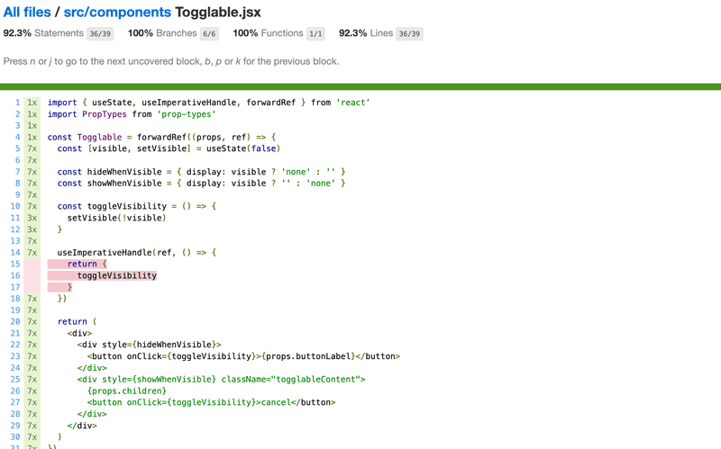

You can find the code for our current application in its entirety in the _part5-8_ branch of [this GitHub repository](https://github.com/fullstack-hy2020/part2-notes-frontend/tree/part5-8).

<hr style="border: 2px solid rgba(171, 40, 236, 0.81);">

### Exercise 5.13 - 5.16

#### 5.13: Blog List Tests, step 1

Make a test, which checks that the component displaying a blog renders the blog's title and author, but does not render its URL or number of likes by default.

Add CSS classes to the component to help the testing as necessary.

#### 5.14: Blog List Tests, step 2

Make a test, which checks that the blog's URL and number of likes are shown when the button controlling the shown details has been clicked.

#### 5.15: Blog List Tests, step 3

Make a test, which ensures that if the _like_ button is clicked twice, the event handler the component received as props is called twice.

#### 5.16: Blog List Tests, step 4

Make a test for the new blog form. The test should check, that the form calls the event handler it received as props with the right details when a new blog is created.

<hr style="border: 2px solid rgba(171, 40, 236, 0.81);">

### Frontend integration tests

In the previous part of the course material, we wrote integration tests for the backend that tested its logic and connected the database through the API provided by the backend. When writing these tests, we made the conscious decision not to write unit tests, as the code for that backend is fairly simple, and it is likely that bugs in our application occur in more complicated scenarios than unit tests are well suited for.

So far all of our tests for the frontend have been unit tests that have validated the correct functioning of individual components. Unit testing is useful at times, but even a comprehensive suite of unit tests is not enough to validate that the application works as a whole.

We could also make integration tests for the frontend. Integration testing tests the collaboration of multiple components. It is considerably more difficult than unit testing, as we would have to for example mock data from the server. We chose to concentrate on making end-to-end tests to test the whole application. We will work on the end-to-end tests in the last chapter of this part.

### Snapshot testing

Vitest offers a completely different alternative to "traditional" testing called [snapshot](https://vitest.dev/guide/snapshot) testing. The interesting feature of snapshot testing is that developers do not need to define any tests themselves, it is simple enough to adopt snapshot testing.

The fundamental principle is to compare the HTML code defined by the component after it has changed to the HTML code that existed before it was changed.

If the snapshot notices some change in the HTML defined by the component, then either it is new functionality or a "bug" caused by accident. Snapshot tests notify the developer if the HTML code of the component changes. The developer has to tell Vitest if the change was desired or undesired. If the change to the HTML code is unexpected, it strongly implies a bug, and the developer can become aware of these potential issues easily thanks to snapshot testing.

## Part 5d - End to end testing: Playwright

So far we have tested the backend as a whole on an API level using integration tests and tested some frontend components using unit tests.

Next, we will look into one way to test the [system as a whole](https://en.wikipedia.org/wiki/System_testing) using End to End (E2E) tests.

We can do E2E testing of a web application using a browser and a testing library. There are multiple libraries available. One example is [Selenium](http://www.seleniumhq.org/), which can be used with almost any browser. Another browser option is so-called [headless browsers](https://en.wikipedia.org/wiki/Headless_browser), which are browsers with no graphical user interface. For example, Chrome can be used in headless mode.

E2E tests are potentially the most useful category of tests because they test the system through the same interface as real users use.

They do have some drawbacks too. Configuring E2E tests is more challenging than unit or integration tests. They also tend to be quite slow, and with a large system, their execution time can be minutes or even hours. This is bad for development because during coding it is beneficial to be able to run tests as often as possible in case of code [regressions](https://en.wikipedia.org/wiki/Regression_testing).

E2E tests can also be [flaky](https://hackernoon.com/flaky-tests-a-war-that-never-ends-9aa32fdef359). Some tests might pass one time and fail another, even if the code does not change at all.

Perhaps the two easiest libraries for End to End testing at the moment are [Cypress](https://www.cypress.io/) and [Playwright](https://playwright.dev/).

From the statistics on [npmtrends.com](https://npmtrends.com/cypress-vs-playwright) we see that Cypress, which dominated the market for the last five years, is still clearly the number one, but Playwright is on a rapid rise:

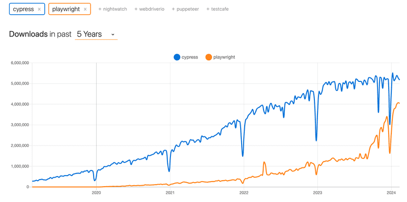

This course has been using Cypress for years. Now Playwright is a new addition. You can choose whether to complete the E2E testing part of the course with Cypress or Playwright. The operating principles of both libraries are very similar, so your choice is not very important. However, Playwright is now the preferred E2E library for the course.

If your choice is Playwright, please proceed. If you end up using Cypress, go [here](https://fullstackopen.com/en/part5/end_to_end_testing_cypress).

### Playwright

So [Playwright](https://playwright.dev/) is a newcomer to the End to End tests, which started to explode in popularity towards the end of 2023. Playwright is roughly on a par with Cypress in terms of ease of use. The libraries are slightly different in terms of how they work. Cypress is radically different from most libraries suitable for E2E testing, as Cypress tests are run entirely within the browser. Playwright's tests, on the other hand, are executed in the Node process, which is connected to the browser via programming interfaces.

It is difficult to say which library is better. One advantage of Playwright is its browser support; Playwright supports Chrome, Firefox and Webkit-based browsers like Safari. Currently, Cypress includes support for all these browsers, although Webkit support is experimental and does not support all of Cypress features. At the time of writing (1.3.2024), my personal preference leans slightly towards Playwright.

Now let's explore Playwright.

### Initializing tests

Unlike the backend tests or unit tests done on the React front-end, End to End tests do not need to be located in the same npm project where the code is. Let's make a completely separate project for the E2E tests with the `npm init` command. Then install Playwright by running in the new project directory the command:

```
npm init playwright@latest
```

The installation script will ask a few questions, answer them as follows:

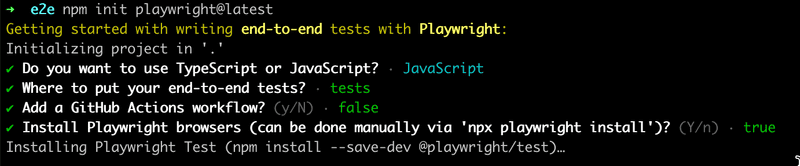

Note that when installing Playwright your operating system may not support all of the browsers Playwright offers and you may see an error message like below:

```
Webkit 18.0 (playwright build v2070) downloaded to /home/user/.cache/ms-playwright/webkit-2070
Playwright Host validation warning: 
╔══════════════════════════════════════════════════════╗
║ Host system is missing dependencies to run browsers. ║
║ Missing libraries:                                   ║
║     libicudata.so.66                                 ║
║     libicui18n.so.66                                 ║
║     libicuuc.so.66                                   ║
║     libjpeg.so.8                                     ║
║     libwebp.so.6                                     ║
║     libpcre.so.3                                     ║
║     libffi.so.7                                      ║
╚══════════════════════════════════════════════════════╝
```

If this is the case you can either specify specific browsers to test with `--project=` in your `package.json`:

```json
"test": "playwright test --project=chromium --project=firefox",
```

or remove the entry for any problematic browsers from your `playwright.config.js` file:

```js
projects: [
  // ...
  //{
  //  name: 'webkit',
  //  use: { ...devices['Desktop Safari'] },
  //},
```

Let's define an npm script for running tests and test reports in `package.json`:

```json
{
  // ...
  "scripts": {
    "test": "playwright test",
    "test:report": "playwright show-report"
  },
  // ...
}
```

During installation, the following is printed to the console:

```
And check out the following files:
  - ./tests/example.spec.js - Example end-to-end test
  - ./tests-examples/demo-todo-app.spec.js - Demo Todo App end-to-end tests
  - ./playwright.config.js - Playwright Test configuration
```

that is, the location of a few example tests for the project that the installation has created.

Let's run the tests:

```bash
$ npm test

> notes-e2e@1.0.0 test
> playwright test


Running 6 tests using 5 workers
  6 passed (3.9s)

To open last HTML report run:

  npx playwright show-report
```

The tests pass. A more detailed test report can be opened either with the command suggested by the output, or with the npm script we just defined:

```
npm run test:report
```

Tests can also be run via the graphical UI with the command:

```
npm run test -- --ui
```

Sample tests look like this:

```js
const { test, expect } = require('@playwright/test');

test('has title', async ({ page }) => {

  await page.goto('https://playwright.dev/');

  // Expect a title "to contain" a substring.
  await expect(page).toHaveTitle(/Playwright/);
});

test('get started link', async ({ page }) => {
  await page.goto('https://playwright.dev/');

  // Click the get started link.
  await page.getByRole('link', { name: 'Get started' }).click();

  // Expects page to have a heading with the name of Installation.
  await expect(page.getByRole('heading', { name: 'Installation' })).toBeVisible();
});
```

The first line of the test functions says that the tests are testing the page at https://playwright.dev/.

### Testing our own code

Now let's remove the sample tests and start testing our own application.

Playwright tests assume that the system under test is running when the tests are executed. Unlike, for example, backend integration tests, Playwright tests _do not start_ the system under test during testing.

Let's make an npm script for the _backend_, which will enable it to be started in testing mode, i.e. so that _NODE_ENV_ gets the value _test_.

```json
{
  // ...
  "scripts": {
    "start": "NODE_ENV=production node index.js",
    "dev": "NODE_ENV=development nodemon index.js",
    "build:ui": "rm -rf build && cd ../frontend/ && npm run build && cp -r build ../backend",
    "deploy": "fly deploy",
    "deploy:full": "npm run build:ui && npm run deploy",
    "logs:prod": "fly logs",
    "lint": "eslint .",
    "test": "NODE_ENV=test node --test",
    "start:test": "NODE_ENV=test node index.js"
  },
  // ...
}
```

Let's start the frontend and backend, and create the first test file for the application `tests/note_app.spec.js`:

```js
const { test, expect } = require('@playwright/test')

test('front page can be opened', async ({ page }) => {
  await page.goto('http://localhost:5173')

  const locator = await page.getByText('Notes')
  await expect(locator).toBeVisible()
  await expect(page.getByText('Note app, Department of Computer Science, University of Helsinki 2023')).toBeVisible()
})
```

First, the test opens the application with the method [page.goto](https://playwright.dev/docs/writing-tests#navigation). After this, it uses the [page.getByText](https://playwright.dev/docs/api/class-page#page-get-by-text) to get a [locator](https://playwright.dev/docs/locators) that corresponds to the element where the text _Notes_ is found.

The method [toBeVisible](https://playwright.dev/docs/api/class-locatorassertions#locator-assertions-to-be-visible) ensures that the element corresponding to the locator is visible at the page.

The second check is done without using the auxiliary variable.

We notice that the year has changed. Let's change the test as follows:

```js
const { test, expect } = require('@playwright/test')

test('front page can be opened', async ({ page }) => {
  await page.goto('http://localhost:5173')

  const locator = await page.getByText('Notes')
  await expect(locator).toBeVisible()

  await expect(page.getByText('Note app, Department of Computer Science, University of Helsinki 2025')).toBeVisible()
})
```

As expected, the test fails. Playwright opens the test report in the browser and it becomes clear that Playwright has actually performed the tests with three different browsers: Chrome, Firefox and Webkit, i.e. the browser engine used by Safari:

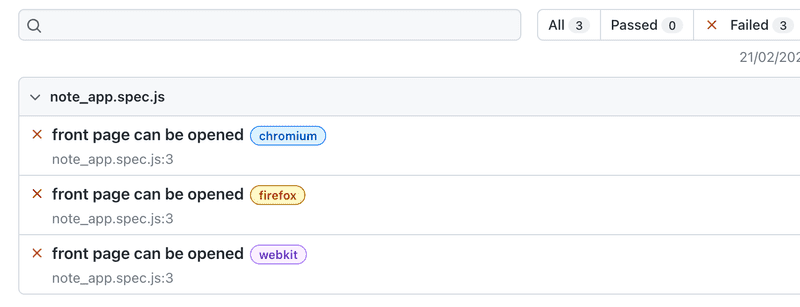

By clicking on the report of one of the browsers, we can see a more detailed error message:

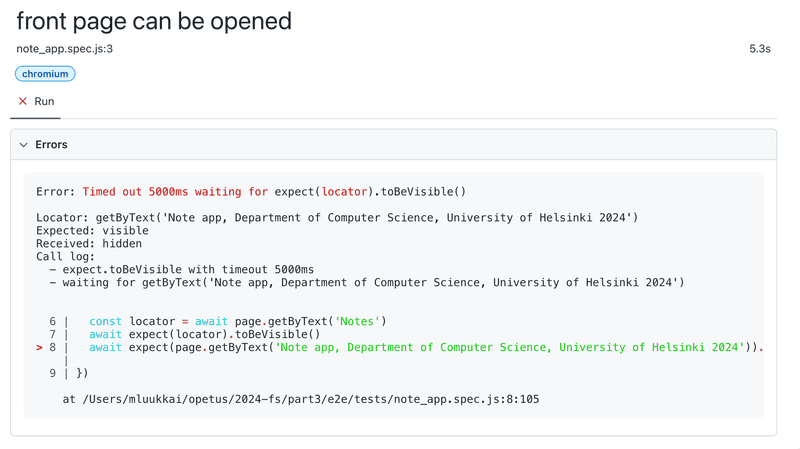

In the big picture, it is of course a very good thing that the testing takes place with all three commonly used browser engines, but this is slow, and when developing the tests it is probably best to carry them out mainly with only one browser. You can define the browser engine to be used with the command line parameter:

```bash
npm test -- --project chromium
```

Before we move on, let's break the tests one more time. We notice that the execution of the tests is quite fast when they pass, but much slower if the they do not pass. The reason for this is that Playwright's policy is to wait for searched elements until [they are rendered and ready for action](https://playwright.dev/docs/actionability). If the element is not found, a `TimeoutError` is raised and the test fails. Playwright waits for elements by default for 5 or 30 seconds [depending on the functions used in testing](https://playwright.dev/docs/test-timeouts#introduction).

When developing tests, it may be wiser to reduce the waiting time to a few seconds. According to the [documentation](https://playwright.dev/docs/test-timeouts), this can be done by changing the file `playwright.config.js` as follows:

```js
module.exports = defineConfig({
  timeout: 3000,
  fullyParallel: false,
  workers: 1,
  // ...
})
```

We also made two other changes to the file, and specified that all tests [be executed one at a time](https://playwright.dev/docs/test-parallel). With the default configuration, the execution happens in parallel, and since our tests use a database, parallel execution causes problems.

