So far, we have placed the application's state and state logic directly inside React components. When applications grow larger, state management should be moved outside React components. In this part, we will introduce the Redux library, which is currently the most popular solution for managing the state of React applications.

We'll learn about the lightweight version of Redux directly supported by React, namely the React context and useReducer hook, as well as the React Query library that simplifies the server state management.

# Table of Contents

- [Part 6](#part-6)
  - [Part 6a - Flux-architecture and Redux](#part-6a---flux-architecture-and-redux)
    - [Flux-architecture](#flux-architecture)
    - [Redux](#redux)
    - [A note about the use of createStore](#a-note-about-the-use-of-createstore)
    - [Redux-notes](#redux-notes)
      - [Pure functions, immutable](#pure-functions-immutable)
      - [Array spread syntax](#array-spread-syntax)
    - [Exercises 6.1 - 6.2](#exercises-61---62)
      - [6.1: Unicafe Revisited, step 1](#61-unicafe-revisited-step-1)
    - [Uncontrolled form](#uncontrolled-form)
    - [Action creators](#action-creators)
    - [Forwarding Redux Store to various components](#forwarding-redux-store-to-various-components)
    - [More components](#more-components)
    - [Exercises 6.3-6.8](#exercises-63-68)
      - [6.3: Anecdotes, step 1](#63-anecdotes-step-1)
      - [6.4: Anecdotes, step 2](#64-anecdotes-step-2)
      - [6.5: Anecdotes, step 3](#65-anecdotes-step-3)
      - [6.6: Anecdotes, step 4](#66-anecdotes-step-4)
      - [6.7: Anecdotes, step 5](#67-anecdotes-step-5)
      - [6.8: Anecdotes, step 6](#68-anecdotes-step-6)

# Part 6

## Part 6a - Flux-architecture and Redux

So far, we have followed the state management conventions recommended by React. We have placed the state and the functions for handling it in the [higher level](https://react.dev/learn/sharing-state-between-components) of the component structure of the application. Quite often most of the app state and state altering functions reside directly in the root component. The state and its handler methods have then been passed to other components with props. This works up to a certain point, but when applications grow larger, state management becomes challenging.

### Flux-architecture

Already years ago Facebook developed the [Flux](https://facebookarchive.github.io/flux/docs/in-depth-overview)-architecture to make state management of React apps easier. In Flux, the state is separated from the React components and into its own _stores_. State in the store is not changed directly, but with different _actions_.

When an action changes the state of the store, the views are rerendered:


If some action on the application, for example pushing a button, causes the need to change the state, the change is made with an action. This causes re-rendering the view again:


Flux offers a standard way for how and where the application's state is kept and how it is modified.

### Redux

Facebook has an implementation for Flux, but we will be using the [Redux](https://redux.js.org/) library. It works with the same principle but is a bit simpler. Facebook also uses Redux now instead of their original Flux.

We will get to know Redux by implementing a counter application yet again:


Create a new Vite application and install redux with the command

```
npm install redux
```

As in Flux, in Redux the state is also stored in a [store](https://redux.js.org/tutorials/essentials/part-1-overview-concepts#store).

The whole state of the application is stored in _one_ JavaScript object in the store. Because our application only needs the value of the counter, we will save it straight to the store. If the state was more complicated, different things in the state would be saved as separate fields of the object.

The state of the store is changed with [actions](https://redux.js.org/tutorials/essentials/part-1-overview-concepts#actions). Actions are objects, which have at least a field determining the _type_ of the action. Our application needs for example the following action:

```js
{
  type: 'INCREMENT'
}
```

If there is data involved with the action, other fields can be declared as needed. However, our counting app is so simple that the actions are fine with just the type field.

The impact of the action to the state of the application is defined using a [reducer](https://redux.js.org/tutorials/essentials/part-1-overview-concepts#reducers). In practice, a reducer is a function that is given the current state and an action as parameters. It _returns_ a new state.

Let's now define a reducer for our application:

```js
const counterReducer = (state, action) => {
  if (action.type === 'INCREMENT') {
    return state + 1
  } else if (action.type === 'DECREMENT') {
    return state - 1
  } else if (action.type === 'ZERO') {
    return 0
  }

  return state
}
```

The first parameter is the _state_ in the store. The reducer returns a _new state_ based on the `action` type. So, e.g. when the type of Action is _INCREMENT_, the state gets the old value plus one. If the type of Action is _ZERO_ the new value of state is zero.

Let's change the code a bit. We have used if-else statements to respond to an action and change the state. However, the [switch](https://developer.mozilla.org/en-US/docs/Web/JavaScript/Reference/Statements/switch) statement is the most common approach to writing a reducer.

Let's also define a [default value](https://developer.mozilla.org/en-US/docs/Web/JavaScript/Reference/Functions/Default_parameters) of 0 for the parameter _state_. Now the reducer works even if the store state has not been primed yet.

```js
const counterReducer = (state = 0, action) => {
  switch (action.type) {
    case 'INCREMENT':
      return state + 1
    case 'DECREMENT':
      return state - 1
    case 'ZERO':
      return 0
    default: // if none of the above matches, code comes here
      return state
  }
}
```

The reducer is never supposed to be called directly from the application's code. It is only given as a parameter to the `createStore` function which creates the store:

```js
import { createStore } from 'redux'

const counterReducer = (state = 0, action) => {
  // ...
}

const store = createStore(counterReducer)
```

The store now uses the reducer to handle actions, which are _dispatched_ or 'sent' to the store with its [dispatch](https://redux.js.org/tutorials/essentials/part-1-overview-concepts#dispatch) method.

```js
store.dispatch({ type: 'INCREMENT' })
```

You can find out the state of the store using the method [getState](https://redux.js.org/api/store#getstate).

For example the following code:

```js
const store = createStore(counterReducer)
console.log(store.getState())
store.dispatch({ type: 'INCREMENT' })
store.dispatch({ type: 'INCREMENT' })
store.dispatch({ type: 'INCREMENT' })
console.log(store.getState())
store.dispatch({ type: 'ZERO' })
store.dispatch({ type: 'DECREMENT' })
console.log(store.getState())
```

would print the following to the console

```
0
3
-1
```

because at first, the state of the store is 0. After three _INCREMENT_ actions the state is 3. In the end, after the _ZERO_ and _DECREMENT_ actions, the state is -1.

The third important method that the store has is [subscribe](https://redux.js.org/api/store#subscribelistener), which is used to create callback functions that the store calls whenever an action is dispatched to the store.

If, for example, we would add the following function to subscribe, _every change in the store_ would be printed to the console.

```js
store.subscribe(() => {
  const storeNow = store.getState()
  console.log(storeNow)
})
```

so the code

```js
const store = createStore(counterReducer)

store.subscribe(() => {
  const storeNow = store.getState()
  console.log(storeNow)
})

store.dispatch({ type: 'INCREMENT' })
store.dispatch({ type: 'INCREMENT' })
store.dispatch({ type: 'INCREMENT' })
store.dispatch({ type: 'ZERO' })
store.dispatch({ type: 'DECREMENT' })
```

would cause the following to be printed

```
1
2
3
0
-1
```

The code of our counter application is the following. All of the code has been written in the same file (`main.jsx`), so _store_ is directly available for the React code. We will get to know better ways to structure React/Redux code later.

```js
import React from 'react'
import ReactDOM from 'react-dom/client'

import { createStore } from 'redux'

const counterReducer = (state = 0, action) => {
  switch (action.type) {
    case 'INCREMENT':
      return state + 1
    case 'DECREMENT':
      return state - 1
    case 'ZERO':
      return 0
    default:
      return state
  }
}

const store = createStore(counterReducer)

const App = () => {
  return (
    <div>
      <div>
        {store.getState()}
      </div>
      <button 
        onClick={e => store.dispatch({ type: 'INCREMENT' })}
      >
        plus
      </button>
      <button
        onClick={e => store.dispatch({ type: 'DECREMENT' })}
      >
        minus
      </button>
      <button 
        onClick={e => store.dispatch({ type: 'ZERO' })}
      >
        zero
      </button>
    </div>
  )
}

const root = ReactDOM.createRoot(document.getElementById('root'))

const renderApp = () => {
  root.render(<App />)
}

renderApp()
store.subscribe(renderApp)
```

There are a few notable things in the code. _App_ renders the value of the counter by asking it from the store with the method `store.getState()`. The action handlers of the buttons _dispatch_ the right actions to the store.

When the state in the store is changed, React is not able to automatically re-render the application. Thus we have registered a function `renderApp`, which renders the whole app, to listen for changes in the store with the `store.subscribe` method. Note that we have to immediately call the renderApp method. Without the call, the first rendering of the app would never happen.

# A note about the use of createStore

The most observant will notice that the name of the function createStore is overlined. If you move the mouse over the name, an explanation will appear


The full explanation is as follows

> _We recommend using the configureStore method of the @reduxjs/toolkit package, which replaces createStore._ 
>
> _Redux Toolkit is our recommended approach for writing Redux logic today, including store setup, reducers, data fetching, and more._
>
> _For more details, please read this Redux docs page: https://redux.js.org/introduction/why-rtk-is-redux-today_
>
> _configureStore from Redux Toolkit is an improved version of createStore that simplifies setup and helps avoid common bugs._
>
> _You should not be using the redux core package by itself today, except for learning purposes. The createStore method from the core redux package will not be removed, but we encourage all users to migrate to using Redux Toolkit for all Redux code._

So, instead of the function _createStore_, it is recommended to use the slightly more "advanced" function _configureStore_, and we will also use it when we have achieved the basic functionality of Redux.

Side note: _createStore_ is defined as "deprecated", which usually means that the feature will be removed in some newer version of the library. The explanation above and this [discussion](https://stackoverflow.com/questions/71944111/redux-createstore-is-deprecated-cannot-get-state-from-getstate-in-redux-ac) reveal that createStore will not be removed, and it has been given the status _deprecated_, perhaps with slightly incorrect reasons. So the function is not obsolete, but today there is a more preferable, new way to do almost the same thing.

### Redux-notes

We aim to modify our note application to use Redux for state management. However, let's first cover a few key concepts through a simplified note application.

The first version of our application is the following

```js
const noteReducer = (state = [], action) => {
  if (action.type === 'NEW_NOTE') {
    state.push(action.payload)
    return state
  }

  return state
}

const store = createStore(noteReducer)

store.dispatch({
  type: 'NEW_NOTE',
  payload: {
    content: 'the app state is in redux store',
    important: true,
    id: 1
  }
})

store.dispatch({
  type: 'NEW_NOTE',
  payload: {
    content: 'state changes are made with actions',
    important: false,
    id: 2
  }
})

const App = () => {
  return(
    <div>
      <ul>
        {store.getState().map(note=>
          <li key={note.id}>
            {note.content} <strong>{note.important ? 'important' : ''}</strong>
          </li>
        )}
        </ul>
    </div>
  )
}
export default noteReducer;
```

So far the application does not have the functionality for adding new notes, although it is possible to do so by dispatching _NEW_NOTE_ actions.

Now the actions have a type and a field _payload_, which contains the note to be added:

```js
{
  type: 'NEW_NOTE',
  payload: {
    content: 'state changes are made with actions',
    important: false,
    id: 2
  }
}
```

The choice of the field name is not random. The general convention is that actions have exactly two fields, _type_ telling the type and _payload_ containing the data included with the Action.

### Pure functions, immutable

The initial version of the reducer is very simple:

```js
const noteReducer = (state = [], action) => {
  if (action.type === 'NEW_NOTE') {
    state.push(action.payload)
    return state
  }

  return state
}
```

The state is now an Array. _NEW_NOTE_-type actions cause a new note to be added to the state with the [push](https://developer.mozilla.org/en-US/docs/Web/JavaScript/Reference/Global_Objects/Array/push) method.

The application seems to be working, but the reducer we have declared is bad. It breaks the [basic assumption](https://redux.js.org/tutorials/essentials/part-1-overview-concepts#reducers) that reducers must be [pure functions](https://en.wikipedia.org/wiki/Pure_function).

Pure functions are such, that they _do not cause any side effects_ and they must always return the same response when called with the same parameters.

We added a new note to the state with the method `state.push(action.payload)` which _changes_ the state of the state-object. This is not allowed. The problem is easily solved by using the [concat](https://developer.mozilla.org/en-US/docs/Web/JavaScript/Reference/Global_Objects/Array/concat) method, which creates a _new array_, which contains all the elements of the old array and the new element:

```js
const noteReducer = (state = [], action) => {
  if (action.type === 'NEW_NOTE') {
    return state.concat(action.payload)
  }

  return state
}
```

A reducer state must be composed of [immutable](https://en.wikipedia.org/wiki/Immutable_object) objects. If there is a change in the state, the old object is not changed, but it is _replaced with a new, changed, object_. This is exactly what we did with the new reducer: the old array is replaced with the new one.

Let's expand our reducer so that it can handle the change of a note's importance:

```js
{
  type: 'TOGGLE_IMPORTANCE',
  payload: {
    id: 2
  }
}
```

Since we do not have any code which uses this functionality yet, we are expanding the reducer in the 'test-driven' way. Let's start by creating a test for handling the action _NEW_NOTE_.

We have to first configure the [Jest](https://jestjs.io/) testing library for the project. Let us install the following dependencies:

```
npm install --save-dev jest @babel/preset-env @babel/preset-react eslint-plugin-jest
```

Next we'll create the file _.babelrc_, with the following content:

```json
{
  "presets": [
    "@babel/preset-env",
    ["@babel/preset-react", { "runtime": "automatic" }]
  ]
}
```

Let us expand package.json with a script for running the tests:

```json
{
  // ...
  "scripts": {
    "dev": "vite",
    "build": "vite build",
    "lint": "eslint . --ext js,jsx --report-unused-disable-directives --max-warnings 0",
    "preview": "vite preview",

    "test": "jest"
  },
  // ...
}
```

And finally, _.eslintrc.cjs_ needs to be altered as follows:

```js
module.exports = {
  root: true,
  env: { 
    browser: true,
    es2020: true,
    "jest/globals": true
  },
  // ...
}
```

To make testing easier, we'll first move the reducer's code to its own module, to the file _src/reducers/noteReducer.js_. We'll also add the library [deep-freeze](https://www.npmjs.com/package/deep-freeze), which can be used to ensure that the reducer has been correctly defined as an immutable function. Let's install the library as a development dependency:

```
npm install --save-dev deep-freeze
```

The test, which we define in file _src/reducers/noteReducer.test.js_, has the following content:

```js
import noteReducer from './noteReducer'
import deepFreeze from 'deep-freeze'

describe('noteReducer', () => {
  test('returns new state with action NEW_NOTE', () => {
    const state = []
    const action = {
      type: 'NEW_NOTE',
      payload: {
        content: 'the app state is in redux store',
        important: true,
        id: 1
      }
    }

    deepFreeze(state)
    const newState = noteReducer(state, action)

    expect(newState).toHaveLength(1)
    expect(newState).toContainEqual(action.payload)
  })
})
```

Run the test with _npm test_. The _deepFreeze(state)_ command ensures that the reducer does not change the state of the store given to it as a parameter. If the reducer uses the `push` command to manipulate the state, the test will not pass


Now we'll create a test for the _TOGGLE_IMPORTANCE_ action:

```js
test('returns new state with action TOGGLE_IMPORTANCE', () => {
  const state = [
    {
      content: 'the app state is in redux store',
      important: true,
      id: 1
    },
    {
      content: 'state changes are made with actions',
      important: false,
      id: 2
    }]

  const action = {
    type: 'TOGGLE_IMPORTANCE',
    payload: {
      id: 2
    }
  }

  deepFreeze(state)
  const newState = noteReducer(state, action)

  expect(newState).toHaveLength(2)

  expect(newState).toContainEqual(state[0])

  expect(newState).toContainEqual({
    content: 'state changes are made with actions',
    important: true,
    id: 2
  })
})
```

So the following action

```js
{
  type: 'TOGGLE_IMPORTANCE',
  payload: {
    id: 2
  }
}
```

has to change the importance of the note with the id 2.

The reducer is expanded as follows

```js
const noteReducer = (state = [], action) => {
  switch(action.type) {
    case 'NEW_NOTE':
      return state.concat(action.payload)
    case 'TOGGLE_IMPORTANCE': {
      const id = action.payload.id
      const noteToChange = state.find(n => n.id === id)
      const changedNote = { 
        ...noteToChange, 
        important: !noteToChange.important 
      }
      return state.map(note =>
        note.id !== id ? note : changedNote 
      )
     }
    default:
      return state
  }
}
```

We create a copy of the note whose importance has changed with the syntax [familiar from part 2](../part2/README.md#changing-the-importance-of-notes), and replace the state with a new state containing all the notes which have not changed and the copy of the changed note _changedNote_.

Let's recap what goes on in the code. First, we search for a specific note object, the importance of which we want to change:

```js
const noteToChange = state.find(n => n.id === id)
```

then we create a new object, which is a _copy_ of the original note, only the value of the _important_ field has been changed to the opposite of what it was:

```js
const changedNote = { 
  ...noteToChange, 
  important: !noteToChange.important 
}
```

A new state is then returned. We create it by taking all of the notes from the old state except for the desired note, which we replace with its slightly altered copy:

```js
state.map(note =>
  note.id !== id ? note : changedNote 
)
```

### Array spread syntax

Because we now have quite good tests for the reducer, we can refactor the code safely.

Adding a new note creates the state returned from the Array's `concat` function. Let's take a look at how we can achieve the same by using the JavaScript [array spread](https://developer.mozilla.org/en-US/docs/Web/JavaScript/Reference/Operators/Spread_operator) syntax:

```js
const noteReducer = (state = [], action) => {
  switch(action.type) {
    case 'NEW_NOTE':

      return [...state, action.payload]
    case 'TOGGLE_IMPORTANCE':
      // ...
    default:
    return state
  }
}
```

The spread -syntax works as follows. If we declare

```js
const numbers = [1, 2, 3]
```

`...numbers` breaks the array up into individual elements, which can be placed in another array.

```js
[...numbers, 4, 5]
```

and the result is an array _[1, 2, 3, 4, 5]_.

```js
[numbers, 4, 5]
```

the result would have been _[[1, 2, 3], 4, 5]_.

When we take elements from an array by [destructuring](https://developer.mozilla.org/en-US/docs/Web/JavaScript/Reference/Operators/Destructuring_assignment), a similar-looking syntax is used to _gather_ the rest of the elements:

```js
const numbers = [1, 2, 3, 4, 5, 6]

const [first, second, ...rest] = numbers

console.log(first)     // prints 1
console.log(second)   // prints 2
console.log(rest)     // prints [3, 4, 5, 6]
```

<hr style="border: 2px solid rgb(127, 103, 168)">

### Exercises 6.1 - 6.2

Let's make a simplified version of the unicafe exercise from part 1. Let's handle the state management with Redux.

You can take the code from this repository https://github.com/fullstack-hy2020/unicafe-redux for the base of your project.

_Start by removing the git configuration of the cloned repository, and by installing dependencies_

```
cd unicafe-redux   // go to the directory of cloned repository
rm -rf .git
npm install
```

#### 6.1: Unicafe Revisited, step 1

Before implementing the functionality of the UI, let's implement the functionality required by the store.

We have to save the number of each kind of feedback to the store, so the form of the state in the store is:

```js
{
  good: 5,
  ok: 4,
  bad: 2
}
```

The project has the following base for a reducer:

```js
const initialState = {
  good: 0,
  ok: 0,
  bad: 0
}

const counterReducer = (state = initialState, action) => {
  console.log(action)
  switch (action.type) {
    case 'GOOD':
      return state
    case 'OK':
      return state
    case 'BAD':
      return state
    case 'ZERO':
      return state
    default: return state
  }

}

export default counterReducer
```

and a base for its tests

```js
import deepFreeze from 'deep-freeze'
import counterReducer from './reducer'

describe('unicafe reducer', () => {
  const initialState = {
    good: 0,
    ok: 0,
    bad: 0
  }

  test('should return a proper initial state when called with undefined state', () => {
    const state = {}
    const action = {
      type: 'DO_NOTHING'
    }

    const newState = counterReducer(undefined, action)
    expect(newState).toEqual(initialState)
  })

  test('good is incremented', () => {
    const action = {
      type: 'GOOD'
    }
    const state = initialState

    deepFreeze(state)
    const newState = counterReducer(state, action)
    expect(newState).toEqual({
      good: 1,
      ok: 0,
      bad: 0
    })
  })
})
```

__Implement the reducer and its tests__

In the tests, make sure that the reducer is an _immutable function_ with the _deep-freeze_ library. Ensure that the provided first test passes, because Redux expe cts that the reducer returns the original state when it is called with a first parameter - which represents the previous _state_ - with the value _undefined_.

Start by expanding the reducer so that both tests pass. Then add the rest of the tests, and finally the functionality that they are testing.

A good model for the reducer is the [redux-notes](https://fullstackopen.com/en/part6/flux_architecture_and_redux#pure-functions-immutable) example above.

<hr style="border: 2px solid rgb(127, 103, 168)">

### Uncontrolled form

Let's add the functionality for adding new notes and changing their importance:

```js
const generateId = () =>
  Number((Math.random() * 1000000).toFixed(0))

const App = () => {

  const addNote = (event) => {
    event.preventDefault()
    const content = event.target.note.value
    event.target.note.value = ''
    store.dispatch({
      type: 'NEW_NOTE',
      payload: {
        content,
        important: false,
        id: generateId()
      }
    })
  }


  const toggleImportance = (id) => {
    store.dispatch({
      type: 'TOGGLE_IMPORTANCE',
      payload: { id }
    })
  }

  return (
    <div>
      <form onSubmit={addNote}>
        <input name="note" /> 
        <button type="submit">add</button>
      </form>
      <ul>
        {store.getState().map(note =>
          <li
            key={note.id} 

            onClick={() => toggleImportance(note.id)}
          >
            {note.content} <strong>{note.important ? 'important' : ''}</strong>
          </li>
        )}
      </ul>
    </div>
  )
}
```

The implementation of both functionalities is straightforward. It is noteworthy that we _have not_ bound the state of the form fields to the state of the _App_ component like we have previously done. React calls this kind of form [uncontrolled](https://react.dev/reference/react-dom/components/input#controlling-an-input-with-a-state-variable).

> Uncontrolled forms have certain limitations (for example, dynamic error messages or disabling the submit button based on input are not possible). However they are suitable for our current needs.

You can read more about uncontrolled forms [here](https://goshakkk.name/controlled-vs-uncontrolled-inputs-react/).

The method for adding new notes is simple, it just dispatches the action for adding notes:

```js
addNote = (event) => {
  event.preventDefault()
  const content = event.target.note.value
  event.target.note.value = ''
  store.dispatch({
    type: 'NEW_NOTE',
    payload: {
      content,
      important: false,
      id: generateId()
    }
  })
}
```

We can get the content of the new note straight from the form field. Because the field has a name, we can access the content via the event object _event.target.note.value_.

```js
<form onSubmit={addNote}>
  <input name="note" />
  <button type="submit">add</button>
</form>
```

A note's importance can be changed by clicking its name. The event handler is very simple:

```js
toggleImportance = (id) => {
  store.dispatch({
    type: 'TOGGLE_IMPORTANCE',
    payload: { id }
  })
}
```

### Action creators

We begin to notice that, even in applications as simple as ours, using Redux can simplify the frontend code. However, we can do a lot better.

React components don't need to know the Redux action types and forms. Let's separate creating actions into separate functions:

```js
const createNote = (content) => {
  return {
    type: 'NEW_NOTE',
    payload: {
      content,
      important: false,
      id: generateId()
    }
  }
}

const toggleImportanceOf = (id) => {
  return {
    type: 'TOGGLE_IMPORTANCE',
    payload: { id }
  }
}
```

Functions that create actions are called [action creators](https://redux.js.org/tutorials/essentials/part-1-overview-concepts#action-creators).

The _App_ component does not have to know anything about the inner representation of the actions anymore, it just gets the right action by calling the creator function:

```js
const App = () => {
  const addNote = (event) => {
    event.preventDefault()
    const content = event.target.note.value
    event.target.note.value = ''
    store.dispatch(createNote(content))
  }
  
  const toggleImportance = (id) => {
    store.dispatch(toggleImportanceOf(id))
  }

  // ...
}
```

### Forwarding Redux Store to various components

Aside from the reducer, our application is in one file. This is of course not sensible, and we should separate _App_ into its module.

Now the question is, how can the App access the store after the move? And more broadly, when a component is composed of many smaller components, there must be a way for all of the components to access the store. There are multiple ways to share the Redux store with the components. First, we will look into the newest, and possibly the easiest way, which is using the [hooks](https://react-redux.js.org/api/hooks) API of the [react-redux](https://react-redux.js.org/) library.

First, we install react-redux

```
npm install react-redux
```

Next, we move the `App` component into its own file `App.jsx`. Let's see how this affects the rest of the application files.

`main.jsx`/`index.jsx` becomes:

```js
import React from 'react'
import ReactDOM from 'react-dom/client'
import { createStore } from 'redux'
import { Provider } from 'react-redux'
import App from './App'
import noteReducer from './reducers/noteReducer'

const store = createStore(noteReducer)

ReactDOM.createRoot(document.getElementById('root')).render(
  <Provider store={store}>
    <App />
  </Provider>
)
```

Note, that the application is now defined as a child of a [Provider](https://react-redux.js.org/api/provider) component provided by the react-redux library. The application's store is given to the Provider as its attribute _store_.

Defining the action creators has been moved to the file _reducers/noteReducer.js_ where the reducer is defined. That file looks like this:

```js
const noteReducer = (state = [], action) => {
  // ...
}

const generateId = () =>
  Number((Math.random() * 1000000).toFixed(0))

export const createNote = (content) => {
  return {
    type: 'NEW_NOTE',
    payload: {
      content,
      important: false,
      id: generateId()
    }
  }
}

export const toggleImportanceOf = (id) => {
  return {
    type: 'TOGGLE_IMPORTANCE',
    payload: { id }
  }
}

export default noteReducer
```

Previously, if the application had many components which needed the store, the _App_ component had to pass store as props to all of those components (known as prop drilling). Now with the _store_ Provider wrapping the _App_ component, the _store_ is directly accessible to all components within the _App_ component without explicitly being passed as props.

The module now has multiple [export](https://developer.mozilla.org/en-US/docs/Web/JavaScript/Reference/Statements/export) commands.

The reducer function is still returned with the _export default_ command, so the reducer can be imported the usual way:

```js
import noteReducer from './reducers/noteReducer'
```

A module can have only _one default export_, but multiple "normal" exports

```js
export const createNote = (content) => {
  // ...
}

export const toggleImportanceOf = (id) => { 
  // ...
}
```

Normally (not as defaults) exported functions can be imported with the curly brace syntax:

```js
import { createNote } from '../../reducers/noteReducer'
```

Code for the _App_ component

```js
import { createNote, toggleImportanceOf } from './reducers/noteReducer'
import { useSelector, useDispatch } from 'react-redux'

const App = () => {
  const dispatch = useDispatch()
  const notes = useSelector(state => state)

  const addNote = (event) => {
    event.preventDefault()
    const content = event.target.note.value
    event.target.note.value = ''
    dispatch(createNote(content))
  }

  const toggleImportance = (id) => {
    dispatch(toggleImportanceOf(id))
  }

  return (
    <div>
      <form onSubmit={addNote}>
        <input name="note" /> 
        <button type="submit">add</button>
      </form>
      <ul>
        {notes.map(note =>
          <li
            key={note.id} 
            onClick={() => toggleImportance(note.id)}
          >
            {note.content} <strong>{note.important ? 'important' : ''}</strong>
          </li>
        )}
      </ul>
    </div>
  )
}

export default App
```

There are a few things to note in the code. Previously the code dispatched actions by calling the dispatch method of the Redux store:

```js
store.dispatch({
  type: 'TOGGLE_IMPORTANCE',
  payload: { id }
})
```

Now it does it with the _dispatch_ function from the [useDispatch](https://react-redux.js.org/api/hooks#usedispatch) hook.

```js
import { useSelector, useDispatch } from 'react-redux'

const App = () => {
  const dispatch = useDispatch()
  // ...

  const toggleImportance = (id) => {
    dispatch(toggleImportanceOf(id))
  }

  // ...
}
```

The _useDispatch_ hook provides any React component access to the dispatch function of the Redux store defined in _main.jsx_. This allows all components to make changes to the state of the Redux store.

The component can access the notes stored in the store with the [useSelector](https://react-redux.js.org/api/hooks#useselector)-hook of the react-redux library.

```js
import { useSelector, useDispatch } from 'react-redux'

const App = () => {
  // ...
  const notes = useSelector(state => state)
  // ...
}
```

_useSelector_ receives a function as a parameter. The function either searches for or selects data from the Redux store. Here we need all of the notes, so our selector function returns the whole state:

```js
state => state
```

which is a shorthand for:

```js
(state) => {
  return state
}
```

Usually, selector functions are a bit more interesting and return only selected parts of the contents of the Redux store. We could for example return only notes marked as important:

```js
const importantNotes = useSelector(state => state.filter(note => note.important))  
```

The current version of the application can be found on [GitHub](https://github.com/fullstack-hy2020/redux-notes/tree/part6-0), branch part6-0.

### More components

Let's separate creating a new note into a component.

```js
import { useDispatch } from 'react-redux'
import { createNote } from '../reducers/noteReducer'

const NewNote = () => {
  const dispatch = useDispatch()

  const addNote = (event) => {
    event.preventDefault()
    const content = event.target.note.value
    event.target.note.value = ''
    dispatch(createNote(content))
  }

  return (
    <form onSubmit={addNote}>
      <input name="note" />
      <button type="submit">add</button>
    </form>
  )
}

export default NewNote
```

Unlike in the React code we did without Redux, the event handler for changing the state of the app (which now lives in Redux) has been moved away from the App to a child component. The logic for changing the state in Redux is still neatly separated from the whole React part of the application.

We'll also separate the list of notes and displaying a single note into their own components (which will both be placed in the Notes.jsx file ):

```js
import { useDispatch, useSelector } from 'react-redux'
import { toggleImportanceOf } from '../reducers/noteReducer'

const Note = ({ note, handleClick }) => {
  return(
    <li onClick={handleClick}>
      {note.content} 
      <strong> {note.important ? 'important' : ''}</strong>
    </li>
  )
}

const Notes = () => {
  const dispatch = useDispatch()
  const notes = useSelector(state => state)

  return(
    <ul>
      {notes.map(note =>
        <Note
          key={note.id}
          note={note}
          handleClick={() => 
            dispatch(toggleImportanceOf(note.id))
          }
        />
      )}
    </ul>
  )
}

export default Notes
```

The logic for changing the importance of a note is now in the component managing the list of notes.

There is not much code left in _App_:

```js
const App = () => {

  return (
    <div>
      <NewNote />
      <Notes />
    </div>
  )
}
```

_Note_, responsible for rendering a single note, is very simple and is not aware that the event handler it gets as props dispatches an action. These kinds of components are called [presentational](https://medium.com/@dan_abramov/smart-and-dumb-components-7ca2f9a7c7d0) in React terminology.

_Notes_, on the other hand, is a [container](https://medium.com/@dan_abramov/smart-and-dumb-components-7ca2f9a7c7d0) component, as it contains some application logic: it defines what the event handlers of the _Note_ components do and coordinates the configuration of _presentational_ components, that is, the _Notes_.

The code of the Redux application can be found on [GitHub](https://github.com/fullstack-hy2020/redux-notes/tree/part6-1), on the branch _part6-1_.

<hr style="border: 2px solid rgb(127, 103, 168)">

### Exercises 6.3-6.8

Let's make a new version of the anecdote voting application from part 1. Take the project from this repository https://github.com/fullstack-hy2020/redux-anecdotes as the base of your solution.

If you clone the project into an existing git repository, _remove the git configuration of the cloned application_:

```
cd redux-anecdotes  // go to the cloned repository
rm -rf .git
```

The application can be started as usual, but you have to install the dependencies first:

```
npm install
npm run dev
```

After completing these exercises, your application should look like this:

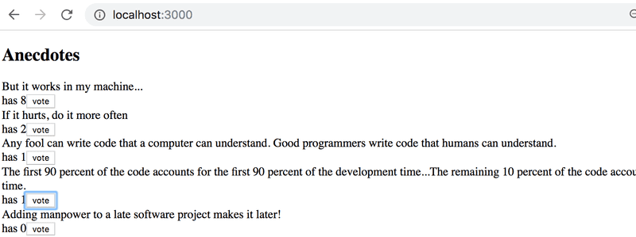

#### 6.3: Anecdotes, step 1

Implement the functionality for voting anecdotes. The number of votes must be saved to a Redux store.

#### 6.4: Anecdotes, step 2

Implement the functionality to add new anecdotes.

You can keep the form uncontrolled like we did [earlier](#uncontrolled-form).

#### 6.5: Anecdotes, step 3

Make sure that the anecdotes are ordered by the number of votes.

#### 6.6: Anecdotes, step 4

If you haven't done so already, separate the creation of action-objects to [action creator](https://read.reduxbook.com/markdown/part1/04-action-creators.html)-functions and place them in the _src/reducers/anecdoteReducer.js_ file, so do what we have been doing since the chapter [action creators](https://fullstackopen.com/en/part6/flux_architecture_and_redux#action-creators).

#### 6.7: Anecdotes, step 5

Separate the creation of new anecdotes into a component called _AnecdoteForm_. Move all logic for creating a new anecdote into this new component.

#### 6.8: Anecdotes, step 6

Separate the rendering of the anecdote list into a component called _AnecdoteList_. Move all logic related to voting for an anecdote to this new component.

Now the _App_ component should look like this:

```js
import AnecdoteForm from './components/AnecdoteForm'
import AnecdoteList from './components/AnecdoteList'

const App = () => {
  return (
    <div>
      <h2>Anecdotes</h2>
      <AnecdoteList />
      <AnecdoteForm />
    </div>
  )
}

export default App
```

<hr style="border: 2px solid rgb(127, 103, 168)">

## Part 6b - Many reducers

Let's continue our work with the simplified Redux version of our notes application.

To ease our development, let's change our reducer so that the store gets initialized with a state that contains a couple of notes:

```js
const initialState = [
  {
    content: 'reducer defines how redux store works',
    important: true,
    id: 1,
  },
  {
    content: 'state of store can contain any data',
    important: false,
    id: 2,
  },
]

const noteReducer = (state = initialState, action) => {
  // ...
}

// ...
export default noteReducer
```

## Store with complex state

Let's implement filtering for the notes that are displayed to the user. The user interface for the filters will be implemented with [radio buttons](https://developer.mozilla.org/en-US/docs/Web/HTML/Element/input/radio):

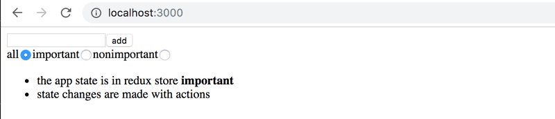

Let's start with a very simple and straightforward implementation:

```js
import NewNote from './components/NewNote'
import Notes from './components/Notes'

const App = () => {

  const filterSelected = (value) => {
    console.log(value)
  }

  return (
    <div>
      <NewNote />

      <div>
        all          <input type="radio" name="filter"
          onChange={() => filterSelected('ALL')} />
        important    <input type="radio" name="filter"
          onChange={() => filterSelected('IMPORTANT')} />
        nonimportant <input type="radio" name="filter"
          onChange={() => filterSelected('NONIMPORTANT')} />
      </div>
      <Notes />
    </div>
  )
}
```

Since the _name_ attribute of all the radio buttons is the same, they form a _button group_ where only one option can be selected.

Since the name attribute of all the radio buttons is the same, they form a button group where only one option can be selected.

In the following section, we will implement filtering by storing both the notes as well as _the value of the filter_ in the redux store. When we are finished, we would like the state of the store to look like this:

```js
{
  notes: [
    { content: 'reducer defines how redux store works', important: true, id: 1},
    { content: 'state of store can contain any data', important: false, id: 2}
  ],
  filter: 'IMPORTANT'
}
```

Only the array of notes was stored in the state of the previous implementation of our application. In the new implementation, the state object has two properties, _notes_ that contains the array of notes and _filter_ that contains a string indicating which notes should be displayed to the user.

### Combined reducers

We could modify our current reducer to deal with the new shape of the state. However, a better solution in this situation is to define a new separate reducer for the state of the filter:

```js
const filterReducer = (state = 'ALL', action) => {
  switch (action.type) {
    case 'SET_FILTER':
      return action.payload
    default:
      return state
  }
}
```

The actions for changing the state of the filter look like this:

```js
{
  type: 'SET_FILTER',
  payload: 'IMPORTANT'
}
```

Let's also create a new `action creator` function. We will write its code in a new _src/reducers/filterReducer.js_ module:

```js
const filterReducer = (state = 'ALL', action) => {
  // ...
}

export const filterChange = filter => {
  return {
    type: 'SET_FILTER',
    payload: filter,
  }
}

export default filterReducer
```

We can create the actual reducer for our application by combining the two existing reducers with the [combineReducers](https://redux.js.org/api/combinereducers) function.

Let's define the combined reducer in the _main.jsx_ file:

```js
import ReactDOM from 'react-dom/client'
import { createStore, combineReducers } from 'redux'
import { Provider } from 'react-redux' 
import App from './App'

import noteReducer from './reducers/noteReducer'
import filterReducer from './reducers/filterReducer'

const reducer = combineReducers({
  notes: noteReducer,
  filter: filterReducer
})

const store = createStore(reducer)

console.log(store.getState())

/*
ReactDOM.createRoot(document.getElementById('root')).render(
  <Provider store={store}>
    <App />
  </Provider>
)*/

ReactDOM.createRoot(document.getElementById('root')).render(
  <Provider store={store}>
    <div />
  </Provider>
)
```

Since our application breaks completely at this point, we render an empty _div_ element instead of the _App_ component.

The state of the store gets printed to the console:

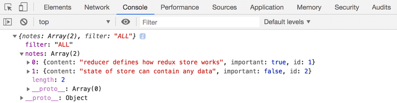

As we can see from the output, the store has the exact shape we wanted it to!

Let's take a closer look at how the combined reducer is created:

```js
const reducer = combineReducers({
  notes: noteReducer,
  filter: filterReducer,
})
```

The state of the store defined by the reducer above is an object with two properties: _notes_ and _filter_. The value of the _notes_ property is defined by the _noteReducer_, which does not have to deal with the other properties of the state. Likewise, the _filter_ property is managed by the _filterReducer_.

Before we make more changes to the code, let's take a look at how different actions change the state of the store defined by the combined reducer. Let's add the following to the _main.jsx_ file:

```js
import { createNote } from './reducers/noteReducer'
import { filterChange } from './reducers/filterReducer'
//...
store.subscribe(() => console.log(store.getState()))
store.dispatch(filterChange('IMPORTANT'))
store.dispatch(createNote('combineReducers forms one reducer from many simple reducers'))
```

By simulating the creation of a note and changing the state of the filter in this fashion, the state of the store gets logged to the console after every change that is made to the store:

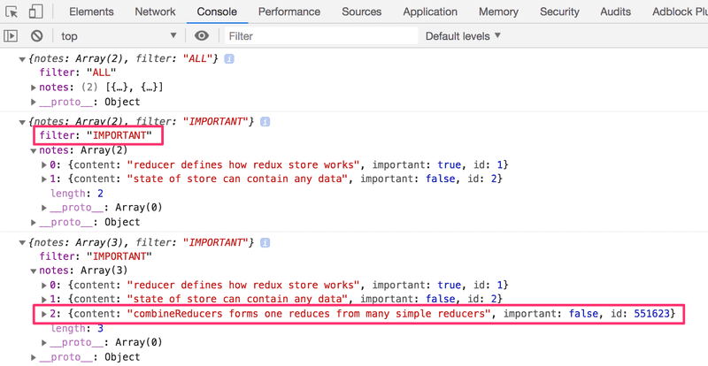

At this point, it is good to become aware of a tiny but important detail. If we add a console log statement to the beginning of both reducers:

```js
const filterReducer = (state = 'ALL', action) => {
  console.log('ACTION: ', action)
  // ...
}
```

Based on the console output one might get the impression that every action gets duplicated:

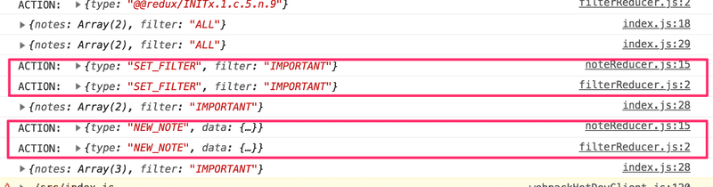

Is there a bug in our code? No. The combined reducer works in such a way that every _action_ gets handled in _every_ part of the combined reducer, or in other words, every reducer "listens" to all of the dispatched actions and does something with them if it has been instructed to do so. Typically only one reducer is interested in any given action, but there are situations where multiple reducers change their respective parts of the state based on the same action.

### Finishing the filtering 

Let's finish the application so that it uses the combined reducer. We start by changing the rendering of the application and hooking up the store to the application in the main.jsx file:

```js
ReactDOM.createRoot(document.getElementById('root')).render(
  <Provider store={store}>
    <App />
  </Provider>
)
```

Next, let's fix a bug that is caused by the code expecting the application store to be an array of notes:

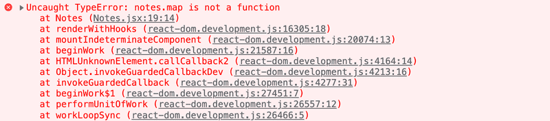

It's an easy fix. Because the notes are in the store's field notes, we only have to make a little change to the selector function:

```js
const Notes = () => {
  const dispatch = useDispatch()
  const notes = useSelector(state => state.notes)

  return(
    <ul>
      {notes.map(note =>
        <Note
          key={note.id}
          note={note}
          handleClick={() => 
            dispatch(toggleImportanceOf(note.id))
          }
        />
      )}
    </ul>
  )
}
```

Previously the selector function returned the whole state of the store:

```js
const notes = useSelector(state => state)
```

And now it returns only its fields _notes_

```js
const notes = useSelector(state => state.notes)
```

Let's extract the visibility filter into its own _src/components/VisibilityFilter.jsx_ component:

```js
import { filterChange } from '../reducers/filterReducer'
import { useDispatch } from 'react-redux'

const VisibilityFilter = (props) => {
  const dispatch = useDispatch()

  return (
    <div>
      all    
      <input 
        type="radio" 
        name="filter" 
        onChange={() => dispatch(filterChange('ALL'))}
      />
      important   
      <input
        type="radio"
        name="filter"
        onChange={() => dispatch(filterChange('IMPORTANT'))}
      />
      nonimportant 
      <input
        type="radio"
        name="filter"
        onChange={() => dispatch(filterChange('NONIMPORTANT'))}
      />
    </div>
  )
}

export default VisibilityFilter
```

With the new component, App can be simplified as follows:

```js
import Notes from './components/Notes'
import NewNote from './components/NewNote'
import VisibilityFilter from './components/VisibilityFilter'

const App = () => {
  return (
    <div>
      <NewNote />
      <VisibilityFilter />
      <Notes />
    </div>
  )
}

export default App
```

The implementation is rather straightforward. Clicking the different radio buttons changes the state of the store's _filter_ property.

Let's change the _Notes_ component to incorporate the filter:

```js
const Notes = () => {
  const dispatch = useDispatch()
  const notes = useSelector(state => {
    if ( state.filter === 'ALL' ) {
      return state.notes
    }
    return state.filter  === 'IMPORTANT' 
      ? state.notes.filter(note => note.important)
      : state.notes.filter(note => !note.important)
  })

  return(
    <ul>
      {notes.map(note =>
        <Note
          key={note.id}
          note={note}
          handleClick={() => 
            dispatch(toggleImportanceOf(note.id))
          }
        />
      )}
    </ul>
  )
}
```

We only make changes to the selector function, which used to be

```js
useSelector(state => state.notes)
```

Let's simplify the selector by destructuring the fields from the state it receives as a parameter:

```js
const notes = useSelector(({ filter, notes }) => {
  if ( filter === 'ALL' ) {
    return notes
  }
  return filter  === 'IMPORTANT' 
    ? notes.filter(note => note.important)
    : notes.filter(note => !note.important)
})
```

There is a slight cosmetic flaw in our application. Even though the filter is set to _ALL_ by default, the associated radio button is not selected. Naturally, this issue can be fixed, but since this is an unpleasant but ultimately harmless bug we will save the fix for later.

The current version of the application can be found on [GitHub](https://github.com/fullstack-hy2020/redux-notes/tree/part6-2), branch _part6-2_.

<hr style="border: 2px solid rgb(127, 103, 168)">

### Exercise 6.9

#### 6.9: Better Anecdote, step 7

Implement filtering for the anecdotes that are displayed to the user.

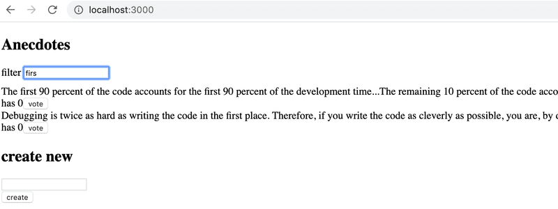

Store the state of the filter in the redux store. It is recommended to create a new reducer, action creators, and a combined reducer for the store using the _combineReducers_ function.

Create a new _Filter_ component for displaying the filter. You can use the following code as a template for the component:

```js
const Filter = () => {
  const handleChange = (event) => {
    // input-field value is in variable event.target.value
  }
  const style = {
    marginBottom: 10
  }

  return (
    <div style={style}>
      filter <input onChange={handleChange} />
    </div>
  )
}

export default Filter
```

### Redux Toolkit

As we have seen so far, Redux's configuration and state management implementation requires quite a lot of effort. This is manifested for example in the reducer and action creator-related code which has somewhat repetitive boilerplate code. [Redux Toolkit](https://redux-toolkit.js.org/) is a library that solves these common Redux-related problems. The library for example greatly simplifies the configuration of the Redux store and offers a large variety of tools to ease state management.

Let's start using Redux Toolkit in our application by refactoring the existing code. First, we will need to install the library:

```
npm install @reduxjs/toolkit
```

Next, open the _main.jsx_ file which currently creates the Redux store. Instead of Redux's `createStore` function, let's create the store using Redux Toolkit's [configureStore](https://redux-toolkit.js.org/api/configureStore) function:

```js
import ReactDOM from 'react-dom/client'
import { Provider } from 'react-redux'
import { configureStore } from '@reduxjs/toolkit'
import App from './App'

import noteReducer from './reducers/noteReducer'
import filterReducer from './reducers/filterReducer'

const store = configureStore({
  reducer: {
    notes: noteReducer,
    filter: filterReducer
  }
})

console.log(store.getState())

ReactDOM.createRoot(document.getElementById('root')).render(
  <Provider store={store}>
    <App />
  </Provider>
)
```

We already got rid of a few lines of code, now we don't need the `combineReducers` function to create the store's reducer. We will soon see that the `configureStore` function has many additional benefits such as the effortless integration of development tools and many commonly used libraries without the need for additional configuration.

Let's move on to refactoring the reducers, which brings forth the benefits of the Redux Toolkit. With Redux Toolkit, we can easily create reducer and related action creators using the [createSlice](https://redux-toolkit.js.org/api/createSlice) function. We can use the `createSlice` function to refactor the reducer and action creators in the _reducers/noteReducer_.js file in the following manner:

```js
import { createSlice } from '@reduxjs/toolkit'

const initialState = [
  {
    content: 'reducer defines how redux store works',
    important: true,
    id: 1,
  },
  {
    content: 'state of store can contain any data',
    important: false,
    id: 2,
  },
]

const generateId = () =>
  Number((Math.random() * 1000000).toFixed(0))

const noteSlice = createSlice({
  name: 'notes',
  initialState,
  reducers: {
     git(state, action) {
      const content = action.payload
      state.push({
        content,
        important: false,
        id: generateId(),
      })
    },
    toggleImportanceOf(state, action) {
      const id = action.payload
      const noteToChange = state.find(n => n.id === id)
      const changedNote = { 
        ...noteToChange, 
        important: !noteToChange.important 
      }
      return state.map(note =>
        note.id !== id ? note : changedNote 
      )     
    }
  },
})
```

The `createSlice` function's `name` parameter defines the prefix which is used in the action's type values. For example, the `createNote` action defined later will have the type value of `notes/createNote`. It is a good practice to give the parameter a value which is unique among the reducers. This way there won't be unexpected collisions between the application's action type values. The `initialState` parameter defines the reducer's initial state. The `reducers` parameter takes the reducer itself as an object, of which functions handle state changes caused by certain actions. Note that the `action.payload` in the function contains the argument provided by calling the action creator:

```js
dispatch(createNote('Redux Toolkit is awesome!'))
```

This dispatch call is equivalent to dispatching the following object:

```js
dispatch({ type: 'notes/createNote', payload: 'Redux Toolkit is awesome!' })
```

If you followed closely, you might have noticed that inside the `createNote` action, there seems to happen something that violates the reducers' immutability principle mentioned earlier:

```js
createNote(state, action) {
  const content = action.payload

  state.push({
    content,
    important: false,
    id: generateId(),
  })
}
```

We are mutating `state` argument's array by calling the push method instead of returning a new instance of the array. What's this all about?

Redux Toolkit utilizes the [Immer](https://immerjs.github.io/immer/) library with reducers created by `createSlice` function, which makes it possible to mutate the `state` argument inside the reducer. Immer uses the mutated state to produce a new, immutable state and thus the state changes remain immutable. Note that `state` can be changed without "mutating" it, as we have done with the `toggleImportanceOf` action. In this case, the function directly _returns_ the new state. Nevertheless mutating the state will often come in handy especially when a complex state needs to be updated.

The `createSlice` function returns an object containing the reducer as well as the action creators defined by the reducers parameter. The `reducer` can be accessed by the `noteSlice.reducer` property, whereas the action creators by the `noteSlice.actions` property. We can produce the file's exports in the following way:

```js
const noteSlice = createSlice(/* ... */)

export const { createNote, toggleImportanceOf } = noteSlice.actions
export default noteSlice.reducer
```

The imports in other files will work just as they did before:

```js
import noteReducer, { createNote, toggleImportanceOf } from './reducers/noteReducer'
```

We need ot alter the action type names in tests doe to the conventions of ReduxToolkit:

```js
import noteReducer from './noteReducer'
import deepFreeze from 'deep-freeze'

describe('noteReducer', () => {
  test('returns new state with action notes/createNote', () => {
    const state = []
    const action = {
      type: 'notes/createNote',
      payload: 'the app state is in redux store',
    }

    deepFreeze(state)
    const newState = noteReducer(state, action)

    expect(newState).toHaveLength(1)
    expect(newState.map(s => s.content)).toContainEqual(action.payload)
  })

  test('returns new state with action notes/toggleImportanceOf', () => {
    const state = [
      {
        content: 'the app state is in redux store',
        important: true,
        id: 1
      },
      {
        content: 'state changes are made with actions',
        important: false,
        id: 2
      }]
  
    const action = {
      type: 'notes/toggleImportanceOf',
      payload: 2
    }
  
    deepFreeze(state)
    const newState = noteReducer(state, action)
  
    expect(newState).toHaveLength(2)
  
    expect(newState).toContainEqual(state[0])
  
    expect(newState).toContainEqual({
      content: 'state changes are made with actions',
      important: true,
      id: 2
    })
  })
})
```

### Redux Toolkit and console.log()

As we have learned, console.log is an extremely powerful tool; it often saves us from trouble.

Let's try to print the state of the Redux Store to the console in the middle of the reducer created with the function createSlice:

```js
const noteSlice = createSlice({
  name: 'notes',
  initialState,
  reducers: {
    // ...
    toggleImportanceOf(state, action) {
      const id = action.payload

      const noteToChange = state.find(n => n.id === id)

      const changedNote = { 
        ...noteToChange, 
        important: !noteToChange.important 
      }

      console.log(state)

      return state.map(note =>
        note.id !== id ? note : changedNote 
      )     
    }
  },
})
```

The following is printed to the console

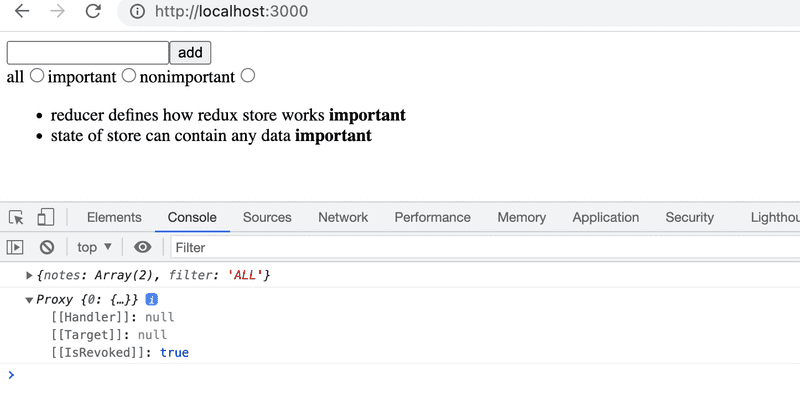

The output is interesting but not very useful. This is about the previously mentioned Immer library used by the Redux Toolkit internally to save the state of the Store.

The status can be converted to a human-readable format by using the [current](https://redux-toolkit.js.org/api/other-exports#current) function from the immer library.

Let's update the imports to include the "current" function from the immer library:

```js
import { createSlice, current } from '@reduxjs/toolkit'
```

Then we update the console.log function call:

```js
console.log(current(state))
```

Console output is now human readable

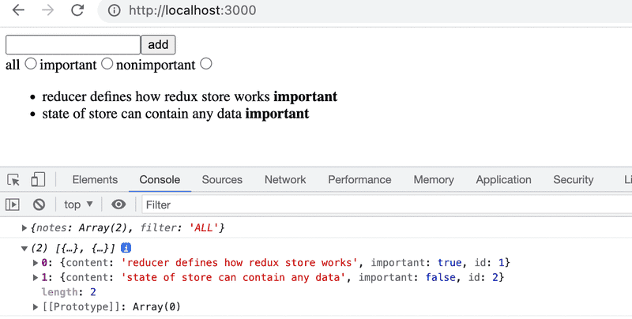

### Redux DevTools

[Redux DevTools](https://chrome.google.com/webstore/detail/redux-devtools/lmhkpmbekcpmknklioeibfkpmmfibljd) is a Chrome addon that offers useful development tools for Redux. It can be used for example to inspect the Redux store's state and dispatch actions through the browser's console. When the store is created using Redux Toolkit's `configureStore` function, no additional configuration is needed for Redux DevTools to work.

Once the addon is installed, clicking the _Redux_ tab in the browser's developer tools, the Redux DevTools should open:

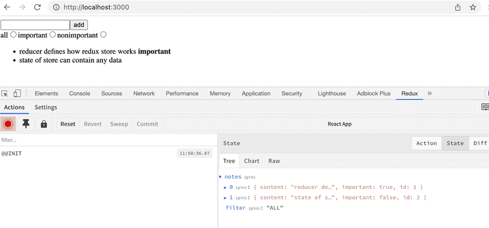

You can inspect how dispatching a certain action changes the state by clicking the action:

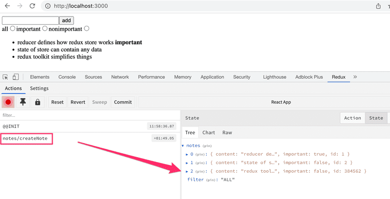

It is also possible to dispatch actions to the store using the development tools:


You can find the code for our current application in its entirety in the _part6-3_ branch of this [GitHub repository](https://github.com/fullstack-hy2020/redux-notes/tree/part6-3).

<hr style="border: 2px solid rgb(127, 103, 168)">

### Exercises 6.10 - 6.13

Let's continue working on the anecdote application using Redux that we started in exercise 6.3.

#### 6.10 Better Anecdotes, step 8

Install Redux Toolkit for the project. Move the Redux store creation into the file _store.js_ and use Redux Toolkit's `configureStore` to create the store.

Change the definition of the _filter reducer and action creators_ to use the Redux Toolkit's `createSlice` function.

Also, start using Redux DevTools to debug the application's state easier.

#### 6.11 Better Anecdotes, step 9

Change also the definition of the _anecdote reducer ad action creators_ to use the Redux Toolkit's `createSlice` function. 

Implementation note: when you use the Redux Toolkit to return the initial state of anecdotes, it will be immutable, so you will need to make a copy of it to sort the anecdotes, or you will encounter the error "TypeError: Cannot assign to read only property". You can use the spread syntax to make a copy of the array. Instead of:

```js
anecdotes.sort()
```

Write:

```js
[...anecdotes].sort()
```

#### 6.12 Better Anecdotes, step 10

The application has a ready-made body for the _Notification_ component:

```js
const Notification = () => {
  const style = {
    border: 'solid',
    padding: 10,
    borderWidth: 1
  }
  return (
    <div style={style}>
      render here notification...
    </div>
  )
}

export default Notification
```

Extend the component so that it renders the message stored in the Redux store, making the component take the following form:

```js
import { useSelector } from 'react-redux'

const Notification = () => {

  const notification = useSelector(/* something here */)
  const style = {
    border: 'solid',
    padding: 10,
    borderWidth: 1
  }
  return (
    <div style={style}>

      {notification}
    </div>
  )
}
```

You will have to make changes to the application's existing reducer. Create a separate reducer for the new functionality by using the Redux Toolkit's `createSlice` function.

The application does not have to use the _Notification_ component intelligently at this point in the exercises. It is enough for the application to display the initial value set for the message in the _notificationReducer_.

#### 6.13 Better Anecdotes, step 11

Extend the application so that it uses the _Notification_ component to display a message for five seconds when the user votes for an anecdote or creates a new anecdote:

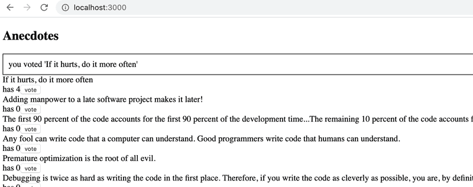

It's recommended to create separate action creators for setting and removing notifications.

<hr style="border: 2px solid rgb(127, 103, 168)">

## Part 6c - Communicating with server in a Redux application

Let's expand the application so that the notes are stored in the backend. We'll use [json-server](../part2/README.md#2c---getting-data-from-server), familiar from part 2.

The initial state of the database is stored in the file _db.json_, which is placed in the root of the project:

```js
{
  "notes": [
    {
      "content": "the app state is in redux store",
      "important": true,
      "id": 1
    },
    {
      "content": "state changes are made with actions",
      "important": false,
      "id": 2
    }
  ]
}
```

We'll install json-server for the project:

```
npm install json-server --save-dev
```

and add the following line to the scripts part of the file package.json

```json
"scripts": {
  "server": "json-server -p3001 --watch db.json",
  // ...
}
```

Add let's launch json-server with the command `npm run server`.

### Getting data from the backend

Next, we'll create a method into the file _services/notes.js_, which uses _axios_ to fetch data from the backend

```js
import axios from 'axios'

const baseUrl = 'http://localhost:3001/notes'

const getAll = async () => {
  const response = await axios.get(baseUrl)
  return response.data
}

export default { getAll }
```

We'll add axios to the project

```
npm install axios
```

We'll change the initialization of the state in _noteReducer_, so that by default there are no notes:

```js
const noteSlice = createSlice({
  name: 'notes',

  initialState: [],
  // ...
})
```

Let's also add a new action `appendNote` for adding a note object:

```js
const noteSlice = createSlice({
  name: 'notes',
  initialState: [],
  reducers: {
    createNote(state, action) {
      const content = action.payload

      state.push({
        content,
        important: false,
        id: generateId(),
      })
    },
    toggleImportanceOf(state, action) {
      const id = action.payload

      const noteToChange = state.find(n => n.id === id)

      const changedNote = { 
        ...noteToChange, 
        important: !noteToChange.important 
      }

      return state.map(note =>
        note.id !== id ? note : changedNote 
      )     
    },
    appendNote(state, action) {
      state.push(action.payload)
    }
  },
})

export const { createNote, toggleImportanceOf, appendNote } = noteSlice.actions

export default noteSlice.reducer
```

A quick way to initialize the notes state based on the data received from the server is to fetch the notes in the _main.jsx_ file and dispatch an action using the `appendNote` action creator for each individual note object:

```js
// ...

import noteService from './services/notes'
import noteReducer, { appendNote } from './reducers/noteReducer'

const store = configureStore({
  reducer: {
    notes: noteReducer,
    filter: filterReducer,
  }
})

noteService.getAll().then(notes =>
  notes.forEach(note => {
    store.dispatch(appendNote(note))
  })
)

// ...
```

Dispatching multiple actions seems a bit impractical. Let's add an action creator `setNotes` which can be used to directly replace the notes array. We'll get the action creator from the `createSlice` function by implementing the `setNotes` action:

```js
// ...

const noteSlice = createSlice({
  name: 'notes',
  initialState: [],
  reducers: {
    createNote(state, action) {
      const content = action.payload

      state.push({
        content,
        important: false,
        id: generateId(),
      })
    },
    toggleImportanceOf(state, action) {
      const id = action.payload

      const noteToChange = state.find(n => n.id === id)

      const changedNote = { 
        ...noteToChange, 
        important: !noteToChange.important 
      }

      return state.map(note =>
        note.id !== id ? note : changedNote 
      )     
    },
    appendNote(state, action) {
      state.push(action.payload)
    },
    setNotes(state, action) {
      return action.payload
    }
  },
})

export const { createNote, toggleImportanceOf, appendNote, setNotes } = noteSlice.actions

export default noteSlice.reducer
```

Now, the code in the _main.jsx_ file looks a lot better:

```js
// ...
import noteService from './services/notes'
import noteReducer, { setNotes } from './reducers/noteReducer'

const store = configureStore({
  reducer: {
    notes: noteReducer,
    filter: filterReducer,
  }
})

noteService.getAll().then(notes =>
  store.dispatch(setNotes(notes))
)
```

> __NB__: Why didn't we use await in place of promises and event handlers (registered to `then`-methods)?
>
> Await only works inside _async_ functions, and the code in _main.jsx_ is not inside a function, so due to the simple nature of the operation, we'll abstain from using _async_ this time.

We do, however, decide to move the initialization of the notes into the _App_ component, and, as usual, when fetching data from a server, we'll use the _effect hook_.

```js
import { useEffect } from 'react'
import NewNote from './components/NewNote'
import Notes from './components/Notes'
import VisibilityFilter from './components/VisibilityFilter'
import noteService from './services/notes'
import { setNotes } from './reducers/noteReducer'
import { useDispatch } from 'react-redux'

const App = () => {
  const dispatch = useDispatch()
  useEffect(() => {
    noteService
      .getAll().then(notes => dispatch(setNotes(notes)))
  }, [])

  return (
    <div>
      <NewNote />
      <VisibilityFilter />
      <Notes />
    </div>
  )
}

export default App
```

### Sending data to the backend

We can do the same thing when it comes to creating a new note. Let's expand the code communicating with the server as follows:

```js
const baseUrl = 'http://localhost:3001/notes'

const getAll = async () => {
  const response = await axios.get(baseUrl)
  return response.data
}

const createNew = async (content) => {
  const object = { content, important: false }
  const response = await axios.post(baseUrl, object)
  return response.data
}

export default {
  getAll,
  createNew,
}
```

The method addNote of the component `NewNote` changes slightly:

```js
import { useDispatch } from 'react-redux'
import { createNote } from '../reducers/noteReducer'

import noteService from '../services/notes'

const NewNote = (props) => {
  const dispatch = useDispatch()
  

  const addNote = async (event) => {
    event.preventDefault()
    const content = event.target.note.value
    event.target.note.value = ''

    const newNote = await noteService.createNew(content)
    dispatch(createNote(newNote))
  }

  return (
    <form onSubmit={addNote}>
      <input name="note" />
      <button type="submit">add</button>
    </form>
  )
}

export default NewNote
```

Because the backend generates ids for the notes, we'll change the action creator `createNote` in the file `noteReducer.js` accordingly:

```js
const noteSlice = createSlice({
  name: 'notes',
  initialState: [],
  reducers: {
    createNote(state, action) {
      state.push(action.payload)
    },
    // ..
  },
})
```

Changing the importance of notes could be implemented using the same principle, by making an asynchronous method call to the server and then dispatching an appropriate action.

The current state of the code for the application can be found on [GitHub](https://github.com/fullstack-hy2020/redux-notes/tree/part6-3) in the branch _part6-3_.

<hr style="border: 2px solid rgb(127, 103, 168)">

### Exercises 6.14 - 6.15

#### 6.14 Anecdotes and the Backend, step 1

When the application launches, fetch the anecdotes from the backend implemented using json-server.

As the initial backend data, you can use, e.g. [this](https://github.com/fullstack-hy2020/misc/blob/master/anecdotes.json).

#### 6.15 Anecdotes and the Backend, step 2

Modify the creation of new anecdotes, so that the anecdotes are stored in the backend.

<hr style="border: 2px solid rgb(127, 103, 168)">

### Asynchronous actions and Redux Thunk

Our approach is quite good, but it is not great that the communication with the server happens inside the functions of the components. It would be better if the communication could be abstracted away from the components so that they don't have to do anything else but call the appropriate _action creator_. As an example, _App_ would initialize the state of the application as follows:

```js
const App = () => {
  const dispatch = useDispatch()

  useEffect(() => {
    dispatch(initializeNotes())  
  }, []) 

  // ...
}
```

and _NewNote_ would create a new note as follows:

```js
const NewNote = () => {
  const dispatch = useDispatch()
  
  const addNote = async (event) => {
    event.preventDefault()
    const content = event.target.note.value
    event.target.note.value = ''
    dispatch(createNote(content))
  }

  // ...
}
```

In this implementation, both components would dispatch an action without the need to know about the communication with the server that happens behind the scenes. These kinds of _async actions_ can be implemented using the [Redux Thunk](https://github.com/reduxjs/redux-thunk) library. The use of the library doesn't need any additional configuration or even installation when the Redux store is created using the Redux Toolkit's `configureStore` function.

With Redux Thunk it is possible to implement _action creators_ which return a function instead of an object. The function receives Redux store's `dispatch` and `getState` methods as parameters. This allows for example implementations of asynchronous action creators, which first wait for the completion of a certain asynchronous operation and after that dispatch some action, which changes the store's state.

We can define an action creator `initializeNotes` which initializes the notes based on the data received from the server:

```js
// ...
import noteService from '../services/notes'

const noteSlice = createSlice(/* ... */)

export const { createNote, toggleImportanceOf, setNotes, appendNote } = noteSlice.actions

export const initializeNotes = () => {
  return async dispatch => {
    const notes = await noteService.getAll()
    dispatch(setNotes(notes))
  }
}

export default noteSlice.reducer
```

In the inner function, meaning the _asynchronous action_, the operation first fetches all the notes from the server and then _dispatches_ the `setNotes` action, which adds them to the store.

The component _App_ can now be defined as follows:

```js
// ...
import { initializeNotes } from './reducers/noteReducer'

const App = () => {
  const dispatch = useDispatch()

  useEffect(() => {
    dispatch(initializeNotes()) 
  }, []) 

  return (
    <div>
      <NewNote />
      <VisibilityFilter />
      <Notes />
    </div>
  )
}
```

The solution is elegant. The initialization logic for the notes has been completely separated from the React component.

Next, let's replace the `createNote` action creator created by the `createSlice` function with an asynchronous action creator:

```js
// ...
import noteService from '../services/notes'

const noteSlice = createSlice({
  name: 'notes',
  initialState: [],
  reducers: {
    toggleImportanceOf(state, action) {
      const id = action.payload

      const noteToChange = state.find(n => n.id === id)

      const changedNote = { 
        ...noteToChange, 
        important: !noteToChange.important 
      }

      return state.map(note =>
        note.id !== id ? note : changedNote 
      )     
    },
    appendNote(state, action) {
      state.push(action.payload)
    },
    setNotes(state, action) {
      return action.payload
    }
    // createNote definition removed from here!
  },
})

export const { toggleImportanceOf, appendNote, setNotes } = noteSlice.actions

export const initializeNotes = () => {
  return async dispatch => {
    const notes = await noteService.getAll()
    dispatch(setNotes(notes))
  }
}

export const createNote = content => {
  return async dispatch => {
    const newNote = await noteService.createNew(content)
    dispatch(appendNote(newNote))
  }
}

export default noteSlice.reducer
```

The principle here is the same: first, an asynchronous operation is executed, after which the action changing the state of the store is _dispatched_.

The component _NewNote_ changes as follows:

```js
// ...
import { createNote } from '../reducers/noteReducer'

const NewNote = () => {
  const dispatch = useDispatch()
  
  const addNote = async (event) => {
    event.preventDefault()
    const content = event.target.note.value
    event.target.note.value = ''

    dispatch(createNote(content))
  }

  return (
    <form onSubmit={addNote}>
      <input name="note" />
      <button type="submit">add</button>
    </form>
  )
}
```

Finally, let's clean up the _main.jsx_ file a bit by moving the code related to the creation of the Redux store into its own, _store.js_ file:

```js
import { configureStore } from '@reduxjs/toolkit'

import noteReducer from './reducers/noteReducer'
import filterReducer from './reducers/filterReducer'

const store = configureStore({
  reducer: {
    notes: noteReducer,
    filter: filterReducer
  }
})

export default store
```

After the changes, the content of the _main.jsx_ is the following:

```js
import React from 'react'
import ReactDOM from 'react-dom/client'
import { Provider } from 'react-redux' 
import store from './store'
import App from './App'

ReactDOM.createRoot(document.getElementById('root')).render(
  <Provider store={store}>
    <App />
  </Provider>
)
```

The current state of the code for the application can be found on [GitHub](https://github.com/fullstack-hy2020/redux-notes/tree/part6-5) in the branch _part6-5_.

Redux Toolkit offers a multitude of tools to simplify asynchronous state management. Suitable tools for this use case are for example the [createAsyncThunk](https://redux-toolkit.js.org/api/createAsyncThunk) function and the [RTK Query](https://redux-toolkit.js.org/rtk-query/overview) API.

<hr style="border: 2px solid rgb(127, 103, 168)">

### Exercises 6.16 - 6.19

#### 6.16 Anecdotes and the Backend, step 3

Modify the initialization of the Redux store to happen using asynchronous action creators, which are made possible by the Redux Thunk library.

#### 6.17 Anecdotes and the Backend, step 4

Also modify the creation of a new anecdote to happen using asynchronous action creators, made possible by the Redux Thunk library.

#### 6.18 Anecdotes and the Backend, step 5

Voting does not yet save changes to the backend. Fix the situation with the help of the Redux Thunk library.

#### 6.19 Anecdotes and the Backend, step 6

The creation of notifications is still a bit tedious since one has to do two actions and use the `setTimeout` function:

```js
dispatch(setNotification(`new anecdote '${content}'`))
setTimeout(() => {
  dispatch(clearNotification())
}, 5000)
```

Make an action creator, which enables one to provide the notification as follows:

```js
dispatch(setNotification(`you voted '${anecdote.content}'`, 10))
```

The first parameter is the text to be rendered and the second parameter is the time to display the notification given in seconds.

Implement the use of this improved notification in your application.

<hr style="border: 2px solid rgb(127, 103, 168)">

## Part 6d - React Query, useReducer and the context

At the end of this part, we will look at a few more different ways to manage the state of an application.

Let's continue with the note application. We will focus on communication with the server. Let's start the application from scratch. The first version is as follows:

```js
const App = () => {
  const addNote = async (event) => {
    event.preventDefault()
    const content = event.target.note.value
    event.target.note.value = ''
    console.log(content)
  }

  const toggleImportance = (note) => {
    console.log('toggle importance of', note.id)
  }

  const notes = []

  return(
    <div>
      <h2>Notes app</h2>
      <form onSubmit={addNote}>
        <input name="note" />
        <button type="submit">add</button>
      </form>
      {notes.map(note =>
        <li key={note.id} onClick={() => toggleImportance(note)}>
          {note.content} 
          <strong> {note.important ? 'important' : ''}</strong>
        </li>
      )}
    </div>
  )
}

export default App
```

The initial code is on GitHub in this [repository](https://github.com/fullstack-hy2020/query-notes/tree/part6-0), in the branch _part6-0_.

__Note__: By default, cloning the repo will only give you the main branch. To get the initial code from the part6-0 branch, use the following command:

```
git clone --branch part6-0 https://github.com/fullstack-hy2020/query-notes.git
```

### Managing data on the server with the React Query library

We shall now use the [React Query](https://tanstack.com/query/latest) library to store and manage data retrieved from the server. The latest version of the library is also called TanStack Query, but we stick to the familiar name.

Install the library with the command

```
npm install @tanstack/react-query
```

A few additions to the file _main.jsx_ are needed to pass the library functions to the entire application:

```js
import React from 'react'
import ReactDOM from 'react-dom/client'
import { QueryClient, QueryClientProvider } from '@tanstack/react-query'

import App from './App'

const queryClient = new QueryClient()

ReactDOM.createRoot(document.getElementById('root')).render(
  <QueryClientProvider client={queryClient}>
    <App />
  </QueryClientProvider>
)
```

We can now retrieve the notes in the _App_ component. The code expands as follows:

```js
import { useQuery } from '@tanstack/react-query'
import axios from 'axios'

const App = () => {
  // ...

  const result = useQuery({
    queryKey: ['notes'],
    queryFn: () => axios.get('http://localhost:3001/notes').then(res => res.data)
  })
  console.log(JSON.parse(JSON.stringify(result)))

  if ( result.isLoading ) {
    return <div>loading data...</div>
  }

  const notes = result.data

  return (
    // ...
  )
}
```

Retrieving data from the server is still done in a familiar way with the Axios _get_ method. However, the Axios method call is now wrapped in a [query](https://tanstack.com/query/latest/docs/react/guides/queries) formed with the [useQuery](https://tanstack.com/query/latest/docs/react/reference/useQuery) function. The first parameter of the function call is a string _notes_ which acts as a [key](https://tanstack.com/query/latest/docs/react/guides/query-keys) to the query defined, i.e. the list of notes.

The return value of the _useQuery_ function is an object that indicates the status of the query. The output to the console illustrates the situation:

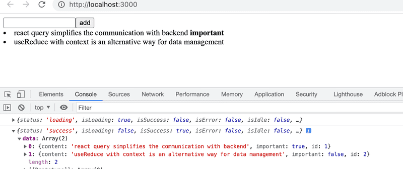

That is, the first time the component is rendered, the query is still in _loading_ state, i.e. the associated HTTP request is pending. At this stage, only the following is rendered:

```js
<div>loading data...</div>
```

However, the HTTP request is completed so quickly that not even Max Verstappen would be able to see the text. When the request is completed, the component is rendered again. The query is in the state _success_ on the second rendering, and the field _data_ of the query object contains the data returned by the request, i.e. the list of notes that is rendered on the screen.

So the application retrieves data from the server and renders it on the screen without using the React hooks _useState_ and _useEffect_ used in chapters 2-5 at all. The data on the server is now entirely under the administration of the React Query library, and the application does not need the state defined with React's _useState_ hook at all!

Let's move the function making the actual HTTP request to its own file _requests.js_.

```js
import axios from 'axios'

export const getNotes = () =>
  axios.get('http://localhost:3001/notes').then(res => res.data)
```

The App component is now slightly simplified

```js
import { useQuery } from '@tanstack/react-query'
import { getNotes } from './requests'

const App = () => {
  // ...

  const result = useQuery({
    queryKey: ['notes'],
    queryFn: getNotes
  })

  // ...
}
```

The current code for the application is in [GitHub](https://github.com/fullstack-hy2020/query-notes/tree/part6-1) in the branch _part6-1_ (part-6.6).

### Synchronizing data to the server using React Query

Data is already successfully retrieved from the server. Next, we will make sure that the added and modified data is stored on the server. Let's start by adding new notes.

Let's make a function _createNote_ to the file _requests.js_ for saving new notes:

```js
import axios from 'axios'

const baseUrl = 'http://localhost:3001/notes'

export const getNotes = () =>
  axios.get(baseUrl).then(res => res.data)

export const createNote = newNote =>
  axios.post(baseUrl, newNote).then(res => res.data)
```

The _App_ component will change as follows

```js
import { useQuery, useMutation } from '@tanstack/react-query'
import { getNotes, createNote } from './requests'

const App = () => {
 const newNoteMutation = useMutation({ mutationFn: createNote })

  const addNote = async (event) => {
    event.preventDefault()
    const content = event.target.note.value
    event.target.note.value = ''
    newNoteMutation.mutate({ content, important: true })
  }

  // 

}
```

To create a new note, a [mutation](https://tanstack.com/query/latest/docs/react/guides/mutations) is defined using the function [useMutation](https://tanstack.com/query/latest/docs/react/reference/useMutation):

```js
const newNoteMutation = useMutation({ mutationFn: createNote })
```

The parameter is the function we added to the file _requests.js_, which uses Axios to send a new note to the server.

The event handler _addNote_ performs the mutation by calling the mutation object's function _mutate_ and passing the new note as an argument:

```js
newNoteMutation.mutate({ content, important: true })
```

Our solution is good. Except it doesn't work. The new note is saved on the server, but it is not updated on the screen.

In order to render a new note as well, we need to tell React Query that the old result of the query whose key is the string _notes_ should be [invalidated](https://tanstack.com/query/latest/docs/react/guides/invalidations-from-mutations).

Fortunately, invalidation is easy, it can be done by defining the appropriate _onSuccess_ callback function to the mutation:

```js
import { useQuery, useMutation, useQueryClient } from '@tanstack/react-query'
import { getNotes, createNote } from './requests'

const App = () => {
  const queryClient = useQueryClient()

  const newNoteMutation = useMutation({
    mutationFn: createNote, 
    onSuccess: () => {
      queryClient.invalidateQueries({ queryKey: ['notes'] })
    },
  })

  // ...
}
```

Now that the mutation has been successfully executed, a function call is made to

```js
queryClient.invalidateQueries({ queryKey: ['notes'] })
```

This in turn causes React Query to automatically update a query with the key _notes_, i.e. fetch the notes from the server. As a result, the application renders the up-to-date state on the server, i.e. the added note is also rendered.

Let us also implement the change in the importance of notes. A function for updating notes is added to the file _requests.js_:

```js
export const updateNote = updatedNote =>
  axios.put(`${baseUrl}/${updatedNote.id}`, updatedNote).then(res => res.data)
```

Updating the note is also done by mutation. The _App_ component expands as follows:

```js
import { useQuery, useMutation, useQueryClient } from '@tanstack/react-query' 
import { getNotes, createNote, updateNote } from './requests'

const App = () => {
  // ...

  const updateNoteMutation = useMutation({
    mutationFn: updateNote,
    onSuccess: () => {
      queryClient.invalidateQueries({ queryKey: ['notes'] })
    },
  })
  const toggleImportance = (note) => {
    updateNoteMutation.mutate({...note, important: !note.important })
  }

  // ...
}
```

So again, a mutation was created that invalidated the query _notes_ so that the updated note is rendered correctly. Using mutations is easy, the method _mutate_ receives a note as a parameter, the importance of which is been changed to the negation of the old value.

The current code for the application is on [GitHub](https://github.com/fullstack-hy2020/query-notes/tree/part6-2) in the branch _part6-2_ (part-6.6).

### Optimizing the performance

The application works well, and the code is relatively simple. The ease of making changes to the list of notes is particularly surprising. For example, when we change the importance of a note, invalidating the query _notes_ is enough for the application data to be updated:

```js
  const updateNoteMutation = useMutation({
    mutationFn: updateNote,
    onSuccess: () => {
      queryClient.invalidateQueries('notes')
    },
  })
```

The consequence of this, of course, is that after the PUT request that causes the note change, the application makes a new GET request to retrieve the query data from the server:


If the amount of data retrieved by the application is not large, it doesn't really matter. After all, from a browser-side functionality point of view, making an extra HTTP GET request doesn't really matter, but in some situations it might put a strain on the server.

If necessary, it is also possible to optimize performance [by manually updating](https://tanstack.com/query/latest/docs/react/guides/updates-from-mutation-responses) the query state maintained by React Query.

The change for the mutation adding a new note is as follows:

```js
const App = () => {
  const queryClient =  useQueryClient() 

  const newNoteMutation = useMutation({
    mutationFn: createNote,
    onSuccess: (newNote) => {
      const notes = queryClient.getQueryData(['notes'])
      queryClient.setQueryData(['notes'], notes.concat(newNote))
    }
  })
  // ...
}
```

That is, in the _onSuccess_ callback, the _queryClient_ object first reads the existing _notes_ state of the query and updates it by adding a new note, which is obtained as a parameter of the callback function. The value of the parameter is the value returned by the function _createNote_, defined in the file _requests.js_ as follows:

```js
export const createNote = newNote =>
  axios.post(baseUrl, newNote).then(res => res.data)
```

It would be relatively easy to make a similar change to a mutation that changes the importance of the note, but we leave it as an optional exercise.

If we closely follow the browser's network tab, we notice that React Query retrieves all notes as soon as we move the cursor to the input field:

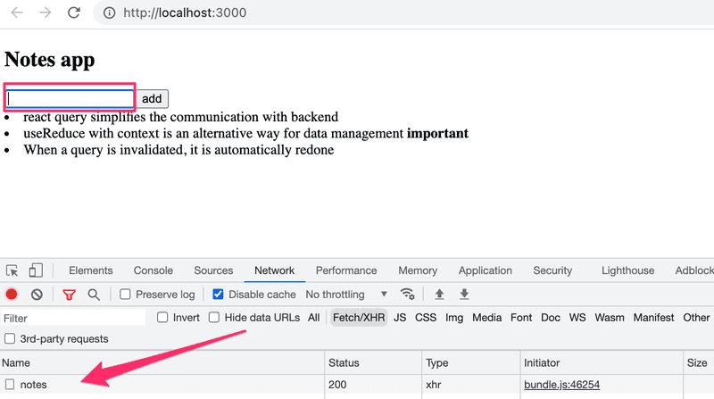

What is going on? By reading the [documentation](https://tanstack.com/query/latest/docs/react/reference/useQuery), we notice that the default functionality of React Query's queries is that the queries (whose status is _stale_) are updated when _window focus_, i.e. the active element of the application's user interface, changes. If we want, we can turn off the functionality by creating a query as follows:

```js
const App = () => {
  // ...
  const result = useQuery({
    queryKey: ['notes'],
    queryFn: getNotes,
    refetchOnWindowFocus: false
  })

  // ...
}
```

If you put a console.log statement to the code, you can see from browser console how often React Query causes the application to be re-rendered. The rule of thumb is that rerendering happens at least whenever there is a need for it, i.e. when the state of the query changes. You can read more about it e.g. [here](https://tkdodo.eu/blog/react-query-render-optimizations).

The code for the application is in [GitHub](https://github.com/fullstack-hy2020/query-notes/tree/part6-3) in the branch _part6-3_ (_part-6.6_).

React Query is a versatile library that, based on what we have already seen, simplifies the application. Does React Query make more complex state management solutions such as Redux unnecessary? No. React Query can partially replace the state of the application in some cases, but as the [documentation](https://tanstack.com/query/latest/docs/react/guides/does-this-replace-client-state) states

- React Query is a _server-state library_, responsible for managing asynchronous operations between your server and client

- Redux, etc. are _client-state libraries_ that can be used to store asynchronous data, albeit inefficiently when compared to a tool like React Query

So React Query is a library that maintains the _server state_ in the frontend, i.e. acts as a cache for what is stored on the server. React Query simplifies the processing of data on the server, and can in some cases eliminate the need for data on the server to be saved in the frontend state.

Most React applications need not only a way to temporarily store the served data, but also some solution for how the rest of the frontend state (e.g. the state of forms or notifications) is handled.

<hr style="border: 2px solid rgb(127, 103, 168)">

### Exercises 6.20 - 6.22

Now let's make a new version of the anecdote application that uses the React Query library. Take [this project](https://github.com/fullstack-hy2020/query-anecdotes) as your starting point. The project has a ready-installed JSON Server, the operation of which has been slightly modified (Review the `server.js` file for more details. Make sure you're connecting to the correct `PORT`). Start the server with _npm run server_.

#### Exercise 6.20

Implement retrieving anecdotes from the server using React Query.

The application should work in such a way that if there are problems communicating with the server, only an error page will be displayed:

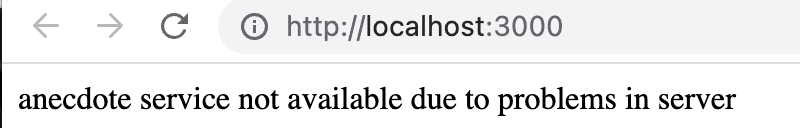

You can find [here](https://tanstack.com/query/latest/docs/react/guides/queries) info how to detect the possible errors.

You can simulate a problem with the server by e.g. turning off the JSON Server. Please note that in a problem situation, the query is first in the state _isLoading_ for a while, because if a request fails, React Query tries the request a few times before it states that the request is not successful. You can optionally specify that no retries are made:

```js
const result = useQuery(
  {
    queryKey: ['anecdotes'],
    queryFn: getAnecdotes,
    retry: false
  }
)
```

or that the request is retried e.g. only once:

```js
const result = useQuery(
  {
    queryKey: ['anecdotes'],
    queryFn: getAnecdotes,
    retry: 1
  }
)
```