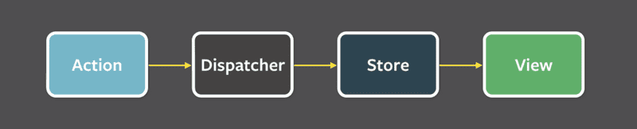
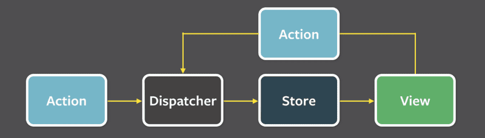
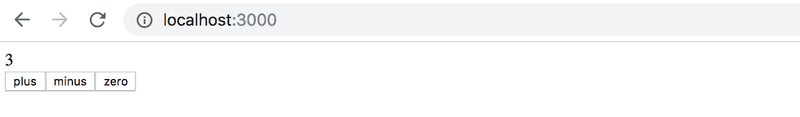
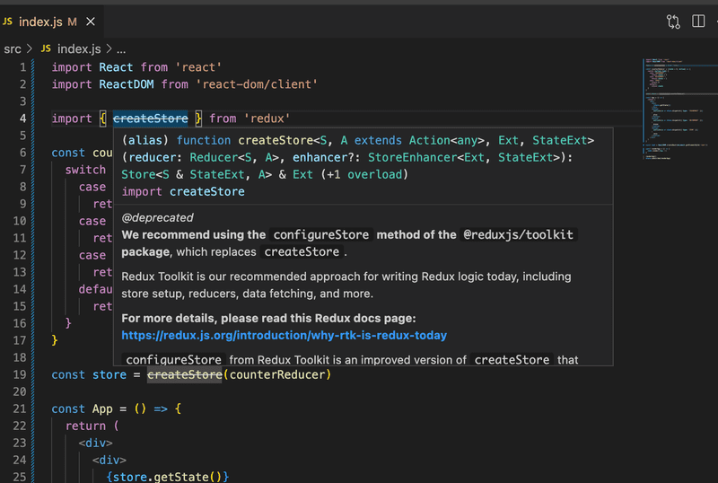

So far, we have placed the application's state and state logic directly inside React components. When applications grow larger, state management should be moved outside React components. In this part, we will introduce the Redux library, which is currently the most popular solution for managing the state of React applications.

We'll learn about the lightweight version of Redux directly supported by React, namely the React context and useReducer hook, as well as the React Query library that simplifies the server state management.

# Table of Contents

# Part 6

## Part 6a - Flux-architecture and Redux

So far, we have followed the state management conventions recommended by React. We have placed the state and the functions for handling it in the [higher level](https://react.dev/learn/sharing-state-between-components) of the component structure of the application. Quite often most of the app state and state altering functions reside directly in the root component. The state and its handler methods have then been passed to other components with props. This works up to a certain point, but when applications grow larger, state management becomes challenging.

### Flux-architecture

Already years ago Facebook developed the [Flux](https://facebookarchive.github.io/flux/docs/in-depth-overview)-architecture to make state management of React apps easier. In Flux, the state is separated from the React components and into its own _stores_. State in the store is not changed directly, but with different _actions_.

When an action changes the state of the store, the views are rerendered:



If some action on the application, for example pushing a button, causes the need to change the state, the change is made with an action. This causes re-rendering the view again:



Flux offers a standard way for how and where the application's state is kept and how it is modified.

### Redux

Facebook has an implementation for Flux, but we will be using the [Redux](https://redux.js.org/) library. It works with the same principle but is a bit simpler. Facebook also uses Redux now instead of their original Flux.

We will get to know Redux by implementing a counter application yet again:



Create a new Vite application and install redux with the command

```
npm install redux
```

As in Flux, in Redux the state is also stored in a [store](https://redux.js.org/tutorials/essentials/part-1-overview-concepts#store).

The whole state of the application is stored in _one_ JavaScript object in the store. Because our application only needs the value of the counter, we will save it straight to the store. If the state was more complicated, different things in the state would be saved as separate fields of the object.

The state of the store is changed with [actions](https://redux.js.org/tutorials/essentials/part-1-overview-concepts#actions). Actions are objects, which have at least a field determining the _type_ of the action. Our application needs for example the following action:

```js
{
  type: 'INCREMENT'
}
```

If there is data involved with the action, other fields can be declared as needed. However, our counting app is so simple that the actions are fine with just the type field.

The impact of the action to the state of the application is defined using a [reducer](https://redux.js.org/tutorials/essentials/part-1-overview-concepts#reducers). In practice, a reducer is a function that is given the current state and an action as parameters. It _returns_ a new state.

Let's now define a reducer for our application:

```js
const counterReducer = (state, action) => {
  if (action.type === 'INCREMENT') {
    return state + 1
  } else if (action.type === 'DECREMENT') {
    return state - 1
  } else if (action.type === 'ZERO') {
    return 0
  }

  return state
}
```

The first parameter is the _state_ in the store. The reducer returns a _new state_ based on the `action` type. So, e.g. when the type of Action is _INCREMENT_, the state gets the old value plus one. If the type of Action is _ZERO_ the new value of state is zero.

Let's change the code a bit. We have used if-else statements to respond to an action and change the state. However, the [switch](https://developer.mozilla.org/en-US/docs/Web/JavaScript/Reference/Statements/switch) statement is the most common approach to writing a reducer.

Let's also define a [default value](https://developer.mozilla.org/en-US/docs/Web/JavaScript/Reference/Functions/Default_parameters) of 0 for the parameter _state_. Now the reducer works even if the store state has not been primed yet.

```js
const counterReducer = (state = 0, action) => {
  switch (action.type) {
    case 'INCREMENT':
      return state + 1
    case 'DECREMENT':
      return state - 1
    case 'ZERO':
      return 0
    default: // if none of the above matches, code comes here
      return state
  }
}
```

The reducer is never supposed to be called directly from the application's code. It is only given as a parameter to the `createStore` function which creates the store:

```js
import { createStore } from 'redux'

const counterReducer = (state = 0, action) => {
  // ...
}

const store = createStore(counterReducer)
```

The store now uses the reducer to handle actions, which are _dispatched_ or 'sent' to the store with its [dispatch](https://redux.js.org/tutorials/essentials/part-1-overview-concepts#dispatch) method.

```js
store.dispatch({ type: 'INCREMENT' })
```

You can find out the state of the store using the method [getState](https://redux.js.org/api/store#getstate).

For example the following code:

```js
const store = createStore(counterReducer)
console.log(store.getState())
store.dispatch({ type: 'INCREMENT' })
store.dispatch({ type: 'INCREMENT' })
store.dispatch({ type: 'INCREMENT' })
console.log(store.getState())
store.dispatch({ type: 'ZERO' })
store.dispatch({ type: 'DECREMENT' })
console.log(store.getState())
```

would print the following to the console

```
0
3
-1
```

because at first, the state of the store is 0. After three _INCREMENT_ actions the state is 3. In the end, after the _ZERO_ and _DECREMENT_ actions, the state is -1.

The third important method that the store has is [subscribe](https://redux.js.org/api/store#subscribelistener), which is used to create callback functions that the store calls whenever an action is dispatched to the store.

If, for example, we would add the following function to subscribe, _every change in the store_ would be printed to the console.

```js
store.subscribe(() => {
  const storeNow = store.getState()
  console.log(storeNow)
})
```

so the code

```js
const store = createStore(counterReducer)

store.subscribe(() => {
  const storeNow = store.getState()
  console.log(storeNow)
})

store.dispatch({ type: 'INCREMENT' })
store.dispatch({ type: 'INCREMENT' })
store.dispatch({ type: 'INCREMENT' })
store.dispatch({ type: 'ZERO' })
store.dispatch({ type: 'DECREMENT' })
```

would cause the following to be printed

```
1
2
3
0
-1
```

The code of our counter application is the following. All of the code has been written in the same file (`main.jsx`), so _store_ is directly available for the React code. We will get to know better ways to structure React/Redux code later.

```js
import React from 'react'
import ReactDOM from 'react-dom/client'

import { createStore } from 'redux'

const counterReducer = (state = 0, action) => {
  switch (action.type) {
    case 'INCREMENT':
      return state + 1
    case 'DECREMENT':
      return state - 1
    case 'ZERO':
      return 0
    default:
      return state
  }
}

const store = createStore(counterReducer)

const App = () => {
  return (
    <div>
      <div>
        {store.getState()}
      </div>
      <button 
        onClick={e => store.dispatch({ type: 'INCREMENT' })}
      >
        plus
      </button>
      <button
        onClick={e => store.dispatch({ type: 'DECREMENT' })}
      >
        minus
      </button>
      <button 
        onClick={e => store.dispatch({ type: 'ZERO' })}
      >
        zero
      </button>
    </div>
  )
}

const root = ReactDOM.createRoot(document.getElementById('root'))

const renderApp = () => {
  root.render(<App />)
}

renderApp()
store.subscribe(renderApp)
```

There are a few notable things in the code. _App_ renders the value of the counter by asking it from the store with the method `store.getState()`. The action handlers of the buttons _dispatch_ the right actions to the store.

When the state in the store is changed, React is not able to automatically re-render the application. Thus we have registered a function `renderApp`, which renders the whole app, to listen for changes in the store with the `store.subscribe` method. Note that we have to immediately call the renderApp method. Without the call, the first rendering of the app would never happen.

# A note about the use of createStore

The most observant will notice that the name of the function createStore is overlined. If you move the mouse over the name, an explanation will appear



The full explanation is as follows

> _We recommend using the configureStore method of the @reduxjs/toolkit package, which replaces createStore._ 
>
> _Redux Toolkit is our recommended approach for writing Redux logic today, including store setup, reducers, data fetching, and more._
>
> _For more details, please read this Redux docs page: https://redux.js.org/introduction/why-rtk-is-redux-today_
>
> _configureStore from Redux Toolkit is an improved version of createStore that simplifies setup and helps avoid common bugs._
>
> _You should not be using the redux core package by itself today, except for learning purposes. The createStore method from the core redux package will not be removed, but we encourage all users to migrate to using Redux Toolkit for all Redux code._

So, instead of the function _createStore_, it is recommended to use the slightly more "advanced" function _configureStore_, and we will also use it when we have achieved the basic functionality of Redux.

Side note: _createStore_ is defined as "deprecated", which usually means that the feature will be removed in some newer version of the library. The explanation above and this [discussion](https://stackoverflow.com/questions/71944111/redux-createstore-is-deprecated-cannot-get-state-from-getstate-in-redux-ac) reveal that createStore will not be removed, and it has been given the status _deprecated_, perhaps with slightly incorrect reasons. So the function is not obsolete, but today there is a more preferable, new way to do almost the same thing.

### Redux-notes

We aim to modify our note application to use Redux for state management. However, let's first cover a few key concepts through a simplified note application.

The first version of our application is the following

```js
const noteReducer = (state = [], action) => {
  if (action.type === 'NEW_NOTE') {
    state.push(action.payload)
    return state
  }

  return state
}

const store = createStore(noteReducer)

store.dispatch({
  type: 'NEW_NOTE',
  payload: {
    content: 'the app state is in redux store',
    important: true,
    id: 1
  }
})

store.dispatch({
  type: 'NEW_NOTE',
  payload: {
    content: 'state changes are made with actions',
    important: false,
    id: 2
  }
})

const App = () => {
  return(
    <div>
      <ul>
        {store.getState().map(note=>
          <li key={note.id}>
            {note.content} <strong>{note.important ? 'important' : ''}</strong>
          </li>
        )}
        </ul>
    </div>
  )
}
export default noteReducer;
```

So far the application does not have the functionality for adding new notes, although it is possible to do so by dispatching _NEW_NOTE_ actions.

Now the actions have a type and a field _payload_, which contains the note to be added:

```js
{
  type: 'NEW_NOTE',
  payload: {
    content: 'state changes are made with actions',
    important: false,
    id: 2
  }
}
```

The choice of the field name is not random. The general convention is that actions have exactly two fields, _type_ telling the type and _payload_ containing the data included with the Action.

### Pure functions, immutable

The initial version of the reducer is very simple:

```js
const noteReducer = (state = [], action) => {
  if (action.type === 'NEW_NOTE') {
    state.push(action.payload)
    return state
  }

  return state
}
```