The seventh part of the course touches on several different themes. First, we'll get familiar with React Router. React Router helps us divide the application into different views that are shown based on the URL in the browser's address bar. After this, we'll look at a few more ways to add CSS styles to React applications. During the entire course, we've used Vite to build all of our applications. It is also possible to configure the whole toolchain yourself, and in this part we will see how this can be done with a tool called Webpack. We shall also have a look at hook functions and how to define a custom hook.

# Table of Contents

- [Part 7](#part-7)

# Part 7

## Part 7a - React Router

The exercises in this seventh part of the course differ a bit from the ones before. In this and the next chapter, as usual, there are [exercises related to the theory of the chapter](https://fullstackopen.com/en/part7/react_router#exercises-7-1-7-3).

In addition to the exercises in this and the next chapter, there are a series of exercises in which we'll be revising what we've learned during the whole course, by expanding the BlogList application, which we worked on during parts 4 and 5.

### Application navigation structure

Following part 6, we return to React without Redux.

It is very common for web applications to have a navigation bar, which enables switching the view of the application.

Our app could have a main page


and separate pages for showing information on notes and users:


In an [old school web app](https://fullstackopen.com/en/part0/fundamentals_of_web_apps#traditional-web-applications), changing the page shown by the application would be accomplished by the browser making an HTTP GET request to the server and rendering the HTML representing the view that was returned.

In single-page apps, we are, in reality, always on the same page. The Javascript code run by the browser creates an illusion of different "pages". If HTTP requests are made when switching views, they are only for fetching JSON-formatted data, which the new view might require for it to be shown.

The navigation bar and an application containing multiple views are very easy to implement using React.

Here is one way:

```js
import { useState }  from 'react'
import ReactDOM from 'react-dom/client'

const Home = () => (
  <div> <h2>TKTL notes app</h2> </div>
)

const Notes = () => (
  <div> <h2>Notes</h2> </div>
)

const Users = () => (
  <div> <h2>Users</h2> </div>
)

const App = () => {
  const [page, setPage] = useState('home')

  const toPage = (page) => (event) => {
    event.preventDefault()
    setPage(page)
  }

  const content = () => {
    if (page === 'home') {
      return <Home />
    } else if (page === 'notes') {
      return <Notes />
    } else if (page === 'users') {
      return <Users />
    }
  }

  const padding = {
    padding: 5
  }

  return (
    <div>
      <div>
        <a href="" onClick={toPage('home')} style={padding}>
          home
        </a>
        <a href="" onClick={toPage('notes')} style={padding}>
          notes
        </a>
        <a href="" onClick={toPage('users')} style={padding}>
          users
        </a>
      </div>

      {content()}
    </div>
  )
}

ReactDOM.createRoot(document.getElementById('root')).render(<App />)
```

Each view is implemented as its own component. We store the view component information in the application state called page. This information tells us which component, representing a view, should be shown below the menu bar.

However, the method is not very optimal. As we can see from the pictures, the address stays the same even though at times we are in different views. Each view should preferably have its own address, e.g. to make bookmarking possible. The _back_ button doesn't work as expected for our application either, meaning that _back_ doesn't move you to the previously displayed view of the application, but somewhere completely different. If the application were to grow even bigger and we wanted to, for example, add separate views for each user and note, then this self-made _routing_, which means the navigation management of the application, would get overly complicated.

### React Router

Luckily, React has the [React Router](https://reactrouter.com/) library which provides an excellent solution for managing navigation in a React application.

Let's change the above application to use React Router. First, we install React Router with the command:

```
npm install react-router-dom
```

The routing provided by React Router is enabled by changing the application as follows:

```js
import {
  BrowserRouter as Router,
  Routes, Route, Link
} from 'react-router-dom'

const App = () => {

  const padding = {
    padding: 5
  }

  return (
    <Router>
      <div>
        <Link style={padding} to="/">home</Link>
        <Link style={padding} to="/notes">notes</Link>
        <Link style={padding} to="/users">users</Link>
      </div>

      <Routes>
        <Route path="/notes" element={<Notes />} />
        <Route path="/users" element={<Users />} />
        <Route path="/" element={<Home />} />
      </Routes>

      <div>
        <i>Note app, Department of Computer Science 2024</i>
      </div>
    </Router>
  )
}
```

Routing, or the conditional rendering of components _based on the URL_ in the browser, is used by placing components as children of the _Router_ component, meaning inside _Router_ tags.

Notice that, even though the component is referred to by the name _Router_, we are talking about [BrowserRouter](https://reactrouter.com/en/main/router-components/browser-router), because here the import happens by renaming the imported object:

```js
import {
  BrowserRouter as Router,
  Routes, Route, Link
} from 'react-router-dom'
```

According to the [v5 docs](https://v5.reactrouter.com/web/api/BrowserRouter):

> _BrowserRouter_ is a _Router_ that uses the HTML5 history API (pushState, replaceState and the popState event) to keep your UI in sync with the URL.

Normally the browser loads a new page when the URL in the address bar changes. However, with the help of the [HTML5 history API](https://css-tricks.com/using-the-html5-history-api/), _BrowserRouter_ enables us to use the URL in the address bar of the browser for internal "routing" in a React application. So, even if the URL in the address bar changes, the content of the page is only manipulated using Javascript, and the browser will not load new content from the server. Using the back and forward actions, as well as making bookmarks, is still logical like on a traditional web page.

Inside the router, we define _links_ that modify the address bar with the help of the [Link](https://reactrouter.com/en/main/components/link) component. For example:

```js
<Link to="/notes">notes</Link>
```

creates a link in the application with the text _notes_, which when clicked changes the URL in the address bar to _/notes_.

Components rendered based on the URL of the browser are defined with the help of the component [Route](https://reactrouter.com/en/main/route/route). For example,

```js
<Route path="/notes" element={<Notes />} />
```

defines that, if the browser address is _/notes_, we render the _Notes_ component.

We wrap the components to be rendered based on the URL with a [Routes](https://reactrouter.com/en/main/components/routes) component

```js
<Routes>
  <Route path="/notes" element={<Notes />} />
  <Route path="/users" element={<Users />} />
  <Route path="/" element={<Home />} />
</Routes>
```

The Routes works by rendering the first component whose _path_ matches the URL in the browser's address bar.

### Parameterized route

Let's examine a slightly modified version from the previous example. The complete code for the updated example can be found [here](https://github.com/fullstack-hy2020/misc/blob/master/router-app-v1.js).

The application now contains five different views whose display is controlled by the router. In addition to the components from the previous example (_Home_, _Notes_ and _Users_), we have _Login_ representing the login view and _Note_ representing the view of a single note.

_Home_ and _Users_ are unchanged from the previous exercise. _Notes_ is a bit more complicated. It renders the list of notes passed to it as props in such a way that the name of each note is clickable.


The ability to click a name is implemented with the component _Link_, and clicking the name of a note whose id is 3 would trigger an event that changes the address of the browser into _notes/3_:

```js
const Notes = ({notes}) => (
  <div>
    <h2>Notes</h2>
    <ul>
      {notes.map(note =>
        <li key={note.id}>
          <Link to={`/notes/${note.id}`}>{note.content}</Link>
        </li>
      )}
    </ul>
  </div>
)
```

We define parameterized URLs in the routing of the _App_ component as follows:

```js
<Router>
  // ...

  <Routes>
    <Route path="/notes/:id" element={<Note notes={notes} />} />
    <Route path="/notes" element={<Notes notes={notes} />} />   
    <Route path="/users" element={user ? <Users /> : <Navigate replace to="/login" />} />
    <Route path="/login" element={<Login onLogin={login} />} />
    <Route path="/" element={<Home />} />      
  </Routes>
</Router>
```

We define the route rendering a specific note "express style" by marking the parameter with a colon - _:id_

```js
<Route path="/notes/:id" element={<Note notes={notes} />} />
```

When a browser navigates to the URL for a specific note, for example, _/notes/3_, we render the _Note_ component:

```js
import {
  // ...
  useParams
} from 'react-router-dom'

const Note = ({ notes }) => {
  const id = useParams().id
  const note = notes.find(n => n.id === Number(id)) 
  return (
    <div>
      <h2>{note.content}</h2>
      <div>{note.user}</div>
      <div><strong>{note.important ? 'important' : ''}</strong></div>
    </div>
  )
}
```

The `Note` component receives all of the notes as props _notes_, and it can access the URL parameter (the id of the note to be displayed) with the [useParams](https://reactrouter.com/en/main/hooks/use-params) function of the React Router.

### useNavigate

We have also implemented a simple login function in our application. If a user is logged in, information about a logged-in _user_ is saved to the user field of the state of the _App_ component.

The option to navigate to the _Login_ view is rendered conditionally in the menu.

```js
<Router>
  <div>
    <Link style={padding} to="/">home</Link>
    <Link style={padding} to="/notes">notes</Link>
    <Link style={padding} to="/users">users</Link>
    {user
      ? <em>{user} logged in</em>
      : <Link style={padding} to="/login">login</Link>
    }
  </div>

  // ...
</Router>
```

So if the user is already logged in, instead of displaying the link _Login_, we show its username:


The code of the component handling the login functionality is as follows:

```js
import {
  // ...
  useNavigate
} from 'react-router-dom'

const Login = (props) => {
  const navigate = useNavigate()

  const onSubmit = (event) => {
    event.preventDefault()
    props.onLogin('mluukkai')
    navigate('/')
  }

  return (
    <div>
      <h2>login</h2>
      <form onSubmit={onSubmit}>
        <div>
          username: <input />
        </div>
        <div>
          password: <input type='password' />
        </div>
        <button type="submit">login</button>
      </form>
    </div>
  )
}
```

What is interesting about this component is the use of the [useNavigate](https://reactrouter.com/en/main/hooks/use-navigate) function of the React Router. With this function, the browser's URL can be changed programmatically.

With user login, we call `navigate('/')` which causes the browser's URL to change to `/` and the application renders the corresponding component _Home_.

Both [useParams](https://reactrouter.com/en/main/hooks/use-params) and [useNavigate](https://reactrouter.com/en/main/hooks/use-navigate) are hook functions, just like useState and useEffect which we have used many times now. As you remember from part 1, there are some [rules](https://fullstackopen.com/en/part1/a_more_complex_state_debugging_react_apps/#rules-of-hooks) to using hook functions.

### Redirect 

There is one more interesting detail about the _Users_ route:

```js
<Route path="/users" element={user ? <Users /> : <Navigate replace to="/login" />} />
```

If a user isn't logged in, the _Users_ component is not rendered. Instead, the user is _redirected_ using the component [Navigate](https://reactrouter.com/en/main/components/navigate) to the login view:

```js
<Navigate replace to="/login" />
```

In reality, it would perhaps be better to not even show links in the navigation bar requiring login if the user is not logged into the application.

Here is the _App_ component in its entirety:

```js
const App = () => {
  const [notes, setNotes] = useState([
    // ...
  ])

  const [user, setUser] = useState(null) 

  const login = (user) => {
    setUser(user)
  }

  const padding = {
    padding: 5
  }

  return (
    <div>
      <Router>
        <div>
          <Link style={padding} to="/">home</Link>
          <Link style={padding} to="/notes">notes</Link>
          <Link style={padding} to="/users">users</Link>
          {user
            ? <em>{user} logged in</em>
            : <Link style={padding} to="/login">login</Link>
          }
        </div>

        <Routes>
          <Route path="/notes/:id" element={<Note notes={notes} />} />  
          <Route path="/notes" element={<Notes notes={notes} />} />   
          <Route path="/users" element={user ? <Users /> : <Navigate replace to="/login" />} />
          <Route path="/login" element={<Login onLogin={login} />} />
          <Route path="/" element={<Home />} />      
        </Routes>
      </Router>      
      <footer>
        <br />
        <em>Note app, Department of Computer Science 2024</em>
      </footer>
    </div>
  )
}
```

We define an element common for modern web apps called _footer_, which defines the part at the bottom of the screen, outside of the _Router_, so that it is shown regardless of the component shown in the routed part of the application.

### Parameterized route revisited

Our application has a flaw. The `Note` component receives all of the notes, event though it only displays the one whose id matches the URL parameter:

```js
const Note = ({ notes }) => { 
  const id = useParams().id
  const note = notes.find(n => n.id === Number(id))
  // ...
}
```

Would it be possible to modify the application so that the Note component receives only the note that it should display?

```js
const Note = ({ note }) => {
  return (
    <div>
      <h2>{note.content}</h2>
      <div>{note.user}</div>
      <div><strong>{note.important ? 'important' : ''}</strong></div>
    </div>
  )
}
```

One way to do this would be to use React Router's [useMatch](https://reactrouter.com/en/main/hooks/use-match) hook to figure out the id of the note to be displayed in the `App` component.

It is not possible to use the _useMatch_ hook in the component which defines the routed part of the application. Let's move the use of the `Router` components from `App`:

```js
ReactDOM.createRoot(document.getElementById('root')).render(
  <Router>
    <App />
  </Router>
)
```

The `App` component becomes:

```js
import {
  // ...
  useMatch
} from 'react-router-dom'

const App = () => {
  // ...

  const match = useMatch('/notes/:id')
  const note = match 
    ? notes.find(note => note.id === Number(match.params.id))
    : null

  return (
    <div>
      <div>
        <Link style={padding} to="/">home</Link>
        // ...
      </div>

      <Routes>
        <Route path="/notes/:id" element={<Note note={note} />} />
        <Route path="/notes" element={<Notes notes={notes} />} />   
        <Route path="/users" element={user ? <Users /> : <Navigate replace to="/login" />} />
        <Route path="/login" element={<Login onLogin={login} />} />
        <Route path="/" element={<Home />} />      
      </Routes>   

      <div>
        <em>Note app, Department of Computer Science 2024</em>
      </div>
    </div>
  )
}  
```

Every time the component is rendered, so practically every time the browser's URL changes, the following command is executed:

```js
const match = useMatch('/notes/:id')
```

If the URL matches `/notes/:id`, the match variable will contain an object from which we can access the parameterized part of the path, the id of the note to be displayed, and we can then fetch the correct note to display.

```js
const note = match 
  ? notes.find(note => note.id === Number(match.params.id))
  : null
```

The completed code can be found [here](https://github.com/fullstack-hy2020/misc/blob/master/router-app-v2.js).

<hr style="border: 2px solid rgb(125, 204, 240)">

### Exercises 7.1 - 7.3

Let's return to working with anecdotes. Use the redux-free anecdote app found in the repository https://github.com/fullstack-hy2020/routed-anecdotes as the starting point for the exercises.

If you clone the project into an existing git repository, remember to _delete the git configuration of the cloned application_:

```
cd routed-anecdotes   // go first to directory of the cloned repository
rm -rf .git
```

The application starts the usual way, but first, you need to install its dependencies:

```
npm install
npm run dev
```

#### 7.1: Routed Anecdotes, step 1

Add React Router to the application so that by clicking links in the _Menu_ component the view can be changed.

At the root of the application, meaning the path `/`, show the list of anecdotes:


The _Footer_ component should always be visible at the bottom. 

The creation of a new anecdote should happen e.g. in the path _create_:


#### 7.2: Routed Anecdotes, step 2

Implement a view for showing a single anecdote:


Navigating to the page showing the single anecdote is done by clicking the name of that anecdote:


#### 7.3: Routed Anecdotes, step 3

The default functionality of the creation form is quite confusing because nothing seems to be happening after creating a new anecdote using the form.

Improve the functionality such that after creating a new anecdote the application transitions automatically to showing the view for all anecdotes _and_ the user is shown a notification informing them of this successful creation for the next five seconds:


<hr style="border: 2px solid rgb(125, 204, 240)">

## Part 7b - Custom hooks

React offers 15 different [built-in hooks](https://react.dev/reference/react/hooks), of which the most popular ones are the [useState](https://react.dev/reference/react/useState) and [useEffect](https://react.dev/reference/react/useEffect) hooks that we have already been using extensively.

In [part 5](../part5/README.md#references-to-components-with-ref) we used the [useImperativeHandle](https://react.dev/reference/react/useImperativeHandle) hook which allows components to provide their functions to other components. In [part 6](../part6/README.md#part-6d---react-query-usereducer-and-the-context) we used [useReducer](https://react.dev/reference/react/useReducer) and [useContext](https://react.dev/reference/react/useContext) to implement a Redux like state management.

Within the last couple of years, many React libraries have begun to offer hook-based APIs. In [part 6](../part6/README.md#part-6a---flux-architecture-and-redux) we used the [useSelector](https://react-redux.js.org/api/hooks#useselector) and [useDispatch](https://react-redux.js.org/api/hooks#usedispatch) hooks from the react-redux library to share our redux-store and dispatch function to our components.

The [React Router's](https://reactrouter.com/en/main/start/tutorial) API we introduced in the [previous part](#part-7a---react-router) is also partially hook-based. Its hooks can be used to access URL parameters and the _navigation_ object, which allows for manipulating the browser URL programmatically.

As mentioned in [part 1](https://fullstackopen.com/en/part1/a_more_complex_state_debugging_react_apps#rules-of-hooks), hooks are not normal functions, and when using these we have to adhere to certain [rules or limitations](https://react.dev/warnings/invalid-hook-call-warning#breaking-rules-of-hooks). Let's recap the rules of using hooks, copied verbatim from the official React documentation:

__Don’t call Hooks inside loops, conditions, or nested functions__. Instead, always use Hooks at the top level of your React function.

__You can only call Hooks while React is rendering a function component__:

- Call them at the top level in the body of a function component. 

- Call them at the top level in the body of a custom Hook.

There's an existing [ESlint plugin](https://www.npmjs.com/package/eslint-plugin-react-hooks) that can be used to verify that the application uses hooks correctly:


### Custom hooks

React offers the option to create [custom](https://react.dev/learn/reusing-logic-with-custom-hooks) hooks. According to React, the primary purpose of custom hooks is to facilitate the reuse of the logic used in components.

> Building your own Hooks lets you extract component logic into reusable functions.

Custom hooks are regular JavaScript functions that can use any other hooks, as long as they adhere to the [rules of hooks](https://fullstackopen.com/en/part1/a_more_complex_state_debugging_react_apps#rules-of-hooks). Additionally, the name of custom hooks must start with the word `use`.

We implemented a counter application in [part 1](https://fullstackopen.com/en/part1/component_state_event_handlers#event-handling) that can have its value incremented, decremented, or reset. The code of the application is as follows:

```js
import { useState } from 'react'
const App = () => {
  const [counter, setCounter] = useState(0)

  return (
    <div>
      <div>{counter}</div>
      <button onClick={() => setCounter(counter + 1)}>
        plus
      </button>
      <button onClick={() => setCounter(counter - 1)}>
        minus
      </button>      
      <button onClick={() => setCounter(0)}>
        zero
      </button>
    </div>
  )
}
```

Let's extract the counter logic into a custom hook. The code for the hook is as follows:

```js
const useCounter = () => {
  const [value, setValue] = useState(0)

  const increase = () => {
    setValue(value + 1)
  }

  const decrease = () => {
    setValue(value - 1)
  }

  const zero = () => {
    setValue(0)
  }

  return {
    value, 
    increase,
    decrease,
    zero
  }
}
```

Our custom hook uses the `useState` hook internally to create its state. The hook returns an object, the properties of which include the value of the counter as well as functions for manipulating the value.

React components can use the hook as shown below:

```js
const App = () => {
  const counter = useCounter()

  return (
    <div>
      <div>{counter.value}</div>
      <button onClick={counter.increase}>
        plus
      </button>
      <button onClick={counter.decrease}>
        minus
      </button>      
      <button onClick={counter.zero}>
        zero
      </button>
    </div>
  )
}
```

By doing this we can extract the state of the `App` component and its manipulation entirely into the `useCounter` hook. Managing the counter state and logic is now the responsibility of the custom hook.

The same hook could be _reused_ in the application that was keeping track of the number of clicks made to the left and right buttons:

```js 
const App = () => {
  const left = useCounter()
  const right = useCounter()

  return (
    <div>
      {left.value}
      <button onClick={left.increase}>
        left
      </button>
      <button onClick={right.increase}>
        right
      </button>
      {right.value}
    </div>
  )
}
```

The application creates _two_ completely separate counters. The first one is assigned to the variable `left` and the other to the variable `right`.

Dealing with forms in React is somewhat tricky. The following application presents the user with a form that requires him to input their name, birthday, and height:

```js
const App = () => {
  const [name, setName] = useState('')
  const [born, setBorn] = useState('')
  const [height, setHeight] = useState('')

  return (
    <div>
      <form>
        name: 
        <input
          type='text'
          value={name}
          onChange={(event) => setName(event.target.value)} 
        /> 
        <br/> 
        birthdate:
        <input
          type='date'
          value={born}
          onChange={(event) => setBorn(event.target.value)}
        />
        <br /> 
        height:
        <input
          type='number'
          value={height}
          onChange={(event) => setHeight(event.target.value)}
        />
      </form>
      <div>
        {name} {born} {height} 
      </div>
    </div>
  )
}
```

Every field of the form has its own state. To keep the state of the form synchronized with the data provided by the user, we have to register an appropriate _onChange_ handler for each of the _input_ elements.

Let's define our own custom `useField` hook that simplifies the state management of the form:

```js
const useField = (type) => {
  const [value, setValue] = useState('')

  const onChange = (event) => {
    setValue(event.target.value)
  }

  return {
    type,
    value,
    onChange
  }
}
```

The hook function receives the type of the input field as a parameter. It returns all of the attributes required by the _input_: its type, value and the onChange handler.

The hook can be used in the following way:

```js
const App = () => {
  const name = useField('text')
  // ...

  return (
    <div>
      <form>
        <input
          type={name.type}
          value={name.value}
          onChange={name.onChange} 
        /> 
        // ...
      </form>
    </div>
  )
}
```

### Spread attributes

We could simplify things a bit further. Since the `name` object has exactly all of the attributes that the _input_ element expects to receive as props, we can pass the props to the element using the [spread syntax](https://developer.mozilla.org/en-US/docs/Web/JavaScript/Reference/Operators/Spread_syntax) in the following way:

```js
<input {...name} />
```

As the [example](https://react.dev/learn/updating-objects-in-state#copying-objects-with-the-spread-syntax) in the React documentation states, the following two ways of passing props to a component achieve the exact same result:

```js
<Greeting firstName='Arto' lastName='Hellas' />

const person = {
  firstName: 'Arto',
  lastName: 'Hellas'
}

<Greeting {...person} />
```

The application gets simplified into the following format:

```js
const App = () => {
  const name = useField('text')
  const born = useField('date')
  const height = useField('number')

  return (
    <div>
      <form>
        name: 
        <input  {...name} /> 
        <br/> 
        birthdate:
        <input {...born} />
        <br /> 
        height:
        <input {...height} />
      </form>
      <div>
        {name.value} {born.value} {height.value}
      </div>
    </div>
  )
}
```

Dealing with forms is greatly simplified when the unpleasant nitty-gritty details related to synchronizing the state of the form are encapsulated inside our custom hook.

Custom hooks are not only a tool for reusing code; they also provide a better way for dividing it into smaller modular parts.

### More about hooks

The internet is starting to fill up with more and more helpful material related to hooks. The following sources are worth checking out:

- [Awesome React Hooks Resources](https://github.com/rehooks/awesome-react-hooks)

- [Easy to understand React Hook recipes by Gabe Ragland](https://usehooks.com/)

- [Why Do React Hooks Rely on Call Order?](https://overreacted.io/why-do-hooks-rely-on-call-order/)

<hr style="border: 2px solid rgb(125, 204, 240)">

### Exercises 7.4 - 7.8

We'll continue with the app from the [exercises](#exercises-71---73) of the react [router chapter](#part-7a---react-router).

#### 7.4: Anecdotes and Hooks, step 1

Simplify the anecdote creation form of your application with the `useField` custom hook we defined earlier.

One natural place to save the custom hooks of your application is in the _/src/hooks/index.js_ file.

If you use the [named export](https://developer.mozilla.org/en-US/docs/Web/JavaScript/Reference/Statements/export#Description) instead of the default export:

```js
import { useState } from 'react'

export const useField = (type) => {
  const [value, setValue] = useState('')

  const onChange = (event) => {
    setValue(event.target.value)
  }

  return {
    type,
    value,
    onChange
  }
}

// modules can have several named exports
export const useAnotherHook = () => {
  // ...
}
```

Then [importing](https://developer.mozilla.org/en-US/docs/Web/JavaScript/Reference/Statements/import) happens in the following way:

```js
import  { useField } from './hooks'

const App = () => {
  // ...
  const username = useField('text')
  // ...
}
```   

#### 7.5: Anecdotes and Hooks, step 2

Add a button to the form that you can use to clear all the input fields:

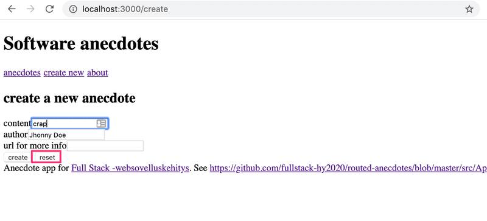

Expand the functionality of the _useField_ hook so that it offers a new _reset_ operation for clearing the field.

Depending on your solution, you may see the following warning in your console:

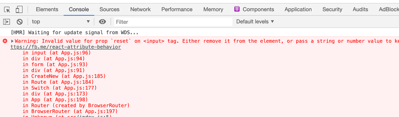

We will return to this warning in the next exercise.

#### 7.6: Anecdotes and Hooks, step 3

If your solution did not cause a warning to appear in the console, you have already finished this exercise.

If you see the `Invalid value for prop "reset" on <input> tag` warning in the console, make the necessary changes to get rid of it.

The reason for this warning is that after making the changes to your application, the following expression:

```js
<input {...content}/>
```

Essentially, is the same as this:

```js
<input
  value={content.value} 
  type={content.type}
  onChange={content.onChange}
  reset={content.reset} // <--
/>
```

The _input_ element should not be given a _reset_ attribute.

One simple fix would be to not use the spread syntax and write all of the forms like this:

```js
<input
  value={username.value} 
  type={username.type}
  onChange={username.onChange}
/>
```

If we were to do this, we would lose much of the benefit provided by the _useField_ hook. Instead, come up with a solution that fixes the issue, but is still easy to use with the spread syntax.

#### 7.7: Country hook

Let's return to exercises [2.18-2.20](https://fullstackopen.com/en/part2/adding_styles_to_react_app#exercises-2-18-2-20).

Use the code from https://github.com/fullstack-hy2020/country-hook as your starting point.

The application can be used to search for a country's details from the service in https://studies.cs.helsinki.fi/restcountries/. If a country is found, its details are displayed:

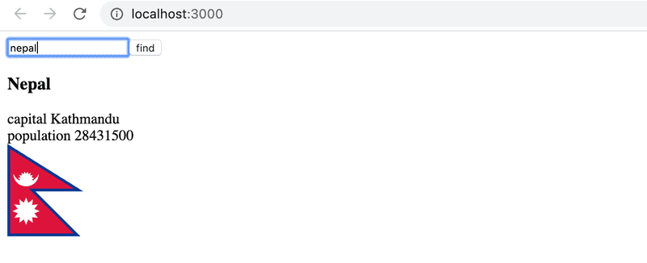

If no country is found, a message is displayed to the user:

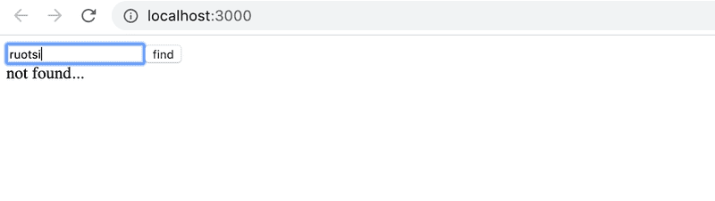

The application is otherwise complete, but in this exercise, you have to implement a custom hook `useCountry`, which can be used to search for the details of the country given to the hook as a parameter.

Use the API endpoint [name](https://studies.cs.helsinki.fi/restcountries/) to fetch a country's details in a `useEffect` hook within your custom hook.

Note that in this exercise it is essential to use useEffect's [second parameter](https://react.dev/reference/react/useEffect#parameters) array to control when the effect function is executed. See the course [part 2](https://fullstackopen.com/en/part2/adding_styles_to_react_app#couple-of-important-remarks) for more info how the second parameter could be used.

#### 7.8: Ultimate Hooks

The code of the application responsible for communicating with the backend of the note application of the previous parts looks like this:

```js
import axios from 'axios'
const baseUrl = '/api/notes'

let token = null

const setToken = newToken => {
  token = `bearer ${newToken}`
}

const getAll = async () => {
  const response = await axios.get(baseUrl)
  return response.data
}

const create = async newObject => {
  const config = {
    headers: { Authorization: token },
  }

  const response = await axios.post(baseUrl, newObject, config)
  return response.data
}

const update = async (id, newObject) => {
  const response = await axios.put(`${ baseUrl }/${id}`, newObject)
  return response.data
}

export default { getAll, create, update, setToken }
```

We notice that the code is in no way specific to the fact that our application deals with notes. Excluding the value of the `baseURL` variable, the same code could be reused in the blog post application for dealing with the communication with the backend. 

Extract the code for communicating with the backend into its own `useResources` hook. It is sufficient to implement fetching all resources and creating a new resource. 

You can do the exercise in the project found in the https://github.com/fullstack-hy2020/ultimate-hooks repository. The _App_ component for the project is the following:

```js
const App = () => {
  const content = useField('text')
  const name = useField('text')
  const number = useField('text')

  const [notes, noteService] = useResource('http://localhost:3005/notes')
  const [persons, personService] = useResource('http://localhost:3005/persons')

  const handleNoteSubmit = (event) => {
    event.preventDefault()
    noteService.create({ content: content.value })
  }
 
  const handlePersonSubmit = (event) => {
    event.preventDefault()
    personService.create({ name: name.value, number: number.value})
  }

  return (
    <div>
      <h2>notes</h2>
      <form onSubmit={handleNoteSubmit}>
        <input {...content} />
        <button>create</button>
      </form>
      {notes.map(n => <p key={n.id}>{n.content}</p>)}

      <h2>persons</h2>
      <form onSubmit={handlePersonSubmit}>
        name <input {...name} /> <br/>
        number <input {...number} />
        <button>create</button>
      </form>
      {persons.map(n => <p key={n.id}>{n.name} {n.number}</p>)}
    </div>
  )
}
```

The `useResource` custom hook returns an array of two items just like the state hooks. The first item of the array contains all of the individual resources and the second item of the array is an object that can be used for manipulating the resource collection, like creating new ones. 

If you implement the hook correctly, it can be used for both notes and persons (start the server with the `npm run server` command at port 3005)

## Part 7c - More about styles

In part 2, we examined two different ways of adding styles to our application: the old-school [single CSS](../part2/README.md#2e---adding-styles-to-react-app) file and [inline styles](../part2/README.md#inline-styles). In this part, we will take a look at a few other ways.

### Ready-made UI libraries

One approach to defining styles for an application is to use a ready-made "UI framework".

One of the first widely popular UI frameworks was the [Bootstrap](https://getbootstrap.com/) toolkit created by Twitter which may still be the most popular. Recently, there has been an explosion in the number of new UI frameworks that have entered the arena. The selection is so vast that there is little hope of creating an exhaustive list of options.

Many UI frameworks provide developers of web applications with ready-made themes and "components" like buttons, menus, and tables. We write components in quotes because, in this context, we are not talking about React components. Usually, UI frameworks are used by including the CSS stylesheets and JavaScript code of the framework in the application.

Many UI frameworks have React-friendly versions where the framework's "components" have been transformed into React components. There are a few different React versions of Bootstrap like [reactstrap](http://reactstrap.github.io/) and [react-bootstrap](https://react-bootstrap.github.io/).

Next, we will take a closer look at two UI frameworks, Bootstrap and [MaterialUI](https://mui.com/). We will use both frameworks to add similar styles to the application we made in the [React Router](#part-7a---react-router) section of the course material.

### React Bootstrap 

Let's start by taking a look at Bootstrap with the help of the [react-bootstrap](https://react-bootstrap.github.io/) package.

Let's install the package with the command:

```
npm install react-bootstrap
```

Then let's add a [link for loading the CSS stylesheet](https://react-bootstrap.github.io/docs/getting-started/introduction#stylesheets) for Bootstrap inside of the _head_ tag in the _public/index.html_ file of the application:

```html
<head>
  <link
    rel="stylesheet"
    href="https://cdn.jsdelivr.net/npm/bootstrap@5.3.0/dist/css/bootstrap.min.css"
    integrity="sha384-9ndCyUaIbzAi2FUVXJi0CjmCapSmO7SnpJef0486qhLnuZ2cdeRhO02iuK6FUUVM"
    crossorigin="anonymous"
  />
  // ...
</head>
```

When we reload the application, we notice that it already looks a bit more stylish:


In Bootstrap, all of the contents of the application are typically rendered inside a [container](https://getbootstrap.com/docs/4.1/layout/overview/#containers). In practice this is accomplished by giving the root `div` element of the application the `container` class attribute:

```js
const App = () => {
  // ...

  return (
    <div className="container">
      // ...
    </div>
  )
}
``` 

We notice that this already affected the appearance of the application. The content is no longer as close to the edges of the browser as it was earlier:

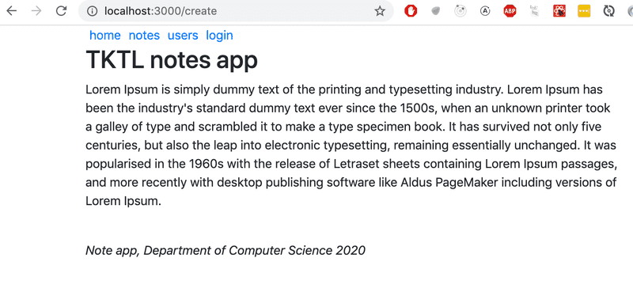

#### Tables

Next, let's make some changes to the _Notes_ component so that it renders the list of notes as a [table](https://getbootstrap.com/docs/4.1/content/tables/). React Bootstrap provides a built-in [Table](https://react-bootstrap.github.io/docs/components/table/) component for this purpose, so there is no need to define CSS classes separately.

The appearance of the application is quite stylish:

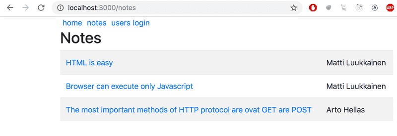

Notice that the React Bootstrap components have to be imported separately from the library as shown below:

```js
import { Table } from 'react-bootstrap'
```

#### Forms

Let's improve the form in the _Login_ view with the help of Bootstrap [forms](https://getbootstrap.com/docs/4.1/components/forms/).

React Bootstrap provides built-in [components](https://react-bootstrap.github.io/docs/forms/overview/) for creating forms (although the documentation for them is slightly lacking):

```js
let Login = (props) => {
  // ...
  return (
    <div> 
      <h2>login</h2>
      <Form onSubmit={onSubmit}>
        <Form.Group>
          <Form.Label>username:</Form.Label>
          <Form.Control
            type="text"
            name="username"
          />
        </Form.Group>
        <Form.Group>
          <Form.Label>password:</Form.Label>
          <Form.Control
            type="password"
          />
        </Form.Group>
        <Button variant="primary" type="submit">
          login
        </Button>
      </Form>
    </div>
  )
}
```

The number of components we need to import increases:

```js
import { Table, Form, Button } from 'react-bootstrap'
```

After switching over to the Bootstrap form, our improved application looks like this:

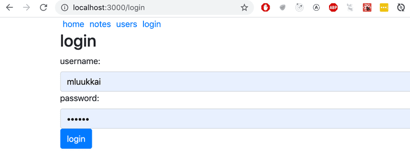

#### Notification

Now that the login form is in better shape, let's take a look at improving our application's notifications:

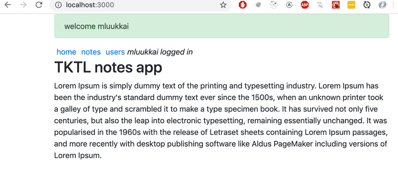

Let's add a message for the notification when a user logs into the application. We will store it in the `message` variable in the _App_ component's state:

```js
const App = () => {
  const [notes, setNotes] = useState([
    // ...
  ])

  const [user, setUser] = useState(null)
  const [message, setMessage] = useState(null)

  const login = (user) => {
    setUser(user)
    setMessage(`welcome ${user}`)
    setTimeout(() => {
      setMessage(null)
    }, 10000)
  }
  // ...
}
```

We will render the message as a Bootstrap [Alert](https://getbootstrap.com/docs/4.1/components/alerts/) component. Once again, the React Bootstrap library provides us with a matching [React component](https://react-bootstrap.github.io/docs/components/alerts/):

```js
<div className="container">
  {(message &&
    <Alert variant="success">
      {message}
    </Alert>
  )}
  // ...
</div>
```

__Navigation structure__

Lastly, let's alter the application's navigation menu to use Bootstrap's [Navbar](https://getbootstrap.com/docs/4.1/components/navbar/) component. The React Bootstrap library provides us with [matching built-in components](https://react-bootstrap.github.io/docs/components/navbar/#responsive-behaviors). Through trial and error, we end up with a working solution despite the cryptic documentation:

```js
<Navbar collapseOnSelect expand="lg" bg="dark" variant="dark">
  <Navbar.Toggle aria-controls="responsive-navbar-nav" />
  <Navbar.Collapse id="responsive-navbar-nav">
    <Nav className="me-auto">
      <Nav.Link href="#" as="span">
        <Link style={padding} to="/">home</Link>
      </Nav.Link>
      <Nav.Link href="#" as="span">
        <Link style={padding} to="/notes">notes</Link>
      </Nav.Link>
      <Nav.Link href="#" as="span">
        <Link style={padding} to="/users">users</Link>
      </Nav.Link>
      <Nav.Link href="#" as="span">
        {user
          ? <em style={padding}>{user} logged in</em>
          : <Link style={padding} to="/login">login</Link>
        }
      </Nav.Link>
    </Nav>
  </Navbar.Collapse>
</Navbar>
```

The resulting layout has a very clean and pleasing appearance:

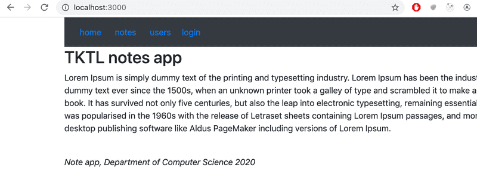

If the viewport of the browser is narrowed, we notice that the menu "collapses" and it can be expanded by clicking the "hamburger" button:

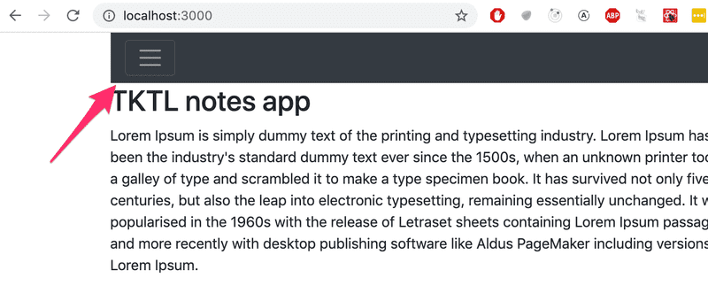

Bootstrap and a large majority of existing UI frameworks produce [responsive](https://en.wikipedia.org/wiki/Responsive_web_design) designs, meaning that the resulting applications render well on a variety of different screen sizes.

Chrome's developer tools make it possible to simulate using our application in the browser of different mobile clients:

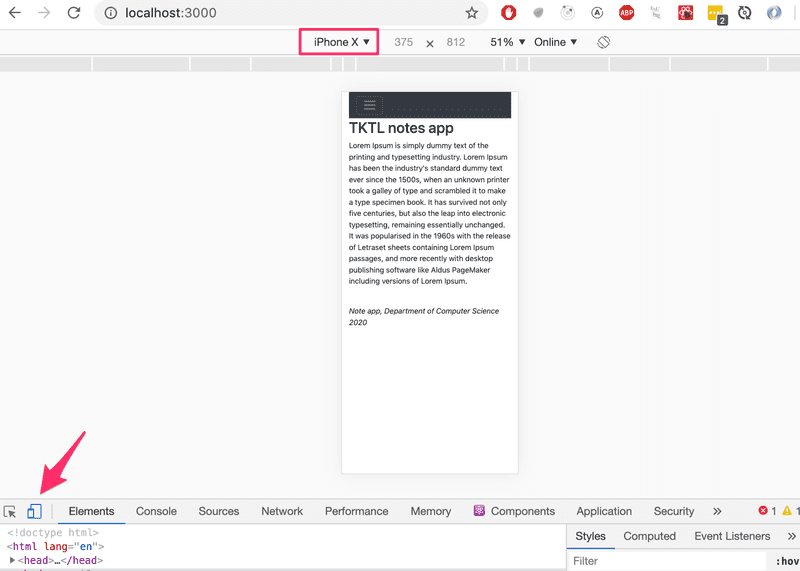

You can find the complete code for the application [here](https://github.com/fullstack-hy2020/misc/blob/master/notes-bootstrap.js).

### Material UI

As our second example, we will look into the [MaterialUI](https://mui.com/) React library, which implements the [Material Design](https://material.io/) visual language developed by Google.

```
npm install @mui/material @emotion/react @emotion/styled
```

Now let's use MaterialUI to do the same modifications to the code we did earlier with Bootstrap.

Render the contents of the whole application within a [Container](https://mui.com/components/container/):

```js
import { Container } from '@mui/material'

const App = () => {
  // ...
  return (
    <Container>
      // ...
    </Container>
  )
}
```

#### Table

Let's start with the _Notes_ component. We'll render the list of notes as a [table](https://mui.com/material-ui/react-table/#simple-table):

```js
const Notes = ({ notes }) => (
  <div>
    <h2>Notes</h2>

    <TableContainer component={Paper}>
      <Table>
        <TableBody>
          {notes.map(note => (
            <TableRow key={note.id}>
              <TableCell>
                <Link to={`/notes/${note.id}`}>{note.content}</Link>
              </TableCell>
              <TableCell>
                {note.user}
              </TableCell>
            </TableRow>
          ))}
        </TableBody>
      </Table>
    </TableContainer>
  </div>
)
```

The table looks like so:

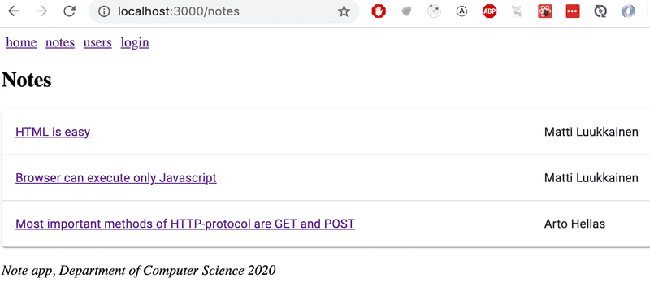

One less pleasant feature of Material UI is that each component has to be imported separately. The import list for the notes page is quite long:

```js
import {
  Container,
  Table,
  TableBody,
  TableCell,
  TableContainer,
  TableRow,
  Paper,
} from '@mui/material'
```

#### Form

Next, let's make the login form in the _Login_ view better using the [TextField](https://mui.com/material-ui/react-text-field/) and [Button](https://mui.com/material-ui/api/button/) components:

```js
const Login = (props) => {
  const navigate = useNavigate()

  const onSubmit = (event) => {
    event.preventDefault()
    props.onLogin('mluukkai')
    navigate('/')
  }

  return (
    <div>
      <h2>login</h2>
      <form onSubmit={onSubmit}>
        <div>
          <TextField label="username" />
        </div>
        <div>
          <TextField label="password" type='password' />
        </div>
        <div>
          <Button variant="contained" color="primary" type="submit">
            login
          </Button>
        </div>
      </form>
    </div>
  )
}
```

The result is:

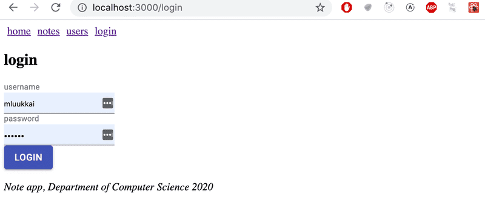

MaterialUI, unlike Bootstrap, does not provide a component for the form itself. The form here is an ordinary HTML [form](https://developer.mozilla.org/en-US/docs/Web/HTML/Element/form) element.

Remember to import all the components used in the form.

#### Notification

The notification displayed on login can be done using the [Alert](https://mui.com/material-ui/react-alert/) component, which is quite similar to Bootstrap's equivalent component:

```js
<div>
  {(message &&
    <Alert severity="success">
      {message}
    </Alert>
  )}
</div>
```

Alert is quite stylish:

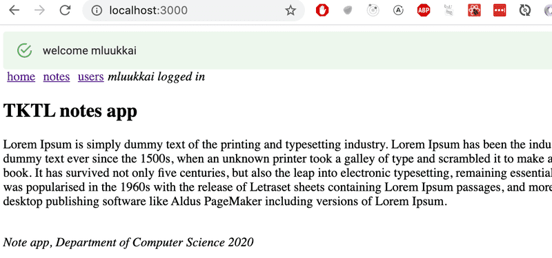

#### Navigation structure

We can implement navigation using the [AppBar](https://mui.com/material-ui/react-app-bar/) component.

If we use the example code from the documentation

```js
<AppBar position="static">
  <Toolbar>
    <IconButton edge="start" color="inherit" aria-label="menu">
    </IconButton>
    <Button color="inherit">
      <Link to="/">home</Link>
    </Button>
    <Button color="inherit">
      <Link to="/notes">notes</Link>
    </Button>
    <Button color="inherit">
      <Link to="/users">users</Link>
    </Button>  
    <Button color="inherit">
      {user
        ? <em>{user} logged in</em>
        : <Link to="/login">login</Link>
      }
    </Button>                
  </Toolbar>
</AppBar>
```

we do get working navigation, but it could look better

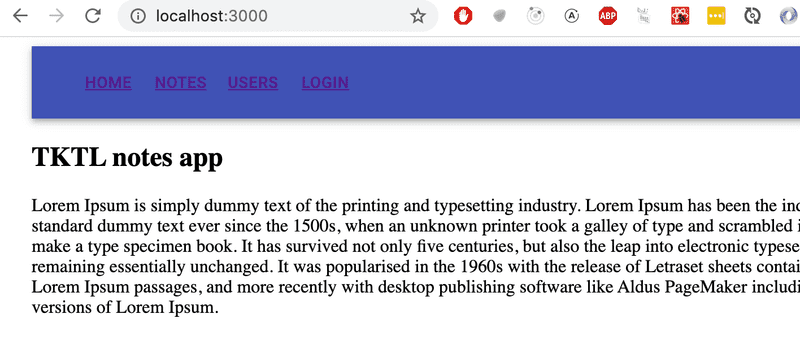

We can find a better way in the [documentation](https://mui.com/material-ui/integrations/routing/#button). We can use [component props](https://mui.com/material-ui/guides/composition/#component-prop) to define how the root element of a MaterialUI component is rendered.

By defining

```js
<Button color="inherit" component={Link} to="/">
  home
</Button>
```

and it looks like we want it to:


The code of the application can be found [here](https://github.com/fullstack-hy2020/misc/blob/master/notes-materialui.js).

### Closing thoughts

The difference between react-bootstrap and MaterialUI is not big. It's up to you which one you find better looking. I have not used MaterialUI a lot, but my first impressions are positive. Its documentation is a bit better than react-bootstrap's. According to https://www.npmtrends.com/ which tracks the popularity of different npm-libraries, MaterialUI passed react-bootstrap in popularity at the end of 2018:

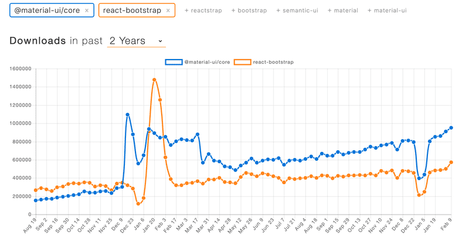

In the two previous examples, we used the UI frameworks with the help of React-integration libraries.

Instead of using the [React Bootstrap](https://react-bootstrap.github.io/) library, we could have just as well used Bootstrap directly by defining CSS classes for our application's HTML elements. Instead of defining the table with the _Table_ component:

```js
<Table striped>
  // ...
</Table>
```

We could have used a regular HTML _table_ and added the required CSS class:

```js
<table className="table striped">
  // ...
</table>
```

The benefit of using the React Bootstrap library is not that evident from this example.

In addition to making the frontend code more compact and readable, another benefit of using React UI framework libraries is that they include the JavaScript that is needed to make specific components work. Some Bootstrap components require a few [unpleasant JavaScript](https://getbootstrap.com/docs/4.1/getting-started/introduction/#js) dependencies that we would prefer not to include in our React applications.

Some potential downsides to using UI frameworks through integration libraries instead of using them "directly" are that integration libraries may have unstable APIs and poor documentation. The situation with [Semantic UI React](https://react.semantic-ui.com/) is a lot better than with many other UI frameworks, as it is an official React integration library.

There is also the question of whether or not UI framework libraries should be used in the first place. It is up to everyone to form their own opinion, but for people lacking knowledge in CSS and web design, they are very useful tools.

### Other UI frameworks

Here are some other UI frameworks for your consideration. If you do not see your favorite UI framework in the list, please make a pull request to the course material for adding it.

- https://bulma.io/
- https://ant.design/
- https://get.foundation/
- https://chakra-ui.com/
- https://tailwindcss.com/
- https://semantic-ui.com/
- https://mantine.dev/
- https://react.fluentui.dev/
- https://storybook.js.org
- https://www.primefaces.org/primereact/
- https://v2.grommet.io
- https://blueprintjs.com
- https://evergreen.segment.com
- https://www.radix-ui.com/
- https://react-spectrum.adobe.com/react-aria/index.html
- https://master.co/
- https://nextui.org/
- https://daisyui.com/
- https://ui.shadcn.com/
- https://www.tremor.so/
- https://headlessui.com/

### Styled components

There are also [other ways](https://blog.bitsrc.io/5-ways-to-style-react-components-in-2019-30f1ccc2b5b) of styling React applications that we have not yet taken a look at.

The [styled components](https://styled-components.com/) library offers an interesting approach for defining styles through [tagged template literals](https://developer.mozilla.org/en-US/docs/Web/JavaScript/Reference/Template_literals#tagged_templates) that were introduced in ES6.

Let's make a few changes to the styles of our application with the help of styled components. First, install the package with the command:

```
npm install styled-components
```

Then let's define two components with styles:

```js
import styled from 'styled-components'

const Button = styled.button`
  background: Bisque;
  font-size: 1em;
  margin: 1em;
  padding: 0.25em 1em;
  border: 2px solid Chocolate;
  border-radius: 3px;
`

const Input = styled.input`
  margin: 0.25em;
`
```

The code above creates styled versions of the _button_ and _input_ HTML elements and then assigns them to the _Button_ and _Input_ variables.

The syntax for defining the styles is quite interesting, as the CSS rules are defined inside of backticks.

The styled components that we defined work exactly like regular _button_ and _input_ elements, and they can be used in the same way:

```js
const Login = (props) => {
  // ...
  return (
    <div>
      <h2>login</h2>
      <form onSubmit={onSubmit}>
        <div>
          username:
          <Input />
        </div>
        <div>
          password:
          <Input type='password' />
        </div>
        <Button type="submit" primary=''>login</Button>
      </form>
    </div>
  )
}
```

Let's create a few more components for styling this application which will be styled versions of _div_ elements:

```js
const Page = styled.div`
  padding: 1em;
  background: papayawhip;
`

const Navigation = styled.div`
  background: BurlyWood;
  padding: 1em;
`

const Footer = styled.div`
  background: Chocolate;
  padding: 1em;
  margin-top: 1em;
`
```

Let's use the components in our application:

```js
const App = () => {
  // ...

  return (
     <Page>
      <Navigation>
        <Link style={padding} to="/">home</Link>
        <Link style={padding} to="/notes">notes</Link>
        <Link style={padding} to="/users">users</Link>
        {user
          ? <em>{user} logged in</em>
          : <Link style={padding} to="/login">login</Link>
        }
      </Navigation>
      
      <Routes>
        <Route path="/notes/:id" element={<Note note={note} />} />  
        <Route path="/notes" element={<Notes notes={notes} />} />   
        <Route path="/users" element={user ? <Users /> : <Navigate replace to="/login" />} />
        <Route path="/login" element={<Login onLogin={login} />} />
        <Route path="/" element={<Home />} />      
      </Routes>

      <Footer>
        <em>Note app, Department of Computer Science 2022</em>
      </Footer>
    </Page>
  )
}
```

The appearance of the resulting application is shown below:

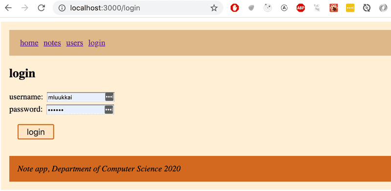

Styled components have seen consistent growth in popularity in recent times, and quite a lot of people consider it to be the best way of defining styles in React applications.

## Part 7d - Webpack

In the early days, React was somewhat famous for being very difficult to configure the tools required for application development. To make the situation easier, [Create React App](https://github.com/facebookincubator/create-react-app) was developed, which eliminated configuration-related problems. [Vite](https://vitejs.dev/), which is also used in the course, has recently replaced Create React App in new applications.

Both Vite and Create React App use _bundlers_ to do the actual work. We will now familiarize ourselves with the bundler called [Webpack](https://webpack.js.org/) used by Create React App. Webpack was by far the most popular bundler for years. Recently, however, there have been several new generation bundlers such as [esbuild](https://esbuild.github.io/) used by Vite, which are significantly faster and easier to use than Webpack. However, e.g. esbuild still lacks some useful features (such as hot reload of the code in the browser), so next we will get to know the old ruler of bundlers, Webpack.

### Bundling

We have implemented our applications by dividing our code into separate modules that have been _imported_ to places that require them. Even though ES6 modules are defined in the ECMAScript standard, the older browsers do not know how to handle code that is divided into modules.

For this reason, code that is divided into modules must be _bundled_ for browsers, meaning that all of the source code files are transformed into a single file that contains all of the application code. When we deployed our React frontend to production in [part 3](../part3/README.md#3b---deploying-app-to-internet), we performed the bundling of our application with the `npm run build` command. Under the hood, the npm script bundles the source, and this produces the following collection of files in the _dist_ directory:

```
├── assets
│   ├── index-d526a0c5.css
│   ├── index-e92ae01e.js
│   └── react-35ef61ed.svg
├── index.html
└── vite.svg
```

The _index.html_ file located at the root of the _dist_ directory is the "main file" of the application which loads the bundled JavaScript file with a _script_ tag:

```js
<!doctype html>
<html lang="en">
  <head>
    <meta charset="UTF-8" />
    <link rel="icon" type="image/svg+xml" href="/vite.svg" />
    <meta name="viewport" content="width=device-width, initial-scale=1.0" />
    <title>Vite + React</title>
    <script type="module" crossorigin src="/assets/index-e92ae01e.js"></script>
    <link rel="stylesheet" href="/assets/index-d526a0c5.css">
  </head>
  <body>
    <div id="root"></div>
    
  </body>
</html>
```

As we can see from the example application that was created with Vite, the build script also bundles the application's CSS files into a single _/assets/index-d526a0c5.css_ file.

In practice, bundling is done so that we define an entry point for the application, which typically is the _index.js_ file. When webpack bundles the code, it includes not only the code from the entry point but also the code that is imported by the entry point, as well as the code imported by its import statements, and so on.

Since part of the imported files are packages like React, Redux, and Axios, the bundled JavaScript file will also contain the contents of each of these libraries.

> The old way of dividing the application's code into multiple files was based on the fact that the _index.html_ file loaded all of the separate JavaScript files of the application with the help of script tags. This resulted in decreased performance, since the loading of each separate file results in some overhead. For this reason, these days the preferred method is to bundle the code into a single file.

Next, we will create a webpack configuration by hand, suitable for a new React application.

Let's create a new directory for the project with the following subdirectories (_build_ and _src_) and files:

```
├── build
├── package.json
├── src
│   └── index.js
└── webpack.config.js
```

The contents of the _package.json_ file can e.g. be the following:

```js
{
  "name": "webpack-part7",
  "version": "0.0.1",
  "description": "practicing webpack",
  "scripts": {},
  "license": "MIT"
}
```

Let's install webpack with the command:

```
npm install --save-dev webpack webpack-cli
```

We define the functionality of webpack in the _webpack.config.js_ file, which we initialize with the following content:

```js
const path = require('path')

const config = () => {
  return {
    entry: './src/index.js',
    output: {
      path: path.resolve(__dirname, 'build'),
      filename: 'main.js'
    }
  }
}

module.exports = config
```

__Note__: it would be possible to make the definition directly as an object instead of a function:

```js
const path = require('path')

const config = {
  entry: './src/index.js',
  output: {
    path: path.resolve(__dirname, 'build'),
    filename: 'main.js'
  }
}

module.exports = config
```

An object will suffice in many situations, but we will later need certain features that require the definition to be done as a function.

We will then define a new npm script called _build_ that will execute the bundling with webpack:

```js
// ...
"scripts": {
  "build": "webpack --mode=development"
},
// ...
```

Let's add some more code to the _src/index.js_ file:

```js
const hello = name => {
  console.log(`hello ${name}`)
}
```

When we execute the `npm run build` command, our application code will be bundled by webpack. The operation will produce a new _main.js_ file that is added under the _build_ directory:

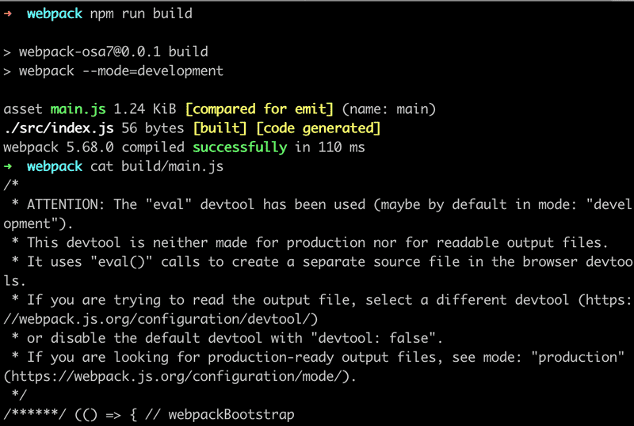

The file contains a lot of stuff that looks quite interesting. We can also see the code we wrote earlier at the end of the file:

```js
eval("const hello = name => {\n  console.log(`hello ${name}`)\n}\n\n//# sourceURL=webpack://webpack-osa7/./src/index.js?");
```

Let's add an _App.js_ file under the src directory with the following content:

```js
const App = () => {
  return null
}

export default App
```

Let's import and use the _App_ module in the _index.js_ file:

```js
import App from './App';

const hello = name => {
  console.log(`hello ${name}`)
}

App()
```

When we bundle the application again with the `npm run build` command, we notice that webpack has acknowledged both files:

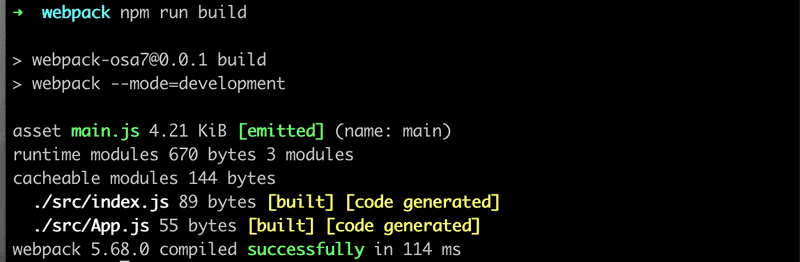

Our application code can be found at the end of the bundle file in a rather obscure format:


### Configuration file

Let's take a closer look at the contents of our current _webpack.config.js_ file:

```js
const path = require('path')

const config = () => {
  return {
    entry: './src/index.js',
    output: {
      path: path.resolve(__dirname, 'build'),
      filename: 'main.js'
    }
  }
}

module.exports = config
```

The configuration file has been written in JavaScript and the function returning the configuration object is exported using Node's module syntax.

Our minimal configuration definition almost explains itself. The [entry](https://webpack.js.org/concepts/#entry) property of the configuration object specifies the file that will serve as the entry point for bundling the application.

The [output](https://webpack.js.org/concepts/#output) property defines the location where the bundled code will be stored. The target directory must be defined as an _absolute path_, which is easy to create with the [path.resolve](https://nodejs.org/docs/latest-v8.x/api/path.html#path_path_resolve_paths) method. We also use [__dirname](https://nodejs.org/docs/latest/api/modules.html#__dirname) which is a variable in Node that stores the path to the current directory.

### Bundling React

Next, let's transform our application into a minimal React application. Let's install the required libraries:

```
npm install react react-dom
```

And let's turn our application into a React application by adding the familiar definitions in the _index.js_ file:

```js
import React from 'react'
import ReactDOM from 'react-dom/client'
import App from './App'

ReactDOM.createRoot(document.getElementById('root')).render(<App />)
```

We will also make the following changes to the _App.js_ file:

```js
import React from 'react' // we need this now also in component files

const App = () => {
  return (
    <div>
      hello webpack
    </div>
  )
}

export default App
```

We still need the _build/index.html_ file that will serve as the "main page" of our application, which will load our bundled JavaScript code with a _script_ tag:

```js
<!DOCTYPE html>
<html lang="en">
  <head>
    <meta charset="utf-8" />
    <title>React App</title>
  </head>
  <body>
    <div id="root"></div>
    <script type="text/javascript" src="./main.js"></script>
  </body>
</html>
```

When we bundle our application, we run into the following problem:

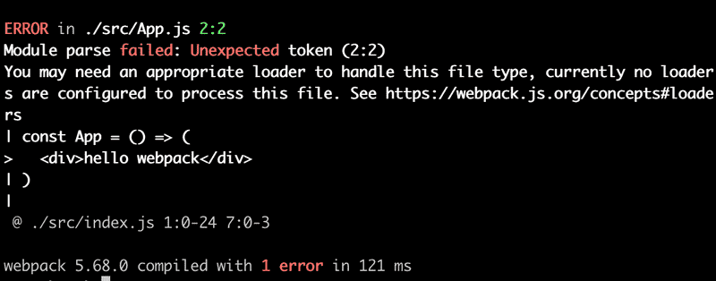

### Loaders

The error message from webpack states that we may need an appropriate _loader_ to bundle the _App.js_ file correctly. By default, webpack only knows how to deal with plain JavaScript. Although we may have become unaware of it, we are using [JSX](https://facebook.github.io/jsx/) for rendering our views in React. To illustrate this, the following code is not regular JavaScript:

```js
const App = () => {
  return (
    <div>
      hello webpack
    </div>
  )
}
```

The syntax used above comes from JSX and it provides us with an alternative way of defining a React element for an HTML _div_ tag.

We can use [loaders](https://webpack.js.org/concepts/loaders/) to inform webpack of the files that need to be processed before they are bundled.

Let's configure a loader to our application that transforms the JSX code into regular JavaScript:

```js
const path = require('path')

const config = () => {
  return {
    entry: './src/index.js',
    output: {
      path: path.resolve(__dirname, 'build'),
      filename: 'main.js'
    },
    module: {
      rules: [
        {
          test: /\.js$/,
          loader: 'babel-loader',
          options: {
            presets: ['@babel/preset-react'],
          },
        },
      ],
    },
  }
}

module.exports = config
```

Loaders are defined under the _module_ property in the rules array.

The definition of a single loader consists of three parts:

```js
{
  test: /\.js$/,
  loader: 'babel-loader',
  options: {
    presets: ['@babel/preset-react']
  }
}
```

The _test_ property specifies that the loader is for files that have names ending with _.js_. The _loader_ property specifies that the processing for those files will be done with [babel-loader](https://github.com/babel/babel-loader). The _options_ property is used for specifying parameters for the loader, which configure its functionality.

Let's install the loader and its required packages as a _development dependency_:

```
npm install @babel/core babel-loader @babel/preset-react --save-dev
```

Bundling the application will now succeed.

If we make some changes to the _App_ component and take a look at the bundled code, we notice that the bundled version of the component looks like this:

```js
const App = () =>
  react__WEBPACK_IMPORTED_MODULE_0___default.a.createElement(
    'div',
    null,
    'hello webpack'
  )
```

As we can see from the example above, the React elements that were written in JSX are now created with regular JavaScript by using React's [createElement](https://react.dev/reference/react/createElement) function.

You can test the bundled application by opening the _build/index.html_ file with the _open file_ functionality of your browser:

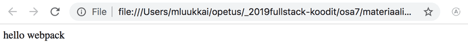

It's worth noting that if the bundled application's source code uses _async/await_, the browser will not render anything on some browsers. [Googling the error message in the console](https://stackoverflow.com/questions/33527653/babel-6-regeneratorruntime-is-not-defined) will shed some light on the issue. With the [previous solution](https://babeljs.io/docs/en/babel-polyfill/) being deprecated we now have to install two more missing dependencies, that is [core-js](https://www.npmjs.com/package/core-js) and [regenerator-runtime](https://www.npmjs.com/package/regenerator-runtime):

```
npm install core-js regenerator-runtime
```

You need to import these dependencies at the top of the _index.js_ file:

```js
import 'core-js/stable/index.js'
import 'regenerator-runtime/runtime.js'
```

Our configuration contains nearly everything that we need for React development.

### Transpilers

The process of transforming code from one form of JavaScript to another is called [transpiling](https://en.wiktionary.org/wiki/transpile). The general definition of the term is to compile source code by transforming it from one language to another.

By using the configuration from the previous section, we are _transpiling_ the code containing JSX into regular JavaScript with the help of [babel](https://babeljs.io/), which is currently the most popular tool for the job.

As mentioned in part 1, most browsers do not support the latest features that were introduced in ES6 and ES7, and for this reason, the code is usually transpiled to a version of JavaScript that implements the ES5 standard.

The transpilation process that is executed by Babel is defined with [plugins](https://babeljs.io/docs/plugins/). In practice, most developers use ready-made [presets](https://babeljs.io/docs/plugins/) that are groups of pre-configured plugins.

Currently, we are using the [@babel/preset-react](https://babeljs.io/docs/babel-preset-react/) preset for transpiling the source code of our application:

```js
{
  test: /\.js$/,
  loader: 'babel-loader',
  options: {
    presets: ['@babel/preset-react']
  }
}
```

Let's add the [@babel/preset-env](https://babeljs.io/docs/babel-preset-env/) plugin that contains everything needed to take code using all of the latest features and to transpile it to code that is compatible with the ES5 standard:

```js
{
  test: /\.js$/,
  loader: 'babel-loader',
  options: {
    presets: ['@babel/preset-env', '@babel/preset-react']
  }
}
```

Let's install the preset with the command:

```
npm install @babel/preset-env --save-dev
```

When we transpile the code, it gets transformed into old-school JavaScript. The definition of the transformed _App_ component looks like this:

```js
var App = function App() {
  return _react2.default.createElement('div', null, 'hello webpack')
};
```

As we can see, variables are declared with the `var` keyword, as ES5 JavaScript does not understand the `const` keyword. Arrow functions are also not used, which is why the function definition used the `function` keyword.

### CSS

Let's add some CSS to our application. Let's create a new _src/index.css_ file:

```js
.container {
  margin: 10px;
  background-color: #dee8e4;
}
```

Then let's use the style in the _App_ component:

```js
const App = () => {
  return (
    <div className="container">
      hello webpack
    </div>
  )
}
```

This will cause the transpilation process to break:

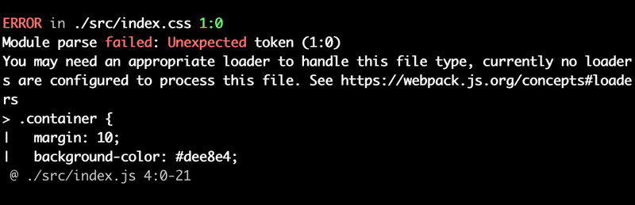

When using CSS, we have to use [css](https://webpack.js.org/loaders/css-loader/) and [style](https://webpack.js.org/loaders/style-loader/) loaders:

```js
{
  rules: [
    {
      test: /\.js$/,
      loader: 'babel-loader',
      options: {
        presets: ['@babel/preset-react', '@babel/preset-env'],
      },
    },
    {
      test: /\.css$/,
      use: ['style-loader', 'css-loader'],
    },
  ],
}
```

The job of the [css loader](https://webpack.js.org/loaders/css-loader/) is to load the CSS files and the job of the [style loader](https://webpack.js.org/loaders/style-loader/) is to generate and inject a _style_ element that contains all of the styles of the application.

With this configuration, the CSS definitions are included in the _main.js_ file of the application. For this reason, there is no need to separately import the CSS styles in the main _index.html_ file.

If needed, the application's CSS can also be generated into its own separate file, by using the [mini-css-extract-plugin](https://github.com/webpack-contrib/mini-css-extract-plugin).

When we install the loaders:

```
npm install style-loader css-loader --save-dev
```

The bundling will succeed once again and the application gets new styles. 

### Webpack-dev-server

The current configuration makes it possible to develop our application but the workflow is awful (to the point where it resembles the development workflow with Java). Every time we make a change to the code, we have to bundle it and refresh the browser to test it.

The [webpack-dev-server](https://webpack.js.org/guides/development/#using-webpack-dev-server) offers a solution to our problems. Let's install it with the command:

```
npm install --save-dev webpack-dev-server
```

Let's define an npm script for starting the dev server:

```js
{
  // ...
  "scripts": {
    "build": "webpack --mode=development",
    "start": "webpack serve --mode=development"
  },
  // ...
}
```

Let's also add a new _devServer_ property to the configuration object in the _webpack.config.js_ file:

```js
const config = {
  entry: './src/index.js',
  output: {
    path: path.resolve(__dirname, 'build'),
    filename: 'main.js',
  },
  devServer: {
    static: path.resolve(__dirname, 'build'),
    compress: true,
    port: 3000,
  },
  // ...
};
```

The `npm start` command will now start the dev-server at port 3000, meaning that our application will be available by visiting http://localhost:3000 in the browser. When we make changes to the code, the browser will automatically refresh the page.

The process for updating the code is fast. When we use the dev-server, the code is not bundled the usual way into the _main.js_ file. The result of the bundling exists only in memory.

Let's extend the code by changing the definition of the _App_ component as shown below:

```js
import React, { useState } from 'react'
import './index.css'

const App = () => {
  const [counter, setCounter] = useState(0)

  return (
    <div className="container">
      hello webpack {counter} clicks
      <button onClick={() => setCounter(counter + 1)}>
        press
      </button>
    </div>
  )
}

export default App
```

The application works nicely and the development workflow is quite smooth.

### Source maps

Let's extract the click handler into its own function and store the previous value of the counter in its own _values_ state:

```js
const App = () => {
  const [counter, setCounter] = useState(0)
  const [values, setValues] = useState()

  const handleClick = () => {
    setCounter(counter + 1)
    setValues(values.concat(counter))
  }

  return (
    <div className="container">
      hello webpack {counter} clicks
      <button onClick={handleClick}>
        press
      </button>
    </div>
  )
}
```

The application no longer works and the console will display the following error:

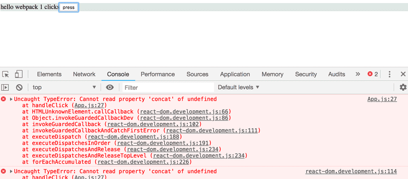

We know that the error is in the onClick method, but if the application was any larger the error message would be quite difficult to track down:

```
App.js:27 Uncaught TypeError: Cannot read property 'concat' of undefined
    at handleClick (App.js:27)
```

The location of the error indicated in the message does not match the actual location of the error in our source code. If we click the error message, we notice that the displayed source code does not resemble our application code:

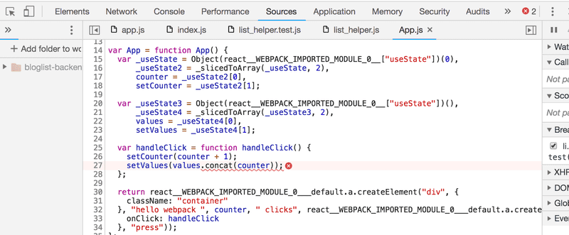

Of course, we want to see our actual source code in the error message.

Luckily, fixing this error message is quite easy. We will ask webpack to generate a so-called [source map](https://webpack.js.org/configuration/devtool/) for the bundle, which makes it possible to _map errors_ that occur during the execution of the bundle to the corresponding part in the original source code.

The source map can be generated by adding a new _devtool_ property to the configuration object with the value 'source-map':

```js
const config = {
  entry: './src/index.js',
  output: {
    // ...
  },
  devServer: {
    // ...
  },
  devtool: 'source-map',
  // ..
};
```

Webpack has to be restarted when we make changes to its configuration. It is also possible to make webpack watch for changes made to itself, but we will not do that this time.

The error message is now a lot better

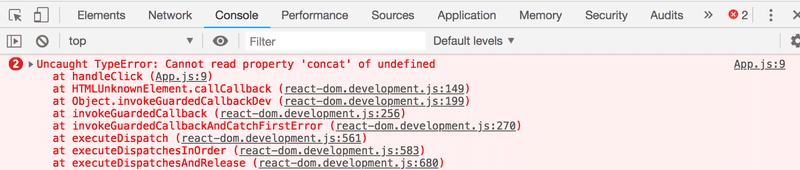

since it refers to the code we wrote:

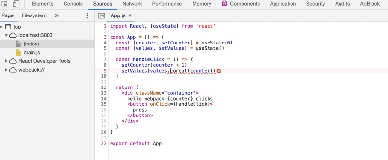

Generating the source map also makes it possible to use the Chrome debugger:

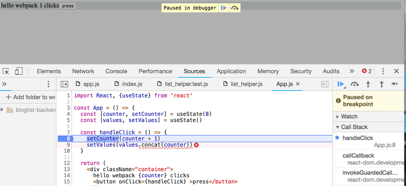

Let's fix the bug by initializing the state of _values_ as an empty array:

```js
const App = () => {
  const [counter, setCounter] = useState(0)
  const [values, setValues] = useState([])
  // ...
}
```

### Minifying the code

When we deploy the application to production, we are using the _main.js_ code bundle that is generated by webpack. The size of the _main.js_ file is 1009487 bytes even though our application only contains a few lines of our code. The large file size is because the bundle also contains the source code for the entire React library. The size of the bundled code matters since the browser has to load the code when the application is first used. With high-speed internet connections, 1009487 bytes is not an issue, but if we were to keep adding more external dependencies, loading speeds could become an issue, particularly for mobile users.

If we inspect the contents of the bundle file, we notice that it could be greatly optimized in terms of file size by removing all of the comments. There's no point in manually optimizing these files, as there are many existing tools for the job.

The optimization process for JavaScript files is called _minification_. One of the leading tools intended for this purpose is [UglifyJS](https://github.com/mishoo/UglifyJS/).

Starting from version 4 of webpack, the minification plugin does not require additional configuration to be used. It is enough to modify the npm script in the _package.json_ file to specify that webpack will execute the bundling of the code in _production_ mode:

```js
{
  "name": "webpack-part7",
  "version": "0.0.1",
  "description": "practicing webpack",
  "scripts": {
    "build": "webpack --mode=production",
    "start": "webpack serve --mode=development"
  },
  "license": "MIT",
  "dependencies": {
    // ...
  },
  "devDependencies": {
    // ...
  }
}
```

When we bundle the application again, the size of the resulting _main.js_ decreases substantially:

```bash
$ ls -l build/main.js
-rw-r--r--  1 mluukkai  ATKK\hyad-all  227651 Feb  7 15:58 build/main.js
```

The output of the minification process resembles old-school C code; all of the comments and even unnecessary whitespace and newline characters have been removed, variable names have been replaced with a single character.

```js
function h(){if(!d){var e=u(p);d=!0;for(var t=c.length;t;){for(s=c,c=[];++f<t;)s&&s[f].run();f=-1,t=c.length}s=null,d=!1,function(e){if(o===clearTimeout)return clearTimeout(e);if((o===l||!o)&&clearTimeout)return o=clearTimeout,clearTimeout(e);try{o(e)}catch(t){try{return o.call(null,e)}catch(t){return o.call(this,e)}}}(e)}}a.nextTick=function(e){var t=new Array(arguments.length-1);if(arguments.length>1)
```

### Development and production configuration

Next, let's add a backend to our application by repurposing the now-familiar note application backend.

Let's store the following content in the _db.json_ file:

```js
{
  "notes": [
    {
      "important": true,
      "content": "HTML is easy",
      "id": "5a3b8481bb01f9cb00ccb4a9"
    },
    {
      "important": false,
      "content": "Mongo can save js objects",
      "id": "5a3b920a61e8c8d3f484bdd0"
    }
  ]
}
```

Our goal is to configure the application with webpack in such a way that, when used locally, the application uses the json-server available in port 3001 as its backend.

The bundled file will then be configured to use the backend available at the https://notes2023.fly.dev/api/notes URL.

We will install _axios_, start the json-server, and then make the necessary changes to the application. For the sake of changing things up, we will fetch the notes from the backend with our [custom hook](https://fullstackopen.com/en/part7/custom_hooks) called `useNotes`:

```js
import React, { useState, useEffect } from 'react'
import axios from 'axios'
const useNotes = (url) => {
  const [notes, setNotes] = useState([])
  useEffect(() => {
    axios.get(url).then(response => {
      setNotes(response.data)
    })
  }, [url])
  return notes
}

const App = () => {
  const [counter, setCounter] = useState(0)
  const [values, setValues] = useState([])
  const url = 'https://notes2023.fly.dev/api/notes'
  const notes = useNotes(url)

  const handleClick = () => {
    setCounter(counter + 1)
    setValues(values.concat(counter))
  }

  return (
    <div className="container">
      hello webpack {counter} clicks
      <button onClick={handleClick}>press</button>
      <div>{notes.length} notes on server {url}</div>
    </div>
  )
}

export default App
```

The address of the backend server is currently hardcoded in the application code. How can we change the address in a controlled fashion to point to the production backend server when the code is bundled for production?

Webpack's configuration function has two parameters, _env_ and _argv_. We can use the latter to find out the _mode_ defined in the npm script:

const path = require('path')

```js
const config = (env, argv) => {
  console.log('argv.mode:', argv.mode)
  return {
    // ...
  }
}

module.exports = config
```

Now, if we want, we can set Webpack to work differently depending on whether the application's operating environment, or _mode_, is set to production or development.

We can also use webpack's [DefinePlugin](https://webpack.js.org/plugins/define-plugin/) for defining _global default constants_ that can be used in the bundled code. Let's define a new global constant *BACKEND_URL* that gets a different value depending on the environment that the code is being bundled for:

```js
const path = require('path')
const webpack = require('webpack')

const config = (env, argv) => {
  console.log('argv', argv.mode)

  const backend_url = argv.mode === 'production'
    ? 'https://notes2023.fly.dev/api/notes'
    : 'http://localhost:3001/notes'

  return {
    entry: './src/index.js',
    output: {
      path: path.resolve(__dirname, 'build'),
      filename: 'main.js'
    },
    devServer: {
      static: path.resolve(__dirname, 'build'),
      compress: true,
      port: 3000,
    },
    devtool: 'source-map',
    module: {
      // ...
    },
    plugins: [
      new webpack.DefinePlugin({
        BACKEND_URL: JSON.stringify(backend_url)
      })
    ]
  }
}

module.exports = config
```

The global constant is used in the following way in the code:

```js
const App = () => {
  const [counter, setCounter] = useState(0)
  const [values, setValues] = useState([])
  const notes = useNotes(BACKEND_URL)

  // ...
  return (
    <div className="container">
      hello webpack {counter} clicks
      <button onClick={handleClick} >press</button>
      <div>{notes.length} notes on server {BACKEND_URL}</div>
    </div>
  )
}
```

If the configuration for development and production differs a lot, it may be a good idea to [separate the configuration](https://webpack.js.org/guides/production/) of the two into their own files.

Now, if the application is started with the command `npm start` in development mode, it fetches the notes from the address http://localhost:3001/notes. The version bundled with the command `npm run build` uses the address https://notes2023.fly.dev/api/notes to get the list of notes.

We can inspect the bundled production version of the application locally by executing the following command in the _build_ directory:

```
npx static-server
```

By default, the bundled application will be available at http://localhost:9080.

### Polyfill

Our application is finished and works with all relatively recent versions of modern browsers, except for Internet Explorer. The reason for this is that, because of `axios`, our code uses [Promises](https://developer.mozilla.org/en-US/docs/Web/JavaScript/Reference/Global_Objects/Promise), and no existing version of IE supports them:

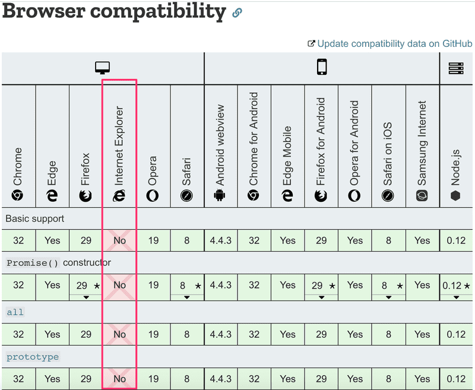

There are many other things in the standard that IE does not support. Something as harmless as the [find](https://developer.mozilla.org/en-US/docs/Web/JavaScript/Reference/Global_Objects/Array/find) method of JavaScript arrays exceeds the capabilities of IE:

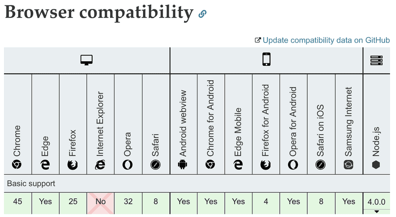

In these situations, it is not enough to transpile the code, as transpilation simply transforms the code from a newer version of JavaScript to an older one with wider browser support. IE understands Promises syntactically but it simply has not implemented their functionality. The `find` property of arrays in IE is simply _undefined_.

If we want the application to be IE-compatible, we need to add a [polyfill](https://remysharp.com/2010/10/08/what-is-a-polyfill), which is code that adds the missing functionality to older browsers.

Polyfills can be added with the help of [webpack and Babel](https://babeljs.io/docs/usage/polyfill/) or by installing one of many existing polyfill libraries.

The polyfill provided by the [promise-polyfill](https://www.npmjs.com/package/promise-polyfill) library is easy to use. We simply have to add the following to our existing application code:

```js
import PromisePolyfill from 'promise-polyfill'

if (!window.Promise) {
  window.Promise = PromisePolyfill
}
```

If the global `Promise` object does not exist, meaning that the browser does not support Promises, the polyfilled Promise is stored in the global variable. If the polyfilled Promise is implemented well enough, the rest of the code should work without issues.

One exhaustive list of existing polyfills can be found [here](https://github.com/Modernizr/Modernizr/wiki/HTML5-Cross-browser-Polyfills).

The browser compatibility of different APIs can be checked by visiting https://caniuse.com or [Mozilla's website](https://developer.mozilla.org/en-US/).

## Part 7e - Class components, Miscellaneous

### Class Components

During the course, we have only used React components having been defined as Javascript functions. This was not possible without the [hook](https://reactjs.org/docs/hooks-intro.html) functionality that came with version 16.8 of React. Before, when defining a component that uses state, one had to define it using Javascript's [Class](https://reactjs.org/docs/state-and-lifecycle.html#converting-a-function-to-a-class) syntax.

It is beneficial to at least be familiar with Class Components to some extent since the world contains a lot of old React code, which will probably never be completely rewritten using the updated syntax.

Let's get to know the main features of Class Components by producing yet another very familiar anecdote application. We store the anecdotes in the file _db.json_ using _json-server_. The contents of the file are lifted from [here](https://github.com/fullstack-hy/misc/blob/master/anecdotes.json).

The initial version of the Class Component looks like this

```js
import React from 'react'

class App extends React.Component {
  constructor(props) {
    super(props)
  }

  render() {
    return (
      <div>
        <h1>anecdote of the day</h1>
      </div>
    )
  }
}

export default App
```

The component now has a [constructor](https://react.dev/reference/react/Component#constructor), in which nothing happens at the moment, and contains the method [render](https://react.dev/reference/react/Component#render). As one might guess, render defines how and what is rendered to the screen.

Let's define a state for the list of anecdotes and the currently-visible anecdote. In contrast to when using the [useState](https://react.dev/reference/react/useState) hook, Class Components only contain one state. So if the state is made up of multiple "parts", they should be stored as properties of the state. The state is initialized in the constructor:

```js
class App extends React.Component {
  constructor(props) {
    super(props)

    this.state = {
      anecdotes: [],
      current: 0
    }
  }

  render() {
    if (this.state.anecdotes.length === 0) {
      return <div>no anecdotes...</div>
    }

    return (
      <div>
        <h1>anecdote of the day</h1>
        <div>
          {this.state.anecdotes[this.state.current].content}
        </div>
        <button>next</button>
      </div>
    )
  }
}
```

The component state is in the instance variable `this.state`. The state is an object having two properties. _this.state.anecdotes_ is the list of anecdotes and _this.state.current_ is the index of the currently-shown anecdote.

In Functional components, the right place for fetching data from a server is inside an [effect hook](https://react.dev/reference/react/useEffect), which is executed when a component renders or less frequently if necessary, e.g. only in combination with the first render.

The [lifecycle methods](https://react.dev/reference/react/Component#adding-lifecycle-methods-to-a-class-component) of Class Components offer corresponding functionality. The correct place to trigger the fetching of data from a server is inside the lifecycle method [componentDidMount](https://react.dev/reference/react/Component#componentdidmount), which is executed once right after the first time a component renders:

```js
class App extends React.Component {
  constructor(props) {
    super(props)

    this.state = {
      anecdotes: [],
      current: 0
    }
  }

  componentDidMount = () => {
    axios.get('http://localhost:3001/anecdotes').then(response => {
      this.setState({ anecdotes: response.data })
    })
  }

  // ...
}
```

The callback function of the HTTP request updates the component state using the method setState. The method only touches the keys that have been defined in the object passed to the method as an argument. The value for the key _current_ remains unchanged.

Calling the method setState always triggers the rerender of the Class Component, i.e. calling the method `render`.

We'll finish off the component with the ability to change the shown anecdote. The following is the code for the entire component with the addition highlighted:

```js
class App extends React.Component {
  constructor(props) {
    super(props)

    this.state = {
      anecdotes: [],
      current: 0
    }
  }

  componentDidMount = () => {
    axios.get('http://localhost:3001/anecdotes').then(response => {
      this.setState({ anecdotes: response.data })
    })
  }

  handleClick = () => {
    const current = Math.floor(
      Math.random() * this.state.anecdotes.length
    )
    this.setState({ current })
  }

  render() {
    if (this.state.anecdotes.length === 0 ) {
      return <div>no anecdotes...</div>
    }

    return (
      <div>
        <h1>anecdote of the day</h1>
        <div>{this.state.anecdotes[this.state.current].content}</div>
        <button onClick={this.handleClick}>next</button>
      </div>
    )
  }
}
```

For comparison, here is the same application as a Functional component:

```js
const App = () => {
  const [anecdotes, setAnecdotes] = useState([])
  const [current, setCurrent] = useState(0)

  useEffect(() =>{
    axios.get('http://localhost:3001/anecdotes').then(response => {
      setAnecdotes(response.data)
    })
  },[])

  const handleClick = () => {
    setCurrent(Math.round(Math.random() * (anecdotes.length - 1)))
  }

  if (anecdotes.length === 0) {
    return <div>no anecdotes...</div>
  }

  return (
    <div>
      <h1>anecdote of the day</h1>
      <div>{anecdotes[current].content}</div>
      <button onClick={handleClick}>next</button>
    </div>
  )
}
```

In the case of our example, the differences were minor. The biggest difference between Functional components and Class components is mainly that the state of a Class component is a single object, and that the state is updated using the method `setState`, while in Functional components the state can consist of multiple different variables, with all of them having their own update function.

In some more advanced use cases, the effect hook offers a considerably better mechanism for controlling side effects compared to the lifecycle methods of Class Components.

A notable benefit of using Functional components is not having to deal with the self-referencing `this` reference of the Javascript class.

In my opinion, and the opinion of many others, Class Components offer little benefit over Functional components enhanced with hooks, except for the so-called [error boundary](https://react.dev/reference/react/Component#catching-rendering-errors-with-an-error-boundary) mechanism, which currently (15th February 2021) isn't yet in use by functional components.

When writing fresh code, [there is no rational reason to use Class Components](https://reactjs.org/docs/hooks-faq.html#should-i-use-hooks-classes-or-a-mix-of-both) if the project is using React with a version number 16.8 or greater. On the other hand, [there is currently no need to rewrite all old React code](https://reactjs.org/docs/hooks-faq.html#do-i-need-to-rewrite-all-my-class-components) as Functional components.

### Organization of the code in React application

In most applications, we followed the principle by which components were placed in the directory _components_, reducers were placed in the directory _reducers_, and the code responsible for communicating with the server was placed in the directory _services_. This way of organizing fits a smaller application just fine, but as the amount of components increases, better solutions are needed. There is no one correct way to organize a project. The article [The 100% correct way to structure a React app (or why there’s no such thing)](https://david-gilbertson.medium.com/the-100-correct-way-to-structure-a-react-app-or-why-theres-no-such-thing-3ede534ef1ed) provides some perspective on the issue.

### Frontend and backend in the same repository

During the course, we have created the frontend and backend into separate repositories. This is a very typical approach. However, we did the deployment by [copying](https://fullstackopen.com/en/part3/deploying_app_to_internet#serving-static-files-from-the-backend) the bundled frontend code into the backend repository. A possibly better approach would have been to deploy the frontend code separately.

Sometimes, there may be a situation where the entire application is to be put into a single repository. In this case, a common approach is to put the _package.json_ and _webpack.config.js_ in the root directory, as well as place the frontend and backend code into their own directories, e.g. _client_ and _server_.

### Changes on the server

If there are changes in the state on the server, e.g. when new blogs are added by other users to the bloglist service, the React frontend we implemented during this course will not notice these changes until the page reloads. A similar situation arises when the frontend triggers a time-consuming computation in the backend. How do we reflect the results of the computation to the frontend?

One way is to execute [polling](https://en.wikipedia.org/wiki/Polling_(computer_science)) on the frontend, meaning repeated requests to the backend API e.g. using the [setInterval](https://developer.mozilla.org/en-US/docs/Web/API/WindowOrWorkerGlobalScope/setInterval) command.

A more sophisticated way is to use [WebSockets](https://developer.mozilla.org/en-US/docs/Web/API/WebSockets_API) which allow for establishing a two-way communication channel between the browser and the server. In this case, the browser does not need to poll the backend, and instead only has to define callback functions for situations when the server sends data about updating state using a WebSocket.

WebSockets is an API provided by the browser, which is not yet fully supported on all browsers:

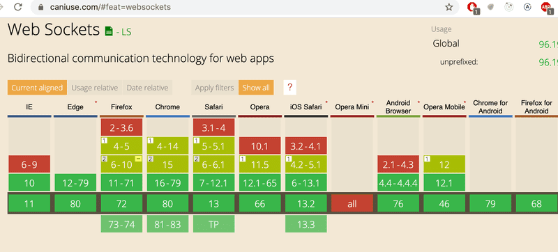

Instead of directly using the WebSocket API, it is advisable to use the [Socket.io](https://socket.io/) library, which provides various _fallback_ options in case the browser does not have full support for WebSockets.

In [part 8](https://fullstackopen.com/en/part8), our topic is GraphQL, which provides a nice mechanism for notifying clients when there are changes in the backend data.

### Virtual DOM

The concept of the Virtual DOM often comes up when discussing React. What is it all about? As mentioned in [part 0](https://fullstackopen.com/en/part0/fundamentals_of_web_apps#document-object-model-or-dom), browsers provide a [DOM API](https://developer.mozilla.org/fi/docs/DOM) through which the JavaScript running in the browser can modify the elements defining the appearance of the page.

```js
const element = <h1>Hello, world</h1>
```

they are also just JavaScript-based React elements at their core.

The React elements defining the appearance of the components of the application make up the [Virtual DOM](https://reactjs.org/docs/faq-internals.html#what-is-the-virtual-dom), which is stored in system memory during runtime.

With the help of the [ReactDOM](https://react.dev/reference/react-dom) library, the virtual DOM defined by the components is rendered to a real DOM that can be shown by the browser using the DOM API:

```js
ReactDOM.createRoot(document.getElementById('root')).render(<App />)
```

When the state of the application changes, a _new virtual DOM_ gets defined by the components. React has the previous version of the virtual DOM in memory and instead of directly rendering the new virtual DOM using the DOM API, React computes the optimal way to update the DOM (remove, add or modify elements in the DOM) such that the DOM reflects the new virtual DOM.

### On the role of React in applications

In the material, we may not have put enough emphasis on the fact that React is primarily a library for managing the creation of views for an application. If we look at the traditional [Model View Controller](https://en.wikipedia.org/wiki/Model%E2%80%93view%E2%80%93controller) pattern, then the domain of React would be View. React has a more narrow area of application than e.g. [Angular](https://angular.io/), which is an all-encompassing Frontend MVC framework. Therefore, React is not called a framework, but a library.

In small applications, data handled by the application is stored in the state of the React components, so in this scenario, the state of the components can be thought of as _models_ of an MVC architecture.

However, MVC architecture is not usually mentioned when talking about React applications. Furthermore, if we are using Redux, then the applications follow the [Flux](https://facebookarchive.github.io/flux/docs/in-depth-overview/) architecture and the role of React is even more focused on creating the views. The business logic of the application is handled using the Redux state and action creators. If we're using [Redux Thunk](../part6/README.md#asynchronous-actions-and-redux-thunk) familiar from part 6, then the business logic can be almost completely separated from the React code.

Because both React and Flux were created at Facebook, one could say that using React only as a UI library is the intended use case. Following the Flux architecture adds some overhead to the application, and if we're talking about a small application or prototype, it might be a good idea to use React "wrong", since [over-engineering](https://en.wikipedia.org/wiki/Overengineering) rarely yields an optimal result.

Part 6 [last chapter](../part6/README.md#part-6d---react-query-usereducer-and-the-context) covers the newer trends of state management in React. React's hook functions useReducer and useContext provide a kind of lightweight version of Redux. React Query, on the other hand, is a library that solves many of the problems associated with handling state on the server, eliminating the need for a React application to store data retrieved from the server directly in frontend state.

### React/node-application security

So far during the course, we have not touched on information security much. We do not have much time for this now either, but fortunately, University of Helsinki has a MOOC course [Securing Software](https://cybersecuritybase.mooc.fi/module-2.1) for this important topic.

We will, however, take a look at some things specific to this course.

The Open Web Application Security Project, otherwise known as [OWASP](https://www.owasp.org/), publishes an annual list of the most common security risks in Web applications. The most recent list can be found [here](https://owasp.org/Top10/). The same risks can be found from one year to another.

At the top of the list, we find _injection_, which means that e.g. text sent using a form in an application is interpreted completely differently than the software developer had intended. The most famous type of injection is probably [SQL injection](https://stackoverflow.com/questions/332365/how-does-the-sql-injection-from-the-bobby-tables-xkcd-comic-work).

For example, imagine that the following SQL query is executed in a vulnerable application:

```js
let query = "SELECT * FROM Users WHERE name = '" + userName + "';"
```

Now let's assume that a malicious user _Arto Hellas_ would define their name as

```
Arto Hell-as'; DROP TABLE Users; --
```

so that the name would contain a single quote `'`, which is the beginning and end character of a SQL string. As a result of this, two SQL operations would be executed, the second of which would destroy the database table _Users_:

```js
SELECT * FROM Users WHERE name = 'Arto Hell-as'; DROP TABLE Users; --'
```

SQL injections are prevented using [parameterized queries](https://security.stackexchange.com/questions/230211/why-are-stored-procedures-and-prepared-statements-the-preferred-modern-methods-f). With them, user input isn't mixed with the SQL query, but the database itself inserts the input values at placeholders in the query (usually `?`):

```js
execute("SELECT * FROM Users WHERE name = ?", [userName])
```

Injection attacks are also possible in NoSQL databases. However, mongoose prevents them by [sanitizing](https://zanon.io/posts/nosql-injection-in-mongodb) the queries. More on the topic can be found e.g. [here](https://web.archive.org/web/20220901024441/https://blog.websecurify.com/2014/08/hacking-nodejs-and-mongodb.html).

_Cross-site scripting (XSS)_ is an attack where it is possible to inject malicious JavaScript code into a legitimate web application. The malicious code would then be executed in the browser of the victim. If we try to inject the following into e.g. the notes application:

```js
<script>
  alert('Evil XSS attack')
</script>
```

the code is not executed, but is only rendered as 'text' on the page:

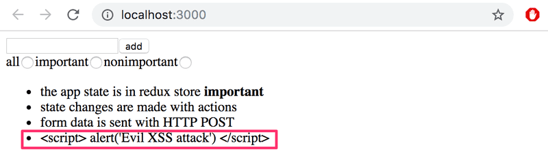

since React [takes care of sanitizing data in variables](https://legacy.reactjs.org/docs/introducing-jsx.html#jsx-prevents-injection-attacks). Some versions of React [have been vulnerable](https://medium.com/dailyjs/exploiting-script-injection-flaws-in-reactjs-883fb1fe36c1) to XSS attacks. The security holes have of course been patched, but there is no guarantee that there couldn't be any more.

One needs to remain vigilant when using libraries; if there are security updates to those libraries, it is advisable to update those libraries in one's applications. Security updates for Express are found in the [library's documentation](https://expressjs.com/en/advanced/security-updates.html) and the ones for Node are found in [this blog](https://nodejs.org/en/blog/vulnerability/).

You can check how up-to-date your dependencies are using the command

```bash
npm outdated --depth 0
```

The one-year-old project that is used in [part 9](https://fullstackopen.com/en/part9) of this course already has quite a few outdated dependencies:

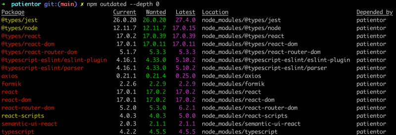

The dependencies can be brought up to date by updating the file _package.json_. The best way to do that is by using a tool called `npm-check-updates`. It can be installed globally by running the command:

```bash
npm install -g npm-check-updates
```

Using this tool, the up-to-dateness of dependencies is checked in the following way:

```bash
$ npm-check-updates
Checking ...\ultimate-hooks\package.json
[====================] 9/9 100%

 @testing-library/react       ^13.0.0  →  ^13.1.1
 @testing-library/user-event  ^14.0.4  →  ^14.1.1
 react-scripts                  5.0.0  →    5.0.1

Run ncu -u to upgrade package.json
```

The file package.json is brought up to date by running the command `ncu -u`.

```bash
$ ncu -u
Upgrading ...\ultimate-hooks\package.json
[====================] 9/9 100%

 @testing-library/react       ^13.0.0  →  ^13.1.1
 @testing-library/user-event  ^14.0.4  →  ^14.1.1
 react-scripts                  5.0.0  →    5.0.1

Run npm install to install new versions.
```

Then it is time to update the dependencies by running the command `npm install`. However, old versions of the dependencies are not necessarily a security risk.

The npm [audit](https://docs.npmjs.com/cli/audit) command can be used to check the security of dependencies. It compares the version numbers of the dependencies in your application to a list of the version numbers of dependencies containing known security threats in a centralized error database.

Running `npm audit` on the same project, it prints a long list of complaints and suggested fixes. Below is a part of the report:

```bash
$ patientor npm audit

... many lines removed ...

url-parse  <1.5.2
Severity: moderate
Open redirect in url-parse - https://github.com/advisories/GHSA-hh27-ffr2-f2jc
fix available via `npm audit fix`
node_modules/url-parse

ws  6.0.0 - 6.2.1 || 7.0.0 - 7.4.5
Severity: moderate
ReDoS in Sec-Websocket-Protocol header - https://github.com/advisories/GHSA-6fc8-4gx4-v693
ReDoS in Sec-Websocket-Protocol header - https://github.com/advisories/GHSA-6fc8-4gx4-v693
fix available via `npm audit fix`
node_modules/webpack-dev-server/node_modules/ws
node_modules/ws

120 vulnerabilities (102 moderate, 16 high, 2 critical)

To address issues that do not require attention, run:
  npm audit fix

To address all issues (including breaking changes), run:
  npm audit fix --force
```

After only one year, the code is full of small security threats. Luckily, there are only 2 critical threats. Let's run `npm audit fix` as the report suggests:

```bash
$ npm audit fix

+ mongoose@5.9.1
added 19 packages from 8 contributors, removed 8 packages and updated 15 packages in 7.325s
fixed 354 of 416 vulnerabilities in 20047 scanned packages
  1 package update for 62 vulns involved breaking changes
  (use `npm audit fix --force` to install breaking changes; or refer to `npm audit` for steps to fix these manually)
```

62 threats remain because, by default, `audit fix` does not update dependencies if their _major_ version number has increased. Updating these dependencies could lead to the whole application breaking down.

The source for the critical bug is the library [immer](https://github.com/immerjs/immer)

```bash
immer  <9.0.6
Severity: critical
Prototype Pollution in immer - https://github.com/advisories/GHSA-33f9-j839-rf8h
fix available via `npm audit fix --force`
Will install react-scripts@5.0.0, which is a breaking change
```

Running `npm audit fix --force` would upgrade the library version but would also upgrade the library `react-scripts` and that would potentially break down the development environment. So we will leave the library upgrades for later...

One of the threats mentioned in the list from OWASP is Broken_ Authentication_ and the related _Broken Access Control_. The token-based authentication we have been using is fairly robust if the application is being used on the traffic-encrypting HTTPS protocol. When implementing access control, one should e.g. remember to not only check a user's identity in the browser but also on the server. Bad security would be to prevent some actions to be taken only by hiding the execution options in the code of the browser.

On Mozilla's MDN, there is a very good [Website security guide](https://developer.mozilla.org/en-US/docs/Learn/Server-side/First_steps/Website_security), which brings up this very important topic:

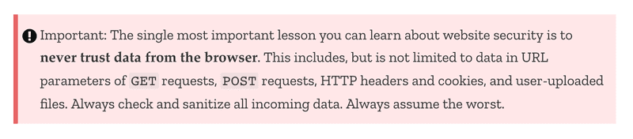

The documentation for Express includes a section on security: [Production Best Practices: Security](https://expressjs.com/en/advanced/best-practice-security.html), which is worth a read. It is also recommended to add a library called [Helmet](https://helmetjs.github.io/) to the backend. It includes a set of middleware that eliminates some security vulnerabilities in Express applications.

Using the ESlint [security-plugin](https://github.com/nodesecurity/eslint-plugin-security) is also worth doing.

### Current trends

Finally, let's take a look at some technology of tomorrow (or, actually, already today), and the directions in which Web development is heading.

#### Typed version of JavaScript

Sometimes, the [dynamic typing](https://developer.mozilla.org/en-US/docs/Glossary/Dynamic_typing) of JavaScript variables creates annoying bugs. In part 5, we talked briefly about [PropTypes](https://fullstackopen.com/en/part5/props_children_and_proptypes#prop-types): a mechanism which enables one to enforce type-checking for props passed to React components.

Lately, there has been a notable uplift in the interest in [static type checking](https://en.wikipedia.org/wiki/Type_system#Static_type_checking). At the moment, the most popular typed version of Javascript is [TypeScript](https://www.typescriptlang.org/) which has been developed by Microsoft. Typescript is covered in [part 9](https://fullstackopen.com/en/part9).

#### Server-side rendering, isomorphic applications and universal code

The browser is not the only domain where components defined using React can be rendered. The rendering can also be done on the [server](https://react.dev/reference/react-dom/server). This kind of approach is increasingly being used, such that, when accessing the application for the first time, the server serves a pre-rendered page made with React. From here onwards, the operation of the application continues, as usual, meaning the browser executes React, which manipulates the DOM shown by the browser. The rendering that is done on the server goes by the name: _server-side rendering_.

One motivation for server-side rendering is Search Engine Optimization (SEO). Search engines have traditionally been very bad at recognizing JavaScript-rendered content. However, the tide might be turning, e.g. take a look at [this](https://www.javascriptstuff.com/react-seo/) and [this](https://medium.freecodecamp.org/seo-vs-react-is-it-neccessary-to-render-react-pages-in-the-backend-74ce5015c0c9).

Of course, server-side rendering is not anything specific to React or even JavaScript. Using the same programming language throughout the stack in theory simplifies the execution of the concept because the same code can be run on both the front- and backend.

Along with server-side rendering, there has been talk of so-called _isomorphic applications_ and _universal code_, although there has been some debate about their [definitions](https://medium.com/@ghengeveld/isomorphism-vs-universal-javascript-4b47fb481beb). According to some definitions, an isomorphic web application performs rendering on both frontend and backend. On the other hand, universal code is code that can be executed in most environments, meaning both frontend and backend.

React and Node provide a desirable option for implementing an isomorphic application as universal code.

Writing universal code directly using React is currently still pretty cumbersome. Lately, a library called [Next.js](https://github.com/vercel/next.js), which is implemented on top of React, has garnered much attention and is a good option for making universal applications.

#### Progressive web apps

Lately, people have started using the term [progressive web app](https://developers.google.com/web/progressive-web-apps/) (PWA) launched by Google.

In short, we are talking about web applications working as well as possible on every platform and taking advantage of the best parts of those platforms. The smaller screen of mobile devices must not hamper the usability of the application. PWAs should also work flawlessly in offline mode or with a slow internet connection. On mobile devices, they must be installable just like any other application. All the network traffic in a PWA should be encrypted.

#### Microservice architecture

During this course, we have only scratched the surface of the server end of things. In our applications, we had a _monolithic_ backend, meaning one application making up a whole and running on a single server, serving only a few API endpoints.

As the application grows, the monolithic backend approach starts turning problematic both in terms of performance and maintainability.

A [microservice architecture](https://martinfowler.com/articles/microservices.html) (microservices) is a way of composing the backend of an application from many separate, independent services, which communicate with each other over the network. An individual microservice's purpose is to take care of a particular logical functional whole. In a pure microservice architecture, the services do not use a shared database.

For example, the bloglist application could consist of two services: one handling the user and another taking care of the blogs. The responsibility of the user service would be user registration and user authentication, while the blog service would take care of operations related to the blogs.

The image below visualizes the difference between the structure of an application based on a microservice architecture and one based on a more traditional monolithic structure:

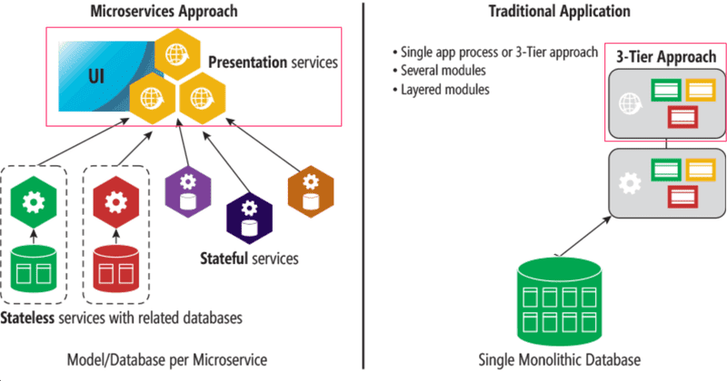

The role of the frontend (enclosed by a square in the picture) does not differ much between the two models. There is often a so-called [API gateway](http://microservices.io/patterns/apigateway) between the microservices and the frontend, which provides an illusion of a more traditional "everything on the same server" API. [Netflix](https://medium.com/netflix-techblog/optimizing-the-netflix-api-5c9ac715cf19), among others, uses this type of approach.

Microservice architectures emerged and evolved for the needs of large internet-scale applications. The trend was set by Amazon far before the appearance of the term microservice. The critical starting point was an email sent to all employees in 2002 by Amazon CEO Jeff Bezos:

>All teams will henceforth expose their data and functionality through service interfaces.
>
>Teams must communicate with each other through these interfaces.
>
>There will be no other form of inter-process communication allowed: no direct linking, no direct reads of another team’s data store, no shared-memory model, no back-doors whatsoever. The only communication allowed is via service interface calls over the network.
>
>It doesn’t matter what technology you use.
>
>All service interfaces, without exception, must be designed from the ground up to be externalize-able. That is to say, the team must plan and design to be able to expose the interface to developers in the outside world.
>
>No exceptions.
>
>Anyone who doesn’t do this will be fired. Thank you; have a nice day!

Nowadays, one of the biggest forerunners in the use of microservices is [Netflix](https://www.infoq.com/presentations/netflix-chaos-microservices).

The use of microservices has steadily been gaining hype to be kind of a [silver bullet](https://en.wikipedia.org/wiki/No_Silver_Bullet) of today, which is being offered as a solution to almost every kind of problem. However, there are several challenges when it comes to applying a microservice architecture, and it might make sense to go [monolith first](https://martinfowler.com/bliki/MonolithFirst.html) by initially making a traditional all-encompassing backend. Or maybe [not](https://martinfowler.com/articles/dont-start-monolith.html). There are a bunch of different opinions on the subject. Both links lead to Martin Fowler's site; as we can see, even the wise are not entirely sure which one of the right ways is more right.

Unfortunately, we cannot dive deeper into this important topic during this course. Even a cursory look at the topic would require at least 5 more weeks.

#### Serverless

After the release of Amazon's [lambda](https://aws.amazon.com/lambda/) service at the end of 2014, a new trend started to emerge in web application development: [serverless](https://serverless.com/).

The main thing about lambda, and nowadays also Google's [Cloud functions](https://cloud.google.com/functions/) as well as [similar functionality in Azure](https://azure.microsoft.com/en-us/services/functions/), is that it enables _the execution of individual functions in the cloud_. Before, the smallest executable unit in the cloud was a single process, e.g. a runtime environment running a Node backend.

E.g. Using [Amazon's API](https://aws.amazon.com/api-gateway/) gateway it is possible to make serverless applications where the requests to the defined HTTP API get responses directly from cloud functions. Usually, the functions already operate using stored data in the databases of the cloud service.

Serverless is not about there not being a server in applications, but about how the server is defined. Software developers can shift their programming efforts to a higher level of abstraction as there is no longer a need to programmatically define the routing of HTTP requests, database relations, etc., since the cloud infrastructure provides all of this. Cloud functions also lend themselves to creating a well-scaling system, e.g. Amazon's Lambda can execute a massive amount of cloud functions per second. All of this happens automatically through the infrastructure and there is no need to initiate new servers, etc.

### Useful libraries and interesting links

The JavaScript developer community has produced a large variety of useful libraries. If you are developing anything more substantial, it is worth it to check if existing solutions are already available. Below are listed some libraries recommended by trustworthy parties.

If your application has to handle complicated data, [lodash](https://www.npmjs.com/package/lodash), which we recommended in [part 4](../part4/README.md#exercise-43---47), is a good library to use. If you prefer the functional programming style, you might consider using [ramda](https://ramdajs.com/).

If you are handling times and dates, [date-fns](https://github.com/date-fns/date-fns) offers good tools for that.

If you have complex forms in your apps, have a look at whether [React Hook Form](https://react-hook-form.com/) would be a good fit.

If your application displays graphs, there are multiple options to choose from. Both [recharts](https://recharts.org/en-US/) and [highcharts](https://github.com/highcharts/highcharts-react) are well-recommended.

The [Immer](https://github.com/mweststrate/immer) provides immutable implementations of some data structures. The library could be of use when using Redux, since as we [remember](../part6/README.md#pure-functions-immutable) from part 6, reducers must be pure functions, meaning they must not modify the store's state but instead have to replace it with a new one when a change occurs.

[Redux-saga](https://redux-saga.js.org/) provides an alternative way to make asynchronous actions for [Redux Thunk](https://fullstackopen.com/en/part6/communicating_with_server_in_a_redux_application#asynchronous-actions-and-redux-thunk) familiar from part 6. Some embrace the hype and like it. I don't.

For single-page applications, the gathering of analytics data on the interaction between the users and the page is [more challenging](https://developers.google.com/analytics/devguides/collection/ga4/single-page-applications?implementation=browser-history) than for traditional web applications where the entire page is loaded. The [React Google Analytics 4](https://github.com/codler/react-ga4) library offers a solution.

You can take advantage of your React know-how when developing mobile applications using Facebook's extremely popular [React Native](https://facebook.github.io/react-native/) library, which is the topic of [part 10](https://fullstackopen.com/en/part10) of the course.

When it comes to the tools used for the management and bundling of JavaScript projects, the community has been very fickle. Best practices have changed rapidly (the years are approximations, nobody remembers that far back in the past):

- 2011 [Bower](https://www.npmjs.com/package/bower)

- 2012 [Grunt](https://www.npmjs.com/package/grunt)

- 2013-14 [Gulp](https://www.npmjs.com/package/gulp)

- 2012-14 [Browserify](https://www.npmjs.com/package/browserify)

- 2015-2023 [Webpack](https://www.npmjs.com/package/webpack)

- 2023- [esbuild](https://esbuild.github.io/)

Hipsters seemed to have lost their interest in tool development after webpack started to dominate the markets. A few years ago, Parcel started to make the rounds marketing itself as simple (which Webpack is not) and faster than Webpack. However, after a promising start, Parcel has not gathered any steam. But recently, esbuild has been on a high rise and is already replacing Webpack.

The site https://reactpatterns.com/ provides a concise list of best practices for React, some of which are already familiar from this course. Another similar list is [react bits](https://vasanthk.gitbooks.io/react-bits/).

[Reactiflux](https://www.reactiflux.com/) is a big chat community of React developers on Discord. It could be one possible place to get support after the course has concluded. For example, numerous libraries have their own channels.

If you know some recommendable links or libraries, make a pull request!

