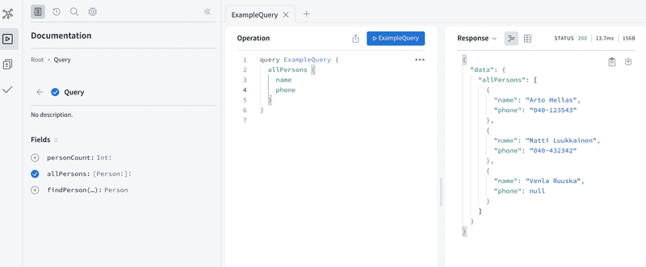
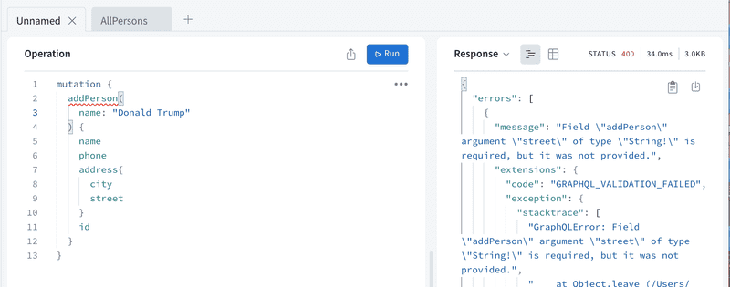
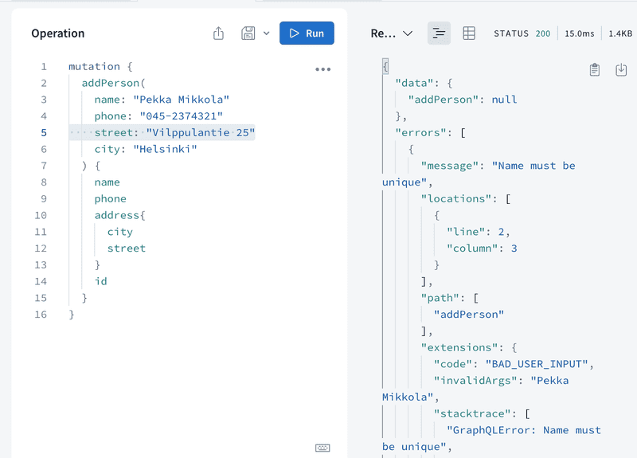
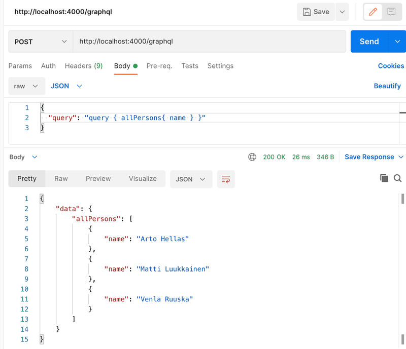
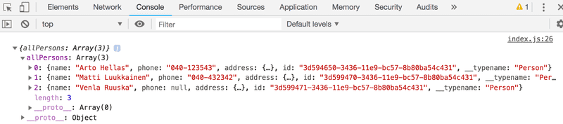
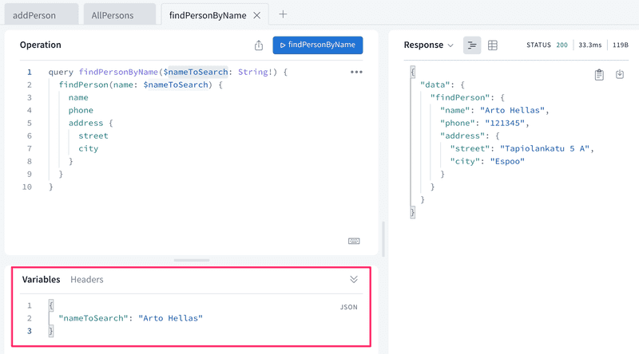
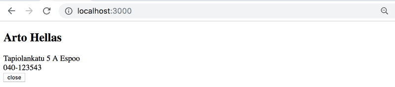
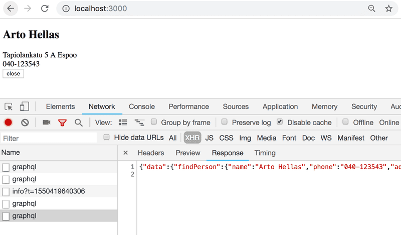
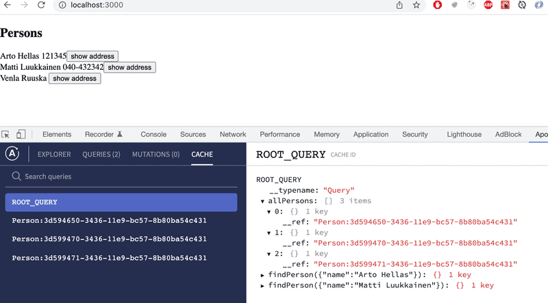
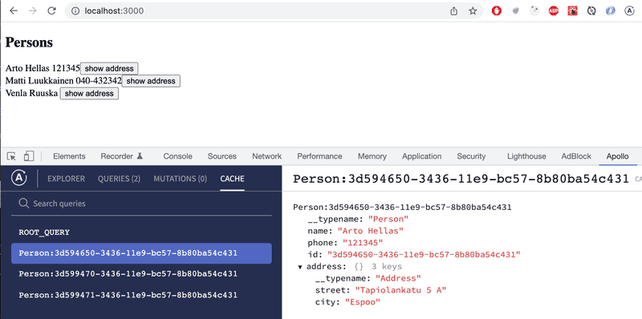

This part of the course is about GraphQL, Facebook's alternative to REST for communication between browser and server.

# Table of Contents

# Part 8

## Part 8a - GraphQL - server

REST, familiar to us from the previous parts of the course, has long been the most prevalent way to implement the interfaces servers offer for browsers, and in general the integration between different applications on the web.

In recent years, [GraphQL](http://graphql.org/), developed by Facebook, has become popular for communication between web applications and servers.

The GraphQL philosophy is very different from REST. REST is _resource-based_. Every resource, for example a _user_, has its own address which identifies it, for example /users/10. All operations done to the resource are done with HTTP requests to its URL. The action depends on the HTTP method used.

The resource-basedness of REST works well in most situations. However, it can be a bit awkward sometimes.

Let's consider the following example: our bloglist application contains some kind of social media functionality, and we would like to show a list of all the blogs that were added by users who have commented on any of the blogs of the users we follow.

If the server implemented a REST API, we would probably have to do multiple HTTP requests from the browser before we had all the data we wanted. The requests would also return a lot of unnecessary data, and the code on the browser would probably be quite complicated.

If this was an often-used functionality, there could be a REST endpoint for it. If there were a lot of these kinds of scenarios however, it would become very laborious to implement REST endpoints for all of them.

A GraphQL server is well-suited for these kinds of situations.

The main principle of GraphQL is that the code on the browser forms a _query_ describing the data wanted, and sends it to the API with an HTTP POST request. Unlike REST, all GraphQL queries are sent to the same address, and their type is POST.

The data described in the above scenario could be fetched with (roughly) the following query:

```js
query FetchBlogsQuery {
  user(username: "mluukkai") {
    followedUsers {
      blogs {
        comments {
          user {
            blogs {
              title
            }
          }
        }
      }
    }
  }
}
```

The content of the `FetchBlogsQuery` can be roughly interpreted as: find a user named `"mluukkai"` and for each of his `followedUsers`, find all their `blogs`, and for each blog, all its `comments`, and for each `user` who wrote each comment, find their `blogs`, and return the `title` of each of them.

The server's response would be about the following JSON object:

```json
{
  "data": {
    "followedUsers": [
      {
        "blogs": [
          {
            "comments": [
              {
                "user": {
                  "blogs": [
                    {
                      "title": "Goto considered harmful"
                    },
                    {
                      "title": "End to End Testing with Cypress is most enjoyable"
                    },
                    {
                      "title": "Navigating your transition to GraphQL"
                    },
                    {
                      "title": "From REST to GraphQL"
                    }
                  ]
                }
              }
            ]
          }
        ]
      }
    ]
  }
}
```

The application logic stays simple, and the code on the browser gets exactly the data it needs with a single query.

### Schema and queries

We will get to know the basics of GraphQL by implementing a GraphQL version of the phonebook application from parts 2 and 3.

In the heart of all GraphQL applications is a [schema](https://graphql.org/learn/schema/), which describes the data sent between the client and the server. The initial schema for our phonebook is as follows:

```js
type Person {
  name: String!
  phone: String
  street: String!
  city: String!
  id: ID! 
}

type Query {
  personCount: Int!
  allPersons: [Person!]!
  findPerson(name: String!): Person
}
```

The schema describes two [types](https://graphql.org/learn/schema/#type-system). The first type, _Person_, determines that persons have five fields. Four of the fields are type _String_, which is one of the [scalar types](https://graphql.org/learn/schema/#scalar-types) of GraphQL. All of the String fields, except _phone_, must be given a value. This is marked by the exclamation mark on the schema. The type of the field id is _ID_. _ID_ fields are strings, but GraphQL ensures they are unique.

The second type is a [Query](https://graphql.org/learn/schema/#the-query-and-mutation-types). Practically every GraphQL schema describes a Query, which tells what kind of queries can be made to the API.

The phonebook describes three different queries. `personCount` returns an integer, `allPersons` returns a list of _Person_ objects and `findPerson` is given a string parameter and it returns a _Person_ object.

Again, exclamation marks are used to mark which return values and parameters are _Non-Null_. `personCount` will, for sure, return an integer. The query `findPerson` must be given a string as a parameter. The query returns a _Person-object_ or _null_. `allPersons` returns a list of _Person_ objects, and the list does not contain any _null_ values.

So the schema describes what queries the client can send to the server, what kind of parameters the queries can have, and what kind of data the queries return.

The simplest of the queries, `personCount`, looks as follows:

```js
query {
  personCount
}
```

Assuming our application has saved the information of three people, the response would look like this:

```json
{
  "data": {
    "personCount": 3
  }
}
```

The query fetching the information of all of the people, `allPersons`, is a bit more complicated. Because the query returns a list of _Person_ objects, the query must describe _which [fields](https://graphql.org/learn/queries/#fields)_ of the objects the query returns:

```js
query {
  allPersons {
    name
    phone
  }
}
```

The response could look like this:

```json
{
  "data": {
    "allPersons": [
      {
        "name": "Arto Hellas",
        "phone": "040-123543"
      },
      {
        "name": "Matti Luukkainen",
        "phone": "040-432342"
      },
      {
        "name": "Venla Ruuska",
        "phone": null
      }
    ]
  }
}
```

A query can be made to return any field described in the schema. For example, the following would also be possible:

```js
query {
  allPersons{
    name
    city
    street
  }
}
```

The last example shows a query which requires a parameter, and returns the details of one person.

```js
query {
  findPerson(name: "Arto Hellas") {
    phone 
    city 
    street
    id
  }
}
```

So, first, the parameter is described in round brackets, and then the fields of the return value object are listed in curly brackets.

The response is like this:

```json
{
  "data": {
    "findPerson": {
      "phone": "040-123543",
      "city": "Espoo",
      "street": "Tapiolankatu 5 A"
      "id": "3d594650-3436-11e9-bc57-8b80ba54c431"
    }
  }
}
```

The return value was marked as nullable, so if we search for the details of an unknown

```js
query {
  findPerson(name: "Joe Biden") {
    phone 
  }
}
```

the return value is _null_.

```json
{
  "data": {
    "findPerson": null
  }
}
```

As you can see, there is a direct link between a GraphQL query and the returned JSON object. One can think that the query describes what kind of data it wants as a response. The difference to REST queries is stark. With REST, the URL and the type of the request have nothing to do with the form of the returned data.

GraphQL query describes only the data moving between a server and the client. On the server, the data can be organized and saved any way we like.

Despite its name, GraphQL does not actually have anything to do with databases. It does not care how the data is saved. The data a GraphQL API uses can be saved into a relational database, document database, or to other servers which a GraphQL server can access with for example REST.

### Apollo Server

Let's implement a GraphQL server with today's leading library: [Apollo Server](https://www.apollographql.com/docs/apollo-server/).

Create a new npm project with `npm init` and install the required dependencies.

```
npm install @apollo/server graphql
```

Also create a `index.js` file in your project's root directory.

The initial code is as follows:

```js
const { ApolloServer } = require('@apollo/server')
const { startStandaloneServer } = require('@apollo/server/standalone')

let persons = [
  {
    name: "Arto Hellas",
    phone: "040-123543",
    street: "Tapiolankatu 5 A",
    city: "Espoo",
    id: "3d594650-3436-11e9-bc57-8b80ba54c431"
  },
  {
    name: "Matti Luukkainen",
    phone: "040-432342",
    street: "Malminkaari 10 A",
    city: "Helsinki",
    id: '3d599470-3436-11e9-bc57-8b80ba54c431'
  },
  {
    name: "Venla Ruuska",
    street: "Nallemäentie 22 C",
    city: "Helsinki",
    id: '3d599471-3436-11e9-bc57-8b80ba54c431'
  },
]

const typeDefs = `
  type Person {
    name: String!
    phone: String
    street: String!
    city: String! 
    id: ID!
  }

  type Query {
    personCount: Int!
    allPersons: [Person!]!
    findPerson(name: String!): Person
  }
`

const resolvers = {
  Query: {
    personCount: () => persons.length,
    allPersons: () => persons,
    findPerson: (root, args) =>
      persons.find(p => p.name === args.name)
  }
}

const server = new ApolloServer({
  typeDefs,
  resolvers,
})

startStandaloneServer(server, {
  listen: { port: 4000 },
}).then(({ url }) => {
  console.log(`Server ready at ${url}`)
})
```

The heart of the code is an [ApolloServer](https://www.apollographql.com/docs/apollo-server/api/apollo-server/), which is given two parameters:

```js
const server = new ApolloServer({
  typeDefs,
  resolvers,
})
```

The first parameter, `typeDefs`, contains the GraphQL schema.

The second parameter is an object, which contains the [resolvers](https://www.apollographql.com/docs/apollo-server/data/resolvers/) of the server. These are the code, which defines _how_ GraphQL queries are responded to.

The code of the resolvers is the following:

```js
const resolvers = {
  Query: {
    personCount: () => persons.length,
    allPersons: () => persons,
    findPerson: (root, args) =>
      persons.find(p => p.name === args.name)
  }
}
```

As you can see, the resolvers correspond to the queries described in the schema.

```js
type Query {
  personCount: Int!
  allPersons: [Person!]!
  findPerson(name: String!): Person
}
```

So there is a field under _Query_ for every query described in the schema.

The query

```js
query {
  personCount
}
```

Has the resolver

```js
() => persons.length
```

So the response to the query is the length of the array `persons`.

The query which fetches all persons

```js
query {
  allPersons {
    name
  }
}
```

has a resolver which returns _all_ objects from the `persons` array.

```js
() => persons
```

Start the server by running `node index.js` in the terminal.

### Apollo Studio Explorer

When Apollo server is run in development mode the page http://localhost:4000 has a button _Query your server_ that takes us to [GraphOS Studio Explorer](https://www.apollographql.com/docs/graphos/platform/explorer). This is very useful for a developer, and can be used to make queries to the server.

Let's try it out:



At the left side Explorer shows the API-documentation that it has automatically generated based on the schema.

### Parameters of a resolver

The query fetching a single person

```js
query {
  findPerson(name: "Arto Hellas") {
    phone 
    city 
    street
  }
}
```

has a resolver which differs from the previous ones because it is given _two parameters_:

```js
(root, args) => persons.find(p => p.name === args.name)
```

The second parameter, `args`, contains the parameters of the query. The resolver then returns from the array `persons` the person whose name is the same as the value of _args.name_. The resolver does not need the first parameter `root`.

In fact, all resolver functions are given [four parameters](https://www.graphql-tools.com/docs/resolvers#resolver-function-signature). With JavaScript, the parameters don't have to be defined if they are not needed. We will be using the first and the third parameter of a resolver later in this part.

### The default resolver

When we do a query, for example

```js
query {
  findPerson(name: "Arto Hellas") {
    phone 
    city 
    street
  }
}
```

the server knows to send back exactly the fields required by the query. How does that happen?

A GraphQL server must define resolvers for _each_ field of each type in the schema. We have so far only defined resolvers for fields of the type _Query_, so for each query of the application.

Because we did not define resolvers for the fields of the type _Person_, Apollo has defined [default resolvers](https://www.graphql-tools.com/docs/resolvers/#default-resolver) for them. They work like the one shown below:

```js
const resolvers = {
  Query: {
    personCount: () => persons.length,
    allPersons: () => persons,
    findPerson: (root, args) => persons.find(p => p.name === args.name)
  },

  Person: {
    name: (root) => root.name,
    phone: (root) => root.phone,
    street: (root) => root.street,
    city: (root) => root.city,
    id: (root) => root.id
  }
}
```

The default resolver returns the value of the corresponding field of the object. The object itself can be accessed through the first parameter of the resolver, `root`.

If the functionality of the default resolver is enough, you don't need to define your own. It is also possible to define resolvers for only some fields of a type, and let the default resolvers handle the rest.

We could for example define that the address of all persons is _Manhattan New York_ by hard-coding the following to the resolvers of the street and city fields of the type _Person_:

```js
Person: {
  street: (root) => "Manhattan",
  city: (root) => "New York"
}
```

### Object within an object

Let's modify the schema a bit

```js
type Address {
  street: String!
  city: String! 
}

type Person {
  name: String!
  phone: String

  address: Address!
  id: ID!
}

type Query {
  personCount: Int!
  allPersons: [Person!]!
  findPerson(name: String!): Person
}
```

so a person now has a field with the type _Address_, which contains the street and the city.

The queries requiring the address change into

```js
query {
  findPerson(name: "Arto Hellas") {
    phone 
    address {
      city 
      street
    }
  }
}
```

and the response is now a person object, which _contains_ an address object.

```json
{
  "data": {
    "findPerson": {
      "phone": "040-123543",
      "address":  {
        "city": "Espoo",
        "street": "Tapiolankatu 5 A"
      }
    }
  }
}
```

We still save the persons in the server the same way we did before.

```js
let persons = [
  {
    name: "Arto Hellas",
    phone: "040-123543",
    street: "Tapiolankatu 5 A",
    city: "Espoo",
    id: "3d594650-3436-11e9-bc57-8b80ba54c431"
  },
  // ...
]
```

The person-objects saved in the server are not exactly the same as the GraphQL type _Person_ objects described in the schema.

Contrary to the _Person_ type, the _Address_ type does not have an _id_ field, because they are not saved into their own separate data structure in the server.

Because the objects saved in the array do not have an _address_ field, the default resolver is not sufficient. Let's add a resolver for the _address_ field of _Person_ type:

```js
const resolvers = {
  Query: {
    personCount: () => persons.length,
    allPersons: () => persons,
    findPerson: (root, args) =>
      persons.find(p => p.name === args.name)
  },

  Person: {
    address: (root) => {
      return { 
        street: root.street,
        city: root.city
      }
    }
  }
}
```

So every time a _Person_ object is returned, the fields _name_, _phone_ and _id_ are returned using their default resolvers, but the field _address_ is formed by using a self-defined resolver. The parameter `root` of the resolver function is the person-object, so the street and the city of the address can be taken from its fields.

The current code of the application can be found on [Github](https://github.com/fullstack-hy2020/graphql-phonebook-backend/tree/part8-1), branch _part8-1_.

### Mutations

Let's add a functionality for adding new persons to the phonebook. In GraphQL, all operations which cause a change are done with [mutations](https://graphql.org/learn/mutations). Mutations are described in the schema as the keys of type _Mutation_.

The schema for a mutation for adding a new person looks as follows:

```js
type Mutation {
  addPerson(
    name: String!
    phone: String
    street: String!
    city: String!
  ): Person
}
```

The Mutation is given the details of the person as parameters. The parameter _phone_ is the only one which is nullable. The Mutation also has a return value. The return value is type _Person_, the idea being that the details of the added person are returned if the operation is successful and if not, null. Value for the field _id_ is not given as a parameter. Generating an id is better left for the server.

Mutations also require a resolver:

```js
const { v1: uuid } = require('uuid')

// ...

const resolvers = {
  // ...
  Mutation: {
    addPerson: (root, args) => {
      const person = { ...args, id: uuid() }
      persons = persons.concat(person)
      return person
    }
  }
}
```

The mutation adds the object given to it as a parameter `args` to the array `persons`, and returns the object it added to the array.

The _id_ field is given a unique value using the [uuid](https://github.com/kelektiv/node-uuid#readme) library.

A new person can be added with the following mutation

```js
mutation {
  addPerson(
    name: "Pekka Mikkola"
    phone: "045-2374321"
    street: "Vilppulantie 25"
    city: "Helsinki"
  ) {
    name
    phone
    address{
      city
      street
    }
    id
  }
}
```

Note that the person is saved to the `persons` array as

```js
{
  name: "Pekka Mikkola",
  phone: "045-2374321",
  street: "Vilppulantie 25",
  city: "Helsinki",
  id: "2b24e0b0-343c-11e9-8c2a-cb57c2bf804f"
}
```

But the response to the mutation is

```js
{
  "data": {
    "addPerson": {
      "name": "Pekka Mikkola",
      "phone": "045-2374321",
      "address": {
        "city": "Helsinki",
        "street": "Vilppulantie 25"
      },
      "id": "2b24e0b0-343c-11e9-8c2a-cb57c2bf804f"
    }
  }
}
```

So the resolver of the _address_ field of the _Person_ type formats the response object to the right form.

### Error handling

If we try to create new person, but the parameters fo not correspond with the schema description, the server gives an error message:



So some of the error handling can be automatically done with GraphQL [validation](https://graphql.org/learn/validation/).

However, GraphQL cannot handle everything automatically. For example, stricter rules for data sent to a Mutation have to be added manually. An error could be handled by throwing [GraphQLError](https://www.apollographql.com/docs/apollo-server/data/errors/#custom-errors) with a proper [error code](https://www.apollographql.com/docs/apollo-server/data/errors/#built-in-error-codes).

Let's prevent adding the same name to the phonebook multiple times:

```js
const { GraphQLError } = require('graphql')

// ...

const resolvers = {
  // ..
  Mutation: {
    addPerson: (root, args) => {

      if (persons.find(p => p.name === args.name)) {
        throw new GraphQLError('Name must be unique', {
          extensions: {
            code: 'BAD_USER_INPUT',
            invalidArgs: args.name
          }
        })
      }

      const person = { ...args, id: uuid() }
      persons = persons.concat(person)
      return person
    }
  }
}
```

So if the name to be added already exists in the phonebook, throw `GraphQLError` error.



The current code of the application can be found on [GitHub](https://github.com/fullstack-hy2020/graphql-phonebook-backend/tree/part8-2), branch _part8-2_.

### Enum

Let's add a possibility to filter the query returning all persons with the parameter _phone_ so that it returns only persons with a phone number

```js
query {
  allPersons(phone: YES) {
    name
    phone 
  }
}
```

or persons without a phone number 

```js
query {
  allPersons(phone: NO) {
    name
  }
}
```

The schema changes like so:

```js
enum YesNo {
  YES
  NO
}

type Query {
  personCount: Int!

  allPersons(phone: YesNo): [Person!]!
  findPerson(name: String!): Person
}
```

The type _YesNo_ is a GraphQL [enum](https://graphql.org/learn/schema/#enumeration-types), or an enumerable, with two possible values: _YES_ or _NO_. In the query `allPersons`, the parameter `phone` has the type _YesNo_, but is nullable.

The resolver changes like so:

```js
Query: {
  personCount: () => persons.length,

  allPersons: (root, args) => {
    if (!args.phone) {
      return persons
    }
    const byPhone = (person) =>
      args.phone === 'YES' ? person.phone : !person.phone
    return persons.filter(byPhone)
  },
  findPerson: (root, args) =>
    persons.find(p => p.name === args.name)
},
```

### Changing a phone number

Let's add a mutation for changing the phone number of a person. The schema of this mutation looks as follows:

```js
type Mutation {
  addPerson(
    name: String!
    phone: String
    street: String!
    city: String!
  ): Person

  editNumber(
    name: String!
    phone: String!
  ): Person
}
```

and is done by a resolver:

```js
Mutation: {
  // ...
  editNumber: (root, args) => {
    const person = persons.find(p => p.name === args.name)
    if (!person) {
      return null
    }

    const updatedPerson = { ...person, phone: args.phone }
    persons = persons.map(p => p.name === args.name ? updatedPerson : p)
    return updatedPerson
  }   
}
```

The mutation finds the person to be updated by the field _name_.

The current code of the application can be found on [Github](https://github.com/fullstack-hy2020/graphql-phonebook-backend/tree/part8-3), branch _part8-3_.

### More on queries

With GraphQL, it is possible to combine multiple fields of type Query, or "separate queries" into one query. For example, the following query returns both the amount of persons in the phonebook and their names:

```js
query {
  personCount
  allPersons {
    name
  }
}
```

The response looks as follows:

```json
{
  "data": {
    "personCount": 3,
    "allPersons": [
      {
        "name": "Arto Hellas"
      },
      {
        "name": "Matti Luukkainen"
      },
      {
        "name": "Venla Ruuska"
      }
    ]
  }
}
```

Combined query can also use the same query multiple times. You must however give the queries alternative names like so:

```js
query {
  havePhone: allPersons(phone: YES){
    name
  }
  phoneless: allPersons(phone: NO){
    name
  }
}
```

The response looks like:

```json
{
  "data": {
    "havePhone": [
      {
        "name": "Arto Hellas"
      },
      {
        "name": "Matti Luukkainen"
      }
    ],
    "phoneless": [
      {
        "name": "Venla Ruuska"
      }
    ]
  }
}
```

In some cases, it might be beneficial to name the queries. This is the case especially when the queries or mutations have [parameters](https://graphql.org/learn/queries/#variables). We will get into parameters soon.

<hr style="border: 2px solid rgba(90, 171, 163, 1)">

### Exercises 8.1 - 8.7

Through the exercises, we will implement a GraphQL backend for a small library. Start with [this file](https://github.com/fullstack-hy2020/misc/blob/master/library-backend.js). Remember to `npm init` and to install dependencies!

#### 8.1: The number of books and authors

Implement queries `bookCount` and `authorCount1 which return the number of books and the number of authors. 

The query

```js
query {
  bookCount
  authorCount
}
```

should return

```json
{
  "data": {
    "bookCount": 7,
    "authorCount": 5
  }
}
```

#### 8.2 - All books

Implement query `allBooks`, which returns the details of all books. 

In the end, the user should be able to do the following query:

```js
query {
  allBooks { 
    title 
    author
    published 
    genres
  }
}
```

#### All authors

Implement query `allAuthors`, which returns the details of all authors. The response should include a field `bookCount` containing the number of books the author has written.

For example the query

```js
query {
  allAuthors {
    name
    bookCount
  }
}
```

should return 

```json
{
  "data": {
    "allAuthors": [
      {
        "name": "Robert Martin",
        "bookCount": 2
      },
      {
        "name": "Martin Fowler",
        "bookCount": 1
      },
      {
        "name": "Fyodor Dostoevsky",
        "bookCount": 2
      },
      {
        "name": "Joshua Kerievsky",
        "bookCount": 1
      },
      {
        "name": "Sandi Metz",
        "bookCount": 1
      }
    ]
  }
}
```

#### 8.4: Books of an author

Modify the `allBooks` query so that a user can give an optional parameter _author_. The response should include only books written by that author.

For example query

```js
query {
  allBooks(author: "Robert Martin") {
    title
  }
}
```

should return 

```json
{
  "data": {
    "allBooks": [
      {
        "title": "Clean Code"
      },
      {
        "title": "Agile software development"
      }
    ]
  }
}
```

#### 8.5: Books by genre

Modify the query `allBooks` so that a user can give an optional parameter _genre_. The response should include only books of that genre.

For example query

```js
query {
  allBooks(genre: "refactoring") {
    title
    author
  }
}
```

should return 

```json
{
  "data": {
    "allBooks": [
      {
        "title": "Clean Code",
        "author": "Robert Martin"
      },
      {
        "title": "Refactoring, edition 2",
        "author": "Martin Fowler"
      },
      {
        "title": "Refactoring to patterns",
        "author": "Joshua Kerievsky"
      },
      {
        "title": "Practical Object-Oriented Design, An Agile Primer Using Ruby",
        "author": "Sandi Metz"
      }
    ]
  }
}
```

The query must work when both optional parameters are given:

```js
query {
  allBooks(author: "Robert Martin", genre: "refactoring") {
    title
    author
  }
}
```

#### 8.6: Adding a book 

Implement mutation `addBook`, which can be used like this:

```js
mutation {
  addBook(
    title: "NoSQL Distilled",
    author: "Martin Fowler",
    published: 2012,
    genres: ["database", "nosql"]
  ) {
    title,
    author
  }
}
```

The mutation works even if the author is not already saved to the server:

```js
mutation {
  addBook(
    title: "Pimeyden tango",
    author: "Reijo Mäki",
    published: 1997,
    genres: ["crime"]
  ) {
    title,
    author
  }
}
```

If the author is not yer saved to the server, a new author is added to the system. The birth years of authors are ot saved to the server yet, so the query

```js
query {
  allAuthors {
    name
    born
    bookCount
  }
}
```

returns

```json
{
  "data": {
    "allAuthors": [
      // ...
      {
        "name": "Reijo Mäki",
        "born": null,
        "bookCount": 1
      }
    ]
  }
}
```

#### 8.7: Updating the birth of an author

Implement mutation `editAuthor`, which can be used to set a birth year for an author. The mutation is used like so:

```js
mutation {
  editAuthor(name: "Reijo Mäki", setBornTo: 1958) {
    name
    born
  }
}
```

If the correct author is found, the operation returns the edited author:

```json
{
  "data": {
    "editAuthor": {
      "name": "Reijo Mäki",
      "born": 1958
    }
  }
}
```

If the author is not in the system, _null_ is returned:

```json
{
  "data": {
    "editAuthor": null
  }
}
```

<hr style="border: 2px solid rgba(90, 171, 163, 1)">

## Part 8b - React and GraphQL

We will next implement a React app that uses the GraphQL server we created.

The current code of the server can be found on [GitHub](https://github.com/fullstack-hy2020/graphql-phonebook-backend/tree/part8-3), branch _part8-3_.

In theory, we could use GraphQL with HTTP POST requests. The following shows an example of this with Postman:



The communication works by sending HTTP POST requests to http://localhost:4000/graphql. The query itself is a string sent as the value of the key _query_.

We could take care of the communication between the React app and GraphQL by using Axios. However, most of the time, it is not very sensible to do so. It is a better idea to use a higher-order library capable of abstracting the unnecessary details of the communication.

At the moment, there are two good options: [Relay](https://facebook.github.io/relay/) by Facebook and [Apollo Client](https://www.apollographql.com/docs/react/), which is the client side of the same library we used in the previous section. Apollo is absolutely the most popular of the two, and we will use it in this section as well.

### Apollo client

Let us create a new React app, and can continue installing dependencies required by [Apollo client](https://www.apollographql.com/docs/react/get-started/).

```
npm install @apollo/client graphql
```

We'll start with the following code for our application:

```js
import ReactDOM from 'react-dom/client'
import App from './App'

import { ApolloClient, InMemoryCache, gql } from '@apollo/client'

const client = new ApolloClient({
  uri: 'http://localhost:4000',
  cache: new InMemoryCache(),
})

const query = gql`
  query {
    allPersons  {
      name,
      phone,
      address {
        street,
        city
      }
      id
    }
  }
`

client.query({ query })
  .then((response) => {
    console.log(response.data)
  })


ReactDOM.createRoot(document.getElementById('root')).render(<App />)
```

The beginning of the code creates a new client object, which is then used to send a query to the server:

```js
client.query({ query })
  .then((response) => {
    console.log(response.data)
  })
```

The server's response is printed to the console:



The application can communicate with a GraphQL server using the `client` object. The client can be made accessible for all components of the application by wrapping the _App_ component with [ApolloProvider](https://www.apollographql.com/docs/react/get-started#step-4-connect-your-client-to-react).

```js
import ReactDOM from 'react-dom/client'
import App from './App'

import {
  ApolloClient,
  ApolloProvider,
  InMemoryCache,
} from '@apollo/client'

const client = new ApolloClient({
  uri: 'http://localhost:4000',
  cache: new InMemoryCache(),
})

ReactDOM.createRoot(document.getElementById('root')).render(
  <ApolloProvider client={client}>
    <App />
  </ApolloProvider>
)
```

### Making queries

We are ready to implement the main view of the application, which shows a list of person's name and phone number.

Apollo Client offers a few alternatives for making [queries](https://www.apollographql.com/docs/react/data/queries/). Currently, the use of the hook function [useQuery](https://www.apollographql.com/docs/react/api/react/hooks/#usequery) is the dominant practice.

The query is made by the _App_ component, the code of which is as follows:

```js
import { gql, useQuery } from '@apollo/client'

const ALL_PERSONS = gql`
query {
  allPersons {
    name
    phone
    id
  }
}
`

const App = () => {
  const result = useQuery(ALL_PERSONS)

  if (result.loading) {
    return <div>loading...</div>
  }

  return (
    <div>
      {result.data.allPersons.map(p => p.name).join(', ')}
    </div>
  )
}

export default App
```

When called, `useQuery` makes the query it receives as a parameter. It returns an object with multiple [fields](https://www.apollographql.com/docs/react/api/react/hooks/#result). The field _loading_ is true if the query has not received a response yet. Then the following code gets rendered:

```js
if (result.loading) {
  return <div>loading...</div>
}
```

When a response is received, the result of the _allPersons_ query can be found in the data field, and we can render the list of names to the screen.

```js
<div>
  {result.data.allPersons.map(p => p.name).join(', ')}
</div>
```

Let's separate displaying the list of persons into its own component:

```js
const Persons = ({ persons }) => {
  return (
    <div>
      <h2>Persons</h2>
      {persons.map(p =>
        <div key={p.name}>
          {p.name} {p.phone}
        </div>  
      )}
    </div>
  )
}
```

The `App` component still makes the query, and passes the result to the new component to be rendered:

```js
const App = () => {
  const result = useQuery(ALL_PERSONS)

  if (result.loading)  {
    return <div>loading...</div>
  }

  return (
    <Persons persons={result.data.allPersons}/>
  )
}
```

### Named queries and variables

Let's implement functionality for viewing the address details of a person. The _findPerson_ query is well-suited for this.

The queries we did in the last chapter had the parameter hardcoded into the query:

```js
query {
  findPerson(name: "Arto Hellas") {
    phone 
    city 
    street
    id
  }
}
```

When we do queries programmatically, we must be able to give them parameters dynamically.

GraphQL [variables](https://graphql.org/learn/queries/#variables) are well-suited for this. To be able to use variables, we must also name our queries.

A good format for the query is this:

```js
query findPersonByName($nameToSearch: String!) {
  findPerson(name: $nameToSearch) {
    name
    phone 
    address {
      street
      city
    }
  }
}
```

The name of the query is _findPersonByName_, and it is given a string _$nameToSearch_ as a parameter.

It is also possible to do queries with parameters with the Apollo Explorer. The parameters are given in _Variables_:



The `useQuery` hook is well-suited for situations where the query is done when the component is rendered. However, we now want to make the query only when a user wants to see the details of a specific person, so the query is done only [as required](https://www.apollographql.com/docs/react/data/queries/#executing-queries-manually).

One possibility for this kind of situations is the hook function [useLazyQuery](https://www.apollographql.com/docs/react/api/react/hooks/#uselazyquery) that would make it possible to define a query which is executed _when_ the user wants to see the detailed information of a person.

However, in our case we can stick to `useQuery` and use the option [skip](https://www.apollographql.com/docs/react/data/queries#skipoptional), which makes it possible to do the query only if a set condition is true.

The solution is as follows:

```js
import { useState } from 'react'
import { gql, useQuery } from '@apollo/client'

const FIND_PERSON = gql`
  query findPersonByName($nameToSearch: String!) {
    findPerson(name: $nameToSearch) {
      name
      phone
      id
      address {
        street
        city
      }
    }
  }
`

const Person = ({ person, onClose }) => {
  return (
    <div>
      <h2>{person.name}</h2>
      <div>
        {person.address.street} {person.address.city}
      </div>
      <div>{person.phone}</div>
      <button onClick={onClose}>close</button>
    </div>
  )
}

const Persons = ({ persons }) => {
  const [nameToSearch, setNameToSearch] = useState(null)
  const result = useQuery(FIND_PERSON, {
    variables: { nameToSearch },
    skip: !nameToSearch,
  })

  if (nameToSearch && result.data) {
    return (
      <Person
        person={result.data.findPerson}
        onClose={() => setNameToSearch(null)}
      />
    )
  }

  return (
    <div>
      <h2>Persons</h2>
      {persons.map((p) => (
        <div key={p.name}>
          {p.name} {p.phone} 
          <button onClick={() => setNameToSearch(p.name)}>
            show address
          </button>
        </div>
      ))}
    </div>
  )
}

export default Persons
```

The code has changed quite a lot, and all of the changes are not completely apparent.

When the button _show address_ of a person is pressed, the name of the person is set to state _nameToSearch_:

```js
<button onClick={() => setNameToSearch(p.name)}>
  show address
</button>
```

This causes the component to re-render itself. On render the query *FIND_PERSON* that fetches the detailed information of a user is executed if the variable _nameToSearch_ has a value:

```js
const result = useQuery(FIND_PERSON, {
  variables: { nameToSearch },
  skip: !nameToSearch,
})
```

When the user is not interested in seeing the detailed info of any person, the state variable _nameToSearch_ is null and the query is not executed.

If the state _nameToSearch_ has a value and the query result is ready, the component _Person_ renders the detailed info of a person:

```js
if (nameToSearch && result.data) {
  return (
    <Person
      person={result.data.findPerson}
      onClose={() => setNameToSearch(null)}
    />
  )
}
```

A single-person view looks like this:



When a user wants to return to the person list, the `nameToSearch` state is set to `null`.

The current code of the application can be found on [GitHub](https://github.com/fullstack-hy2020/graphql-phonebook-frontend/tree/part8-1) branch _part8-1_.

### Cache

When we do multiple queries, for example with the address details of Arto Hellas, we notice something interesting: the query to the backend is done only the first time around. After this, despite the same query being done again by the code, the query is not sent to the backend.



Apollo client saves the responses of queries to [cache](https://www.apollographql.com/docs/react/caching/overview/). To optimize performance if the response to a query is already in the cache, the query is not sent to the server at all.



Cache shows the detailed info of Arto Hellas after the query _findPerson_:



