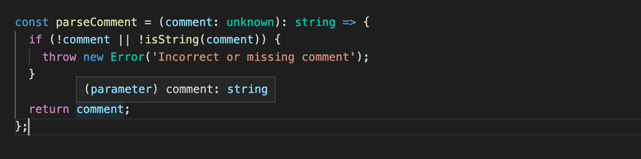

This part is all about TypeScript: an open-source typed superset of JavaScript developed by Microsoft that compiles to plain JavaScript.

In this part, we will be using the tools previously introduced to build end-to-end features to an existing ecosystem, with predefined linters and an existing codebase, while writing TypeScript. After doing this part, you should be able to understand, develop and configure projects using TypeScript.

This part is created by Tuomo Torppa, Tuukka Peuraniemi and Jani Rapo, the awesome developers of Terveystalo, the largest private healthcare service provider in Finland. Terveystalo’s nationwide network covers 300 locations across Finland. The clinic network is supplemented by 24/7 digital services.

# Table of Content

- [Part 9](#part-9)
  - [Part 9a - Background and introduction](#part-9a---background-and-introduction)
    - [Main principle](#main-principle)
    - [TypeScript key language features](#typescript-key-language-features)
    - [Why should one use TypeScript?](#why-should-one-use-typescript)
    - [What does TypeScript not fix?](#what-does-typescript-not-fix)
    - [Incomplete, invalid or missing types in external libraries](#incomplete-invalid-or-missing-types-in-external-libraries)
    - [Sometimes, type inference needs assistance](#sometimes-type-inference-needs-assistance)
    - [Mysterious type errors](#mysterious-type-errors)
  - [Part 9b - First steps with TypeScript](#part-9b---first-steps-with-typescript)
    - [Setting things up](#setting-things-up)
    - [A note about the coding style](#a-note-about-the-coding-style)
    - [Creating your first own types](#creating-your-first-own-types)
    - [Type narrowing](#type-narrowing)
    - [Accessing command line arguments](#accessing-command-line-arguments)
    - [@types/{npm_package}](#typesnpm_package)
    - [Improving the project](#improving-the-project)
    - [The alternative array syntax](#the-alternative-array-syntax)
    - [Exercises 9.1 - 9.3](#exercises-91---93)
      - [setup](#setup)
      - [9.1: Body mass index](#91-body-mass-index)
      - [9.2: Exercise calculator](#92-exercise-calculator)
      - [9.3: Command line](#93-command-line)
    - [More about tsconfig](#more-about-tsconfig)
    - [Adding Express to the mix](#adding-express-to-the-mix)
    - [Exercise 9.4 - 9.5](#exercise-94---95)
      - [9.4 Express](#94-express)
      - [9.5 WebBMI](#95-webbmi)
    - [The horrors of any](#the-horrors-of-any)
    - [Type assertion](#type-assertion)
    - [Exercises 9.6 - 9.7](#exercises-96---97)
      - [9.6: Eslint](#96-eslint)
      - [9.7: WebExercises](#97-webexercises)
  - [Part 9c - Typing an Express app](#part-9c---typing-an-express-app)
    - [Setting up the project](#setting-up-the-project)
    - [Let there be code](#let-there-be-code)
    - [Exercise 9.8 - 9.9](#exercise-98---99)
      - [9.8: Patientor backend, step 1](#98-patientor-backend-step-1)
      - [9.8: Patientor backend, step 2](#98-patientor-backend-step-2)
    - [Implementing the functionality](#implementing-the-functionality)
    - [Utility Types](#utility-types)
    - [Preventing an accidental undefined result](#preventing-an-accidental-undefined-result)
    - [Adding a new diary](#adding-a-new-diary)
    - [Validating requests](#validating-requests)
    - [Type guards](#type-guards)
    - [Enum](#enum)
    - [Node and JSON modules](#node-and-json-modules)
    - [Parsing request body in middleware](#parsing-request-body-in-middleware)
    - [Exercises 9.10 - 9.11](#exercises-910---911)
      - [Patientor backend, step 4](#patientor-backend-step-4)
    - [Exercises 9.12 - 9.13](#exercises-912---913)
      - [9.12: Patientor backend, step 5](#912-patientor-backend-step-5)
      - [9.13: Patientor backend, step 6](#913-patientor-backend-step-6)
    - [Using schema validation libraries](#using-schema-validation-libraries)
    - [Exercises 9.14](#exercises-914)
      - [9.14: Patientor backend, step 7](#914-patientor-backend-step-7)

# Part 9

## Part 9a - Background and introduction

[TypeScript](https://www.typescriptlang.org/) is a programming language designed for large-scale JavaScript development created by Microsoft. For example, Microsoft's _Azure Management Portal_ (1,2 million lines of code) and _Visual Studio Code_ (300 000 lines of code) have both been written in TypeScript. To support building large-scale JavaScript applications, TypeScript offers features such as better development-time tooling, static code analysis, compile-time type checking and code-level documentation.

### Main principle

TypeScript is a typed superset of JavaScript, and eventually, it's compiled into plain JavaScript code. The programmer is even able to decide the version of the generated code, as long as it's ECMAScript 3 or newer. TypeScript being a superset of JavaScript means that it includes all the features of JavaScript and its additional features as well. In other words, all existing JavaScript code is valid TypeScript.

TypeScript consists of three separate, but mutually fulfilling parts:

- The language

- The compiler

- The language service


The _language_ consists of syntax, keywords and type annotations. The syntax is similar to but not the same as JavaScript syntax. From the three parts of TypeScript, programmers have the most direct contact with the language.

The _compiler_ is responsible for type information erasure (i.e. removing the typing information) and for code transformations. The code transformations enable TypeScript code to be transpiled into executable JavaScript. Everything related to the types is removed at compile-time, so TypeScript isn't genuine statically typed code.

Traditionally, _compiling_ means that code is transformed from a human-readable format to a machine-readable format. In TypeScript, human-readable source code is transformed into another human-readable source code, so the correct term would be _transpiling_. However, compiling has been the most commonly used term in this context, so we will continue to use it.

The compiler also performs a static code analysis. It can emit warnings or errors if it finds a reason to do so, and it can be set to perform additional tasks such as combining the generated code into a single file.

The _language service_ collects type information from the source code. Development tools can use the type information for providing intellisense, type hints and possible refactoring alternatives.

### TypeScript key language features

In this section, we will describe some of the key features of the TypeScript language. The intent is to provide you with a basic understanding of TypeScript's key features to help you understand more of what is to come during this course.

__Type annotations__

Type annotations in TypeScript are a lightweight way to record the intended contract of a function or a variable. In the example below, we have defined a `birthdayGreeter` function that accepts two arguments: one of type string and one of type number. The function will return a string.

```js
const birthdayGreeter = (name: string, age: number): string => {
  return `Happy birthday ${name}, you are now ${age} years old!`
}

const birthdayHero = "Jane User"
const age = 22

console.log(birthdayGreeter(birthdayHero, age))
```

__Keywords__

Keywords in TypeScript are specially reserved words that embody designated teleological meaning within the construct of the language. They cannot be used as identifiers (variable names, function names, class names, etc.) because they are part of the syntax of the language. An attempt to use these keywords will result in syntax or semantics error. There are about 40-50 keywords in TypeScript. Some of these keywords include: type, enum, interface, void, null, instanceof etc. One thing to note is that, TypeScript inherits all the reserved keywords from JavaScript, plus it adds a few of its own type-related keywords like interface, type, enum, etc.

__Structural typing__

TypeScript is a structurally typed language. In structural typing, two elements are considered to be compatible with one another if, for each feature within the type of the first element, a corresponding and identical feature exists within the type of the second element. Two types are considered to be identical if they are compatible with each other.

__Type inference__

The TypeScript compiler can attempt to infer the type information if no type has been specified. Variables' types can be inferred based on their assigned value and their usage. The type inference takes place when initializing variables and members, setting parameter default values, and determining function return types.

For example, consider the function `add`:

```js
const add = (a: number, b: number) => {
  /* The return value is used to determine
     the return type of the function */
  return a + b;
}
```

The type of the function's return value is inferred by retracing the code back to the return expression. The return expression performs an addition of the parameters a and b. We can see that a and b are numbers based on their types. Thus, we can infer the return value to be of type `number`.

__Type erasure__

TypeScript removes all type system constructs during compilation.

Input:

```js
let x: SomeType
```

Output:

```js
let x
```

This means that no type information remains at runtime; nothing says that some variable x was declared as being of type `SomeType`.

The lack of runtime type information can be surprising for programmers who are used to extensively using reflection or other metadata systems.

### Why should one use TypeScript?

On different forums, you may stumble upon a lot of different arguments either for or against TypeScript. The truth is probably as vague, it depends on your needs and the use of the functions that TypeScript offers. Anyway, here are some of our reasons behind why we think that the use of TypeScript may have some advantages.

First of all, TypeScript offers _type checking and static code analysis_. We can require values to be of a certain type and have the compiler warn about using them incorrectly. This can reduce runtime errors, and you might even be able to reduce the number of required unit tests in a project, at least concerning pure-type tests. The static code analysis doesn't only warn about wrongful type usage, but also other mistakes such as misspelling a variable or function name or trying to use a variable beyond its scope.

The second advantage of TypeScript is that the type annotations in the code can function as a kind of _code-level documentation_. It's easy to check from a function signature what kind of arguments the function can consume and what type of data it will return. This form of type annotation-bound documentation will always be up to date and it makes it easier for new programmers to start working on an existing project. It is also helpful when returning to work on an old project.

Types can be reused all around the code base, and a change to a type definition will automatically be reflected everywhere the type is used. One might argue that you can achieve similar code-level documentation with e.g. [JSDoc](https://jsdoc.app/about-getting-started.html), but it is not connected to the code as tightly as TypeScript's types, and may thus get out of sync more easily, and is also more verbose.

The third advantage of TypeScript is that IDEs can provide more _specific and smarter IntelliSense_ when they know exactly what types of data you are processing.

All of these features are extremely helpful when you need to refactor your code. The static code analysis warns you about any errors in your code, and IntelliSense can give you hints about available properties and even possible refactoring options. The code-level documentation helps you understand the existing code. With the help of TypeScript, it is also very easy to start using the newest JavaScript language features at an early stage just by altering its configuration.

### What does TypeScript not fix?

As mentioned above, TypeScript's type annotations and type checking exist only at compile time and no longer at runtime. Even if the compiler does not throw any errors, runtime errors are still possible. These runtime errors are especially common when handling external input, such as data received from a network request.

Lastly, below, we list some issues many have with TypeScript, which might be good to be aware of:

#### Incomplete, invalid or missing types in external libraries

When using external libraries, you may find that some have either missing or in some way invalid type declarations. Most often, this is due to the library not being written in TypeScript, and the person adding the type declarations manually not doing such a good job with it. In these cases, you might need to define the type declarations yourself. However, there is a good chance someone has already added typings for the package you are using. Always check the DefinitelyTyped [GitHub page](https://github.com/DefinitelyTyped/DefinitelyTyped) first. It is probably the most popular source for type declaration files. Otherwise, you might want to start by getting acquainted with TypeScript's [documentation](https://www.typescriptlang.org/docs/handbook/declaration-files/introduction.html) regarding type declarations.

#### Sometimes, type inference needs assistance

The type inference in TypeScript is pretty good but not quite perfect. Sometimes, you may feel like you have declared your types perfectly, but the compiler still tells you that the property does not exist or that this kind of usage is not allowed. In these cases, you might need to help the compiler out by doing something like an "extra" type check. One should be careful with type casting (that is quite often called type assertion) or type guards: when using those, you are giving your word to the compiler that the value is of the type that you declare. You might want to check out TypeScript's documentation regarding [type assertions](https://www.typescriptlang.org/docs/handbook/2/everyday-types.html#type-assertions) and [type guarding/narrowing](https://www.typescriptlang.org/docs/handbook/2/narrowing.html).

#### Mysterious type errors

The errors given by the type system may sometimes be quite hard to understand, especially if you use complex types. As a rule of thumb, the TypeScript error messages have the most useful information at the end of the message. When running into long confusing messages, start reading them from the end.

## Part 9b - First steps with TypeScript

After the brief introduction to the main principles of TypeScript, we are now ready to start our journey toward becoming FullStack TypeScript developers. Rather than giving you a thorough introduction to all aspects of TypeScript, we will focus in this part on the most common issues that arise when developing an Express backend or a React frontend with TypeScript. In addition to language features, we will also have a strong emphasis on tooling.

### Setting things up

Install TypeScript support to your editor of choice. Visual Studio Code works natively with TypeScript.

As mentioned earlier, TypeScript code is not executable by itself. It has to be first compiled into executable JavaScript. When TypeScript is compiled into JavaScript, the code becomes subject to type erasure. This means that type annotations, interfaces, type aliases, and other type system constructs are removed and the result is pure ready-to-run JavaScript.

In a production environment, the need for compilation often means that you have to set up a "build step." During the build step, all TypeScript code is compiled into JavaScript in a separate folder, and the production environment then runs the code from that folder. In a development environment, it is often easier to make use of real-time compilation and auto-reloading so one can see the resulting changes more quickly.

Let's start writing our first TypeScript app. To keep things simple, let's start by using the npm package [ts-node](https://github.com/TypeStrong/ts-node). It compiles and executes the specified TypeScript file immediately so that there is no need for a separate compilation step.

You can install both ts-node and the official typescript package globally by running:

```
npm install --location=global ts-node typescript
```

If you can't or don't want to install global packages, you can create an npm project that has the required dependencies and run your scripts in it. We will also take this approach.

As we recall from [part 3](../part3/), an npm project is set by running the command `npm init` in an empty directory. Then we can install the dependencies by running

```
npm install --save-dev ts-node typescript
```

and setting up `scripts` within the package.json:

```json
{
  // ..
  "scripts": {
    "ts-node": "ts-node"
  },
  // ..
}
```

You can now use `ts-node` within this directory by running `npm run ts-node`. Note that if you are using ts-node through package.json, command-line arguments that include short or long-form options for the `npm run script` need to be prefixed with `--`. So if you want to run file.ts with `ts-node` and options `-s` and `--someoption`, the whole command is:

```bash
npm run ts-node file.ts -- -s --someoption
```

It is worth mentioning that TypeScript also provides an online playground, where you can quickly try out TypeScript code and instantly see the resulting JavaScript and possible compilation errors. You can access TypeScript's official playground [here](https://www.typescriptlang.org/play/index.html).

__NB__: The playground might contain different tsconfig rules (which will be introduced later) than your local environment, which is why you might see different warnings there compared to your local environment. The playground's tsconfig is modifiable through the config dropdown menu.

#### A note about the coding style

JavaScript is a quite relaxed language in itself, and things can often be done in multiple different ways. For example, we have named vs anonymous functions, using const and let or var, and the optional use of `semicolons`. This part of the course differs from the rest by using semicolons. It is not a TypeScript-specific pattern but a general coding style decision taken when creating any kind of JavaScript project. Whether to use them or not is usually in the hands of the programmer, but since it is expected to adapt one's coding habits to the existing codebase, you are expected to use semicolons and adjust to the coding style in the exercises for this part. This part has some other coding style differences compared to the rest of the course as well, e.g. in the directory naming conventions.

Let us add a configuration file `tsconfig.json` to the project with the following content:

```json
{
  "compilerOptions":{
    "noImplicitAny": false
  }
}
```

The `tsconfig.json` file is used to define how the TypeScript compiler should interpret the code, how strictly the compiler should work, which files to watch or ignore, and [much more](https://www.typescriptlang.org/docs/handbook/tsconfig-json.html). For now, we will only use the compiler option [noImplicitAny](https://www.typescriptlang.org/tsconfig#noImplicitAny), which does not require having types for all variables used.

Let's start by creating a simple Multiplier. It looks exactly as it would in JavaScript.

```js
const multiplicator = (a, b, printText) => {
  console.log(printText,  a * b);
}

multiplicator(2, 4, 'Multiplied numbers 2 and 4, the result is:');
```

As you can see, this is still ordinary basic JavaScript with no additional TS features. It compiles and runs nicely with `npm run ts-node -- multiplier.ts`, as it would with Node.

But what happens if we end up passing the wrong `types` of arguments to the multiplicator function?

Let's try it out!

```js
const multiplicator = (a, b, printText) => {
  console.log(printText,  a * b);
}

multiplicator('how about a string?', 4, 'Multiplied a string and 4, the result is:');
```

Now when we run the code, the output is: `Multiplied a string and 4, the result is: NaN`.

Wouldn't it be nice if the language itself could prevent us from ending up in situations like this? This is where we see the first benefits of TypeScript. Let's add types to the parameters and see where it takes us.

TypeScript natively supports multiple types including `number`, `string` and `Array`. See the comprehensive list [here](https://www.typescriptlang.org/docs/handbook/2/everyday-types.html). More complex custom types can also be created.

The first two parameters of our function are of type number and the last one is of type string, both types are [primitives](https://www.typescriptlang.org/docs/handbook/2/everyday-types.html#the-primitives-string-number-and-boolean):

```ts
const multiplicator = (a: number, b: number, printText: string) => {
  console.log(printText,  a * b);
}

multiplicator('how about a string?', 4, 'Multiplied a string and 4, the result is:');
```

Now the code is no longer valid JavaScript but in fact TypeScript. When we try to run the code, we notice that it does not compile:


One of the best things about TypeScript's editor support is that you don't necessarily need to even run the code to see the issues. VSCode is so efficient, that it informs you immediately when you are trying to use an incorrect type:


### Creating your first own types

Let's expand our multiplicator into a slightly more versatile calculator that also supports addition and division. The calculator should accept three arguments: two numbers and the operation, either `multiply`, `add` or `divide`, which tells it what to do with the numbers.

In JavaScript, the code would require additional validation to make sure the last argument is indeed a string. TypeScript offers a way to define specific types for inputs, which describe exactly what type of input is acceptable. On top of that, TypeScript can also show the info on the accepted values already at the editor level.

We can create a `type` using the TypeScript native keyword `type`. Let's describe our type `Operation`:

```ts
type Operation = 'multiply' | 'add' | 'divide';
```

Now the `Operation` type accepts only three kinds of values; exactly the three strings we wanted. Using the OR operator `|` we can define a variable to accept multiple values by creating a [union type](https://www.typescriptlang.org/docs/handbook/2/everyday-types.html#union-types). In this case, we used exact strings (that, in technical terms, are called [string literal types](https://www.typescriptlang.org/docs/handbook/2/everyday-types.html#literal-types)) but with unions, you could also make the compiler accept for example both string and number: `string | number`.

The `type` keyword defines a new name for a type: [a type alias](https://www.typescriptlang.org/docs/handbook/2/everyday-types.html#type-aliases). Since the defined type is a union of three possible values, it is handy to give it an alias that has a representative name.

Let's look at our calculator now:

```js
type Operation = 'multiply' | 'add' | 'divide';

const calculator = (a: number, b: number, op: Operation) => {
  if (op === 'multiply') {
    return a * b;
  } else if (op === 'add') {
    return a + b;
  } else if (op === 'divide') {
    if (b === 0) return 'can\'t divide by 0!';
    return a / b;
  }
}
```

Now, when we hover on top of the `Operation` type in the calculator function, we can immediately see suggestions on what to do with it:


And if we try to use a value that is not within the `Operation` type, we get the familiar red warning signal and extra info from our editor:


This is already pretty nice, but one thing we haven't touched yet is typing the return value of a function. Usually, you want to know what a function returns, and it would be nice to have a guarantee that it returns what it says it does. Let's add a return value `number` to the calculator function:

```ts
type Operation = 'multiply' | 'add' | 'divide';

const calculator = (a: number, b: number, op: Operation): number => {
  if (op === 'multiply') {
    return a * b;
  } else if (op === 'add') {
    return a + b;
  } else if (op === 'divide') {
    if (b === 0) return 'this cannot be done';
    return a / b;
  }
}
```

The compiler complains straight away because, in one case, the function returns a string. There are a couple of ways to fix this:

We could extend the return type to allow string values, like so:

```ts
const calculator = (a: number, b: number, op: Operation): number | string =>  {
  // ...
}
```

But now the question is if it's `really` okay for the function to return a string?

When your code can end up in a situation where something is divided by 0, something has probably gone terribly wrong and an error should be thrown and handled where the function was called. When you are deciding to return values you weren't originally expecting, the warnings you see from TypeScript prevent you from making rushed decisions and help you to keep your code working as expected.

One more thing to consider is, that even though we have defined types for our parameters, the generated JavaScript used at runtime does not contain the type checks. So if, for example, the `Operation` parameter's value comes from an external interface, there is no definite guarantee that it will be one of the allowed values. Therefore, it's still better to include error handling and be prepared for the unexpected to happen. In this case, when there are multiple possible accepted values and all unexpected ones should result in an error, the [switch...case](https://developer.mozilla.org/en-US/docs/Web/JavaScript/Reference/Statements/switch) statement suits better than if...else in our code.

The code of our calculator should look something like this:

```ts
type Operation = 'multiply' | 'add' | 'divide';

const calculator = (a: number, b: number, op: Operation): number => {
  switch(op) {
    case 'multiply':
      return a * b;
    case 'divide':
      if (b === 0) throw new Error('Can\'t divide by 0!');
      return a / b;
    case 'add':
      return a + b;
    default:
      throw new Error('Operation is not multiply, add or divide!');
  }
}

try {
  console.log(calculator(1, 5 , 'divide'));
} catch (error: unknown) {
  let errorMessage = 'Something went wrong: '
  if (error instanceof Error) {
    errorMessage += error.message;
  }
  console.log(errorMessage);
}
```

### Type narrowing

The default type of the catch block parameter `error` is `unknown`. The [unknown](https://www.typescriptlang.org/docs/handbook/release-notes/typescript-3-0.html#new-unknown-top-type) is a kind of top type that was introduced in TypeScript version 3 to be the type-safe counterpart of `any`. Anything is assignable to `unknown`, but `unknown` isn’t assignable to anything but itself and `any` without a type assertion or a control flow-based type narrowing. Likewise, no operations are permitted on an `unknown` without first asserting or narrowing it to a more specific type.

Both the possible causes of exception (wrong operator or division by zero) will throw an [Error](https://developer.mozilla.org/en-US/docs/Web/JavaScript/Reference/Global_Objects/Error) object with an error message, that our program prints to the user.

If our code would be JavaScript, we could print the error message by just referring to the field [message](https://developer.mozilla.org/en-US/docs/Web/JavaScript/Reference/Global_Objects/Error/message) of the object `error` as follows:

```js
try {
  console.log(calculator(1, 5 , 'divide'));
} catch (error) {

  console.log('Something went wrong: ' + error.message);
}
```

Since the default type of the `error` object in TypeScript is `unknown`, we have to [narrow](https://www.typescriptlang.org/docs/handbook/2/narrowing.html) the type to access the field:

```ts
try {
  console.log(calculator(1, 5 , 'divide'));
} catch (error: unknown) {
  let errorMessage = 'Something went wrong: '
  // here we can not use error.message
  if (error instanceof Error) {
    // the type is narrowed and we can refer to error.message
    errorMessage += error.message;
  }
  // here we can not use error.message
  console.log(errorMessage);
}
```

Here the narrowing was done with the [instanceof](https://www.typescriptlang.org/docs/handbook/2/narrowing.html#instanceof-narrowing) type guard, that is just one of the many ways to narrow a type. We shall see many others later in this part.

### Accessing command line arguments

The programs we have written are alright, but it sure would be better if we could use command-line arguments instead of always having to change the code to calculate different things.

Let's try it out, as we would in a regular Node application, by accessing `process.argv`. If you are using a recent npm-version (7.0 or later), there are no problems, but with an older setup something is not right:


So what is the problem with older setups?

### @types/{npm_package}

Let's return to the basic idea of TypeScript. TypeScript expects all globally-used code to be typed, as it does for your code when your project has a reasonable configuration. The TypeScript library itself contains only typings for the code of the TypeScript package. It is possible to write your own typing for a library, but that is rarely needed - since the TypeScript community has done it for us!

As with npm, the TypeScript world also celebrates open-source code. The community is active and continuously reacting to updates and changes in commonly used npm packages. You can almost always find the typings for npm packages, so you don't have to create types for all of your thousands of dependencies alone.

Usually, types for existing packages can be found from the `@types` organization within npm, and you can add the relevant types to your project by installing an npm package with the name of your package with a `@types/` prefix. For example:

```bash
npm install --save-dev @types/react @types/express @types/lodash @types/jest @types/mongoose
```

and so on and so on. The `@types/` are maintained by [Definitely typed](https://github.com/DefinitelyTyped/DefinitelyTyped), a community project to maintain types of everything in one place.

Sometimes, an npm package can also include its types within the code and, in that case, installing the corresponding `@types/` is not necessary.

> __NB__: Since the typings are only used before compilation, the typings are not needed in the production build and they should `always` be in the devDependencies of the package.json.

Since the global variable `process` is defined by the Node itself, we get its typings from the package `@types/node`.

Since version 10.0 `ts-node` has defined `@types/node` as a peer dependency. If the version of npm is at least 7.0, the [peer dependencies](https://docs.npmjs.com/cli/v8/configuring-npm/package-json#peerdependencies) of a project are automatically installed by npm. If you have an older npm, the peer dependency must be installed explicitly:

```bash
npm install --save-dev @types/node
```

When the package `@types/node` is installed, the compiler does not complain about the variable `process`. Note that there is no need to require the types to the code, the installation of the package is enough!

### Improving the project

Next, let's add npm scripts to run our two programs `multiplier` and `calculator`:

```json
{
  "name": "fs-open",
  "version": "1.0.0",
  "description": "",
  "main": "index.ts",
  "scripts": {
    "ts-node": "ts-node",
    "multiply": "ts-node multiplier.ts",
    "calculate": "ts-node calculator.ts"
  },
  "author": "",
  "license": "ISC",
  "devDependencies": {
    "ts-node": "^10.5.0",
    "typescript": "^4.5.5"
  }
}
```

We can get the multiplier to work with command-line parameters with the following changes:

```js
const multiplicator = (a: number, b: number, printText: string) => {
  console.log(printText,  a * b);
}

const a: number = Number(process.argv[2])
const b: number = Number(process.argv[3])
multiplicator(a, b, `Multiplied ${a} and ${b}, the result is:`);
```

And we can run it with:

```bash
npm run multiply 5 2
```

If the program is run with parameters that are not of the right type, e.g.

```bash
npm run multiply 5 lol
```

it "works" but gives us the answer:

```bash
Multiplied 5 and NaN, the result is: NaN
```

The reason for this is, that `Number('lol')` returns `NaN`, which is actually of type `number`, so TypeScript has no power to rescue us from this kind of situation.

To prevent this kind of behavior, we have to validate the data given to us from the command line.

The improved version of the multiplicator looks like this:

```js
interface MultiplyValues {
  value1: number;
  value2: number;
}

const parseArguments = (args: string[]): MultiplyValues => {
  if (args.length < 4) throw new Error('Not enough arguments');
  if (args.length > 4) throw new Error('Too many arguments');

  if (!isNaN(Number(args[2])) && !isNaN(Number(args[3]))) {
    return {
      value1: Number(args[2]),
      value2: Number(args[3])
    }
  } else {
    throw new Error('Provided values were not numbers!');
  }
}

const multiplicator = (a: number, b: number, printText: string) => {
  console.log(printText,  a * b);
}

try {
  const { value1, value2 } = parseArguments(process.argv);
  multiplicator(value1, value2, `Multiplied ${value1} and ${value2}, the result is:`);
} catch (error: unknown) {
  let errorMessage = 'Something bad happened.'
  if (error instanceof Error) {
    errorMessage += ' Error: ' + error.message;
  }
  console.log(errorMessage);
}
```

When we now run the program:

```bash
npm run multiply 1 lol
```

we get a proper error message:

```bash
Something bad happened. Error: Provided values were not numbers!
```

There is quite a lot going on in the code. The most important addition is the function `parseArguments` which ensures that the parameters given to `multiplicator` are of the right type. If not, an exception is thrown with a descriptive error message.

The definition of the function has a couple of interesting things:

```js
const parseArguments = (args: string[]): MultiplyValues => {
  // ...
}
```

Firstly, the parameter `args` is an [array](https://www.typescriptlang.org/docs/handbook/2/everyday-types.html#arrays) of strings.

The return value of the function has the type `MultiplyValues`, which is defined as follows:

```js
interface MultiplyValues {
  value1: number;
  value2: number;
}
```

The definition utilizes TypeScript's [Interface](https://www.typescriptlang.org/docs/handbook/2/everyday-types.html#interfaces) keyword, which is one way to define the "shape" an object should have. In our case, it is quite obvious that the return value should be an object with the two properties `value1` and `value2`, which should both be of type number.

### The alternative array syntax

Note that there is also an alternative syntax for [arrays](https://www.typescriptlang.org/docs/handbook/2/everyday-types.html#arrays) in TypeScript. Instead of writing

```js
let values: number[];
```

We could use the "generic syntax" and write

```js
let values: Array<number>;
```

In this course we shall mostly be following the convention enforced by the Eslint rule [array-simple](https://typescript-eslint.io/rules/array-type/#array-simple) that suggests writing the simple arrays with the `[]` syntax and using the `<>` syntax for the more complex ones, see [here](https://typescript-eslint.io/rules/array-type/#array-simple) for examples.

<hr style="border: 2px solid #D4FCB5">

### Exercises 9.1 - 9.3

#### setup

Exercises 9.1-9.7. will all be made in the same node project. Create the project in an empty directory with `npm init` and install the ts-node and typescript packages. Also, create the file `tsconfig.json` in the directory with the following content:

```json
{
  "compilerOptions": {
    "noImplicitAny": true,
  }
}
```

The compiler option [noImplicitAny](https://www.typescriptlang.org/tsconfig#noImplicitAny) makes it mandatory to have types for all variables used. This option is currently a default, but it lets us define it explicitly.

#### 9.1: Body mass index

Create the code of this exercise in the file `bmiCalculator.ts`.

Write a function `calculateBmi` that calculates a [BMI](https://en.wikipedia.org/wiki/Body_mass_index) based on a given height (in centimeters) and weight (in kilograms) and then returns a message that suits the results.

Call the function in the same file with hard-coded parameters and print out the result. The code

```ts
console.log(calculateBmi(180, 74))
```

should print the following message:

```
Normal range
```

Create an npm script for running the program with the command `npm run calculateBmi`.

#### 9.2: Exercise calculator

Create the code of this exercise in file `exerciseCalculator.ts`.

Write a function `calculateExercises` that calculates the average time of `daily exercise hours`, compares it to the `target amount` of daily hours and returns an object that includes the following values:

- the number of days

- the number of training days

- the original target value

- the calculated average time

- boolean value describing if the target was reached

- a rating between the numbers 1-3 that tells how well the hours are met. You can decide on the metric on your own

- a text value explaining the rating, you can come up with the explanations

The daily exercise hours are given to the function as an array that contains the number of exercise hours for each day in the training period. Eg. a week with 3 hours of training on Monday, none on Tuesday, 2 hours on Wednesday, 4.5 hours on Thursday and so on would be represented by the following array:

```js
[3, 0, 2, 4.5, 0, 3, 1]
```

For the Result object, you should create an [interface](https://www.typescriptlang.org/docs/handbook/2/everyday-types.html#interfaces).

If you call the function with parameters `[3, 0, 2, 4.5, 0, 3, 1]` and `2`, it should return:

```ts
{ 
  periodLength: 7,
  trainingDays: 5,
  success: false,
  rating: 2,
  ratingDescription: 'not too bad but could be better',
  target: 2,
  average: 1.9285714285714286
}
```

Create an npm script, `npm run calculateExercises`, to call the function with hard-coded values.

### 9.3: Command line

change the previous exercises so that you can give the parameters of `bmiCalculator` and `exerciseCalculator` as command-line arguments. 

Your program could work eg. as follows:

```bash
$ npm run calculateBmi 180 91

Overweight
```
and:

```js
$ npm run calculateExercises 2 1 0 2 4.5 0 3 1 0 4

{
  periodLength: 9,
  trainingDays: 6,
  success: false,
  rating: 2,
  ratingDescription: 'not too bad but could be better',
  target: 2,
  average: 1.7222222222222223
}
```

In the example, the `first argument` is the target value.

Handle exceptions and errors appropriately. The `exerciseCalculator` should accept inputs of varied lengths. Determine by yourself how you manage to collect all needed input.

A couple of things to notice:

If you define helper functions in other modules, you should use the [JavaScript module system](https://developer.mozilla.org/en-US/docs/Web/JavaScript/Guide/Modules), that is, the one we have used with React where importing is done with

```js
import { isNotNumber } from "./utils";
```

and exporting

```js
export const isNotNumber = (argument: any): boolean =>
  isNaN(Number(argument));

export default "this is the default..."
```

Another note: somehow surprisingly TypeScript does not allow to define the same variable in many files at a "block-scope", that is, outside functions (or classes):


This is actually not quite true. This rule applies only to files that are treated as "scripts". A file is a script if it does not contain any export or import statements. If a file has those, then the file is treated as a [module](https://www.typescriptlang.org/docs/handbook/modules.html), and the variables do not get defined in the block scope.

<hr style="border: 2px solid #D4FCB5">

### More about tsconfig

We have so far used only one tsconfig rule [noImplicitAny](https://www.typescriptlang.org/tsconfig#noImplicitAny). It's a good place to start, but now it's time to look into the config file a little deeper.

As mentioned, the [tsconfig.json](https://www.typescriptlang.org/docs/handbook/tsconfig-json.html) file contains all your core configurations on how you want TypeScript to work in your project.

Let's specify the following configuration in our `tsconfig.json` file:

```json
{
  "compilerOptions": {
    "target": "ES2022",
    "strict": true,
    "noUnusedLocals": true,
    "noUnusedParameters": true,
    "noImplicitReturns": true,
    "noFallthroughCasesInSwitch": true,
    "noImplicitAny": true,
    "esModuleInterop": true,
    "moduleResolution": "node"
  }
}
```

Do not worry too much about the `compilerOptions`, they will be under closer inspection later on.

You can find explanations for each of the configurations from the TypeScript documentation or from the really handy [tsconfig page](https://www.typescriptlang.org/tsconfig), or from the [tsconfig schema](http://json.schemastore.org/tsconfig) definition, which unfortunately is formatted a little worse than the first two options.

### Adding Express to the mix

Right now, we are in a pretty good place. Our project is set up and we have two executable calculators in it. However, since we aim to learn FullStack development, it is time to start working with some HTTP requests.

Let us start by installing Express:

```bash
npm install express
```

and then add the `start` script to package.json:

```json
{
  // ..
  "scripts": {
    "ts-node": "ts-node",
    "multiply": "ts-node multiplier.ts",
    "calculate": "ts-node calculator.ts",
    "start": "ts-node index.ts"
  },
  // ..
}
```

Now we can create the file `index.ts`, and write the HTTP GET `ping` endpoint to it:

```ts
const express = require('express');
const app = express();

app.get('/ping', (req, res) => {
  res.send('pong');
});

const PORT = 3003;

app.listen(PORT, () => {
  console.log(`Server running on port ${PORT}`);
});
```

Everything else seems to be ok but, as you'd expect, the `req` and `res` parameters of `app.get` need typing. If you look carefully, VSCode is also complaining about the importing of Express. You can see a short yellow line of dots under `require`. Let's hover over the problem:


The complaint is that the `'require' call may be converted to an import`. Let us follow the advice and write the import as follows:

```ts
import express from 'express';
```

__NB__: VSCode offers you the possibility to fix the issues automatically by clicking the `Quick Fix...` button. Keep your eyes open for these helpers/quick fixes; listening to your editor usually makes your code better and easier to read. The automatic fixes for issues can be a major time saver as well.

Now we run into another problem, the compiler complains about the import statement. Once again, the editor is our best friend when trying to find out what the issue is:


We haven't installed types for `express`. Let's do what the suggestion says and run:

```bash
npm install --save-dev @types/express
```

There should not be any errors remaining. Note that you may need to reopen the file in the editor to get VS Code in sync.

Let's take a look at what changed.

When we hover over the `require` statement, we can see that the compiler interprets everything express-related to be of type `any`.


Whereas when we use `import`, the editor knows the actual types:


Which import statement to use depends on the export method used in the imported package.

A good rule of thumb is to try importing a module using the `import` statement first. We have already used this method in the frontend. If `import` does not work, try a combined method: `import ... = require('...')`.

We strongly suggest you read more about TypeScript modules [here](https://www.typescriptlang.org/docs/handbook/modules.html).

There is one more problem with the code:


This is because we banned unused parameters in our tsconfig.json:

```json
{
  "compilerOptions": {
    "target": "ES2022",
    "strict": true,
    "noUnusedLocals": true,
    "noUnusedParameters": true, // <-
    "noImplicitReturns": true,
    "noFallthroughCasesInSwitch": true,
    "noImplicitAny": true,
    "esModuleInterop": true,
    "moduleResolution": "node"
  }
}
```

This configuration might create problems if you have library-wide predefined functions that require declaring a variable even if it's not used at all, as is the case here. Fortunately, this issue has already been solved on the configuration level. Once again hovering over the issue gives us a solution. This time we can just click the quick fix button:


If it is absolutely impossible to get rid of an unused variable, you can prefix it with an underscore to inform the compiler you have thought about it and there is nothing you can do.

Let's rename the `req` variable to `_req`. Finally, we are ready to start the application. It seems to work fine:


To simplify the development, we should enable `auto-reloading` to improve our workflow. In this course, you have already used `nodemon`, but ts-node has an alternative called `ts-node-dev`. It is meant to be used only with a development environment that takes care of recompilation on every change, so restarting the application won't be necessary.

Let's install `ts-node-dev` to our development dependencies:

```bash
npm install --save-dev ts-node-dev
```

Add a script to `package.json`:

```json
{
  // ...
  "scripts": {
      // ...
      "dev": "ts-node-dev index.ts",
  },
  // ...
}
```

And now, by running `npm run dev`, we have a working, auto-reloading development environment for our project!

<hr style="border: 2px solid #D4FCB5">

### Exercise 9.4 - 9.5

#### 9.4 Express

Add Express to your dependencies and create an HTTP GET endpoint `hello` that answers 'Hello Full Stack!'

The web app should be started with the commands `npm start` in production mode and `npm run dev` in development mode. The latter should also use `ts-node-dev` to run the app.

Replace also your existing `tsconfig.json` file with the following content:

```json
{
  "compilerOptions": {
    "noImplicitAny": true,
    "noImplicitReturns": true,
    "strictNullChecks": true,
    "strictPropertyInitialization": true,
    "strictBindCallApply": true,
    "noUnusedLocals": true,
    "noUnusedParameters": true,
    "noImplicitThis": true,
    "alwaysStrict": true,
    "esModuleInterop": true,
    "declaration": true,
  }
}
```

Make sure there aren't any errors!

#### 9.5 WebBMI

Add an endpoint for the BMI calculator that can be used by doing an HTTP GET request to the endpoint `bmi` and specifying the input with [query string parameters](https://en.wikipedia.org/wiki/Query_string). For example, to get the BMI of a person with a height of 180 and a weight of 72, the URL is http://localhost:3003/bmi?height=180&weight=72.

The response is a JSON of the form:

```json
{
  weight: 72,
  height: 180,
  bmi: "Normal range"
}
```

See the [Express documentation](https://expressjs.com/en/5x/api.html#req.query) for info on how to access the query parameters.

If the query parameters of the request are of the wrong type or missing, a response with proper status code and an error message is given:

```json
{
  error: "malformatted parameters"
}
```

Do not copy the calculator code to file `index.ts`; instead, make it a [TypeScript module](https://www.typescriptlang.org/docs/handbook/modules.html) that can be imported into `index.ts`.

For `calculateBmi` to work correctly from both the command line and the endpoint, consider adding a check `require.main === module` to the file _bmiCalculator.ts_. It tests whether the module is main, i.e. it is run directly from the command line (in our case, `npm run calculateBmi`), or it is used by other modules that import functions from it (e.g. _index.ts_). Parsing command-line arguments makes sense only if the module is main. Without this condition, you might see argument validation errors when starting the application via `npm start` or `npm run dev`.

See the Node [documentation](https://nodejs.org/api/modules.html#accessing-the-main-module) for more.

<hr style="border: 2px solid #D4FCB5">

### The horrors of any 

Now that we have our first endpoints completed, you might notice that we have used barely any TypeScript in these small examples. When examining the code a bit closer, we can see a few dangers lurking there.

Let's add the HTTP POST endpoint `calculate` to our app:

```ts
import { calculator } from './calculator';

app.use(express.json());

// ...

app.post('/calculate', (req, res) => {
  const { value1, value2, op } = req.body;

  const result = calculator(value1, value2, op);
  res.send({ result });
});
```

To get this working, we must add an `export` to the function `calculator`:

```ts
export const calculator = (a: number, b: number, op: Operation) : number => {
```

When you hover over the `calculate` function, you can see the typing of the `calculator` even though the code itself does not contain any typing:


But if you hover over the values parsed from the request, an issue arises:


All of the variables have the type `any`. It is not all that surprising, as no one has given them a type yet. There are a couple of ways to fix this, but first, we have to consider why this is accepted and where the type `any` came from.

In TypeScript, every untyped variable whose type cannot be inferred implicitly becomes of type [any](https://www.typescriptlang.org/docs/handbook/2/everyday-types.html#any). Any is a kind of "wild card" type, which stands for `whatever` type. Things become implicitly any type quite often when one forgets to type functions.

We can also explicitly type things any. The only difference between the implicit and explicit any type is how the code looks; the compiler does not care about the difference.

Programmers however see the code differently when `any` is explicitly enforced than when it is implicitly inferred. Implicit any typings are usually considered problematic since it is quite often due to the coder forgetting to assign types (or being too lazy to do it), and it also means that the full power of TypeScript is not properly exploited.

This is why the configuration rule [noImplicitAny](https://www.typescriptlang.org/tsconfig#noImplicitAny) exists on the compiler level, and it is highly recommended to keep it on at all times. In the rare occasions when you truly cannot know what the type of a variable is, you should explicitly state that in the code:

```js
const a : any = /* no clue what the type will be! */.
```

We already have `noImplicitAny: true` configured in our example, so why does the compiler not complain about the implicit `any` types? The reason is that the `body` field of an Express [Request](https://expressjs.com/en/5x/api.html#req) object is explicitly typed `any`. The same is true for the `request.query` field that Express uses for the query parameters.

What if we would like to restrict developers from using the `any` type? Fortunately, we have methods other than `tsconfig.json` to enforce a coding style. What we can do is use `ESlint` to manage our code. Let's install ESlint and its TypeScript extensions:

```bash
npm install --save-dev eslint @eslint/js @types/eslint__js typescript typescript-eslint
```

We will configure ESlint to [disallow explicit any](https://github.com/typescript-eslint/typescript-eslint/blob/main/packages/eslint-plugin/docs/rules/no-explicit-any.mdx). Write the following rules to `eslint.config.mjs`:

```js
import eslint from '@eslint/js';
import tseslint from 'typescript-eslint';

export default tseslint.config({
  files: ['**/*.ts'],
  extends: [
    eslint.configs.recommended,
    ...tseslint.configs.recommendedTypeChecked,
  ],
  languageOptions: {
    parserOptions: {
      project: true,
      tsconfigRootDir: import.meta.dirname,
    },
  },
  rules: {
    '@typescript-eslint/no-explicit-any': 'error',
  },
});
```

Let us also set up a `lint` npm script to inspect the files by modifying the `package.json` file:

```json
{
  // ...
  "scripts": {
      "start": "ts-node index.ts",
      "dev": "ts-node-dev index.ts",

      "lint": "eslint ."
      //  ...
  },
  // ...
}
```

Now lint will complain if we try to define a variable of type `any`:


[@typescript-eslint](https://github.com/typescript-eslint/typescript-eslint) has a lot of TypeScript-specific ESlint rules, but you can also use all basic ESlint rules in TypeScript projects. For now, we should probably go with the recommended settings, and we will modify the rules as we go along whenever we find something we want to change the behavior of.

On top of the recommended settings, we should try to get familiar with the coding style required in this part and _set the semicolon at the end of each line of code to be required_. For that, we should install and configure [@stylistic/eslint-plugin](https://eslint.style/packages/default):

```bash
npm install --save-dev @stylistic/eslint-plugin
```

Our final `eslint.config.mjs` looks as follows:

```js
import eslint from '@eslint/js';
import tseslint from 'typescript-eslint';
import stylistic from "@stylistic/eslint-plugin";

export default tseslint.config({
  files: ['**/*.ts'],
  extends: [
    eslint.configs.recommended,
    ...tseslint.configs.recommendedTypeChecked,
  ],
  languageOptions: {
    parserOptions: {
      project: true,
      tsconfigRootDir: import.meta.dirname,
    },
  },
  plugins: {
    "@stylistic": stylistic,
  },
  rules: {
    '@stylistic/semi': 'error',
    '@typescript-eslint/no-unsafe-assignment': 'error',
    '@typescript-eslint/no-explicit-any': 'error',
    '@typescript-eslint/explicit-function-return-type': 'off',
    '@typescript-eslint/explicit-module-boundary-types': 'off',
    '@typescript-eslint/restrict-template-expressions': 'off',
    '@typescript-eslint/restrict-plus-operands': 'off',
    '@typescript-eslint/no-unused-vars': [
      'error',
      { 'argsIgnorePattern': '^_' }
    ],
  },
});
```

Quite a few semicolons are missing, but those are easy to add. We also have to solve the ESlint issues concerning the `any` type:


We could and probably should disable some ESlint rules to get the data from the request body.

Disabling `@typescript-eslint/no-unsafe-assignment` for the destructuring assignment and calling the [Number](https://developer.mozilla.org/en-US/docs/Web/JavaScript/Reference/Global_Objects/Number/Number) constructor to values is nearly enough:

```ts
app.post('/calculate', (req, res) => {
  // eslint-disable-next-line @typescript-eslint/no-unsafe-assignment
  const { value1, value2, op } = req.body;

  const result = calculator(Number(value1), Number(value2), op);
  res.send({ result });
});
```

However this still leaves one problem to deal with, the last parameter in the function call is not safe:


We now have ESlint silenced but we are totally at the mercy of the user. We most definitively should do some validation to the post data and give a proper error message if the data is invalid:

```ts
app.post('/calculate', (req, res) => {
  // eslint-disable-next-line @typescript-eslint/no-unsafe-assignment
  const { value1, value2, op } = req.body;

  if ( !value1 || isNaN(Number(value1)) ) {
    return res.status(400).send({ error: '...'});
  }

  // more validations here...

  // eslint-disable-next-line @typescript-eslint/no-unsafe-argument
  const result = calculator(Number(value1), Number(value2), op);
  return res.send({ result });
});
```

We shall see later in this part some techniques on how the `any` typed data (eg. the input an app receives from the user) can be `narrowed` to a more specific type (such as number). With a proper narrowing of types, there is no more need to silence the ESlint rules.

### Type assertion

Using a [type assertion](https://www.typescriptlang.org/docs/handbook/2/everyday-types.html#type-assertions) is another "dirty trick" that can be done to keep TypeScript compiler and Eslint quiet. Let us export the type Operation in `calculator.ts`:

```ts
export type Operation = 'multiply' | 'add' | 'divide';
```

Now we can import the type and use the type assertion `as` to tell the TypeScript compiler what type a variable has:

```ts
import { calculator, Operation } from './calculator';

app.post('/calculate', (req, res) => {
  // eslint-disable-next-line @typescript-eslint/no-unsafe-assignment
  const { value1, value2, op } = req.body;

  // validate the data here

  // assert the type
  const operation = op as Operation;

  const result = calculator(Number(value1), Number(value2), operation);

  return res.send({ result });
});
```

The defined constant `operation` has now the type `Operation` and the compiler is perfectly happy, no quieting of the Eslint rule is needed on the following function call. The new variable is actually not needed, the type assertion can be done when an argument is passed to the function:

```ts
app.post('/calculate', (req, res) => {
  // eslint-disable-next-line @typescript-eslint/no-unsafe-assignment
  const { value1, value2, op } = req.body;

  // validate the data here

  const result = calculator(

    Number(value1), Number(value2), op as Operation
  );

  return res.send({ result });
});
```

Using a type assertion (or quieting an Eslint rule) is always a bit risky. It leaves the TypeScript compiler off the hook, the compiler just trusts that we as developers know what we are doing. If the asserted type _does not_ have the right kind of value, the result will be a runtime error, so one must be pretty careful when validating the data if a type assertion is used.

In the next chapter, we shall have a look at [type narrowing](https://www.typescriptlang.org/docs/handbook/2/narrowing.html) which will provide a much more safe way of giving a stricter type for data that is coming from an external source.

<hr style="border: 2px solid #D4FCB5">

### Exercises 9.6 - 9.7

#### 9.6: Eslint

Configure your project to use the above ESlint settings and fix all the warnings.

#### 9.7: WebExercises

Add an endpoint to your app for the `exercise calculator`. It should be used by doing a HTTP POST request to the endpoint http://localhost:3003/exercises with the following input in the request body:

```json
{
  "daily_exercises": [1, 0, 2, 0, 3, 0, 2.5],
  "target": 2.5
}
```

The response is a JSON of the following form:

```json
{
    "periodLength": 7,
    "trainingDays": 4,
    "success": false,
    "rating": 1,
    "ratingDescription": "bad",
    "target": 2.5,
    "average": 1.2142857142857142
}
```

If the body of the request is in the right form, a response with the proper status code and an error message are given. The error message is either

```json
{
  error: "parameters missing"
}
```

or 

```json
{
  error: "malformatted parameters"
}
```

depending on the error. the latter happens if the input values do not have the right type, i.e. they are not numbers or convertible to numbers. 

In this exercise, you might find it beneficial to use the `explicit any` type when handling the data in the request body. Our ESlint configuration is preventing this but you may unset this rule for a particular line by inserting the following comment as the previous line:

```js
// eslint-disable-next-line @typescript-eslint/no-explicit-any
```

You might also get in trouble with rules `no-unsafe-member-access` and `no-unsafe-assignment`. These rules may be ignored in this exercise.

Note that you need to have a correct setup to get the request body; see [part 3](../part3/README.md#receiving-data).

<hr style="border: 2px solid #D4FCB5">

## Part 9c - Typing an Express app

Now that we have a basic understanding of how TypeScript works and how to create small projects with it, it's time to start creating something useful. We are now going to create a new project that will introduce use cases that are a little more realistic.

One major change from the previous part is that `we're not going to use ts-node anymore`. It is a handy tool that helps you get started, but in the long run, it is advisable to use the official TypeScript compiler that comes with the `typescript` npm-package. The official compiler generates and packages JavaScript files from the .ts files so that the built `production version` won't contain any TypeScript code anymore. This is the exact outcome we are aiming for since TypeScript itself is not executable by browsers or Node.

### Setting up the project

We will create a project for Ilari, who loves flying small planes but has a difficult time managing his flight history. He is a coder himself, so he doesn't necessarily need a user interface, but he'd like to use some custom software with HTTP requests and retain the possibility of later adding a web-based user interface to the application.

Let's start by creating our first real project: `Ilari's flight diaries`. As usual, run `npm init` and install the `typescript` package as a dev dependency.

```bash
 npm install typescript --save-dev
```

TypeScript's Native Compiler (`tsc`) can help us initialize our project by generating our `tsconfig.json` file. First, we need to add the `tsc` command to the list of executable scripts in `package.json` (unless you have installed `typescript` globally). Even if you installed TypeScript globally, you should always add it as a dev dependency to your project.

The npm script for running `tsc` is set as follows:

```json
{
  // ..
  "scripts": {
    "tsc": "tsc"
  },
  // ..
}
```

The bare `tsc` command is often added to `scripts` so that other scripts can use it, hence don't be surprised to find it set up within the project like this.

We can now initialize our tsconfig.json settings by running:

```bash
npm run tsc -- --init
```

Note the extra `--` before the actual argument! Arguments before `--` are interpreted as being for the `npm` command, while the ones after that are meant for the command that is run through the script (i.e. `tsc` in this case).

The `tsconfig.json` file we just created contains a lengthy list of every configuration available to us. However, most of them are commented out. Studying this file can help you find some configuration options you might need. It is also completely okay to keep the commented lines, in case you might need them someday.

At the moment, we want the following to be active:

```json
{
  "compilerOptions": {
    "target": "ES6",
    "outDir": "./build/",
    "module": "commonjs",
    "strict": true,
    "noUnusedLocals": true,
    "noUnusedParameters": true,
    "noImplicitReturns": true,
    "noFallthroughCasesInSwitch": true,
    "esModuleInterop": true
  }
}
```

Let's go through each configuration:

The `target` configuration tells the compiler which `ECMAScript` version to use when generating JavaScript. ES6 is supported by most browsers, so it is a good and safe option.

`outDir` tells where the compiled code should be placed.

`module` tells the compiler that we want to use `CommonJS` modules in the compiled code. This means we can use the old `require` syntax instead of the `import` one, which is not supported in older versions of `Node`.

`strict` is a shorthand for multiple separated options:

- noImplicitAny

- noImplicitThis

- alwaysStrict

- strictBindCallApply

- strictNullChecks

- strictFunctionTypes

- strictPropertyInitialization

They guide our coding style to use the TypeScript features more strictly. For us, perhaps the most important is the already-familiar [noImplicitAny](https://www.staging-typescript.org/tsconfig#noImplicitAny). It prevents implicitly setting type `any`, which can for example happen if you don't type the parameters of a function. Details about the rest of the configurations can be found in the [tsconfig documentation](https://www.staging-typescript.org/tsconfig#strict). Using `strict` is suggested by the official documentation.

- `noUnusedLocals` prevents having unused local variables, and `noUnusedParameters` throws an error if a function has unused parameters.

- `noImplicitReturns` checks all code paths in a function to ensure they return a value.

- `noFallthroughCasesInSwitch` ensures that, in a `switch case`, each case ends either with a `return` or a `break` statement.

- `esModuleInterop` allows interoperability between CommonJS and ES Modules

See more in the [documentation](https://www.staging-typescript.org/tsconfig#esModuleInterop).

Now that we have set our configuration, we can continue by installing `express` and, of course, also `@types/express`. Also, since this is a real project, which is intended to be grown over time, we will use ESlint from the very beginning:

```bash
npm install express
npm install --save-dev eslint @eslint/js typescript-eslint @stylistic/eslint-plugin @types/express @types/eslint__js
```

Now out `package.json` should look like this:

```json
{
  "name": "flights",
  "version": "1.0.0",
  "description": "",
  "main": "index.js",
  "scripts": {
    "tsc": "tsc"
  },
  "author": "",
  "license": "ISC",
  "devDependencies": {
    "@eslint/js": "^9.8.0",
    "@stylistic/eslint-plugin": "^2.6.1",
    "@types/eslint__js": "^8.42.3",
    "@types/express": "^4.17.21",
    "eslint": "^9.8.0",
    "typescript": "^5.5.4",
    "typescript-eslint": "^8.0.0"
  },
  "dependencies": {
    "express": "^4.19.2"
  }
}
```

We also create a `eslint.config.mjs` file with the following content:

```js
import eslint from '@eslint/js';
import tseslint from 'typescript-eslint';
import stylistic from "@stylistic/eslint-plugin";

export default tseslint.config({
  files: ['**/*.ts'],
  extends: [
    eslint.configs.recommended,
    ...tseslint.configs.recommendedTypeChecked,
  ],
  languageOptions: {
    parserOptions: {
      project: true,
      tsconfigRootDir: import.meta.dirname,
    },
  },
  plugins: {
    "@stylistic": stylistic,
  },
  rules: {
    '@stylistic/semi': 'error',
    '@typescript-eslint/no-unsafe-assignment': 'error',
    '@typescript-eslint/no-explicit-any': 'error',
    '@typescript-eslint/explicit-function-return-type': 'off',
    '@typescript-eslint/explicit-module-boundary-types': 'off',
    '@typescript-eslint/restrict-template-expressions': 'off',
    '@typescript-eslint/restrict-plus-operands': 'off',
    '@typescript-eslint/no-unused-vars': [
      'error',
      { 'argsIgnorePattern': '^_' }
    ],
  },
});
```

Now we just need to set up our development environment, and we are ready to start writing some serious code. There are many different options for this. One option could be to use the familiar `nodemon` with `ts-node`. However, as we saw earlier, `ts-node-dev` does the same thing, so we will use that instead. So, let's install `ts-node-dev`:

```bash
npm install --save-dev ts-node-dev
```

We finally define a few more npm scripts, and voilà, we are ready to begin:

```json
{
  // ...
  "scripts": {
    "tsc": "tsc",
    "dev": "ts-node-dev index.ts",
    "lint": "eslint ."
  },
  // ...
}
```

As you can see, there is a lot of stuff to go through before beginning the actual coding. When you are working on a real project, careful preparations support your development process. Take the time needed to create a good setup for yourself and your team, so that everything runs smoothly in the long run.

### Let there be code

Now we can finally start coding! As always, we start by creating a ping endpoint, just to make sure everything is working. 

The content of the `index.ts` file:

```js
import express from 'express';
const app = express();
app.use(express.json());

const PORT = 3000;

app.get('/ping', (_req, res) => {
  console.log('someone pinged here');
  res.send('pong');
});

app.listen(PORT, () => {
  console.log(`Server running on port ${PORT}`);
});
```

Now, if we run the app with `npm run dev`, we can verify that a request to http://localhost:3000/ping gives the response `pong`, so our configuration is set!

When starting the app with `npm run dev`, it runs in development mode. The development mode is not suitable at all when we later operate the app in production.

Let's try to create a `production build` by running the TypeScript compiler. Since we have defined the `outdir` in our tsconfig.json, nothing's left but to run the script `npm run tsc`.

Just like magic, a native runnable JavaScript production build of the Express backend is created in file `index.js` inside the directory `build`. The compiled code looks like this

```js
"use strict";
var __importDefault = (this && this.__importDefault) || function (mod) {
    return (mod && mod.__esModule) ? mod : { "default": mod };
};
Object.defineProperty(exports, "__esModule", { value: true });
const express_1 = __importDefault(require("express"));
const app = (0, express_1.default)();
app.use(express_1.default.json());
const PORT = 3000;
app.get('/ping', (_req, res) => {
    console.log('someone pinged here');
    res.send('pong');
});
app.listen(PORT, () => {
    console.log(`Server running on port ${PORT}`);
});
```

Currently, if we run ESlint it will also interpret the files in the `build` directory. We don't want that, since the code there is compiler-generated. We can [prevent](https://eslint.org/docs/latest/use/configure/configuration-files#excluding-files-with-ignores) this in the file `eslint.config.mjs` as follows:

```js
// ...
export default tseslint.config({
  files: ['**/*.ts'],
  extends: [
    eslint.configs.recommended,
    ...tseslint.configs.recommendedTypeChecked,
  ],
  languageOptions: {
    parserOptions: {
      project: true,
      tsconfigRootDir: import.meta.dirname,
    },
  },
  plugins: {
    "@stylistic": stylistic,
  },
  ignores: ["build/*"],
  rules: {
    // ...
  },
});
```

Let's add an npm script for running the application in production mode:

```json
{
  // ...
  "scripts": {
    "tsc": "tsc",
    "dev": "ts-node-dev index.ts",
    "lint": "eslint .",
    "start": "node build/index.js"
  },
  // ...
}
```

When we run the app with `npm start`, we can verify that the production build also works:


Now we have a minimal working pipeline for developing our project. With the help of our compiler and ESlint, we ensure that good code quality is maintained. With this base, we can start creating an app that we could, later on, deploy into a production environment.

<hr style="border: 2px solid #D4FCB5">

### Exercise 9.8 - 9.9

#### Before you start the exercises

For this set of exercises, you will be developing a backend for an existing project called __Patientor__, which is a simple medical record application for doctors who handle diagnoses and basic health information of their patients.

The [frontend](https://github.com/fullstack-hy2020/patientor) has already been built by outsider experts and your task is to create a backend to support the existing code.

### WARNING

Quite often VS code loses track of what is really happening in the code and it shows type or style related warnings despite the code having been fixed. If this happens (to me it has happened quite often), close and open the file that is giving you trouble or just restart the editor. It is also good to doublecheck that everything really works by running the compiler and the ESlint from the command line with commands:

```bash
npm run tsc
npm run lint
```

When run in command line you get the "real result" for sure. So, never trust the editor too much!

#### 9.8: Patientor backend, step 1

Initialize a new backend project that will work with the frontend. Configure ESlint and tsconfig with the same configurations as proposed in the material. Define an endpoint that answers HTTP GET requests for route `/api/ping`.

The project should be runnable with npm scripts, both in development mode and, as compiled code, in production mode.

#### 9.8: Patientor backend, step 2

Fork and clone the project [patientor](https://github.com/fullstack-hy2020/patientor). Start the project with the help of the README file.

You should be able to use the frontend without a functioning backend.

Ensure that the backend answers the ping request that the `frontend` has made on startup. Check the developer tools to make sure it works:


You might also want to have a look at the `console` tab. If something fails, [part 3](../part3/README.md) of the course shows how the problem can be solved.

<hr style="border: 2px solid #D4FCB5">

### Implementing the functionality

Finally, we are ready to start writing some code.

Let's start from the basics. Ilari wants to be able to keep track of his experiences on his flight journeys.

He wants to be able to save _diary entries_, which contain:

- The date of the entry

- Weather conditions (sunny, windy, cloudy, rainy or stormy)

- Visibility (great, good, ok or poor)

- Free text detailing the experience

We have obtained some sample data, which we will use as a base to build on. The data is saved in JSON format and can be found [here](https://github.com/fullstack-hy2020/misc/blob/master/diaryentries.json).

The data looks like the following:

```json
[
  {
    "id": 1,
    "date": "2017-01-01",
    "weather": "rainy",
    "visibility": "poor",
    "comment": "Pretty scary flight, I'm glad I'm alive"
  },
  {
    "id": 2,
    "date": "2017-04-01",
    "weather": "sunny",
    "visibility": "good",
    "comment": "Everything went better than expected, I'm learning much"
  },
  // ...
]
```

Let's start by creating an endpoint that returns all flight diary entries.

First, we need to make some decisions on how to structure our source code. It is better to place all source code under `src` directory, so source code is not mixed with configuration files. We will move `index.ts` there and make the necessary changes to the npm scripts.

We will place all [routers](https://fullstackopen.com/en/part4/structure_of_backend_application_introduction_to_testing) and modules which are responsible for handling a set of specific resources such as `diaries`, under the directory `src/routes`. This is a bit different than what we did in [part 4](../part4/README.md), where we used the directory `src/controllers`.

The router taking care of all diary endpoints is in `src/routes/diaries.ts` and looks like this:

```ts
import express from 'express';

const router = express.Router();

router.get('/', (_req, res) => {
  res.send('Fetching all diaries!');
});

router.post('/', (_req, res) => {
  res.send('Saving a diary!');
});

export default router;
```

We'll route all requests to prefix `/api/diaries` to that specific router in `index.ts`

```ts
import express from 'express';
import diaryRouter from './routes/diaries';
const app = express();
app.use(express.json());

const PORT = 3000;

app.get('/ping', (_req, res) => {
  console.log('someone pinged here');
  res.send('pong');
});

app.use('/api/diaries', diaryRouter);

app.listen(PORT, () => {
    console.log(`Server running on port ${PORT}`);
});
```

And now, if we make an HTTP GET request to http://localhost:3000/api/diaries, we should see the message: _Fetching all diaries!_

Next, we need to start serving the seed data (found [here](https://github.com/fullstack-hy2020/misc/blob/master/diaryentries.json)) from the app. We will fetch the data and save it to `data/entries.json`.

We won't be writing the code for the actual data manipulations in the router. We will create a _service_ that takes care of the data manipulation instead. It is quite a common practice to separate the "business logic" from the router code into modules, which are quite often called _services_. The name service originates from [Domain-driven design](https://en.wikipedia.org/wiki/Domain-driven_design) and was made popular by the [Spring](https://spring.io/) framework.

Let's create a `src/services` directory and place the `diaryService.ts` file in it. The file contains two functions for fetching and saving diary entries:

```ts
import diaryData from '../../data/entries.json';

const getEntries = () => {
  return diaryData;
};

const addDiary = () => {
  return null;
};

export default {
  getEntries,
  addDiary
};
```

But something is not right:


The hint says we might want to use `resolveJsonModule`. Let's add it to our tsconfig:

```json
{
  "compilerOptions": {
    "target": "ES6",
    "outDir": "./build/",
    "module": "commonjs",
    "strict": true,
    "noUnusedLocals": true,
    "noUnusedParameters": true,
    "noImplicitReturns": true,
    "noFallthroughCasesInSwitch": true,
    "esModuleInterop": true,
    "resolveJsonModule": true
  }
}
```

And our problem is solved.

>__NB__: For some reason, VSCode sometimes complains that it cannot find the file `../../data/entries.json` from the service despite the file existing. That is a bug in the editor, and goes away when the editor is restarted.

Earlier, we saw how the compiler can decide the type of a variable by the value it is assigned. Similarly, the compiler can interpret large data sets consisting of objects and arrays. Due to this, the compiler warns us if we try to do something suspicious with the JSON data we are handling. For example, if we are handling an array containing objects of a specific type, and we try to add an object which does not have all the fields the other objects have, or has type conflicts (for example, a number where there should be a string), the compiler can give us a warning.

Even though the compiler is pretty good at making sure we don't do anything unwanted, it is safer to define the types for the data ourselves.

Currently, we have a basic working TypeScript Express app, but there are barely any actual _typings_ in the code. Since we know what type of data should be accepted for the `weather` and `visibility` fields, there is no reason for us not to include their types in the code.

Let's create a file for our types, `types.ts`, where we'll define all our types for this project.

First, let's type the `Weather` and `Visibility` values using a [union type](https://www.typescriptlang.org/docs/handbook/2/everyday-types.html#union-types) of the allowed strings:

```ts
export type Weather = 'sunny' | 'rainy' | 'cloudy' | 'windy' | 'stormy';

export type Visibility = 'great' | 'good' | 'ok' | 'poor';
```

And, from there, we can continue by creating a DiaryEntry type, which will be an [interface](https://www.typescriptlang.org/docs/handbook/2/everyday-types.html#interfaces):

```ts
export interface DiaryEntry {
  id: number;
  date: string;
  weather: Weather;
  visibility: Visibility;
  comment: string;
}
```

We can now try to type our imported JSON:

```ts
import diaryData from '../../data/entries.json';

import { DiaryEntry } from '../types';

const diaries: DiaryEntry[] = diaryData;

const getEntries = (): DiaryEntry[] => {
  return diaries;
};

const addDiary = () => {
  return null;
};

export default {
  getEntries,
  addDiary
};
```

But since the JSON already has its values declared, assigning a type for the data set results in an error:


The end of the error message reveals the problem: the `weather` fields are incompatible. In `DiaryEntry`, we specified that its type is `Weather`, but the TypeScript compiler had inferred its type to be `string`.

We can fix the problem by doing a [type assertion](https://www.typescriptlang.org/docs/handbook/2/everyday-types.html#type-assertions). As we already [mentioned](#type-assertion) type assertions should be done only if we are certain we know what we are doing!

If we assert the type of the variable `diaryData` to be `DiaryEntry` with the keyword `as`, everything should work:

```ts
import diaryData from '../../data/entries.json'

import { Weather, Visibility, DiaryEntry } from '../types'

const diaries: DiaryEntry[] = diaryData as DiaryEntry[];

const getEntries = (): DiaryEntry[] => {
  return diaries;
}

const addDiary = () => {
  return null;
}

export default {
  getEntries,
  addDiary
};
```

We should never use type assertion unless there is no other way to proceed, as there is always the danger we assert an unfit type to an object and cause a nasty runtime error. While the compiler trusts you to know what you are doing when using `as`, by doing this, we are not using the full power of TypeScript but relying on the coder to secure the code.

In our case, we could change how we export our data so we can type it within the data file. Since we cannot use typings in a JSON file, we should convert the JSON file to a ts file `entries.ts` which exports the typed data like so:

```ts
import { DiaryEntry } from "../src/types";

const diaryEntries: DiaryEntry[] = [
  {
      "id": 1,
      "date": "2017-01-01",
      "weather": "rainy",
      "visibility": "poor",
      "comment": "Pretty scary flight, I'm glad I'm alive"
  },
  // ...
];

export default diaryEntries;
```

Now, when we import the array, the compiler interprets it correctly:

```ts
import diaries from '../../data/entries';

import { DiaryEntry } from '../types';

const getEntries = (): DiaryEntry[] => {
  return diaries;
}

const addDiary = () => {
  return null;
}

export default {
  getEntries,
  addDiary
};
```

Note that, if we want to be able to save entries without a certain field, e.g. `comment`, we could set the type of the field as [optional](https://www.typescriptlang.org/docs/handbook/2/objects.html#optional-properties) by adding `?` to the type declaration:

```ts
export interface DiaryEntry {
  id: number;
  date: string;
  weather: Weather;
  visibility: Visibility;
  comment?: string;
}
```

### Node and JSON modules

It is important to take note of a problem that may arise when using the tsconfig [resolveJsonModule](https://www.typescriptlang.org/tsconfig/#resolveJsonModule) option:

```ts
{
  "compilerOptions": {
    // ...
    "resolveJsonModule": true
  }
}
```

According to the node documentation for [file modules](https://nodejs.org/api/modules.html#modules_file_modules), node will try to resolve modules in order of extensions:

```json
["js", "json", "node"]
```

In addition to that, by default, `ts-node` and `ts-node-dev` extend the list of possible node module extensions to:

```json
["js", "json", "node", "ts", "tsx"]
```

>__NB__: The validity of `.js`, `.json` and `.node` files as modules in TypeScript depend on environment configuration, including `tsconfig` options such as `allowJs` and `resolveJsonModule`.

Consider a flat folder structure containing file:

```
  ├── myModule.json
  └── myModule.ts
```

In TypeScript, with the `resolveJsonModule` option set to true, the file `myModule.json` becomes a valid node module. Now, imagine a scenario where we wish to take the file `myModule.ts` into use:

```ts
import myModule from './myModule';
```

Looking closely at the order of node module extensions:

```json
["js", "json", "node", "ts", "tsx"]
```

We notice that the `.json` file extension takes precedence over `.ts` and so `myModule.json` will be imported and not `myModule.ts`.

To avoid time-eating bugs, it is recommended that within a flat directory, each file with a valid node module extension has a unique filename.

### Utility Types 

Sometimes, we might want to use a specific modification of a type. For example, consider a page for listing some data, some of which is sensitive and some of which is non-sensitive. We might want to be sure that no sensitive data is used or displayed. We could `pick` the fields of a type we allow to be used to enforce this. We can do that by using the utility type [Pick](https://www.typescriptlang.org/docs/handbook/utility-types.html#picktype-keys).

In our project, we should consider that Ilari might want to create a listing of all his diary entries `excluding` the comment field since, during a very scary flight, he might end up writing something he wouldn't necessarily want to show to anyone else.

The [Pick](https://www.typescriptlang.org/docs/handbook/utility-types.html#picktype-keys) utility type allows us to choose which fields of an existing type we want to use. Pick can be used to either construct a completely new type or to inform a function of what it should return on runtime. Utility types are a special kind of type, but they can be used just like regular types.

In our case, to create a "censored" version of the `DiaryEntry` for public displays, we can use `Pick` in the function declaration:

```ts
const getNonSensitiveEntries =
  (): Pick<DiaryEntry, 'id' | 'date' | 'weather' | 'visibility'>[] => {
    // ...
  }
```

and the compiler would expect the function to return an array of values of the modified `DiaryEntry` type, which includes only the four selected fields.

In this case, we want to exclude only one field, so it would be even better to use the [Omit](https://www.typescriptlang.org/docs/handbook/utility-types.html#omittype-keys) utility type, which we can use to declare which fields to exclude:

```ts
const getNonSensitiveEntries = (): Omit<DiaryEntry, 'comment'>[] => {
  // ...
}
```

To improve the readability, we should most definitively define a type alias `NonSensitiveDiaryEntry` in the file `types.ts`:

```ts
export type NonSensitiveDiaryEntry = Omit<DiaryEntry, 'comment'>;
```

The code becomes now much more clear and more descriptive:

```ts
import diaries from '../../data/entries';
import { NonSensitiveDiaryEntry, DiaryEntry } from '../types';

const getEntries = (): DiaryEntry[] => {
  return diaries;
};

const getNonSensitiveEntries = (): NonSensitiveDiaryEntry[] => {
  return diaries;
};

const addDiary = () => {
  return null;
};

export default {
  getEntries,
  addDiary,
  getNonSensitiveEntries
};
```

One thing in our application is a cause for concern. In `getNonSensitiveEntries`, we are returning the complete diary entries, and _no error is given_ despite typing!

This happens because [TypeScript only checks](http://www.typescriptlang.org/docs/handbook/type-compatibility.html) whether we have all of the required fields or not, but excess fields are not prohibited. In our case, this means that it is `not prohibited` to return an object of type `DiaryEntry[]`, but if we were to try to access the `comment` field, it would not be possible because we would be accessing a field that TypeScript is unaware of even though it exists.

Unfortunately, this can lead to unwanted behavior if you are not aware of what you are doing; the situation is valid as far as TypeScript is concerned, but you are most likely allowing a use that is not wanted. If we were now to return all of the diary entries from the `getNonSensitiveEntries` function to the frontend, we would be _leaking the unwanted fields to the requesting browser_ - even though our types seem to imply otherwise!

Because TypeScript doesn't modify the actual data but only its type, we need to exclude the fields ourselves:

```ts
import diaries from '../../data/entries.ts'

import { NonSensitiveDiaryEntry, DiaryEntry } from '../types'

const getEntries = () : DiaryEntry[] => {
  return diaries
}

const getNonSensitiveEntries = (): NonSensitiveDiaryEntry[] => {
  return diaries.map(({ id, date, weather, visibility }) => ({
    id,
    date,
    weather,
    visibility,
  }));
};

const addDiary = () => {
  return null;
}

export default {
  getEntries,
  getNonSensitiveEntries,
  addDiary
}
```

If we now try to return this data with the basic `DiaryEntry` type, i.e. if we type the function as follows:

```ts
const getNonSensitiveEntries = (): DiaryEntry[] => {
```

we would get the following error:


Again, the last line of the error message is the most helpful one. Let's undo this undesired modification.

Note that if you make the comment field optional (using the `?` operator), everything will work fine.

Utility types include many handy tools, and it is undoubtedly worth it to take some time to study [the documentation](https://www.typescriptlang.org/docs/handbook/utility-types.html).

Finally, we can complete the route which returns all diary entries:

```ts
import express from 'express';
import diaryService from '../services/diaryService';

const router = express.Router();

router.get('/', (_req, res) => {
  res.send(diaryService.getNonSensitiveEntries());
});

router.post('/', (_req, res) => {
  res.send('Saving a diary!');
});

export default router;
```

The response is what we expect it to be:


### Typing the request and response

So far we have not discussed anything about the types of the route handler parameters.

If we hover eg. the parameter `res`, we notice it has the following type:

```js
Response<any, Record<string, any>, number>
```

It looks a bit weird. The type `Response` is a [generic type](https://www.typescriptlang.org/docs/handbook/2/generics.html#generic-types) that has three _type parameters_. If we open the type definition (by right clicking and selecting _Go to Type Definition_ in the VS code) we see the following:

```js
export interface Response<
    ResBody = any,
    LocalsObj extends Record<string, any> = Record<string, any>,
    StatusCode extends number = number,
> extends http.ServerResponse, Express.Response {
```

The first type parameter is the most interesting for us, it corresponds _the response body_ and has a default value `any`. So that is why TypeScript compiler accepts any type of response and we get no help to get the response right.

We could and probably should give a proper type as the type variable. In our case it is an array of diary entries:

```ts
import { Response } from 'express'
import { NonSensitiveDiaryEntry } from "../types";
// ...

router.get('/', (_req, res: Response<NonSensitiveDiaryEntry[]>) => {
  res.send(diaryService.getNonSensitiveEntries());
});

// ...
```

If we now try to respond with wrong type of data, the code does not compile


Similarly the request parameter has the type `Request` that is also a generic type. We shall have a closer look on it later on.

<hr style="border: 2px solid #D4FCB5">

### Exercises 9.10 - 9.11

Similarly to Ilari's flight service, we do not use a real database in our app but instead use hardcoded data that is in the files [diagnoses.ts](https://github.com/fullstack-hy2020/misc/blob/master/diagnoses.ts) and [patients.ts](https://github.com/fullstack-hy2020/misc/blob/master/patients.ts). Get the files and store those in a directory called `data` in your project. All data modification can be done in runtime memory, so during this part, it is `not necessary to write to a file`.

#### Patientor backend, step 4

Create data type `Patient` and set up the GET endpoint `/api/patients` which returns all the patients to the frontend, excluding the field `ssn`. Use a [utility type](https://www.typescriptlang.org/docs/handbook/utility-types.html) so make sure you are selecting and returning only the wanted fields. 

In this exercise, you may assume that field `gender` has type `string`.

Try the endpoint with your browser and ensure that `ssn` is not included in the response:


After creating the endpoint, ensure that the `frontend` shows the list of patients:


<hr style="border: 2px solid #D4FCB5">

### Preventing an accidental undefined result

Let's extend the backend to support fetching one specific entry with an HTTP GET request to route `api/diaries/:id`.

The DiaryService needs to be extended with a `findById` function:

```ts
// ...

const findById = (id: number): DiaryEntry => {
  const entry = diaries.find(d => d.id === id);
  return entry;
};

export default {
  getEntries,
  getNonSensitiveEntries,
  addDiary,
  findById
}
```

But once again, a new problem emerges:


The issue is that there is no guarantee that an entry with the specified id can be found. It is good that we are made aware of this potential problem already at compile phase. Without TypeScript, we would not be warned about this problem, and in the worst-case scenario, we could have ended up returning an `undefined` object instead of informing the user about the specified entry not being found.

First of all, in cases like this, we need to decide what the `return value` should be if an object is not found, and how the case should be handled. The `find` method of an array returns `undefined` if the object is not found, and this is fine. We can solve our problem by typing the return value as follows:

```ts
const findById = (id: number): DiaryEntry | undefined => {
  const entry = diaries.find(d => d.id === id);
  return entry;
}
```

The route handler is the following:

```ts
import express from 'express';
import diaryService from '../services/diaryService'

router.get('/:id', (req, res) => {
  const diary = diaryService.findById(Number(req.params.id));

  if (diary) {
    res.send(diary);
  } else {
    res.sendStatus(404);
  }
});

// ...

export default router;
```

### Adding a new diary

Let's start building the HTTP POST endpoint for adding new flight diary entries. The new entries should have the same type as the existing data.

The code handling of the response looks as follows:

```ts
router.post('/', (req, res) => {
  const { date, weather, visibility, comment } = req.body;
  const addedEntry = diaryService.addDiary(
    date,
    weather,
    visibility,
    comment,
  );
  res.json(addedEntry);
});
```

The corresponding method in diaryService looks like this:

```ts
import {
  NonSensitiveDiaryEntry,
  DiaryEntry,
  Visibility,
  Weather
} from '../types';


const addDiary = (
    date: string, weather: Weather, visibility: Visibility, comment: string
  ): DiaryEntry => {

  const newDiaryEntry = {
    id: Math.max(...diaries.map(d => d.id)) + 1,
    date,
    weather,
    visibility,
    comment,
  };

  diaries.push(newDiaryEntry);
  return newDiaryEntry;
};
```

As you can see, the `addDiary` function is becoming quite hard to read now that we have all the fields as separate parameters. It might be better to just send the data as an object to the function:

```ts
router.post('/', (req, res) => {
  const { date, weather, visibility, comment } = req.body;

  const addedEntry = diaryService.addDiary({
    date,
    weather,
    visibility,
    comment,
  });

  res.json(addedEntry);
})
```

But wait, what is the type of this object? It is not exactly a `DiaryEntry`, since it is still missing the `id` field. It could be useful to create a new type, `NewDiaryEntry`, for an entry that hasn't been saved yet. Let's create that in `types.ts` using the existing `DiaryEntry` type and the [Omit](https://www.typescriptlang.org/docs/handbook/utility-types.html#omittype-keys) utility type:

```ts
export type NewDiaryEntry = Omit<DiaryEntry, 'id'>;
```

Now we can use the new type in our DiaryService, and destructure the new entry object when creating an entry to be saved:

```ts
import { NewDiaryEntry, NonSensitiveDiaryEntry, DiaryEntry } from '../types';

// ...

const addDiary = ( entry: NewDiaryEntry ): DiaryEntry => {
  const newDiaryEntry = {
    id: Math.max(...diaries.map(d => d.id)) + 1,
    ...entry
  };

  diaries.push(newDiaryEntry);
  return newDiaryEntry;
};
```

Now the code looks much cleaner!

There is still a complaint from our code:


The cause is the ESlint rule [@typescript-eslint/no-unsafe-assignment](https://github.com/typescript-eslint/typescript-eslint/blob/master/packages/eslint-plugin/docs/rules/no-unsafe-assignment.md) that prevents us from assigning the fields of a request body to variables.

For the time being, let us just ignore the ESlint rule from the whole file by adding the following as the first line of the file:

```ts
/* eslint-disable @typescript-eslint/no-unsafe-assignment */
```

To parse the incoming data we must have the `json` middleware configured:

```ts
import express from 'express';
import diaryRouter from './routes/diaries';
const app = express();

app.use(express.json());

const PORT = 3000;

app.use('/api/diaries', diaryRouter);

app.listen(PORT, () => {
  console.log(`Server running on port ${PORT}`);
});
```

Now the application is ready to receive HTTP POST requests for new diary entries of the correct type!

### Validating requests

There are plenty of things that can go wrong when we accept data from outside sources. Applications rarely work completely on their own, and we are forced to live with the fact that data from sources outside of our system cannot be fully trusted. When we receive data from an outside source, there is no way it can already be typed when we receive it. We need to make decisions on how to handle the uncertainty that comes with this.

The disabled ESlint rule was hinting to us that the following assignment is risky:

```ts
const newDiaryEntry = diaryService.addDiary({
  date,
  weather,
  visibility,
  comment,
});
```

We would like to have the assurance that the object in a POST request has the correct type. Let us now define a function `toNewDiaryEntry` that receives the request body as a parameter and returns a properly-typed `NewDiaryEntry` object. The function shall be defined in the file `utils.ts`.

The route definition uses the function as follows:

```ts
import toNewDiaryEntry from '../utils';

// ...

router.post('/', (req, res) => {
  try {
    const newDiaryEntry = toNewDiaryEntry(req.body);

    const addedEntry = diaryService.addDiary(newDiaryEntry);
    res.json(addedEntry);
  } catch (error: unknown) {
    let errorMessage = 'Something went wrong.';
    if (error instanceof Error) {
      errorMessage += ' Error: ' + error.message;
    }
    res.status(400).send(errorMessage);
  }
})
```

We can now also remove the first line that ignores the ESlint rule `no-unsafe-assignment`.

Since we are now writing secure code and trying to ensure that we are getting exactly the data we want from the requests, we should get started with parsing and validating each field we are expecting to receive.

The skeleton of the function `toNewDiaryEntry` looks like the following:

```ts
import { NewDiaryEntry } from './types';

const toNewDiaryEntry = (object): NewDiaryEntry => {
  const newEntry: NewDiaryEntry = {
    // ...
  };

  return newEntry;
};

export default toNewDiaryEntry;
```

The function should parse each field and make sure that the return value is exactly of type `NewDiaryEntry`. This means we should check each field separately.

Once again, we have a type issue: what is the type of the parameter `object`? Since the `object` is the body of a request, Express has typed it as `any`. Since the idea of this function is to map fields of unknown type to fields of the correct type and check whether they are defined as expected, this might be the rare case in which _we want to allow the any type_.

However, if we type the object as `any`, ESlint complains about that:


We could ignore the ESlint rule but a better idea is to follow one of the advices the editor gives in the `Quick Fix` and set the parameter type to `unknown`:

```ts
import { NewDiaryEntry } from './types';

const toNewDiaryEntry = (object: unknown): NewDiaryEntry => {
  const newEntry: NewDiaryEntry = {
    // ...
  }

  return newEntry;
}

export default toNewDiaryEntry;
```

[unknown](https://www.typescriptlang.org/docs/handbook/2/functions.html#unknown) is the ideal type for our kind of situation of input validation, since we don't yet need to define the type to match `any` type, but can first verify the type and then confirm that is the expected type. With the use of `unknown`, we also don't need to worry about the `@typescript-eslint/no-explicit-any` ESlint rule, since we are not using `any`. However, we might still need to use `any` in some cases in which we are not yet sure about the type and need to access the properties of an object of type `any` to validate or type-check the property values themselves.

>__A sidenote from the editor__
>
>_If you are like me and hate having a code in broken state for a long time due to incomplete typing, you could start by "faking" the function:_

```ts
const toNewDiaryEntry = (object: unknown): NewDiaryEntry => {

 console.log(object); // now object is no longer unused
 const newEntry: NewDiaryEntry = {
   weather: 'cloudy', // fake the return value
   visibility: 'great',
   date: '2022-1-1',
   comment: 'fake news'
 };

 return newEntry;
};
```

>_So before the real data and types are ready to use, I am just returning here something that has for sure the right type. The code stays in an operational state all the time and my blood pressure remains at normal levels._

### Type guards

Let us start creating the parsers for each of the fields of the parameter `object: unknown`.

To validate the `comment` field, we need to check that it exists and to ensure that it is of the type `string`.

The function should look something like this:

```ts
const parseComment = (comment: unknown): string => {
  if (!comment || !isString(comment)) {
    throw new Error('Incorrect or missing comment');
  }

  return comment;
};
```

The function gets a parameter of type `unknown` and returns it as the type `string` if it exists and is of the right type.

The string validation function looks like this:

```ts
const isString = (text: unknown): text is string => {
  return typeof text === 'string' || text instanceof String;
};
```

The function is a so-called [type guard](https://www.typescriptlang.org/docs/handbook/2/narrowing.html#using-type-predicates). That means it is a function that returns a boolean `and` has a _type predicate_ as the return type. In our case, the type predicate is:

```
text is string
```

The general form of a type predicate is `parameterName is Type` where the `parameterName` is the name of the function parameter and `Type` is the targeted type.

If the type guard function returns true, the TypeScript compiler knows that the tested variable has the type that was defined in the type predicate.

Before the type guard is called, the actual type of the variable `comment` is not known:


But after the call, if the code proceeds past the exception (that is, the type guard returned true), then the compiler knows that `comment` is of type `string`:



The use of a type guard that returns a type predicate is one way to do [type narrowing](https://www.typescriptlang.org/docs/handbook/2/narrowing.html), that is, to give a variable a more strict or accurate type. As we will soon see there are also other kind of [type guards](https://www.typescriptlang.org/docs/handbook/2/narrowing.html) available.

>__Side note: testing if something is a string__
>
>_Why do we have two conditions in the string type guard?_

```ts
const isString = (text: unknown): text is string => {
 return typeof text === 'string' || text instanceof String;
}
```

>_Would it not be enough to write the guard like this?_

```ts
const isString = (text: unknown): text is string => {
 return typeof text === 'string';
}
```

>_Most likely, the simpler form is good enough for all practical purposes. However, if we want to be sure, both conditions are needed. There are two different ways to create string in JavaScript, one as a primitive and the other as an object, which both work a bit differently when compared to the typeof and instanceof operators:_

```ts
const a = "I'm a string primitive";
const b = new String("I'm a String Object");
typeof a; --> returns 'string'
typeof b; --> returns 'object'
a instanceof String; --> returns false
b instanceof String; --> returns true
```

>_However, it is unlikely that anyone would create a string with a constructor function. Most likely the simpler version of the type guard would be just fine._

Next, let's consider the `date` field. Parsing and validating the date object is pretty similar to what we did with comments. Since TypeScript doesn't know a type for a date, we need to treat it as a `string`. We should however still use JavaScript-level validation to check whether the date format is acceptable.

We will add the following functions:

```ts
const isDate = (date: string): boolean => {
  return Boolean(Date.parse(date));
};

const parseDate = (date: unknown): string => {
  if (!date || !isString(date) || !isDate(date)) {
      throw new Error('Incorrect or missing date: ' + date);
  }
  return date;
};
```

The code is nothing special. The only thing is that we can't use a type predicate based type guard here since a date in this case is only considered to be a `string`. Note that even though the `parseDate` function accepts the `date` variable as `unknown` after we check the type with `isString`, then its type is set as `string`, which is why we can give the variable to the `isDate` function requiring a string without any problems.

Finally, we are ready to move on to the last two types, `Weather` and `Visibility`.

We would like the validation and parsing to work as follows:

```ts
const parseWeather = (weather: unknown): Weather => {
  if (!weather || !isString(weather) || !isWeather(weather)) {
      throw new Error('Incorrect or missing weather: ' + weather);
  }
  return weather;
};
```

The question is: how can we validate that the string is of a specific form? One possible way to write the type guard would be this:

```ts
const isWeather = (str: string): str is Weather => {
  return ['sunny', 'rainy', 'cloudy', 'stormy'].includes(str);
};
```

This would work just fine, but the problem is that the list of possible values for Weather does not necessarily stay in sync with the type definitions if the type is altered. This is most certainly not good, since we would like to have just one source for all possible weather types.

### Enum

In our case, a better solution would be to improve the actual `Weather` type. Instead of a type alias, we should use the TypeScript [enum](https://www.typescriptlang.org/docs/handbook/enums.html), which allows us to use the actual values in our code at runtime, not only in the compilation phase.

Let use define the type `Weather` as follows:

```ts
export enum Weather {
  Sunny = 'sunny',
  Rainy = 'rainy',
  Cloudy = 'cloudy',
  Stormy = 'stormy',
  Windy = 'windy',
}
```

Now we can check that a string is one of the accepted values, and the type guard can be written like this:

```ts
const isWeather = (param: string): param is Weather => {
  return Object.values(Weather).map(v => v.toString()).includes(param);
};
```

Note that we need to take the string representation of the enum values for the comparison, that is why we do the mapping.

One issue arises after these changes. Our data in file `data/entries.ts` does not conform to our types anymore:


This is because we cannot just assume a string is an enum.

We can fix this by mapping the initial data elements to the `DiaryEntry` type with the `toNewDiaryEntry` function:

```ts
import { DiaryEntry } from "../src/types";
import toNewDiaryEntry from "../src/utils";

const data = [
  {
      "id": 1,
      "date": "2017-01-01",
      "weather": "rainy",
      "visibility": "poor",
      "comment": "Pretty scary flight, I'm glad I'm alive"
  },
  // ...
]

const diaryEntries: DiaryEntry [] = data.map(obj => {
  const object = toNewDiaryEntry(obj) as DiaryEntry;
  object.id = obj.id;
  return object;
});

export default diaryEntries;
```

Note that since `toNewDiaryEntry` returns an object of type `NewDiaryEntry`, we need to assert it to be `DiaryEntry` with the [as](https://www.typescriptlang.org/docs/handbook/2/everyday-types.html#type-assertions) operator.

Enums are typically used when there is a set of predetermined values that are not expected to change in the future. Usually, they are used for much tighter unchanging values (for example, weekdays, months, cardinal directions), but since they offer us a great way to validate our incoming values, we might as well use them in our case.

We still need to give the same treatment to `Visibility`. The enum looks as follows:

```ts
export enum Visibility {
  Great = 'great',
  Good = 'good',
  Ok = 'ok',
  Poor = 'poor',
}
```

The type guard and the parser are below:

```ts
const isVisibility = (param: string): param is Visibility => {
  return Object.values(Visibility).map(v => v.toString()).includes(param);
};

const parseVisibility = (visibility: unknown): Visibility => {
  if (!visibility || !isString(visibility) || !isVisibility(visibility)) {
      throw new Error('Incorrect or missing visibility: ' + visibility);
  }
  return visibility;
};
```

And finally, we can finalize the `toNewDiaryEntry` function that takes care of validating and parsing the fields of the POST body. There is however one more thing to take care of. If we try to access the fields of the parameter `object` as follows:

```ts
const toNewDiaryEntry = (object: unknown): NewDiaryEntry => {
  const newEntry: NewDiaryEntry = {
    comment: parseComment(object.comment),
    date: parseDate(object.date),
    weather: parseWeather(object.weather),
    visibility: parseVisibility(object.visibility)
  };

  return newEntry;
};
```

we notice that the code does not compile. This is because the [unknown](https://www.typescriptlang.org/docs/handbook/release-notes/typescript-3-0.html#new-unknown-top-type) type does not allow any operations, so accessing the fields is not possible.

We can again fix the problem by type narrowing. We have now two type guards, the first checks that the parameter object exists and it has the type `object`. After this, the second type guard uses the [in](https://www.typescriptlang.org/docs/handbook/2/narrowing.html#the-in-operator-narrowing) operator to ensure that the object has all the desired fields:

```ts
const toNewDiaryEntry = (object: unknown): NewDiaryEntry => {
  if ( !object || typeof object !== 'object' ) {
    throw new Error('Incorrect or missing data');
  }

  if ('comment' in object && 'date' in object && 'weather' in object && 'visibility' in object)  {
    const newEntry: NewDiaryEntry = {
      weather: parseWeather(object.weather),
      visibility: parseVisibility(object.visibility),
      date: parseDate(object.date),
      comment: parseComment(object.comment)
    };

    return newEntry;
  }

  throw new Error('Incorrect data: some fields are missing');
};
```

If the guard does not evaluate to true, an exception is thrown.

The use of the operator `in` actually now guarantees that the fields indeed exist in the object. Because of that, the existence checks in the parsers are no longer needed:

```ts
const parseVisibility = (visibility: unknown): Visibility => {
  // check !visibility removed:
  if (!isString(visibility) || !isVisibility(visibility)) {
      throw new Error('Incorrect visibility: ' + visibility);
  }
  return visibility;
};
```

If a field, e.g. `comment` would be optional, the type narrowing should take that into account, and the operator [in](https://www.typescriptlang.org/docs/handbook/2/narrowing.html#the-in-operator-narrowing) could not be used quite as we did here, since the `in` test requires the field to be present.

If we now try to create a new diary entry with invalid or missing fields, we are getting an appropriate error message:


The source code of the application can be found on [GitHub](https://github.com/fullstack-hy2020/flight-diary/tree/part1).

<hr style="border: 2px solid #D4FCB5">

### Exercises 9.12 - 9.13

#### 9.12: Patientor backend, step 5

Create a POST endpoint `/api/patients` for adding patients. Ensure that you can add patients also from the frontend. You can create unique ids of type `string` using the [uuid](https://github.com/uuidjs/uuid) library:

```ts
import { v1 as uuid } from 'uuid'
const id = uuid()
```

#### 9.13: Patientor backend, step 6

Set up safe parsing, validation and type predicate to the POST `/api/patients` request.

Refactor the `gender` field to use an [enum type](http://www.typescriptlang.org/docs/handbook/enums.html).

<hr style="border: 2px solid #D4FCB5">

### Using schema validation libraries

Writing a validator to the request body can be a huge burden. Thankfully there exists several _schema validator libraries_ that can help. Let us now have a look at [Zod](https://zod.dev/) that works pretty well with TypeScript.

Let us get started:

```bash
npm install zod
```

Parsers of the primitive valued fields such as

```ts
const isString = (text: unknown): text is string => {
  return typeof text === 'string' || text instanceof String;
};

const parseComment = (comment: unknown): string => {
  if (!isString(comment)) {
    throw new Error('Incorrect comment');
  }

  return comment;
};
```

are easy to replace as follows:

```ts
const parseComment = (comment: unknown): string => {
  return z.string().parse(comment);
};
```

First the [string](https://zod.dev/?id=strings) method of Zod is used to define the required type (or _schema_ in Zod terms). After that the value (which is of the type `unknown`) is parsed with the method [parse](https://zod.dev/?id=parse), which returns the value in the required type or throws an exception.

We do not actually need the helper function `parseComment` anymore and can use the Zod parser directly:

```ts
export const toNewDiaryEntry = (object: unknown): NewDiaryEntry => {
  if ( !object || typeof object !== 'object' ) {
    throw new Error('Incorrect or missing data');
  }

  if ('comment' in object && 'date' in object && 'weather' in object && 'visibility' in object)  {
    const newEntry: NewDiaryEntry = {
      weather: parseWeather(object.weather),
      visibility: parseVisibility(object.visibility),
      date: parseDate(object.date),
      comment: z.string().parse(object.comment)
    };

    return newEntry;
  }

  throw new Error('Incorrect data: some fields are missing');
};
```

Zod has a bunch of string specific validations, eg. one that validates if a string is a valid [date](https://zod.dev/?id=dates), so we get also rid of the date field parser:

```ts
export const toNewDiaryEntry = (object: unknown): NewDiaryEntry => {
  if ( !object || typeof object !== 'object' ) {
    throw new Error('Incorrect or missing data');
  }

  if ('comment' in object && 'date' in object && 'weather' in object && 'visibility' in object)  {
    const newEntry: NewDiaryEntry = {
      weather: parseWeather(object.weather),
      visibility: parseVisibility(object.visibility), 
      date: z.string().date().parse(object.date),
      comment: z.string().optional().parse(object.comment)
    };

    return newEntry;
  }

  throw new Error('Incorrect data: some fields are missing');
};
```

We have also made the field comment [optional](https://zod.dev/?id=optional) since it is defined optional in the TypeScript definition.

Zod has also support for [enums](https://zod.dev/?id=native-enums) and thanks to that our code simplifies further:

```ts
export const toNewDiaryEntry = (object: unknown): NewDiaryEntry => {
  if ( !object || typeof object !== 'object' ) {
    throw new Error('Incorrect or missing data');
  }

  if ('comment' in object && 'date' in object && 'weather' in object && 'visibility' in object)  {
    const newEntry: NewDiaryEntry = {
      weather: z.nativeEnum(Weather).parse(object.weather),
      visibility: z.nativeEnum(Visibility).parse(object.visibility),
      date: z.string().date().parse(object.date),
      comment: z.string().optional().parse(object.comment)
    };

    return newEntry;
  }

  throw new Error('Incorrect data: some fields are missing');
};
```

We have so far just used Zod to parse the type or schema of individual fields, but we can go one step further and define the whole _new diary entry_ as a Zod [object](https://zod.dev/?id=objects) schema:

```ts
const newEntrySchema = z.object({
  weather: z.nativeEnum(Weather),
  visibility: z.nativeEnum(Visibility),
  date: z.string().date(),
  comment: z.string().optional()
});
```

Now it is just enough to call `parse` of the defined schema:

```ts
export const toNewDiaryEntry = (object: unknown): NewDiaryEntry => {
  return newEntrySchema.parse(object);
};
```

With the help from [documentation](https://zod.dev/ERROR_HANDLING) we could also improve the error handling:

```ts
router.post('/', (req, res) => {
  try {
    const newDiaryEntry = toNewDiaryEntry(req.body);
    const addedEntry = diaryService.addDiary(newDiaryEntry);
    res.json(addedEntry);

  } catch (error: unknown) {
    if (error instanceof z.ZodError) {
      res.status(400).send({ error: error.issues });
    } else {
      res.status(400).send({ error: 'unknown error' });
    }
  }
});
```

The response in case of error looks pretty good:


We could develop our solution still some steps further. Our type definitions currently look like this:

```ts
export interface DiaryEntry {
  id: number;
  date: string;
  weather: Weather;
  visibility: Visibility;
  comment?: string;
}

export type NewDiaryEntry = Omit<DiaryEntry, 'id'>;
```

So besides the type `NewDiaryEntry` we have also the Zod schema `NewEntrySchema` that defines the shape of a new entry. We can use the schema to [infer](https://zod.dev/?id=type-inference) the type:

```ts
import { z } from 'zod';
import { newEntrySchema } from './utils'

export interface DiaryEntry {
  id: number;
  date: string;
  weather: Weather;
  visibility: Visibility;
  comment?: string;
}

// infer the type from schema
export type NewDiaryEntry = z.infer<typeof newEntrySchema>; 
```

We could take this even a bit further and define the DiaryEntry based on NewDiaryEntry:

```ts
export type NewDiaryEntry = z.infer<typeof newEntrySchema>;

export interface DiaryEntry extends NewDiaryEntry {
  id: number;
}
```

This would remove all the duplication in the type and schema definitions but feels a bit backward so we decide to define the type `DiaryEntry` explicitly with TypeScript.

Unfortunately the opposite is not possible: we can not define the Zod schema based on TypeScript type definitions, and due to this, the duplication in the type and schema definitions is hard to avoid.

The current state of the source code can be found in the part2 branch of [this](https://github.com/fullstack-hy2020/flight-diary/tree/part2) GitHub repository.

### Parsing request body in middleware

We can now get rid of this method altogether

```ts
export const toNewDiaryEntry = (object: unknown): NewDiaryEntry => {
  return newEntrySchema.parse(object);
};
```

and just call the Zod-parser directly in the route handler:

```ts
import express, { Request, Response } from 'express';
import diaryService from '../services/diaryService';
import { NewEntrySchema } from '../utils';

router.post('/', (req, res) => {
  try {

    const newDiaryEntry = NewEntrySchema.parse(req.body);
    const addedEntry = diaryService.addDiary(newDiaryEntry);
    res.json(addedEntry);

  } catch (error: unknown) {
    if (error instanceof z.ZodError) {
      res.status(400).send({ error: error.issues });
    } else {
      res.status(400).send({ error: 'unknown error' });
    }
  }
});
```

Instead of calling the request body parsing method explicitly in the route handler, the validation of the input could also be done in a middleware function.

We have also added the type definitions to the route handler parameters, and shall also use types in the middleware function `newDiaryParser`:

```ts
const newDiaryParser = (req: Request, _res: Response, next: NextFunction) => { 
  try {
    NewEntrySchema.parse(req.body);
    next();
  } catch (error: unknown) {
    next(error);
  }
};
```

The middleware just calls the schema parser to the request body. If the parsing throws an exception, that is passed to the error handling middleware.

So after the request passes this middleware, it _is known that the request body is a proper new diary entry_. We can tell this fact to TypeScript compiler by giving a type parameter to the `Request` type:

```ts
router.post('/', newDiaryParser, (req: Request<unknown, unknown, NewDiaryEntry>, res: Response<DiaryEntry>) => {
  const addedEntry = diaryService.addDiary(req.body);
  res.json(addedEntry);
});
```

Thanks to the middleware, the request body is now known to be of right type and it can be directly given as parameter to the function `diaryService.addDiary`.

The syntax of the `Request<unknown, unknown, NewDiaryEntry>` looks a bit odd. The `Request` is a [generic type](https://www.typescriptlang.org/docs/handbook/2/generics.html#generic-types) with several type parameters. The third type parameter represents the request body, and in order to give it the value `NewDiaryEntry` we have to give some value to the two first parameters. We decide to define those `unknown` since we do not need those for now.

Since the possible errors in validation are now handled in the error handling middleware, we need to define one that handles the Zod errors properly:

```ts
const errorMiddleware = (error: unknown, _req: Request, res: Response, next: NextFunction) => { 
  if (error instanceof z.ZodError) {
    res.status(400).send({ error: error.issues });
  } else {
    next(error);
  }
};

router.post('/', newDiaryParser, (req: Request<unknown, unknown, NewDiaryEntry>, res: Response<DiaryEntry>) => {
  // ...
});

router.use(errorMiddleware);
```

The final version of the source code can be found in the part3 branch of [this](https://github.com/fullstack-hy2020/flight-diary/tree/part3) GitHub repository.

<hr style="border: 2px solid #D4FCB5">

### Exercise 9.14

#### 9.14: Patientor backend, step 7

Use Zod to validate the requests to the POST endpoint `/api/patients`.

<hr style="border: 2px solid #D4FCB5">

## Part 9d - React with types

Before we start delving into how you can use TypeScript with REact, we should first have a look at what we want to achieve. When everything works as it should, TypeScript will help us catch the following errors:

- Trying to pass an extra/unwanted prop to a component

- Forgetting to pass a required prop to a component

- Passing a prop with the wrong type to a component

If we make any of these errors, TypeScript can help us catch them in our editor right away. If we didn't use TypeScript, we would have to catch these errors later during testing. We might be forced to do some tedious debugging to find the cause of the errors.

That's enough reasoning for now. Let's start getting our hands dirty!

### Vite with TypeScript

We can use [Vite](https://vitejs.dev/) to create a TypeScript app specifying a template `react-ts` in the initialization script. So to create a TypeScript app, run the following command:

```bash
npm create vite@latest my-app-name -- --template react-ts
```

After running the command, you should have a complete basic React app that uses TypeScript. You can start the app by running `npm run dev` in the application's root.

If you take a look at the files and folders, you'll notice that the app is not that different from one using pure JavaScript. The only differences are that the `.jsx` files are now `.tsx` files, they contain some type annotations, and the root directory contains a `tsconfig.json` file.

Now, let's take a look at the `tsconfig.json` file that has been created for us.

```ts
{
  "compilerOptions": {
    "target": "ES2020",
    "useDefineForClassFields": true,
    "lib": ["ES2020", "DOM", "DOM.Iterable"],
    "module": "ESNext",
    "skipLibCheck": true,

    /* Bundler mode */
    "moduleResolution": "bundler",
    "allowImportingTsExtensions": true,
    "resolveJsonModule": true,
    "isolatedModules": true,
    "noEmit": true,
    "jsx": "react-jsx",

    /* Linting */
    "strict": true,
    "noUnusedLocals": true,
    "noUnusedParameters": true,
    "noFallthroughCasesInSwitch": true
  },
  "include": ["src"],
  "references": [{ "path": "./tsconfig.node.json" }]
}
```

Notice `compilerOptions` now has the key [lib](https://www.typescriptlang.org/tsconfig#lib) that includes "type definitions for things found in browser environments (like `document`)". Everything else should be more or less fine.

In our previous project, we used ESlint to help us enforce a coding style, and we'll do the same with this app. We do not need to install any dependencies, since Vite has taken care of that already.

When we look at the `main.tsx` file that Vite has generated, it looks familiar but there is a small but remarkable difference, there is a exclamation mark after the statement `document.getElementById('root')`:

```ts
import React from 'react'
import ReactDOM from 'react-dom/client'
import App from './App.tsx'
import './index.css'

ReactDOM.createRoot(document.getElementById('root')!).render(
  <React.StrictMode>
    <App />
  </React.StrictMode>,
)
```

The reason for this is that the statement might return value null but the `ReactDOM.createRoot` does not accept null as parameter. With the [! operator](https://www.typescriptlang.org/docs/handbook/2/everyday-types.html#non-null-assertion-operator-postfix-), it is possible to assert to the TypeScript compiler that the value is not null.

Earlier in this part we [warned](#type-assertion) about the dangers of type assertions, but in our case the assertion is ok since we are sure that the file `index.html` indeed has this particular id and the function is always returning a HTMLElement.

### React components with TypeScript

Let us consider the following JavaScript React example:

```ts
import ReactDOM from 'react-dom/client'
import PropTypes from "prop-types";

const Welcome = props => {
  return <h1>Hello, {props.name}</h1>;
};

Welcome.propTypes = {
  name: PropTypes.string
};

ReactDOM.createRoot(document.getElementById('root')).render(
  <Welcome name="Sarah" />
)
```

In this example, we have a component called `Welcome` to which we pass a `name` as a prop. It then renders the name to the screen. We know that the `name` should be a string, and we use the [prop-types](https://www.npmjs.com/package/prop-types) package introduced in [part 5](../part5/README.md#part-5b---propschildren-and-proptypes) to receive hints about the desired types of a component's props and warnings about invalid prop types.

With TypeScript, we don't need the `prop-types` package anymore. We can define the types with the help of TypeScript, just like we define types for a regular function as React components are nothing but mere functions. We will use an interface for the parameter types (i.e. props) and `JSX.Element` as the return type for any React component:

```ts
import ReactDOM from 'react-dom/client'

interface WelcomeProps {
  name: string;
}

const Welcome = (props: WelcomeProps): JSX.Element => {
  return <h1>Hello, {props.name}</h1>;
};

ReactDOM.createRoot(document.getElementById('root')!).render(
  <Welcome name="Sarah" />
)
```

We defined a new type, `WelcomeProps`, and passed it to the function's parameter types.

```ts
const Welcome = (props: WelcomeProps): JSX.Element => {
```

You could write the same thing using a more verbose syntax:

```ts
const Welcome = ({ name }: { name: string }): JSX.Element => (
  <h1>Hello, {name}</h1>
);
```

Now our editor knows that the `name` prop is a string. 

there is actually no need to define the return type of a React component since the TypeScript compiler infers the type automatically, so we can just write:

```ts
interface WelcomeProps {
  name: string;
}

const Welcome = (props: WelcomeProps) => {
  return <h1>Hello, {props.name}</h1>;
};

ReactDOM.createRoot(document.getElementById('root')!).render(
  <Welcome name="Sarah" />
)
```

<hr style="border: 2px solid #D4FCB5">

### Exercise 9.15

#### 9.15

Create a new Vite app with TypeScript.

this exercise is similar to the one you have already done in [Part 1](../part1/) of the course, but with TypeScript and some extra tweaks. Start off by modifying the contents of `main.tsx` to the following:

```ts
import ReactDOM from 'react-dom/client'
import App from './App';

ReactDOM.createRoot(document.getElementById('root')!).render(
  <App />
)
```

And `App.tsx`:

```ts
const App = () => {
  const courseName = "Half Stack application development";
  const courseParts = [
    {
      name: "Fundamentals",
      exerciseCount: 10
    },
    {
      name: "Using props to pass data",
      exerciseCount: 7
    },
    {
      name: "Deeper type usage",
      exerciseCount: 14
    }
  ];

  const totalExercises = courseParts.reduce((sum, part) => sum + part.exerciseCount, 0);

  return (
    <div>
      <h1>{courseName}</h1>
      <p>
        {courseParts[0].name} {courseParts[0].exerciseCount}
      </p>
      <p>
        {courseParts[1].name} {courseParts[1].exerciseCount}
      </p>
      <p>
        {courseParts[2].name} {courseParts[2].exerciseCount}
      </p>
      <p>
        Number of exercises {totalExercises}
      </p>
    </div>
  );
};

export default App;
```

and remove the unnecessary files.

The whole app is now in one component. That is not what we want, so refactor the code so that it consists of three components: `Header`, `Content` and `Total`. All data is still kept in the App component, which passes all necessary data to each component as props. _Be sure to add type declarations for each component's props!_

The `Header` component should take care of rendering the name of the course. `Content` should render the names of the different parts and the number of exercises in each part, and `Total` should render the total sum of exercises in all parts.

The `App` component should look somewhat like this:

```ts
const App = () => {
  // const-declarations

  return (
    <div>
      <Header name={courseName} />
      <Content ... />
      <Total ... />
    </div>
  )
};
```

<hr style="border: 2px solid #D4FCB5">

### Deeper type usage

In the previous exercise, we had three parts of a course, and all parts had the same attributes `name` and `exerciseCount`. But what if we need additional attributes for a specific part? How would this look, codewise? Let's consider the following example:

```ts
const courseParts = [
  {
    name: "Fundamentals",
    exerciseCount: 10,
    description: "This is an awesome course part"
  },
  {
    name: "Using props to pass data",
    exerciseCount: 7,
    groupProjectCount: 3
  },
  {
    name: "Basics of type Narrowing",
    exerciseCount: 7,
    description: "How to go from unknown to string"
  },
  {
    name: "Deeper type usage",
    exerciseCount: 14,
    description: "Confusing description",
    backgroundMaterial: "https://type-level-typescript.com/template-literal-types"
  },
];
```

In the above example, we have added some additional attributes to each course part. Each part has the `name` and `exerciseCount` attributes, but the first, the third and fourth also have an attribute called `description`. The second and fourth parts also have some distinct additional attributes.

Let's imagine that our application just keeps on growing, and we need to pass the different course parts around in our code. On top of that, there are also additional attributes and course parts added to the mix. How can we know that our code is capable of handling all the different types of data correctly, and we are not for example forgetting to render a new course part on some page? This is where TypeScript comes in handy!

Let's start by defining types for our different course parts. We notice that the first and third have the same set of attributes. The second and fourth are a bit different so we have three different kinds of course part elements.

So let us define a type for each of the different kind of course parts:

```ts
interface CoursePartBasic {
  name: string;
  exerciseCount: number;
  description: string;
  kind: "basic"
}

interface CoursePartGroup {
  name: string;
  exerciseCount: number;
  groupProjectCount: number;
  kind: "group"
}

interface CoursePartBackground {
  name: string;
  exerciseCount: number;
  description: string;
  backgroundMaterial: string;
  kind: "background"
}
```

Besides the attributes that are found in the various course parts, we have now introduced an additional attribute called `kind` that has a [literal](https://www.typescriptlang.org/docs/handbook/2/everyday-types.html#literal-types) type, it is a "hard coded" string, distinct for each course part. We shall soon see where the attribute kind is used!

Next, we will create a type [union](https://www.typescriptlang.org/docs/handbook/2/everyday-types.html#union-types) of all these types. We can then use it to define a type for our array, which should accept any of these course part types:

```ts
type CoursePart = CoursePartBasic | CoursePartGroup | CoursePartBackground;
```

Now we can set the type for our `courseParts` variable:

```ts
const App = () => {
  const courseName = "Half Stack application development";
  const courseParts: CoursePart[] = [
    {
      name: "Fundamentals",
      exerciseCount: 10,
      description: "This is an awesome course part",

      kind: "basic"
    },
    {
      name: "Using props to pass data",
      exerciseCount: 7,
      groupProjectCount: 3,

      kind: "group"
    },
    {
      name: "Basics of type Narrowing",
      exerciseCount: 7,
      description: "How to go from unknown to string",

      kind: "basic"
    },
    {
      name: "Deeper type usage",
      exerciseCount: 14,
      description: "Confusing description",
      backgroundMaterial: "https://type-level-typescript.com/template-literal-types",

      kind: "background"
    },
  ]

  // ...
}
```

Note that we have now added the attribute `kind` with a proper value to each element of the array.

Our editor will automatically warn us if we use the wrong type for an attribute, use an extra attribute, or forget to set an expected attribute. If we e.g. try to add the following to the array

```ts
{
  name: "TypeScript in frontend",
  exerciseCount: 10,
  kind: "basic",
},
```

We will immediately see an error in the editor:


Since our new entry has the attribute `kind` with value `"basic"`, TypeScript knows that the entry does not only have the type `CoursePart` but it is actually meant to be a `CoursePartBasic`. So here the attribute `kind` "narrows" the type of the entry from a more general to a more specific type that has a certain set of attributes. We shall soon see this style of type narrowing in action in the code!

But we're not satisfied yet! There is still a lot of duplication in our types, and we want to avoid that. We start by identifying the attributes all course parts have in common, and defining a base type that contains them. Then we will [extend](https://www.typescriptlang.org/docs/handbook/2/objects.html#extending-types) that base type to create our kind-specific types:

```ts
interface CoursePartBase {
  name: string;
  exerciseCount: number;
}

interface CoursePartBasic extends CoursePartBase {
  description: string;
  kind: "basic"
}

interface CoursePartGroup extends CoursePartBase {
  groupProjectCount: number;
  kind: "group"
}
The
interface CoursePartBackground extends CoursePartBase {
  description: string;
  backgroundMaterial: string;
  kind: "background"
}

type CoursePart = CoursePartBasic | CoursePartGroup | CoursePartBackground;
```

### More type narrowing

How should we now use these types in our components?

If we try to access the objects in the array `courseParts: CoursePart[]` we notice that it is possible to only access the attributes that are common to all the types in the union:


And indeed, the TypeScript [documentation](https://www.typescriptlang.org/docs/handbook/2/everyday-types.html#working-with-union-types) says this:

> _TypeScript will only allow an operation (or attribute access) if it is valid for every member of the union._

The documentation also mentions the following:

> _The solution is to narrow the union with code... Narrowing occurs when TypeScript can deduce a more specific type for a value based on the structure of the code._

So once again the [type narrowing](https://www.typescriptlang.org/docs/handbook/2/narrowing.html) is the rescue!

One handy way to narrow these kinds of types in TypeScript is to use `switch case` expressions. Once TypeScript has inferred that a variable is of union type and that each type in the union contains a certain literal attribute (in our case `kind`), we can use that as a type identifier. We can then build a switch case around that attribute and TypeScript will know which attributes are available within each case block:


In the above example, TypeScript knows that a `part` has the type `CoursePart` and it can then infer that `part` is of either type `CoursePartBasic`, `CoursePartGroup` or `CoursePartBackground` based on the value of the attribute `kind`.

The specific technique of type narrowing where a union type is narrowed based on literal attribute value is called [discriminated union](https://www.typescriptlang.org/docs/handbook/2/narrowing.html#discriminated-unions).

Note that the narrowing can naturally be also done with `if` clause. We could eg. do the following:

```ts
  courseParts.forEach(part => {
    if (part.kind === 'background') {
      console.log('see the following:', part.backgroundMaterial)
    }

    // can not refer to part.backgroundMaterial here!
  });
```

What about adding new types? If we were to add a new course part, wouldn't it be nice to know if we had already implemented handling that type in our code? In the example above, a new type would go to the `default` block and nothing would get printed for a new type. Sometimes this is wholly acceptable. For instance, if you wanted to handle only specific (but not all) cases of a type union, having a default is fine. Nonetheless, it is recommended to handle all variations separately in most cases.

With TypeScript, we can use a method called [exhaustive type checking](https://www.typescriptlang.org/docs/handbook/2/narrowing.html#exhaustiveness-checking). Its basic principle is that if we encounter an unexpected value, we call a function that accepts a value with the type [never](https://www.typescriptlang.org/docs/handbook/2/narrowing.html#the-never-type) and also has the return type `never`.

A straightforward version of the function could look like this:

```ts
/**
 * Helper function for exhaustive type checking
 */
const assertNever = (value: never): never => {
  throw new Error(
    `Unhandled discriminated union member: ${JSON.stringify(value)}`
  );
};
```

If we now were to replace the contents of our `default` block to:

```ts
default:
  return assertNever(part);
```

and remove the case that handles the type `CoursePartBackground`, we would see the following error:


The error message says that

```
'CoursePartBackground' is not assignable to parameter of type 'never'.
```

which tells us that we are using a variable somewhere where it should never be used. This tells us that something needs to be fixed.

<hr style="border: 2px solid #D4FCB5">

### Exercise 9.16

#### 9.16

Let us now continue extending the app created in the exercise 9.15. First, add the type information and replace the variable `courseParts` with one from the example below.

```ts
interface CoursePartBase {
  name: string;
  exerciseCount: number;
}

interface CoursePartBasic extends CoursePartBase {
  description: string;
  kind: "basic"
}

interface CoursePartGroup extends CoursePartBase {
  groupProjectCount: number;
  kind: "group"
}

interface CoursePartBackground extends CoursePartBase {
  description: string;
  backgroundMaterial: string;
  kind: "background"
}

type CoursePart = CoursePartBasic | CoursePartGroup | CoursePartBackground;

const courseParts: CoursePart[] = [
  {
    name: "Fundamentals",
    exerciseCount: 10,
    description: "This is an awesome course part",
    kind: "basic"
  },
  {
    name: "Using props to pass data",
    exerciseCount: 7,
    groupProjectCount: 3,
    kind: "group"
  },
  {
    name: "Basics of type Narrowing",
    exerciseCount: 7,
    description: "How to go from unknown to string",
    kind: "basic"
  },
  {
    name: "Deeper type usage",
    exerciseCount: 14,
    description: "Confusing description",
    backgroundMaterial: "https://type-level-typescript.com/template-literal-types",
    kind: "background"
  },
  {
    name: "TypeScript in frontend",
    exerciseCount: 10,
    description: "a hard part",
    kind: "basic",
  },
];
```

Now we know that both interfaces `CoursePartBasic` and `CoursePartBackground` share not only the base attributes but also an attribute called `description`, which is a string in both interfaces.

Your first task is to declare a new interface that includes the `description` attribute and extends the `CoursePartBase` interface. Then modify the code so that you can remove the `description` attribute from both `CoursePartBasic` and `CoursePartBackground` without getting any errors.

Then create a component `Part` that renders all attributes of each type of course part. Use a switch case-based exhaustive type checking! Use the new component in component Content.

Lastly, add another course part interface with the following attributes: `name`, `exerciseCount`, `description` and `requirements`, the latter being a string array. The objects of this type look like the following:

```ts
{
  name: "Backend development",
  exerciseCount: 21,
  description: "Typing the backend",
  requirements: ["nodejs", "jest"],
  kind: "special"
}
```

Then add that interface to the type union `CoursePart` and add the corresponding data to the `courseParts` variable. Now, if you have not modified your `Content` component correctly, you should get an error, because you have not yet added support for the fourth course part type. Do the necessary changes to `Content`, so that all attributes for the new course part also get rendered and that the compiler doesn't produce any errors.

The result might look like the following:


    
<hr style="border: 2px solid #D4FCB5">

### React app with state

So far, we have only looked at an application that keeps all the data in a typed variable but does not have any state. Let us once more go back to the note app, and build a typed version of it.

We start with the following code:

```ts
import { useState } from 'react';

const App = () => {
  const [newNote, setNewNote] = useState('');
  const [notes, setNotes] = useState([]);

  return null
}
```

When we hover over the `useState` calls in the editor, we notice a couple of interesting things.

The type of the first call `useState('')` looks like the following:

```ts
useState<string>(initialState: string | (() => string)):
  [string, React.Dispatch<React.SetStateAction<string>>]
```

The type is somewhat challenging to decipher. It has the following "form":

```ts
functionName(parameters): return_value
```

So we notice that TypeScript compiler has inferred that the initial state is either a string or a function that returns a string:

```ts
initialState: string | (() => string))
```

The type of the returned array is the following:

```ts
[string, React.Dispatch<React.SetStateAction<string>>]
```

So the first element, assigned to `newNote` is a string and the second element that we assigned `setNewNote` has a slightly more complex type. We notice that there is a string mentioned there, so we know that it must be the type of a function that sets a valued data. See [here](https://codewithstyle.info/Using-React-useState-hook-with-TypeScript/) if you want to learn more about the types of useState function.

From all this we see that TypeScript has indeed [inferred](https://www.typescriptlang.org/docs/handbook/type-inference.html#handbook-content) the type of the first useState correctly, a state with type string is created.

When we look at the second useState that has the initial value `[]` , the type looks quite different

```ts
useState<never[]>(initialState: never[] | (() => never[])): 
  [never[], React.Dispatch<React.SetStateAction<never[]>>] 
```

TypeScript can just infer that the state has type `never[]`, it is an array but it has no clue what the elements stored to the array are, so we clearly need to help the compiler and provide the type explicitly.

One of the best sources for information about typing React is the [React TypeScript Cheatsheet](https://react-typescript-cheatsheet.netlify.app/). The Cheatsheet chapter about [useState](https://react-typescript-cheatsheet.netlify.app/docs/basic/getting-started/hooks#usestate) hook instructs us to use a `type parameter` in situations where the compiler can not infer the type.

Let us now define a type for notes:

```ts
interface Note {
  id: string,
  content: string
}
```

The solution is now simple:

```ts
const [notes, setNotes] = useState<Note[]>([]);
```

And indeed, the type is set correctly:

```ts
useState<Note[]>(initialState: Note[] | (() => Note[])):
  [Note[], React.Dispatch<React.SetStateAction<Note[]>>]
```

So in technical terms useState is [a generic function](https://www.typescriptlang.org/docs/handbook/2/generics.html#working-with-generic-type-variables), where the type has to be specified as a `type parameter` in those cases when the compiler can not infer the type.

Rendering the notes is now easy. Let us just add some data to the state so that we can see that the code works:

```ts
interface Note {
  id: string,
  content: string
}

import { useState } from "react";

const App = () => {
  const [notes, setNotes] = useState<Note[]>([
    { id: '1', content: 'testing' }
  ]);
  const [newNote, setNewNote] = useState('');

  return (
    <div>
      <ul>
        {notes.map(note =>
          <li key={note.id}>{note.content}</li>
        )}
      </ul>
    </div>
  )
}
```

The next task is to add a form that makes it possible to create new notes:

```ts
const App = () => {
  const [notes, setNotes] = useState<Note[]>([
    { id: 1, content: 'testing' }
  ]);
  const [newNote, setNewNote] = useState('');

  return (
    <div>
      <form>
        <input
          value={newNote}
          onChange={(event) => setNewNote(event.target.value)} 
        />
        <button type='submit'>add</button>
      </form>
      <ul>
        {notes.map(note =>
          <li key={note.id}>{note.content}</li>
        )}
      </ul>
    </div>
  )
}
```

It just works, there are no complaints about types! When we hover over the `event.target.value`, we see that it is indeed a string, just what is expected for the parameter of `setNewNote`:


So we still need the event handler for adding the new note. Let us try the following:

```ts
const App = () => {
  // ...


  const noteCreation = (event) => {
    event.preventDefault()
    // ...
  };

  return (
    <div>

      <form onSubmit={noteCreation}>
        <input
          value={newNote}
          onChange={(event) => setNewNote(event.target.value)} 
        />
        <button type='submit'>add</button>
      </form>
      // ...
    </div>
  )
}
```

It does not quite work, there is an Eslint error complaining about implicit any:


TypeScript compiler now has no clue what the type of the parameter is, this is why the type is the infamous implicit [any](#the-horrors-of-any) that we want to avoid at all costs. The React TypeScript cheatsheet comes to the rescue again, the chapter about [forms and events](https://react-typescript-cheatsheet.netlify.app/docs/basic/getting-started/forms_and_events) reveals that the right type of event handler is `React.SyntheticEvent`.

```ts
interface Note {
  id: string,
  content: string
}

const App = () => {
  const [notes, setNotes] = useState<Note[]>([]);
  const [newNote, setNewNote] = useState('');

  const noteCreation = (event: React.SyntheticEvent) => {
    event.preventDefault()
    const noteToAdd = {
      content: newNote,
      id: String(notes.length + 1)
    }
    setNotes(notes.concat(noteToAdd));
    setNewNote('')
  };

  return (
    <div>
      <form onSubmit={noteCreation}>
        <input value={newNote} onChange={(event) => setNewNote(event.target.value)} />
        <button type='submit'>add</button>
      </form>
      <ul>
        {notes.map(note =>
          <li key={note.id}>{note.content}</li>
        )}
      </ul>
    </div>
  )
}
```

And that's it, our app is ready and perfectly typed!

### Communicating with the server

Let us modify the app so that the notes are saved in a JSON server backend in url http://localhost:3001/notes

As usual, we shall use Axios and the useEffect hook to fetch the initial state from the server.

Let us try the following:

```ts
const App = () => {
  // ...
  useEffect(() => {
    axios.get('http://localhost:3001/notes').then(response => {
      console.log(response.data);
    })
  }, [])
  // ...
}
```

When we hover over the `response.data` we see that it has the type `any`


To set the data to the state with function `setNotes` we must type it properly.

With a little [help from the internet](https://upmostly.com/typescript/how-to-use-axios-in-your-typescript-apps), we find a clever trick:

```ts
  useEffect(() => {

    axios.get<Note[]>('http://localhost:3001/notes').then(response => {
      console.log(response.data);
    })
  }, [])
```

When we hover over the response.data we see that it has the correct type:


We can now set the data in the state notes to get the code working:

```ts
  useEffect(() => {
    axios.get<Note[]>('http://localhost:3001/notes').then(response => {
      setNotes(response.data)
    })
  }, [])
```

So just like with `useState`, we gave a type parameter to `axios.get` to instruct it on how the typing should be done. Just like `useState`, `axios.get` is also a [generic function](https://www.typescriptlang.org/docs/handbook/2/generics.html#working-with-generic-type-variables). Unlike some generic functions, the type parameter of `axios.get` has a default value of `any` so, if the function is used without defining the type parameter, the type of the response data will be any.

The code works, compiler and Eslint are happy and remain quiet. However, giving a type parameter to `axios.get` is a potentially dangerous thing to do. The _response body can contain data in an arbitrary form_, and when giving a type parameter we are essentially just telling the TypeScript compiler to trust us that the data has type `Note[]`.

So our code is essentially as safe as it would be if a [type assertion](#type-assertion) would be used (not good):

```ts
  useEffect(() => {
    axios.get('http://localhost:3001/notes').then(response => {
      // response.body is of type any
      setNotes(response.data as Note[])
    })
  }, [])
```

Since the TypeScript types do not even exist in runtime, our code does not give us any safety against situations where the request body contains data in the wrong form.

Giving a type parameter to `axios.get` might be ok if we are absolutely sure that the backend behaves correctly and always returns the data in the correct form. If we want to build a robust system we should prepare for surprises and parse the response data (similar to what we did in the [previous section](#part-9c---typing-an-express-app) for the requests to the backend).

Let us now wrap up our app by implementing the new note addition:

```ts
  const noteCreation = (event: React.SyntheticEvent) => {
    event.preventDefault()
    axios.post<Note>('http://localhost:3001/notes', { content: newNote })
      .then(response => {
        setNotes(notes.concat(response.data))
      })

    setNewNote('')
  };
```

We are again giving `axios.post` a type parameter. We know that the server response is the added note, so the proper type parameter is `Note`.

Let us clean up the code a bit. For the type definitions, we create a file `types.ts` with the following content:

```ts
export interface Note {
  id: string,
  content: string
}

export type NewNote = Omit<Note, 'id'>
```

We have added a new type for a `new note`, one that does not yet have the `id` field assigned.

The code that communicates with the backend is also extracted to a module in the file `noteService.ts`

```ts
import axios from 'axios';
import { Note, NewNote } from "./types";

const baseUrl = 'http://localhost:3001/notes'

export const getAllNotes = () => {
  return axios
    .get<Note[]>(baseUrl)
    .then(response => response.data)
}

export const createNote = (object: NewNote) => {
  return axios
    .post<Note>(baseUrl, object)
    .then(response => response.data)
}
```

The component `App` is now much cleaner:

```ts
import { useState, useEffect } from "react";
import { Note } from "./types";
import { getAllNotes, createNote } from './noteService';

const App = () => {
  const [notes, setNotes] = useState<Note[]>([]);
  const [newNote, setNewNote] = useState('');

  useEffect(() => {
    getAllNotes().then(data => {
      setNotes(data)
    })
  }, [])

  const noteCreation = (event: React.SyntheticEvent) => {
    event.preventDefault()
    createNote({ content: newNote }).then(data => {
      setNotes(notes.concat(data))
    })

    setNewNote('')
  };

  return (
    // ...
  )
}
```

The app is now nicely typed and ready for further development!

The code of the typed notes can be found [here](https://github.com/fullstack-hy2020/typed-notes).

